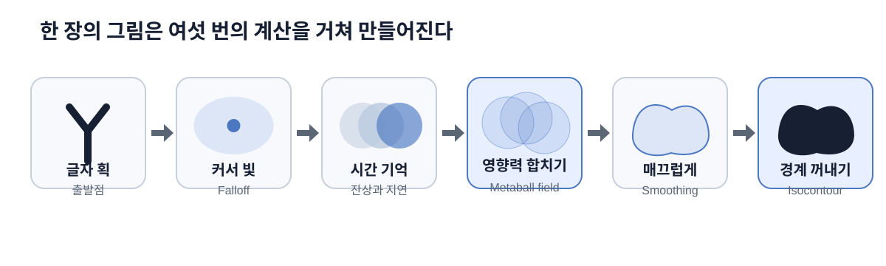
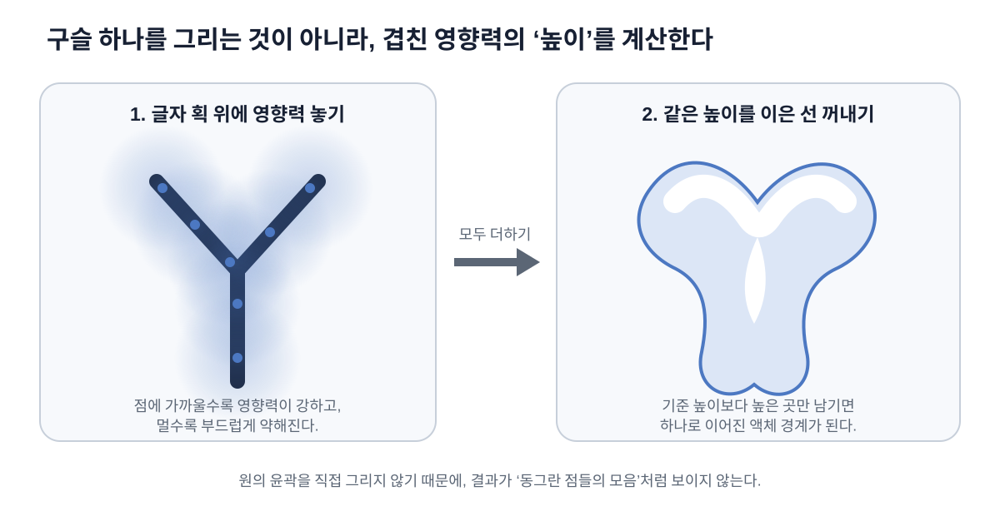
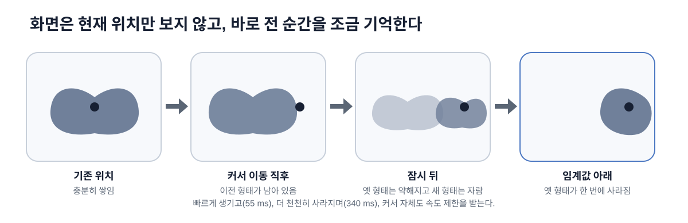
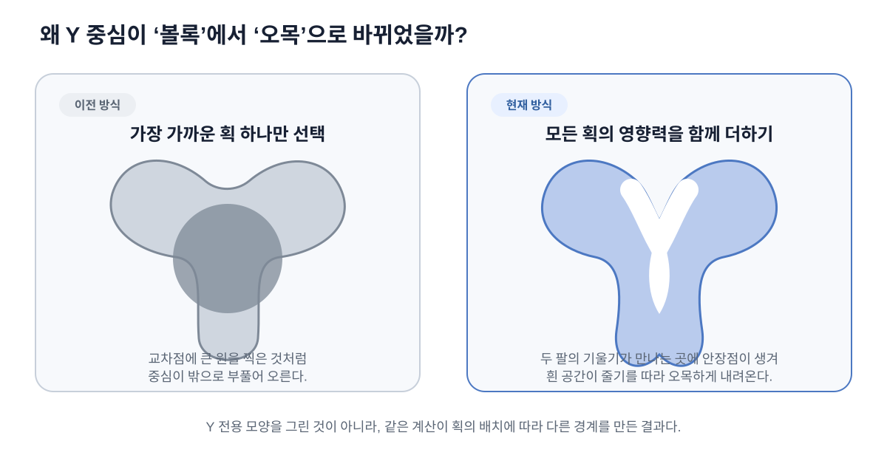

# Artowkr 액체 타이포그래피 아키텍처

이 문서는 `pages/color-changes/`에 구현된 인터랙티브 작품의 **실루엣 생성 구조와 움직임**을 설명한다. 고등학생도 이해할 수 있도록 먼저 비유로 설명하고, 뒤에서 실제 WebGL 렌더 패스와 코드 구조를 연결한다.

> 문서 범위: 글자 모양, 커서 Falloff, 잔상, Metaball field, 외곽선 추출, 검증 방법  
> 제외 범위: 실루엣 내부의 색을 계산하는 방법

## 1. 한 문장으로 이해하기

커서가 비춘 글자 획을 여러 개의 **보이지 않는 부드러운 구슬**처럼 취급하고, 구슬들의 영향력이 겹쳐 만들어진 높이 지도에서 하나의 매끈한 경계를 꺼낸다.



## 2. 프로젝트 파일 구조

```text
brand-artwork/
├── docs/artowkr/
│   ├── architecture.md            # 지금 읽고 있는 문서
│   └── figures/                    # 문서용 SVG 도해
└── pages/color-changes/
    ├── index.html                  # canvas와 오류 메시지
    ├── style.css                   # 전체 화면 레이아웃과 입력 관련 CSS
    ├── script.ts                   # 입력, WebGL 패스, 애니메이션의 중심
    ├── spec.md                     # 수치와 비교 결과를 포함한 상세 스펙
    ├── assets/                     # 레퍼런스 영상과 분석 이미지
    └── qa/                         # 실루엣 비교 이미지와 측정 스크립트
```

실제 작품의 대부분은 `pages/color-changes/script.ts`에 들어 있다. `index.html`은 WebGL이 그릴 `<canvas>`를 제공하고, `style.css`는 캔버스를 화면에 맞게 고정한다.

## 3. 가장 쉬운 비유: 글자 획 위의 투명 구슬

종이에 쓴 `Y`를 얇은 철사라고 생각해 보자. 프로그램은 철사 위의 여러 지점에 보이지 않는 구슬을 놓는다.

- 글자 획은 구슬을 놓을 수 있는 철사다.
- 구슬의 중심에 가까울수록 영향력이 강하다.
- 중심에서 멀어질수록 영향력은 부드럽게 약해진다.
- 여러 구슬의 영향력이 겹치면 그곳의 높이가 올라간다.
- 정해진 높이보다 높은 부분만 남기면 하나의 외곽선이 된다.



중요한 점은 **원의 윤곽을 직접 그리지 않는다**는 것이다. 먼저 모든 구슬의 영향력을 더한 높이 지도를 만들고, 같은 높이를 잇는 선을 나중에 꺼낸다. 그래서 결과가 큰 원 여러 개를 찍은 것처럼 보이지 않고, 물방울이 합쳐진 것처럼 이어질 수 있다.

## 4. 전체 데이터 흐름

실루엣을 만드는 경로만 꺼내면 다음과 같다.

```text
고해상도 글자 마스크
        │
        ▼
sourceMaterial
커서 Falloff × 글자 획
        │
        ▼
temporalMaterial
이전 프레임과 섞어 잔상 생성
        │
        ▼
surfaceSourceMaterial
아주 약한 입력 제거
        │
        ▼
surfaceBlurMaterial
Fibonacci 표본 192개로 Metaball field 생성
        │
        ▼
surfaceSmoothMaterial × 2
가로 → 세로 Gaussian smoothing
        │
        ▼
finalMaterial
기준 높이에서 실루엣 경계 추출
        │
        ▼
화면
```

`animate()` 안에는 이 문서의 범위 밖인 별도 렌더 패스도 존재한다. 그러나 **화면에 보이는 실루엣의 기하 형태**는 위 경로의 `surfaceFieldTarget`으로 결정된다.

## 5. 단계별 구조

### 5.1 글자를 흑백 지도에 굽는다

`bakeTextMask()`는 아홉 줄의 문장을 브라우저의 2D canvas에 그린다.

- 작품 좌표계: `480 × 600`
- 글자 마스크 제작 해상도: `1440 × 1800`
- 배경 픽셀: 알파 `0`
- 글자 획 픽셀: 알파 `1`에 가까운 값

3배 해상도에서 글자를 만든 뒤 텍스처로 사용하므로, 얇은 글자 획의 계단 현상이 줄어든다. 이후 계산이 글자에서 시작할 수 있는지는 이 마스크가 결정한다.

### 5.2 커서 주변의 Falloff만 활성화한다

`sourceMaterial`은 글자 마스크와 커서 주변의 타원형 빛을 곱한다.

```text
활성 획 = 글자 마스크 × 커서 Falloff
```

Falloff는 손전등과 비슷하다. 중심은 강하고 가장자리로 갈수록 약하다. 현재 기본 범위는 다음과 같다.

| 방향 | 범위 |
| --- | ---: |
| 가로 | 160 px |
| 커서 위 | 120 px |
| 커서 아래 | 240 px |

아래쪽 범위를 더 길게 둬서 활성 영역이 아래로 이어지는 구성을 만든다. 세로 가장자리로 갈수록 가로 폭도 줄어들기 때문에 단순한 큰 타원보다 좁고 길게 반응한다.

### 5.3 커서와 효과에 시간 기억을 준다

마우스 위치는 곧바로 효과의 중심이 되지 않는다. `pointerTarget`은 실제 마우스 위치이고, `pointer`는 렌더링에 사용하는 느린 위치다.

- 최대 이동 속도: 초당 `300` 작품 픽셀
- 활성화가 생기는 시간: 약 `55 ms`
- 활성화가 사라지는 시간: 약 `340 ms`

`temporalMaterial`은 현재 활성도와 이전 프레임을 비교한다.

```text
새 값이 더 크면 빠른 attack 속도로 접근
새 값이 더 작으면 느린 release 속도로 접근
```

두 개의 렌더 타깃 `historyTargetA`와 `historyTargetB`가 이전 결과를 번갈아 읽고 쓴다. 이를 **ping-pong buffer**라고 한다. 한쪽을 읽는 동안 다른 쪽에 새 결과를 쓰고, 다음 프레임에는 역할을 바꾼다.



이 구조 때문에 효과는 커서 위치로 순간 이동하지 않는다. 이전 위치의 형태가 잠시 유지되고, 충분히 약해지면 입력 임계값 아래로 내려가며 사라진다.

### 5.4 너무 약한 획은 Metaball의 출발점에서 제외한다

`surfaceSourceMaterial`은 시간 기억에 남은 획 중에서 Metaball field에 넣을 부분을 고른다.

- 입력 임계값: `0.02`
- 부드러운 전환 폭: `0.025`

단순히 `0.02`에서 잘라 버리면 프레임마다 픽셀이 켜졌다 꺼지면서 떨릴 수 있다. 그래서 `smoothstep()`으로 전환 구간을 만든다.

```glsl
detected = smoothstep(0.02, 0.045, activation);
sourceAlpha = activation * detected * textMask;
```

### 5.5 Fibonacci 표본으로 Metaball field를 만든다

`surfaceBlurMaterial`이 현재 구조의 핵심이다. 화면의 각 픽셀은 반경 `30 px` 안을 `192번` 살펴본다.

표본은 원형 격자에 줄을 맞춰 놓지 않고 Fibonacci 나선으로 배치한다. 해바라기 씨가 중심에서 바깥으로 골고루 퍼지는 모습과 비슷하다. 특정 방향에 표본이 몰리지 않기 때문에 사각형이나 십자 모양의 흔적이 줄어든다.

각 표본의 거리 가중치는 다음과 같다.

```text
w = (1 - 거리 비율) ^ 3.2
```

가까운 표본은 큰 값을 갖고, 반경의 끝에 가까워질수록 `0`에 가까워진다. 최종 높이는 다음 생각으로 계산된다.

```text
Metaball 높이
= 현재 위치의 원래 획 × 0.55
+ 주변 192개 표본의 가중 평균 × 2.2
```

조금 더 정확히 쓰면 다음과 같다.

```text
F(p) = 0.55 × S(p) + 2.2 × Σ(S(qᵢ) × wᵢ) / Σwᵢ
```

- `p`: 지금 계산하는 화면 픽셀
- `S(p)`: 그 픽셀에 있는 활성 획의 세기
- `qᵢ`: 주변에서 살펴본 192개의 위치
- `wᵢ`: 각 위치가 얼마나 가까운지를 나타내는 가중치

수식을 외울 필요는 없다. **가까운 획은 많이, 먼 획은 적게 더한다**는 뜻이다.

계산량은 한 프레임에 대략 `480 × 600 × 192 = 55,296,000`번의 주변 텍스처 확인이다. 이 작업을 JavaScript 반복문이 아니라 GPU의 fragment shader가 픽셀마다 병렬로 처리한다.

### 5.6 높이 지도를 가로와 세로로 매끄럽게 만든다

192개 표본만으로 만든 필드에는 작은 계단과 표본 흔적이 남을 수 있다. `surfaceSmoothMaterial`을 두 번 사용해 먼저 가로, 그다음 세로로 Gaussian smoothing을 적용한다.

- sigma: `1.8`
- 반경: 양쪽 `5 px`
- 실제 표본 수: 한 방향당 `-5`부터 `+5`까지 총 `11개`

2차원으로 큰 필터를 한 번 계산하는 대신, 가로와 세로를 나누면 비슷한 결과를 더 적은 계산으로 얻을 수 있다. 이를 **separable filter**라고 한다.

### 5.7 기준 높이에서 최종 외곽선을 꺼낸다

`finalMaterial`은 매끄러워진 필드에서 높이 `0.07` 부근을 경계로 사용한다.

- 실루엣 기준 높이: `0.07`
- 기본 가장자리 softness: `0.012`
- 화면 해상도에 따른 추가 antialiasing: `fwidth(surfaceField) × 1.2`

```glsl
coverage = smoothstep(
  threshold - edge,
  threshold + edge,
  surfaceField
);
```

현재 `coreMix`는 `0`이다. 즉, 가장 가까운 글자 획을 따라 별도의 몸체나 외곽선을 강제로 합치지 않는다. 최종 외곽선은 Metaball field의 등고선 자체다.

## 6. 왜 Y 중심이 볼록하지 않고 오목해지는가



### 이전 구조

이전 구조는 각 출력 픽셀에서 **가장 가까운 획 하나**를 골랐다. Y의 왼쪽 팔, 오른쪽 팔, 줄기가 만나는 곳에서도 하나만 남는다. 여러 획의 관계가 사라지기 때문에 교차점에 큰 원을 찍은 것처럼 중심이 볼록해지기 쉽다.

### 현재 구조

현재 구조에서는 세 획의 영향력이 같은 높이 지도 안에 동시에 들어온다.

1. 왼쪽 팔은 왼쪽에서 높은 값을 만든다.
2. 오른쪽 팔은 오른쪽에서 높은 값을 만든다.
3. 줄기는 아래쪽에서 높은 값을 만든다.
4. 세 방향의 기울기가 만나는 곳에는 안장처럼 가운데가 낮은 지점이 생긴다.
5. 높이 `0.07`의 등고선을 꺼내면 흰 공간이 줄기를 따라 아래로 파고든다.

이런 지점을 **안장점(saddle point)**이라고 한다. 말 안장의 가운데처럼 한 방향에서 보면 높고, 다른 방향에서 보면 낮다.

코드에는 `Y`를 위한 별도 모양이나 예외 처리가 없다. 같은 계산이 글자 획의 배치에 반응해 다른 외곽선을 만든 결과다.

## 7. 렌더 타깃의 역할

WebGL의 렌더 타깃은 GPU 안에서 다음 계산으로 넘겨줄 중간 이미지를 저장하는 공간이다.

| 렌더 타깃 | 저장하는 값 | 다음 사용처 |
| --- | --- | --- |
| `sourceTarget` | 커서 Falloff가 닿은 글자 획 | 시간 기억 |
| `historyTargetA/B` | 이전 프레임과 섞인 활성도 | 입력 감지 |
| `surfaceSourceTarget` | 임계값을 통과한 Metaball 출발점 | Fibonacci field |
| `metaballRawTarget` | 192개 표본이 합쳐진 원래 높이 지도 | 가로 smoothing |
| `surfaceHorizontalTarget` | 가로 방향으로 매끄러워진 높이 | 세로 smoothing |
| `surfaceFieldTarget` | 최종으로 매끄러워진 높이 지도 | 외곽선 추출 |
| 화면 | 최종 실루엣이 합성된 결과 | 사용자에게 표시 |

`renderPass(material, target)`는 전체 화면 크기의 사각형 하나를 그린다. 사각형의 각 픽셀에서 해당 shader가 실행되고, 결과가 다음 렌더 타깃에 저장된다.

## 8. 한 프레임의 실행 순서

`animate(now)`가 브라우저의 `requestAnimationFrame()`마다 호출된다.

```ts
function animate(now) {
  // 1. 커서의 느린 실제 위치를 갱신한다.
  updateDelayedPointer();

  // 2. 글자 획과 Falloff를 곱한다.
  renderPass(sourceMaterial, sourceTarget);

  // 3. 이전 프레임과 섞고 history A/B를 교환한다.
  renderPass(temporalMaterial, historyWrite);
  swap(historyRead, historyWrite);

  // 4. 약한 입력을 제거한다.
  renderPass(surfaceSourceMaterial, surfaceSourceTarget);

  // 5. Fibonacci 표본으로 높이 지도를 만든다.
  renderPass(surfaceBlurMaterial, metaballRawTarget);

  // 6. 가로 → 세로로 매끄럽게 만든다.
  renderPass(surfaceSmoothMaterial, surfaceHorizontalTarget);
  renderPass(surfaceSmoothMaterial, surfaceFieldTarget);

  // 7. 기준 높이에서 경계를 꺼내 화면에 그린다.
  renderPass(finalMaterial, null);
}
```

위 코드는 이해를 위해 이 문서의 범위에 해당하는 패스만 남긴 의사 코드다.

## 9. 입력과 반응형 좌표

브라우저 화면의 크기와 작품 좌표의 크기는 다르다. `updateLayout()`과 `setPointerFromClient()`가 두 좌표계를 연결한다.

1. `480:600` 비율을 유지하면서 화면 안에 작품을 최대한 크게 배치한다.
2. 캔버스 바깥의 여백을 계산해 `artworkRect`에 저장한다.
3. 브라우저의 마우스 좌표에서 여백을 뺀다.
4. 결과를 `0~1` 범위의 작품 좌표로 바꾼다.
5. WebGL의 세로축 방향에 맞게 Y 좌표를 뒤집는다.

그래서 데스크톱과 모바일에서 같은 글자 위치를 가리킬 수 있다. `pointermove`와 `pointerdown`을 모두 받으므로 마우스와 터치 입력이 같은 경로를 사용한다.

## 10. QA 모드와 검증 순서

실루엣은 내부 표현을 제거한 세 종류의 값으로 비교한다.

```text
배경 = 0
원래 텍스트 = 1
효과 실루엣 = 2
```

재현 가능한 비교 주소의 예시는 다음과 같다.

```text
/pages/color-changes/?qa=1&qaX=0.37&qaY=0.52&qaLabels=1
```

- `qa=1`: 움직이는 상태를 고정해 비교하기 쉽게 만든다.
- `qaX`, `qaY`: 커서 위치를 작품 좌표로 고정한다.
- `qaLabels=1`: 배경, 텍스트, 효과만 남긴 실루엣 지도 모드다.

검증은 다음 순서로 진행했다.

1. `Y` 교차부만 확대한다.
2. 중심의 볼록한 돌출이 사라졌는지 확인한다.
3. 흰 공간이 줄기를 따라 오목하게 내려오는지 확인한다.
4. `Y`가 통과한 뒤 전체 실루엣을 비교한다.
5. 커서 이동, 잔상 유지, 소멸을 확인한다.
6. 브라우저 오류와 빌드를 확인한다.

최종 측정에서 효과 면적은 레퍼런스보다 `2.61%` 컸고, 중심 획 두께의 중앙값은 `1.07%` 작았다. 숫자만 맞추지 않고 Y의 오목한 연결과 전체 외곽선의 연속성도 함께 확인했다.

## 11. 이 구현은 실제 물 시뮬레이션이 아니다

이 구조는 다음을 계산하지 않는다.

- 물의 질량과 부피 보존
- 압력과 점성
- 실제 중력 가속도
- 물방울끼리의 충돌
- 튀거나 갈라지는 유체 입자

대신 글자 획에서 시작한 영향력의 높이 지도를 사용해 **물방울이 합쳐지는 외형**을 빠르게 흉내 낸다. 그래서 정확한 표현은 “유체 시뮬레이션”보다 “Metaball 기반 액체 실루엣”이다.

## 12. 주요 조절값

| 상태값 | 기본값 | 모양에 미치는 영향 |
| --- | ---: | --- |
| `radiusX` | `160` | 커서 영향 범위의 가로 폭 |
| `radiusY` | `120` | 커서 위쪽 영향 범위 |
| `radiusYBelow` | `240` | 커서 아래쪽 영향 범위 |
| `metaballInputThreshold` | `0.02` | Metaball 출발점으로 인정할 최소 활성도 |
| `metaballInputSoftness` | `0.025` | 입력이 켜지고 꺼지는 전환 폭 |
| `metaballBlurRadius` | `30` | 주변 획을 모으는 거리 |
| `metaballFalloffPower` | `3.2` | 거리 증가에 따라 영향력이 줄어드는 속도 |
| `metaballSourceGain` | `0.55` | 원래 글자 획의 영향 비율 |
| `metaballFieldGain` | `2.2` | 주변 누적 영향의 비율 |
| `metaballSmoothing` | `1.8` | 높이 지도를 매끄럽게 만드는 정도 |
| `surfaceThreshold` | `0.07` | 최종 외곽선을 꺼낼 높이 |
| `surfaceSoftness` | `0.012` | 외곽선 전환의 부드러움 |
| `coreMix` | `0` | 별도 글자 외곽선 비활성화 |
| `pointerMaxSpeed` | `300` | 커서 빛이 따라가는 최대 속도 |
| `activationAttack` | `0.055 s` | 새 효과가 생기는 시간 |
| `activationRelease` | `0.34 s` | 옛 효과가 약해지는 시간 |

숨겨진 `lil-gui` 패널은 키보드의 `g`를 눌러 열 수 있다. 실루엣을 조절할 때는 한 번에 하나의 값을 바꾸고 Y 교차부를 먼저 확인하는 것이 안전하다.

## 13. 용어 정리

| 용어 | 쉬운 뜻 |
| --- | --- |
| Mask | 계산을 허용할 위치를 표시한 흑백 지도 |
| Falloff | 중심에서 멀어질수록 값이 약해지는 규칙 |
| Field | 화면의 모든 위치에 숫자 하나씩 저장한 지도 |
| Metaball | 가까운 점들의 영향력을 합쳐 물방울 같은 경계를 만드는 방식 |
| Render target | GPU 계산의 중간 결과를 저장하는 이미지 |
| Ping-pong buffer | 두 저장 공간이 읽기와 쓰기 역할을 번갈아 하는 구조 |
| Threshold | 어떤 값을 남길지 결정하는 기준선 |
| Isocontour | 높이 지도에서 같은 높이를 이은 경계선 |
| Smoothing | 작은 계단과 잡음을 부드럽게 줄이는 계산 |
| Saddle point | 한 방향에서는 높고 다른 방향에서는 낮은 안장 모양의 지점 |

## 14. 참고 자료

- 작가가 제공한 Instagram 설명: Shody’s Metaball과 Falloff로 typography stroke를 드러낸다는 설명
- [Scenery — Metaball overview](https://scenery.io/plugins/metaball-7w5Tj0PnVJJ)
- [Scenery — Metaball manual](https://scenery.io/plugins/metaball-7w5Tj0PnVJJ/manual)
- [Cavalry — Falloff documentation](https://cavalry.studio/docs/nodes/utilities/falloff/)
- 구현: [`pages/color-changes/script.ts`](../../pages/color-changes/script.ts)
- 수치 및 비교 기록: [`pages/color-changes/spec.md`](../../pages/color-changes/spec.md)

