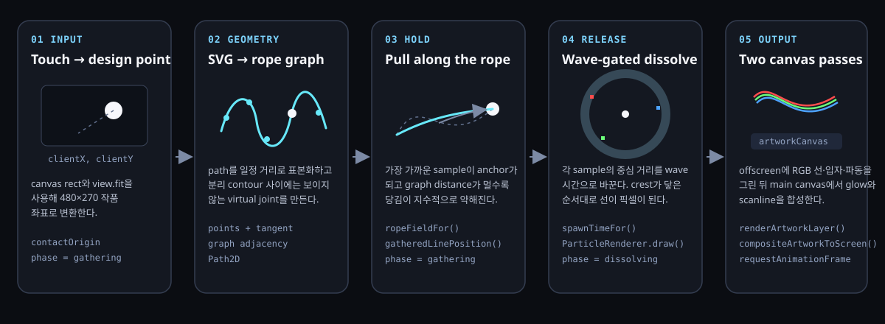

# Body Echo Architecture

Body Echo는 여섯 개의 인체 SVG 잔상을 RGB 채널로 겹쳐 보여 주고, 누르는 동안 선 전체에 장력을 전달한 뒤 손을 놓으면 터치 지점에서 진행하는 파동에 맞춰 선을 사각 파티클로 바꾸는 Canvas 2D 작품이다.

현재 구현은 [`pages/body-echo/`](../../../pages/body-echo/)의 역할별 TypeScript 모듈에 있으며, 활성 조합은 `Lines + NameDrop Wave + Rope Pull + Current Density`이다. `Solid`, `Original`, `Drag Dissolve`, `Previous Shockwave` 분기는 비교와 실험을 위한 비활성 경로다. [`script.ts`](../../../pages/body-echo/script.ts)는 계산이나 입력 정책을 갖지 않고 모듈 조립과 프레임 루프만 담당한다.

## 1. 해결하려는 문제

이 작품의 핵심은 세 동작을 하나의 연속된 형상 변화로 보이게 하는 것이다.

1. 정지 상태에서는 SVG 원본의 연속적인 선을 유지한다.
2. hold 중에는 터치 근처만 접히지 않고 같은 인체를 이루는 선 전체에 당김이 전달된다.
3. release 후에는 원형 파동이 지나간 위치만 선에서 파티클로 바뀐다.

각 점을 터치 방향으로 독립적으로 이동하면 선이 울퉁불퉁해지고, 모든 점을 같은 비율로 이동하면 몸 전체가 하나의 이미지처럼 미끄러진다. Body Echo는 SVG path를 표본화한 graph를 만들어 두 극단 사이의 rope-like 변형을 만든다.



그림은 실제 실행 순서를 왼쪽에서 오른쪽으로 보여 준다. 입력 좌표는 작품 좌표로 변환되고, 미리 만든 SVG graph에서 hold 변형을 계산한다. release 후에는 같은 sample의 중심 거리가 파동 도착 시간이 되며, offscreen canvas와 main canvas의 두 렌더 패스를 거쳐 화면에 출력된다.

### 1.1 파일별 책임

| 모듈 | 책임 | 다음 소비자 |
| --- | --- | --- |
| [`types.ts`](../../../pages/body-echo/types.ts) | 좌표, geometry, phase, particle 상태 타입 | 모든 모듈 |
| [`config.ts`](../../../pages/body-echo/config.ts) | 활성 모드, 기본값, 인체 배치, RGB 채널, asset URL | geometry, runtime, renderer, GUI |
| [`math.ts`](../../../pages/body-echo/math.ts) | `clamp`, deterministic `hash`, `smoothstep` | geometry, runtime, renderer |
| [`geometry.ts`](../../../pages/body-echo/geometry.ts) | SVG/raster 로딩, path sample, tangent, graph, virtual joint | script가 로드해 runtime에 저장 |
| [`wave-timing.ts`](../../../pages/body-echo/wave-timing.ts) | wave extent, forward radius, inverse arrival delay | runtime, wave renderer |
| [`runtime.ts`](../../../pages/body-echo/runtime.ts) | phase와 시간, 좌표 변환, rope field, hold 위치, spawn 시각 | input, figure/particle/wave renderer |
| [`interaction-controller.ts`](../../../pages/body-echo/interaction-controller.ts) | pointer·keyboard 정규화, 명시적 상태 전이, 자동 reset | runtime, drag dissolve |
| [`drag-dissolve.ts`](../../../pages/body-echo/drag-dissolve.ts) | drag trace, segment hit test, drag 입자와 connector | figure renderer |
| [`particles.ts`](../../../pages/body-echo/particles.ts) | release sample의 이동·fade·사각형 출력 | figure renderer |
| [`figure-renderer.ts`](../../../pages/body-echo/figure-renderer.ts) | stable path, 남은 path, release/drag particle 순회 | artwork renderer |
| [`wave-renderer.ts`](../../../pages/body-echo/wave-renderer.ts) | current/previous release wave pass | artwork renderer |
| [`artwork-renderer.ts`](../../../pages/body-echo/artwork-renderer.ts) | offscreen pass 순서, glow·scanline 최종 합성 | script frame loop |
| [`gui.ts`](../../../pages/body-echo/gui.ts) | lil-gui 생성과 설정값 연결 | interaction controller의 `G` 입력 |
| [`script.ts`](../../../pages/body-echo/script.ts) | surface 생성, module wiring, asset loading, frame loop | 최종 canvas 출력 |

## 2. 입력

### 2.1 포인터와 키보드

입력 등록은 `InteractionController.bind()` 한 곳에서 수행한다.

| 입력 | 핸들러 | 상태 전이 |
| --- | --- | --- |
| pointer down | `handlePointerDown()` | `beginGather()` → `gathering` |
| pointer move | `handlePointerMove()` | `contactOrigin` 갱신 |
| pointer up/cancel | `finishPointerInteraction()` | `releaseGather()` → `dissolving` |
| Space/Enter down | `handleKeyDown()` | 화면 중앙에서 `beginGather()` |
| Space/Enter up | `handleKeyUp()` | `releaseGather()` |
| R | `handleKeyDown()` | `reset()` → `idle` |
| G | `handleKeyDown()` | lil-gui 표시 전환 |

Canvas는 `touch-action: none`, `user-select: none`을 사용하며 `contextmenu`, `dragstart`, `selectstart`도 막는다. 따라서 모바일 long press가 텍스트 선택이나 시스템 drag로 바뀌지 않는다. `lostpointercapture`만으로 hold를 끝내지 않는 이유는 Safari가 손가락이 남아 있어도 capture를 일시적으로 잃을 수 있기 때문이다. 실제 종료 판단은 window의 `pointerup`과 `pointercancel`이 담당한다.

### 2.2 좌표 공간

`InteractionController.designPointFromClient()`는 브라우저의 CSS pixel 입력을 다음 두 단계를 거쳐 작품 좌표로 바꾼다.

| 이름 | 공간과 단위 | 역할 |
| --- | --- | --- |
| `clientX`, `clientY` | viewport CSS pixel | 브라우저가 전달한 손가락 위치 |
| `internalX`, `internalY` | canvas device pixel | device pixel ratio가 적용된 실제 canvas 위치 |
| `designX`, `designY` | 480 × 270 design unit | 화면 크기와 무관한 작품 기준 좌표 |
| `view.fit` | device pixel / design unit | design 좌표를 화면에 맞추는 배율 |
| `view.offsetX`, `view.offsetY` | device pixel | letterbox 가운데 정렬 offset |

변환식은 다음과 같다.

```text
internalX = (clientX - rect.left) × canvas.width / rect.width
designX   = (internalX - view.offsetX) / view.fit
```

`Y`도 같은 방식이다. hold는 화면 바깥으로 드래그해도 손가락을 따라가야 하므로 활성 NameDrop 경로에서는 design 좌표를 0–480, 0–270 범위로 자르지 않는다.

## 3. 중간 상태

### 3.1 상태 기계

`phase`는 입력과 렌더러가 공유하는 최소 상태다.

| phase | 의미 | 화면에 그리는 것 |
| --- | --- | --- |
| `idle` | 입력 전 또는 자동 복원 후 | 원본 SVG path |
| `gathering` | pointer가 눌린 상태 | rope로 변형된 SVG path |
| `dissolving` | pointer를 놓은 뒤 | 남은 path + 파티클 + wave |
| `dragging` | 비활성 Drag Dissolve 실험 | 잘린 path + drag 파티클 |
| `blank` | 비활성 Original 모드 종료 | 빈 화면 |

NameDrop 경로의 정상 전이는 `idle → gathering → dissolving → idle`이다. `updateInteractionLifecycle()`가 파동과 파티클의 최대 지속 시간을 계산하고 끝나면 `reset()`을 호출하므로 별도 재생 버튼이 필요하지 않다.

### 3.2 SVG를 렌더 경로와 rope graph로 준비하기

`loadLineAssets()`는 여섯 SVG를 병렬로 읽고, `loadLineAsset()`이 각 파일에서 세 종류의 데이터를 만든다.

- `Path2D path`: idle 상태에서 원본 곡선을 정확히 stroke하기 위한 데이터
- `FigurePoint[] points`: hold 변형과 release 파티클 계산을 위한 일정 간격 sample
- `LineGraphEdge[][] graph`: sample 사이로 장력을 전달하기 위한 인접 목록

한 SVG `<path>` 안에도 여러 `M`으로 시작하는 torso, arm, leg contour가 있을 수 있다. sample 단계에서 contour를 분리해야 실제로 끊긴 팔과 다리 사이에 화면상 직선이 생기지 않는다. 대신 `buildLineGraph()`는 가장 긴 contour에서 시작해 아직 연결되지 않은 contour의 끝점을 가까운 기존 sample과 **virtual joint**로 연결한다. 이 joint는 장력 계산에만 사용되고 stroke에는 사용되지 않는다.

초기화 비용은 각 SVG에 대해 한 번만 발생한다. 매 frame에는 준비된 `Path2D`, sample, graph를 재사용한다.

표본화, virtual joint, graph distance의 재사용 가능한 원리는 [SVG Path Rope Tension](../../concepts/svg-path-rope-tension.md)에서 설명한다.

### 3.3 hold: graph를 따라 전달되는 rope tension

터치를 시작하면 `BodyEchoRuntime.ropeFieldFor()`가 각 인체마다 가장 가까운 sample을 anchor로 선택하고, 그 anchor에서 모든 sample까지의 graph distance를 한 번 계산해 캐시한다. 손가락을 움직이는 동안 anchor와 cache는 유지하고 목표점 `contactOrigin`만 갱신한다. 즉 처음 잡은 strand를 놓지 않은 채 끌고 간다.

`BodyEchoRuntime.gatheredLinePosition()`은 graph distance의 지수 감쇠, 먼 구간에 남기는 작은 전달 장력, 거리에 따른 response lag, path normal 방향의 slack을 합쳐 sample 위치를 만든다. 이는 실제 줄의 질량과 충돌을 적분하는 물리 시뮬레이션이 아니라, 연속적인 rope-like 반응을 위한 경험적 근사다. graph-distance 장력의 공통 원리와 일반 수식은 [SVG Path Rope Tension](../../concepts/svg-path-rope-tension.md)에서 설명하고, 아래에는 Body Echo가 선택한 실제 계산과 값을 기록한다.

현재 구현에서 작은 전달 장력 `T_i`는 고정된 하나의 값이 아니다. 당김 진행도 `p`와 sample `i`의 정규화된 graph distance `n_i`를 사용한다. `p`는 hold 반응이 진행되며 0에서 1로 증가하고, `n_i`는 anchor에서 0, graph에서 가장 먼 sample에서 1이다.

```text
n_i = clamp(g_i / g_max, 0, 1)
T_i = (0.045 + 0.12p) × (1 - 0.35n_i)
```

예를 들어 당김이 끝까지 진행된 `p = 1`에서는 anchor 근처의 `T_i`가 `0.165`, 중간 거리 `n_i = 0.5`에서는 약 `0.136`, 가장 먼 지점에서는 약 `0.107`이다. anchor에서는 원래 local tension `L_i`가 1이므로 이 전달분이 결과를 바꾸지 않는다. `T_i`는 주로 `L_i`가 0에 가까워진 먼 지점의 목표 장력에 약 10%의 하한을 남겨, 움직이는 선과 멈춘 선의 경계가 드러나지 않게 한다. 실제 이동량은 이 목표 장력에 시간 반응, 전체 당김 진행도와 당김 거리를 더 적용해 결정한다.

`0.045`, `0.12`, `0.35`는 물리 법칙에서 유도한 상수가 아니라 현재 형상에 맞춰 시각적으로 조정한 예시다. 각각 당기기 시작할 때의 기본 전달량, 진행되며 추가되는 전달량, 거리에 따라 전달량을 줄이는 정도를 정한다. 전달량을 줄이면 변형이 anchor 주변에 더 국소적으로 모이고, 늘리면 선 전체가 더 강하게 함께 움직인다.

## 4. 렌더 패스

### 4.1 release 시각과 파티클 생성

`releaseGather()`는 손을 놓은 순간의 hold 진행도와 추가 hold 시간을 저장하고 `phase = dissolving`으로 전환한다. 이 값을 보존하기 때문에 누른 시간과 관계없이 release 첫 frame에서 형상이 원본으로 튀지 않는다.

각 SVG sample의 파티클 생성 시각은 `BodyEchoRuntime.spawnTimeFor()`가 정한다. [`wave-timing.ts`](../../../pages/body-echo/wave-timing.ts)는 화면 ring에는 forward easing을, sample의 거리에는 같은 함수의 inverse easing을 적용한다. 그래서 crest가 sample 위치에 도착하는 시각과 선이 파티클로 바뀌는 기준 시각이 일치한다.

`contactWaveExtent`는 터치점에서 480 × 270 design frame의 네 모서리까지 거리 중 가장 큰 값이다. 따라서 터치점이 화면 중앙이 아니어도 wave progress가 1이 될 때 가장 먼 모서리까지 도달한다. 실제 spawn에는 최대 `0.025 s`의 작은 jitter가 더해져 개별 pixel은 crest보다 아주 조금 늦을 수 있다. forward/inverse 대응의 유도와 적용 범위는 [Wavefront Event Scheduling](../../concepts/wavefront-event-scheduling.md)에서 설명한다.

### 4.2 선과 파티클

`FigureRenderer.renderLines()`는 RGB 채널과 여섯 인체를 순회한다.

- `idle`: `FigureRenderer.drawExactLinePath()`가 원본 `Path2D`를 stroke한다.
- `gathering`: `FigureRenderer.drawDissolvingLinePath()`가 모든 sample을 rope 위치로 옮겨 연결한다.
- `dissolving`: wave가 아직 닿지 않은 segment는 선으로, 도착 시각을 지난 sample은 `ParticleRenderer.draw()`의 사각형으로 그린다.

`FigureRenderer.drawDissolvingLinePath()`는 선 fade를 여섯 opacity bucket으로 나눈다. Canvas 2D는 하나의 path 안에서 segment마다 alpha를 직접 바꿀 수 없기 때문에, 비슷한 opacity의 segment를 같은 `Path2D`에 모아 여섯 번 stroke하는 절충이다.

`ParticleRenderer.draw()`은 원래 sample 위치에서 contact 바깥 방향과 그 수직 tangent 방향을 섞어 이동시킨다. RGB 세 채널은 `rgbOffset`만큼 서로 다른 위치에서 시작한다. 현재 lil-gui의 release 기본값은 다음과 같다.

| GUI | 코드 값 | 기본값 |
| --- | --- | ---: |
| Wave speed | `defaultTiming.waveDuration / contactWaveDuration` | 1.35 |
| Particle speed | `contactReleaseSpeed` | 1.45 |
| Particle spread | `contactForce` | 45 |
| Particle fade time | `contactParticleFadeDuration` | 0.9 s |
| Particle size | `contactParticleSize` | 1.2 |
| Chromatic amount | `rgbOffset` | 3.4 design unit |

### 4.3 wave pass

`WaveRenderer.render()`는 중심을 채우는 bloom 없이, 진행 중인 반지름 주변만 두 개의 넓은 band와 한 개의 얇은 crest로 그린다. radial gradient의 안쪽과 바깥쪽을 투명하게 만들기 때문에 원 전체가 밝아지는 것이 아니라 현재 wave front만 보인다.

현재 release 스타일에서는 wave를 인체보다 먼저 offscreen canvas에 그린다. 합성 모드는 `screen`이며, 인체는 이어서 `lighter`로 더해진다.

### 4.4 두 Canvas 합성

한 frame의 `script.ts` 내 `renderFrame()`은 다음 네 단계를 고정된 순서로 호출한다.

1. `ArtworkRenderer.render()`가 offscreen `artworkCanvas`를 검정으로 초기화
2. wave, 인체 선, 파티클, drag connector를 순서대로 렌더
3. glow 사본과 선명한 원본, scanline을 main canvas에 합성
4. `InteractionController.updateLifecycle()`가 애니메이션 종료와 자동 reset을 판단

offscreen canvas를 둔 이유는 작품 자체를 한 번 완성한 뒤 같은 이미지를 blur한 glow 사본과 선명한 원본으로 재사용하기 위해서다. main canvas는 최종 출력만 담당한다.

## 5. 출력

출력은 device pixel ratio가 최대 2로 제한된 전체 화면 Canvas 2D 이미지다. `resize()`는 480 × 270의 종횡비를 유지하는 `view.fit`과 중앙 offset을 계산한다. 화면 비율이 달라도 작품 좌표와 물리적 위치 관계는 변하지 않고 바깥 공간만 letterbox가 된다.

RGB 선과 파티클은 `lighter`, wave는 `screen`, 마지막 glow는 blur가 적용된 `lighter` 합성이다. 최종 단계에서 3 device pixel 간격의 scanline을 얹는다.

## 6. 초기화와 계산 빈도

| 시점 | 계산 |
| --- | --- |
| 최초 1회 | SVG fetch, path sample, tangent, graph, `Path2D`, raster solid sample |
| resize 때 | canvas device 크기, `view.fit`, 중앙 offset |
| hold 시작 때 | 각 인체의 anchor와 graph distance cache |
| hold 위치 이동 때 | cache는 유지하고 `contactOrigin`만 갱신 |
| 매 frame | rope 위치, wave 반지름, 선 opacity, 활성 파티클 위치, 두 canvas 합성 |
| release 종료 때 | 상태와 drag/rope cache reset |

## 7. 검증

구조 변경 후 다음을 확인한다.

1. `pnpm typecheck`: 상태와 렌더 함수 분리 후 타입 연결 검증
2. `pnpm build`: Vite asset URL과 SVG 로딩 경로 검증
3. Chrome `?debug=1`: GUI 기본값, hold → release → 자동 reset, 안내 문구 제거 확인
4. 브라우저 console: error와 warning이 없는지 확인
5. 이 문서의 pipeline SVG: Chrome에서 라벨 겹침과 잘림 확인

## 8. 한계와 대안

- rope 변형은 graph distance를 사용하는 시각적 근사다. 실제 장력 파동, 관성, 충돌을 원한다면 position-based dynamics 또는 질점-스프링 적분이 필요하다.
- virtual joint는 contour의 topology를 의미적으로 이해하지 않고 가장 가까운 점을 연결한다. SVG가 크게 바뀌면 잘못된 팔·다리 연결이 생길 수 있으므로 asset별 joint metadata가 더 정확한 대안이다.
- sample 간격은 고정 SVG 길이 단위다. 곡률이 큰 곳에 더 많은 점을 두는 adaptive sampling을 사용하면 같은 점 수로 실루엣 정확도를 높일 수 있다.
- opacity bucket은 여섯 단계 근사다. segment별 연속 alpha나 더 많은 파티클을 효율적으로 처리하려면 WebGL/WebGPU buffer 렌더링이 더 적합하다.

## 9. 핵심 흐름

포인터 입력을 480 × 270 작품 좌표로 바꾸고, 가장 가까운 SVG sample에서 graph distance를 계산해 hold 중 rope 장력을 만든다. 손을 놓으면 각 sample의 중심 거리를 wave 도착 시각으로 바꿔 선을 순차적으로 사각 파티클로 전환한다. offscreen canvas의 wave·RGB 형상을 main canvas에서 glow·scanline과 합성한 뒤, 전체 지속 시간이 끝나면 `idle`로 자동 복원한다.
