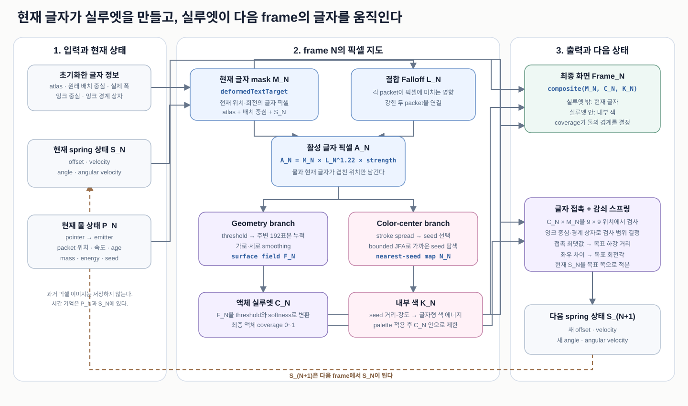
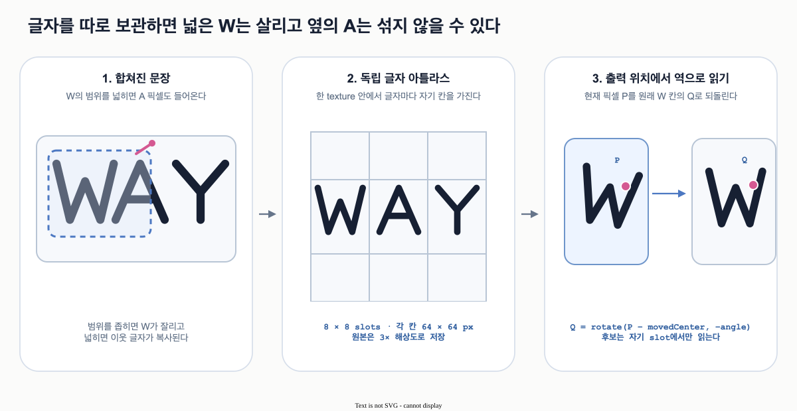
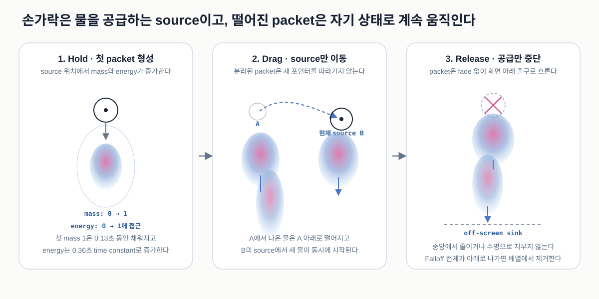
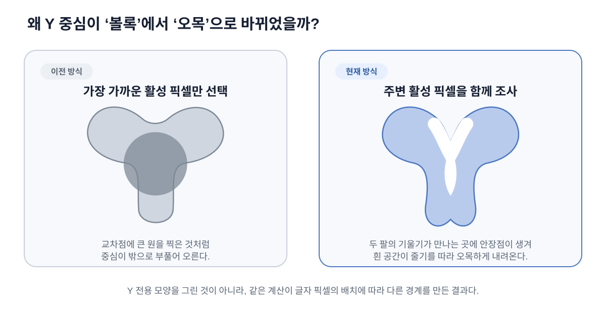
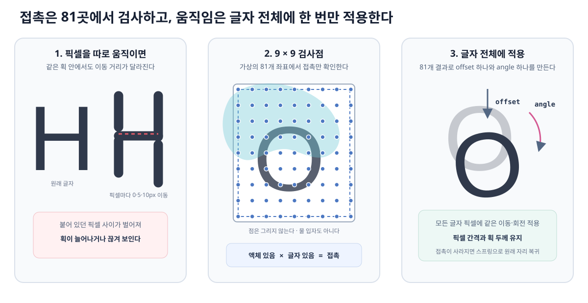

# Color Text Architecture

이 문서는 `pages/color-text/`의 **현재 구현**을 설명한다. 포인터 입력이 물 packet 상태로 바뀌고, 그 상태가 글자 픽셀 기반 실루엣·내부 색·글자 스프링으로 이어지는 실제 실행 순서를 다룬다.

- 기준 구현: [`pages/color-text/script.ts`](../../../pages/color-text/script.ts)
- 작품 좌표: `480 × 600 artwork pixel`
- 문서 갱신 기준: `2026-08-15`
- 세부 파라미터와 구현 기록: [`pages/color-text/spec.md`](../../../pages/color-text/spec.md)
- 레퍼런스 복원 이후 상호작용 선택 과정: [interaction-ideation.md](./interaction-ideation.md)

재사용 가능한 수학 원리는 별도 concept 문서로 분리했다.

- [Pixel-sampled Metaball Field](../../concepts/pixel-metaball-field.md)
- [Jump Flood Nearest-seed Search](../../concepts/jump-flood-nearest-seed.md)

## 1. 가장 먼저 이해할 구조

이 작품이 한 frame마다 만들어야 하는 최종 결과는 세 가지다.

| 결과 | 기호 | 뜻 |
| --- | --- | --- |
| 현재 글자 | `M_N` | frame `N`에서 이동·회전한 글자의 픽셀 mask |
| 액체 실루엣 | `C_N` | 액체로 보일 영역을 `0~1`로 나타낸 coverage |
| 내부 색 | `K_N` | 실루엣 안에서 글자 모양을 따라 달라지는 색 |

최종 화면은 이 셋을 합성한 것이다.

```text
Frame_N = composite(M_N, C_N, K_N)
```

하지만 셋은 서로 독립적으로 만들어지지 않는다. **현재 글자가 실루엣의 입력이 되고, 그 실루엣과 현재 글자의 접촉이 다음 frame의 글자 움직임을 만든다.** 같은 frame 안에서 서로를 무한히 다시 계산하지 않도록, 현재 상태 `S_N`으로 frame `N`을 완성한 뒤 새 상태 `S_(N+1)`은 다음 frame에 사용한다.



편집 가능한 원본은 [color-text-frame-graph.drawio](../../assets/color-text-frame-graph.drawio)다. SVG와 PNG는 이 원본을 draw.io에서 export한 결과다.

### 1.1 의존관계를 질문으로 나누기

| 먼저 답할 질문 | 입력 | 계산 결과 |
| --- | --- | --- |
| 이번 frame에서 글자는 어디에 있는가? | 글자 atlas·원래 배치 중심·현재 spring 상태 `S_N` | 현재 글자 mask `M_N` |
| 물은 화면 어디에 영향을 주는가? | pointer와 최대 32개 물 packet | 결합 Falloff `L_N` |
| 물이 실제로 어떤 글자 픽셀을 덮는가? | `M_N`, `L_N` | 활성 글자 픽셀 `A_N` |
| 활성 픽셀이 만드는 액체 외곽은 무엇인가? | `A_N` | 연속 surface field `F_N`, 실루엣 `C_N` |
| 실루엣 안의 색 중심은 어디인가? | `A_N`, `M_N` | JFA nearest-seed 지도와 내부 색 `K_N` |
| 글자는 다음 frame에 어떻게 움직일 것인가? | `C_N`, `M_N`, 글자 접촉 범위, 현재 상태 `S_N` | 다음 spring 상태 `S_(N+1)` |

손가락은 물을 직접 그리지 않는다. 손가락은 물이 공급되는 source 위치만 정하고, CPU가 최대 32개의 큰 물 packet을 움직인다. GPU는 packet의 Falloff와 **현재 위치의 글자 픽셀**을 곱해 `A_N`을 만든 뒤, 그 픽셀들을 연속적인 field로 연결한다.

실루엣은 물 packet 위치만으로 결정되지 않는다. 같은 Falloff가 지나가더라도 현재 글자 픽셀이 없는 곳에서는 `A_N=0`이므로 새 실루엣 입력이 생기지 않는다. 반대로 글자가 내려가면 `M_N`도 내려가고, 다음 frame의 활성 픽셀과 실루엣도 그 새 위치를 따라 달라진다.

여기서 “Metaball pixelization”보다는 **활성 글자 픽셀을 입력으로 하는 pixel-sampled Metaball field**가 더 정확한 표현이다. 이미 픽셀인 모양을 거칠게 쪼개는 과정이 아니라, 주변 활성 픽셀의 값을 누적해 픽셀마다 연속적인 세기 `F_N`을 만들고 그 등고선으로 `C_N`을 얻는 과정이기 때문이다.

### 1.2 글자 정보와 물리 계산을 정확히 구분하기

초기화할 때 각 글자에서 두 종류의 중심과 크기 정보를 구한다.

| 정보 | 사용하는 곳 |
| --- | --- |
| 문장 배치에서 정한 원래 중심과 실제 glyph 폭 | atlas에서 현재 글자 `M_N`을 다시 그릴 때 |
| alpha로 측정한 잉크 중심과 잉크 경계 상자 크기 | 글자 위에 `9 × 9` 접촉 검사점을 놓을 때 |

잉크 중심은 글자 픽셀의 alpha를 무게처럼 사용해 평균낸 위치라서 계산 방식은 무게중심과 비슷하다. 그러나 글자마다 실제 물리 질량을 저장하거나 질량에 따라 가속도를 다르게 계산하지는 않는다. 화면에 글자를 그릴 때의 회전 중심도 잉크 중심이 아니라 문장 배치에서 정한 원래 중심이다.

또한 실루엣이 글자에 실제 힘을 직접 가하는 구조는 아니다. `C_N × M_N`으로 접촉을 확인하고, 접촉의 최댓값과 좌우 차이를 **목표 하강 거리와 목표 회전각**으로 바꾼다. 그다음 감쇠 스프링이 현재 상태 `S_N`을 그 목표 쪽으로 움직여 `S_(N+1)`을 만든다. 따라서 물리와 비슷한 부분은 스프링의 가속도·속도 적분이고, 실루엣은 힘 자체라기보다 스프링 목표를 정하는 입력이다.

내부 색에 사용하는 알고리즘 이름은 `JPA`가 아니라 **JFA(Jump Flood Algorithm)**다. JFA 결과만으로 색이 완성되는 것도 아니다. 현재 활성 글자 픽셀에서 가장 가까운 seed 좌표를 JFA로 찾고, 그 거리와 seed 강도로 글자형 색 에너지를 만든 뒤, 시간에 따른 palette를 적용하고 마지막에 `C_N` 안으로 자른 결과가 `K_N`이다.

`C_N`은 의존관계를 설명하기 위한 논리적인 이름이며 별도의 texture로 저장하지 않는다. 실제로 저장하는 것은 threshold 이전의 `F_N`이다. Contact shader와 Final shader가 각각 `F_N`을 threshold 주변에서 부드럽게 바꾸어 접촉용 surface와 화면용 coverage를 그때 계산한다.

### 1.3 frame 사이에 유지되는 상태

한 frame에는 다음 세 종류의 상태가 연결된다.

| 상태 | 저장 위치 | 의미 |
| --- | --- | --- |
| `pointerTarget`, `liquid.emitter` | CPU 객체 | 최신 손가락 위치와 완화된 source 위치 |
| `liquid.particles` | CPU 배열, 최대 32개 | 이미 만들어진 물 packet의 위치·속도·모양 상태 |
| `glyphSpringTargetA/B` | GPU `64 × 1` texture | 글자별 하강·회전과 각각의 속도 |

과거 활성 픽셀 이미지를 누적하는 `temporalMaterial`은 없다. 시간 기억은 `liquid.particles`와 글자 spring texture에 들어 있다.

## 2. 파일별 역할

```text
common/
  touch-cursor.ts
    화면 녹화용 터치 ring과 ripple

pages/color-text/
  index.html
    canvas, Process View 버튼, SNS meta
  style.css
    전체 화면 배치, 모바일 기본 제스처 차단
  config.ts
    작품 크기, 문장, 기본 파라미터와 URL 검증 override
  script.ts
    WebGL 자원 생성과 한 frame의 pass 실행 순서
  liquid-solver.ts
    source 공급, packet 중력·점성·응집력과 화면 밖 제거
  text-atlas.ts
    Canvas 자간 배치, 독립 글자 atlas, 글자별 픽셀 측정값 생성
  shaders.ts
    각 GPU pass가 픽셀 하나를 계산하는 GLSL
  parameter-gui.ts
    lil-gui 조절 항목과 texture uniform 갱신
  spec.md
    파라미터와 세부 구현 기록
  assets/
    reference와 OG image
```

처음 코드를 읽을 때는 `config.ts`에서 고정값을 확인하고, `liquid-solver.ts`와 `text-atlas.ts`에서 CPU 입력을 살펴본 뒤, `script.ts`의 `renderFrame()`을 읽는 순서가 가장 자연스럽다. `renderFrame()`은 한 장의 full-screen quad를 서로 다른 `ShaderMaterial`로 반복 렌더링하고, 각 결과를 render target texture에 저장해 다음 pass로 넘긴다. 픽셀별 수식이 필요할 때만 `shaders.ts`에서 같은 이름의 pass를 찾아간다.

## 3. 좌표 공간과 계산 시점

같은 `x`, `y`라도 입력과 shader에서 의미가 다르다.

| 공간 | 범위와 원점 | 사용하는 곳 |
| --- | --- | --- |
| CSS client coordinate | pixel, 화면 왼쪽 위가 원점 | `pointer` event의 `clientX`, `clientY` |
| artwork pixel | `480 × 600`, 문서에서는 길이 단위 | 반경, 속도, 글자 배치, sample 거리 |
| artwork UV | `[0,1] × [0,1]`, 왼쪽 아래가 원점 | `pointerTarget`, particle 위치, field texture |
| glyph atlas bake coordinate | `1536 × 1536`, 왼쪽 위가 원점 | Canvas2D 독립 글자 atlas |
| deformed text coordinate | `1440 × 1800`, 왼쪽 아래가 UV 원점 | GPU가 재구성한 현재 글자 mask |
| device pixel | 실제 drawing buffer pixel | 최종 화면의 `fwidth()` 안티앨리어싱 |

`setPointerFromClient()`는 화면 안에서 작품이 차지하는 사각형을 먼저 구한다. CSS 좌표에서 여백을 빼고 0~1로 나눈 뒤 Y를 뒤집어 artwork UV를 만든다.

계산 시점도 역할에 따라 다르다.

| 계산 | 위치 | 빈도 |
| --- | --- | --- |
| 자연 자간과 glyph atlas 굽기 | CPU Canvas2D | 초기화할 때 한 번 |
| pointer와 particle 물리 | CPU TypeScript | 매 frame, 필요하면 `1/60s` 이하 substep |
| 글자 변형과 field | GPU fragment shader | 매 frame, 각 target pixel |
| 최종 합성 | GPU fragment shader | 매 frame, 각 device fragment |
| 터치 인디케이터와 버튼 | DOM | pointer event와 stage 변경 시 |

## 4. 글자를 독립 아틀라스에 저장하는 이유

### 4.1 해결하려는 문제

문장 전체를 한 장의 이미지로 저장한 뒤 글자 하나만 움직이려고 하면 두 문제가 생긴다.

1. `W`처럼 실제 폭이 넓은 글자는 회전할 때 자기가 처음 있던 배치 범위 밖이 잘릴 수 있다.
2. 잘림을 막으려고 원본 문장을 넓게 읽으면 옆의 `A`나 `Y` 픽셀까지 함께 복사될 수 있다.



### 4.2 실제 저장 구조

공백을 포함한 문장 자리 수는 64개다. 각 자리에 `64 × 64 artwork px` 칸을 주고, `8 × 8` grid의 한 texture로 묶는다. 실제 Canvas2D atlas는 경계 품질을 위해 각 축을 3배로 만들어 `1536 × 1536` pixel이다.

이것을 “독립 글자 아틀라스”라고 부른다.

- **아틀라스:** 여러 작은 이미지를 한 texture에 모은 것
- **독립:** `W` 후보를 계산할 때 반드시 `W` 칸만 읽는다는 뜻
- 개별 texture 64장을 만드는 것이 아니라 한 texture 안에서 UV 구간만 분리한다

`glyphMetadataTexture`는 각 slot에 다음 값을 저장한다.

| 채널 | 의미 |
| --- | --- |
| R | 실제 glyph 반쪽 폭을 `MAX_GLYPH_HALF_WIDTH`로 정규화한 값 |
| G | 글자가 있으면 1, 공백이면 0 |

### 4.3 일반 텍스트처럼 자간을 계산한다

Helvetica Neue는 `I`가 좁고 `W`가 넓은 비례폭 글꼴이다. 모든 글자의 중심을 같은 거리로 놓으면 중심 좌표는 규칙적이지만, 실제로 칠해진 글자 픽셀 사이의 빈 공간은 불규칙해진다. 공백도 글자 한 칸 전체를 차지해 일반 텍스트보다 크게 벌어진다.

초기화할 때 `measureLineLayout()`은 Canvas2D `measureText()`로 글자마다 다음 값을 계산한다.

| 기호 | 단위 | 의미 |
| --- | --- | --- |
| `w_i` | artwork pixel | `i`번 글자의 폰트 advance 폭. 공백도 실제 space 폭을 가진다 |
| `k_i` | artwork pixel | 이전 글자와 `i`번 글자 사이의 폰트 kerning 보정 |
| `s` | artwork pixel | 작품이 추가하는 일정한 자간, 현재 `TEXT_LETTER_SPACING = 4` |
| `x_i` | artwork pixel | `i`번 글자의 최종 중심 X |

두 글자를 붙여 측정한 폭과 따로 측정한 폭의 차이가 kerning이다.

```text
k_i = measureText(previous + current) - w_(i-1) - w_i
```

`AV`처럼 폰트가 두 글자를 서로 당기도록 설계했다면 `k_i`가 음수가 되어 간격이 줄어든다. 그다음 이전 글자의 실제 폭 `w_(i-1)`, kerning `k_i`, 작품 자간 `s`를 차례로 더해 현재 글자의 시작 위치를 구한다. 모든 글자를 놓아 얻은 실제 한 줄 너비를 기준으로 줄 전체를 가운데 정렬한다.

계산한 중심은 `glyphHomeTexture`의 R·G 채널에 artwork UV로 저장한다. 이 값은 글자가 움직이기 전의 기준 위치다. `lineLayouts`에는 각 줄의 첫 중심 X, 평균 중심 간격, 글자 수, 첫 slot 번호를 저장한다. 평균 중심 간격은 shader에서 가까운 후보를 빨리 찾는 용도일 뿐이며, 글자를 그릴 때는 항상 `glyphHomeTexture`의 실제 중심을 사용한다.

### 4.4 출력 픽셀에서 원본 칸을 역으로 찾는다

현재 화면의 artwork UV를 `P`, 글자의 이동 후 중심을 `C_m`, 회전 각도를 radian 단위 `a`라고 하자. Shader는 움직인 글자를 앞으로 그리는 대신 현재 출력 픽셀을 반대로 되돌린다.

```text
deltaArtwork = (P - C_m) * artSize
Q            = rotate(deltaArtwork, -a)
atlasUv      = atlasCellCenter + Q / atlasSize
```

| 변수 | 공간 | 의미 |
| --- | --- | --- |
| `P` | artwork UV | 지금 칠할 출력 픽셀 |
| `C_m` | artwork UV | spring 하강을 적용한 현재 글자 중심 |
| `Q` | artwork pixel | 이동과 회전 전 글자 칸에서의 위치 |
| `atlasUv` | atlas texture UV | 실제 glyph alpha를 읽을 위치 |

`-a`를 쓰는 이유는 현재 화면에 `+a`만큼 회전해 보이는 글자를 원래 방향으로 되돌려야 하기 때문이다. 이것은 texture mapping에서 흔히 사용하는 inverse transform이다.

현재 출력 X와 줄의 평균 중심 간격으로 가까운 slot을 추정한 뒤, 폭 차이를 고려해 그 양쪽 두 slot까지 후보로 확인한다. 각 후보의 정확한 원래 중심은 `glyphHomeTexture`에서 다시 읽는다. 그래서 `I`와 `W`의 폭이 달라도 자연 자간을 유지하면서 회전한 글자를 발견할 수 있다. 각 후보는 자기 atlas 칸만 읽으므로 이웃 글자 픽셀은 섞이지 않는다.

이 계산은 매 frame `deformedGlyphMaterial`에서 실행되어 현재 글자 alpha를 담은 `1440 × 1800`의 `deformedTextTarget`을 만든다.

## 5. 터치 source와 particle 생명주기

### 5.1 해결하려는 문제

포인터 위치에 완성된 큰 타원을 바로 붙이면 첫 터치가 튀고, 드래그 경로에 작은 점을 계속 찍으면 조각 사슬이 생긴다. 손을 뗄 때 중심에서 alpha만 줄이면 물이 흐르지 않고 제자리에서 지워지는 것처럼 보인다.

현재 구조는 손가락을 **질량을 공급하는 source**로 보고, 완성된 큰 packet이 일정 시간마다 분리되어 떨어지게 한다.



### 5.2 `pointerTarget`과 `liquid.emitter`

`pointerTarget`은 이벤트에서 받은 최신 artwork UV다. `liquid.emitter`는 frame time `dt`와 추종 비율 `k_f`를 사용해 그 위치를 지수 완화로 따라간다.

```text
b       = 1 - exp(-k_f * dt)
emitter = emitter + (pointerTarget - emitter) * b
```

기본 `k_f = 7.5 s⁻¹`이다. 이 식은 frame마다 고정 비율을 쓰는 것과 달리 frame rate가 달라져도 비슷한 시간 반응을 유지한다.

### 5.3 하나의 `LiquidParticle`이 기억하는 값

```ts
type LiquidParticle = {
  x: number;
  y: number;
  velocityX: number;
  velocityDown: number;
  age: number;
  mass: number;
  energy: number;
  growing: boolean;
  seed: number;
};
```

| 값 | 단위·범위 | 역할 |
| --- | --- | --- |
| `x`, `y` | artwork UV | packet 중심의 현재 위치 |
| `velocityX` | artwork px/s | 가로 속도 |
| `velocityDown` | artwork px/s | 아래 방향 속도. 위치 Y를 감소시킨다 |
| `age` | second | source에서 분리된 뒤 흐른 시간 |
| `mass` | 기본 packet 질량 1 기준 | Falloff 반경에 `sqrt(mass)`로 적용 |
| `energy` | 보통 `0~1` | Falloff 전체에 곱하는 활성 강도 |
| `growing` | boolean | `age` 기반 추가 birth fade 사용 여부 |
| `seed` | `[0,1)` | packet별 굴곡과 난류 위상 |

#### `age`: 흐른 시간

source에 붙어 있는 packet은 `age = 0`이다. 분리된 뒤에만 증가하며 세로 신장, 가로 폭 축소, 좌우 굴곡의 진행 정도를 정한다. 수명이나 fade 시간이 아니므로 age가 크다는 이유로 지우지 않는다.

#### `mass`: 공간적인 크기

첫 source는 `mass = 0`에서 시작해 0.13초 동안 1까지 채워진다.

```text
radiusScale = sqrt(mass)
```

`mass = 0.25`이면 반경은 기본의 50%다. 면적이 반경 제곱에 비례하므로 질량과 반경을 같은 비율로 쓰지 않는다.

#### `energy`: 활성화 강도

첫 터치 energy는 별도 source 시간 `t_s`로 계산한다.

```text
energy(t_s) = (1 - exp(-t_s / 0.36s))²
```

0.36초는 완료 시간이 아니라 time constant다. energy는 0.36초에 약 0.40, 0.72초에 약 0.75, 1.08초에 약 0.90이다.

- `mass` 감소: Falloff 반경 자체가 작아짐
- `energy` 감소: 같은 모양이 글자 픽셀을 더 약하게 활성화함

누적 드래그 거리가 8 artwork px을 넘으면 현재 source energy를 1로 바꿔 새 위치마다 시작 지연이 반복되지 않게 한다. 손을 떼면 그 순간의 energy를 유지한다.

#### `growing`: 검증 상태와 공유하는 추가 fade 스위치

`growing = true`이면 shader에서 `age` 기반 birth fade를 한 번 더 곱한다. 일반 입력에서는 mass와 energy가 첫 등장을 담당하므로 대부분 false다. 고정 검증 particle도 같은 uniform 구조로 표현하기 위해 남아 있다.

#### `seed`: 깜빡이지 않는 모양 차이

```text
seed = fract(sequence * 0.61803398875)
```

packet을 만들 때 한 번 정하고 이후에는 바꾸지 않는다. Shader의 사인파 시작 위상으로 사용하므로 packet마다 굴곡은 다르지만 매 frame 난수를 다시 뽑을 때처럼 깜빡이지 않는다.

### 5.4 Hold, Drag, Release

첫 packet의 mass가 1이 된 뒤에는 완성된 packet을 emitter에 붙여 둔다. 다음 질량 1이 0.13초 동안 준비되면 같은 위치에서 완성 packet끼리 교대하고, 이전 packet만 낙하한다.

드래그 중에는 붙어 있는 source만 emitter를 따라간다. 분리된 packet은 포인터의 가로 운동량을 받지 않고 `velocityX = 0`, `velocityDown = 18px/s`로 시작한다. 그래서 원형으로 드래그해도 떨어진 물이 원 궤도를 계속 돌지 않는다.

Release는 새 질량 공급만 멈춘다. 모든 packet은 같은 물리 규칙으로 아래로 이동하고, Falloff 전체가 화면 아래 margin을 벗어났을 때 배열에서 제거된다.

### 5.5 Particle solver는 물리 근사다

한 animation frame을 최대 `1/60s` 크기의 substep으로 나눈다. 각 substep에서 다음 순서로 갱신한다.

```text
velocity += (gravity + cohesion + turbulence) * dt
velocity *= exponentialDamping(dt)
position += velocity * dt
age      += dt
```

세로와 가로 damping은 다르다. 가로는 `exp(-viscosity * 1.35 * dt)`, 세로는 `exp(-viscosity * 0.22 * dt)`를 사용해 아래 흐름은 유지하면서 좌우 흔들림을 더 빨리 줄인다.

응집력은 두 packet이 rest distance보다 멀어질 때만 서로 당긴다. 이미 겹친 packet을 밀어내지 않는 이유는 뒤의 Metaball field가 겹침을 하나의 표면으로 처리하기 때문이다. 붙어 있는 source도 응집력과 32개 압축 대상에서 제외해 드래그가 떨어진 물을 끌고 가지 않게 한다.

#### 왜 최대 32개인가

`32`는 물리 법칙에서 나온 수가 아니라, 흐름을 기억하는 길이와 모바일 계산 비용 사이에서 선택한 작품 전용 계산 예산이다. 현재 구조에서는 [config.ts](../../../pages/color-text/config.ts)의 `LIQUID_PARTICLE_COUNT`가 CPU 배열 길이, GPU uniform 배열 길이, shader 반복 횟수를 함께 정한다. 따라서 제한 없이 packet만 계속 추가할 수는 없다.

`interactionFieldMaterial`은 `480 × 600 = 288,000`개의 field pixel마다 모든 packet의 Falloff를 검사한다. 최대 32개일 때 한 frame에 약 `288,000 × 32 = 9,216,000`회의 packet 영향 계산이 필요하다. 64개로 늘리면 이 비용은 약 2배가 된다.

CPU의 응집력은 모든 packet 쌍을 비교한다. packet 수를 `n`이라고 하면 비교 횟수는 `n × (n - 1) / 2`다.

| 최대 packet 수 | 한 substep의 최대 쌍 비교 |
| ---: | ---: |
| 32 | 496 |
| 64 | 2,016 |

packet 수를 2배로 늘리면 GPU Falloff 계산은 2배가 되지만 CPU 쌍 비교는 약 4배가 된다. 반대로 16개로 줄이면 계산은 가벼워지지만 오래된 흐름이 더 자주 합쳐져 손가락이 지나간 경로의 형태를 짧게 기억한다.

기본 방출 간격은 `0.13s`이므로 화면 밖 제거와 병합이 없다고 단순화하면 32개는 약 `32 × 0.13s = 4.16s` 분량의 흐름을 개별 packet으로 유지한다. 실제로는 아래로 빠져나간 packet을 먼저 제거하므로 보통 32개가 계속 가득 차 있지는 않다. 정확히 32여야 한다는 수학적 근거는 없으며, 현재 작품에서 충분한 흐름 기억과 안정적인 렌더링 비용을 함께 얻기 위한 경험적 값이다.

32개가 가득 차면 source가 아닌 가장 가까운 두 packet의 위치와 속도를 질량 가중 평균으로 합친다. 표시 mass는 더하지 않고 큰 기존 값을 유지한다. 이것은 질량 보존보다 병합 순간 반경이 `sqrt(2)`배 커지는 시각적 불연속 방지를 우선한 작품 전용 heuristic이다.

## 6. Packet Falloff와 활성 글자 픽셀

### 6.1 해결하려는 문제

CPU packet은 중심점과 몇 개의 숫자만 가진다. 화면의 각 픽셀에서 이 packet이 미치는 영향과 글자와의 접촉을 계산해야 실제 실루엣 입력을 만들 수 있다.

`interactionFieldMaterial`은 `480 × 600`의 모든 field pixel에서 최대 32개 packet Falloff를 계산한다.

### 6.2 Falloff는 영향이 줄어드는 규칙이다

Falloff는 별도의 물체나 외곽선이 아니다. **한 packet이 현재 픽셀에 얼마나 강하게 영향을 주는지**를 `0~1` 숫자로 돌려주는 거리 기반 함수다. packet 중심 근처에서는 1에 가깝고, 영향권 끝으로 갈수록 연속적으로 작아지며, 바깥에서는 0이 된다. 화면 전체 픽셀에서 이 값을 계산하면 밝은 중심에서 어두운 바깥으로 이어지는 하나의 영향 지도 `F_j(p)`가 된다.

여기서 `j`는 packet 번호이고 `p`는 값을 계산 중인 field pixel이다. Color Text의 Falloff는 단순한 원형 blur가 아니다. 아래로 길고 끝으로 갈수록 좁아지며, packet의 시간 상태에 따라 굽는 물줄기 모양이다. 따라서 Falloff는 **물이 현재 어느 범위의 글자와 접촉할 수 있는지**를 정한다.

Falloff와 7번의 Pixel Metaball은 연결되어 있지만 같은 계산은 아니다.

| 구분 | Packet Falloff | Pixel Metaball field |
| --- | --- | --- |
| 입력 | 최대 32개 packet의 위치와 상태 | Falloff와 만난 활성 글자 픽셀 |
| 질문 | 이 packet이 현재 픽셀에 얼마나 영향을 주는가? | 현재 위치 주변에 활성 픽셀이 얼마나 많이, 가까이 있는가? |
| 출력 | 글자와 곱하기 전 영향 지도 `L(p)` | threshold 전 연속적인 표면 높이 지도 |
| 역할 | 물이 닿을 수 있는 범위 결정 | 닿은 글자 픽셀을 하나의 액체 실루엣으로 연결 |

고전적인 Metaball도 각 중심에서 거리 Falloff를 만들고 합친다는 점에서는 둘이 관련되어 있다. 하지만 현재 구현은 packet Falloff에서 바로 최종 외곽선을 만들지 않는다. 먼저 글자 마스크와 곱해 활성 픽셀을 만들고, 그 결과를 다음 단계의 pixel-sampled Metaball 입력으로 사용한다.

```text
packet 위치와 상태
  -> packet별 Falloff F_j(p)
  -> packet 결합 Falloff L(p)
  -> 글자 마스크 M(p)와 곱한 활성 픽셀
  -> 7번 Pixel Metaball field
  -> threshold 외곽선
```

### 6.3 Packet 하나의 Falloff 계산

현재 출력 위치를 `p`, packet 중심을 `o_j`라고 하자. 둘의 UV 차이에 `artSize`를 곱해 artwork pixel 거리 `d_j`를 만든다.

```text
d_j = (p - o_j) * artSize
```

기본 가로·세로 반경에는 다음 작품 전용 보정을 적용한다.

- `sqrt(mass)`: packet 전체 크기
- `age`: 세로 신장과 가로 stream 형성
- 위 80px, 아래 160px의 비대칭 세로 반경
- 세로 끝으로 갈수록 가로가 좁아지는 taper
- `seed`, `age`, time을 이용한 작은 좌우 굴곡과 밀도 변화

정규화 거리 `n_j`가 Falloff 시작값 0.12보다 작으면 강하고, 1에 가까워지면 0이 된다. 핵심 감소항만 단순화하면 다음과 같다.

```text
F_j(p) = 1 - smoothstep(0.12, 1, n_j)
```

실제 shader는 여기에 birth energy와 density 변화도 곱한다. 이 값은 실제 압력장이 아니라 시각적인 물줄기 영향 범위를 만드는 경험적 함수다.

### 6.4 Packet 사이를 끊기지 않게 연결한다

모든 packet 값을 더하면 겹친 부분이 지나치게 넓어진다. `max()`만 사용하면 가장 강한 packet이 바뀌는 위치에서 기울기가 꺾일 수 있다.

현재는 가장 강한 값 `a`, 두 번째 값 `b`, 결합 폭 `k = 0.08`만 사용한다.

```text
h = max(k - abs(a - b), 0) / k
L = a + h² * k * 0.25
```

`abs(a-b) >= k`이면 `h=0`이라서 `L=a`다. 두 값이 비슷할 때만 최대 `k/4`만큼 연결 에너지를 더한다. 결과가 `a`보다 작아지지 않으므로 평균 blend의 어두운 홈이 없고, 모든 packet 합산보다 팽창이 제한된다.

### 6.5 글자 픽셀과 곱한 RGBA target

현재 변형된 글자 alpha를 `M(p)`, 결합 Falloff를 `L(p)`라고 한다.

```text
surfaceActivation = M(p) * L(p)^1.22 * 0.92
```

`interactionTarget`은 한 번의 pass에서 다음 값을 저장한다. RGBA texture 형식을 공유하므로 사용하지 않는 B에는 0을 쓴다.

| 채널 | 값 | 다음 소비자 |
| --- | --- | --- |
| R | 활성 글자 픽셀 `surfaceActivation` | geometry, contact, color seed |
| G | 현재 글자 alpha `M` | seed의 글자 내부 제한, debug |
| B | 0 | 사용하지 않음 |
| A | 글자와 곱하기 전 `L` | Solver와 Contact 시각화 |

글자 밖에서는 `M=0`이므로 Falloff만 지나가서는 geometry가 생기지 않는다. 내려온 물이 아래쪽의 새로운 글자 픽셀과 만나는 순간 그 위치에서 새 활성 픽셀이 만들어진다.

## 7. Geometry: 활성 픽셀을 액체 실루엣으로 연결

얇은 활성 글자 픽셀을 그대로 그리지 않고, 출력 픽셀마다 주변 활성 분포를 조사해 연속적인 높이 지도를 만든다. 공통 원리와 수식은 [Pixel-sampled Metaball Field](../../concepts/pixel-metaball-field.md)에 분리했다.



현재 작품의 pass와 기본값은 다음과 같다.

| pass | 현재 선택 |
| --- | --- |
| `surfaceSourceMaterial` | R 활성값 0.02부터 0.025 폭으로 부드럽게 허용 |
| `surfaceBlurMaterial` | 반경 30px, 황금각 표본 192개, 거리 지수 3.2 |
| `surfaceSmoothMaterial` | sigma 1.8, 가로 11-tap 후 세로 11-tap |
| `finalMaterial` | field 높이 0.07에서 coverage 추출 |

가장 가까운 활성 픽셀 하나만 사용하지 않고 주변 분포를 누적하므로 `Y`의 두 팔 사이에는 상대적으로 낮은 saddle이 남는다. threshold 외곽선은 그 낮은 공간을 따라 줄기 쪽으로 오목하게 들어온다. Y 전용 모양 코드는 없다.

최종 edge 폭은 `max(surfaceSoftness, fwidth(field) * 1.2)`다. `fwidth()`는 현재 device fragment에서 이웃 픽셀 사이 field 변화량을 측정해 확대와 해상도에 맞는 안티앨리어싱 폭을 만든다.

Geometry에는 별도의 고정 반경 글자 몸체를 합치지 않는다. 화면 외곽은 `surfaceFieldTarget`의 등고선 자체다. 가장 가까운 활성 글자 픽셀은 색 에너지를 계산할 때만 사용한다.

## 8. Color: 활성 글자 모양을 밝게 만들기

### 8.1 해결하려는 문제

색의 밝은 중심이 단순 blur처럼 퍼지면 글자 주위에 긴 halo가 남고 내부 색이 글자 구조와 무관하게 보인다. 현재 색 중심은 각 출력 픽셀에서 **가장 가까운 활성 글자 픽셀까지의 거리**를 사용한다. 원리와 일반적인 JFA 수식은 [Jump Flood Nearest-seed Search](../../concepts/jump-flood-nearest-seed.md)에 분리했다.

### 8.2 현재 pass

```text
interactionTarget의 활성 글자 픽셀
  -> 글자 내부 stroke spread 8회
  -> seed: activation >= 0.05, text alpha >= 0.18
  -> bounded JFA: 16, 8, 4, 2, 1, 1
  -> nearest active glyph coordinate
  -> 3.2px radius, 1px edge의 glyph-shaped energy
```

`nearestTargetA/B`는 seed 좌표가 pixel 사이에서 섞이지 않게 `NearestFilter`를 사용한다. 현재 jump 일정은 전체 480×600 field의 정확한 전역 최근접점을 보장하는 full JFA가 아니다. 최종 색이 3.2px 근처만 사용한다는 조건에 맞춘 bounded heuristic이다.

### 8.3 Palette와 clipping

글자형 에너지는 `edge rose → body rose → pale pink → hot color` 네 anchor를 연속적으로 섞는 입력이 된다. 기본 채도 0.72, 밝기 0.96, warm cream 혼합 0.12이며 palette phase는 8초마다 한 바퀴 돈다.

색은 항상 geometry coverage 안에서만 합성된다. 배경 글자도 coverage 안에서는 완전히 가려진다. 마지막에 coverage 내부에만 1/255보다 작은 dithering을 더해 완만한 색 banding을 줄인다.

## 9. 액체가 닿은 글자를 한 덩어리로 움직이는 방법

이 절에서 사용하는 핵심 값은 다음과 같다.

| 값 | 쉬운 의미 |
| --- | --- |
| `contact` | 액체와 글자가 실제로 겹친 정도 |
| `offset` | 글자 전체가 원래 자리에서 아래로 내려간 거리 |
| `angle` | 글자 전체가 기울어진 각도 |
| spring | 글자를 목표 위치로 당기고, 접촉이 사라지면 원래 자리로 돌려보내는 계산 |



### 9.1 왜 글자의 픽셀을 따로 움직이지 않는가

한 글자는 많은 화면 픽셀로 이루어진다. 액체가 닿은 픽셀만 각각 아래로 옮기면 같은 글자 안에서도 이동 거리가 달라진다.

```text
강하게 닿은 픽셀 -> 아래로 10px
조금 닿은 픽셀   -> 아래로 5px
닿지 않은 픽셀   -> 움직이지 않음
```

그러면 원래 나란히 붙어 있던 픽셀 사이의 간격이 벌어진다. 획이 고무처럼 길어 보이는 상태가 **늘어남**이고, 간격이 너무 벌어져 획 사이에 빈틈이 생기는 상태가 **찢어짐**이다. 실제 픽셀 하나가 늘어나거나 찢어지는 것이 아니라, 글자를 이루는 픽셀들의 상대적인 위치가 달라져 그렇게 보이는 것이다.

현재 구현은 글자 하나를 단단한 판처럼 취급한다. 한 글자에 하나의 `offset`과 하나의 `angle`만 저장하고, 그 글자의 모든 픽셀에 같은 이동과 회전을 적용한다. 그래야 글자 모양과 획 두께가 유지된다. 그래픽스에서는 이런 대상을 강체(`rigid body`)라고 부른다.

반대로 글자를 둘러싼 사각형 안에 액체가 들어왔는지만 검사해서도 안 된다. `O`의 가운데 구멍처럼 사각형 안이지만 실제 글자 픽셀이 없는 곳이 있기 때문이다. 따라서 **액체 실루엣과 실제 글자 픽셀이 겹치는지**를 함께 확인해야 한다.

### 9.2 글자 위 81곳에서 접촉을 확인한다

각 글자에는 글자가 들어 있는 칸(`slot`)과 글자의 실제 모양을 둘러싸는 작은 사각형이 있다. 이 사각형을 글자 경계 상자(`bounding box`)라고 한다.

글자 픽셀의 `alpha`는 그 픽셀이 글자에 얼마나 포함되는지를 나타내는 `0~1` 값이다. 완전히 투명하면 0이고, 글자 안쪽의 불투명한 픽셀이면 1에 가깝다. 초기화할 때 alpha가 큰 픽셀에 더 많은 비중을 주어 글자 모양의 중심을 구하고, 중심에서 왼쪽·오른쪽·위·아래 끝까지의 크기도 저장한다.

매 frame에는 이 사각형 위에 가상의 검사점 81개를 놓는다. 가로 9개와 세로 9개를 일정한 간격으로 배치하기 때문에 `9 × 9` 검사점이라고 부른다.

```text
● ● ● ● ● ● ● ● ●
● ● ● ● ● ● ● ● ●
● ● ● ● ● ● ● ● ●
● ● ● ● ● ● ● ● ●
● ● ● ● ● ● ● ● ●
● ● ● ● ● ● ● ● ●
● ● ● ● ● ● ● ● ●
● ● ● ● ● ● ● ● ●
● ● ● ● ● ● ● ● ●
```

이 점들은 화면에 그리는 점이나 물 입자가 아니다. 액체가 글자에 닿았는지만 묻는 좌표다. 81개를 사용하는 이유는 글자 영역의 모든 픽셀을 검사하는 것보다 저렴하면서도 왼쪽·가운데·오른쪽 중 어디에 닿았는지 구분할 수 있기 때문이다.

검사점이 글자의 가장자리와 정확히 겹치면 안티앨리어싱된 반투명 픽셀 때문에 접촉값이 쉽게 흔들릴 수 있다. 그래서 검사점이 차지하는 사각형은 글자 경계 상자 폭과 높이의 가운데 92%만 사용한다. 왼쪽·오른쪽과 위·아래에 각각 전체 크기의 4% 정도 여백을 남기는 셈이다.

글자가 이미 내려가거나 회전했다면 81개 검사점도 같은 `offset`과 `angle`로 함께 옮기고 돌린다. 각 검사점 `sampleUv`에서는 다음 두 값을 곱한다.

```text
sampleContact = visibleSurface(sampleUv) * visibleTextPixel(sampleUv)
```

| 값 | 쉬운 의미 |
| --- | --- |
| `visibleSurface` | 이 위치가 최종 액체 실루엣 안쪽이면 1에 가까운 값 |
| `visibleTextPixel` | 이 위치에 실제 글자 픽셀이 있으면 1에 가까운 값 |
| `sampleContact` | 액체와 글자가 모두 있을 때만 커지는 한 검사점의 접촉값 |

예를 들어 액체가 `O` 가운데 구멍을 지나가면 `visibleSurface`는 클 수 있지만 `visibleTextPixel`은 0이므로 접촉으로 세지 않는다.

81개 값을 평균내지 않고 가장 큰 값을 사용한다. 따라서 액체가 글자의 작은 한 부분에만 닿아도 글자 전체가 반응한다.

- 전체 81개 중 최댓값은 글자를 얼마나 내릴지 정한다.
- 왼쪽 네 열의 최댓값은 왼쪽 접촉 강도다.
- 오른쪽 네 열의 최댓값은 오른쪽 접촉 강도다.
- 가운데 한 열은 아래로 내리는 계산에는 쓰지만, 어느 쪽으로 기울일지 정할 때는 제외한다.

### 9.3 접촉을 목표 이동 거리와 목표 각도로 바꾼다

전체 접촉이 강할수록 글자를 더 아래로 내린다.

```text
targetOffset = contact * 10px
```

`contact = 1`이면 목표 이동 거리는 10px이고, `contact = 0.4`이면 4px이다. 접촉이 사라져 `contact = 0`이 되면 목표 이동 거리도 0px가 된다.

회전은 왼쪽과 오른쪽의 접촉 차이로 정한다.

```text
side         = max(leftContact, rightContact)
pressureDiff = (leftContact - rightContact) / max(side, epsilon)
targetAngle  = pressureDiff * side * 9°
```

| 값 | 의미 |
| --- | --- |
| `leftContact` | 왼쪽 네 열에서 가장 강한 접촉 |
| `rightContact` | 오른쪽 네 열에서 가장 강한 접촉 |
| `side` | 양쪽 중 더 강한 접촉 |
| `pressureDiff` | 어느 쪽 접촉이 더 강한지를 `-1~1`로 나타낸 값 |
| `epsilon` | 0으로 나누는 일을 막기 위한 매우 작은 양수 |
| `targetAngle` | 현재 접촉으로 가려고 하는 목표 각도, 최대 `±9°` |

액체가 글자 중앙에 닿으면 왼쪽과 오른쪽의 차이가 작아 거의 회전하지 않는다. 왼쪽 접촉이 더 강하면 왼쪽이 내려가도록 반시계 방향으로 기울고, 오른쪽 접촉이 더 강하면 반대로 기운다.

### 9.4 글자가 목표값으로 순간 이동하지 않게 한다

목표 거리와 각도를 바로 적용하면 글자가 한 frame 만에 갑자기 움직인다. 현재 구현은 글자가 스프링에 매달린 것처럼 목표값을 향해 움직이게 한다.

```text
acceleration = (targetOffset - offset) * 58 - velocity * 12

angularAcceleration
  = (targetAngle - angle) * 46 - angularVelocity * 10
```

첫 항은 현재값과 목표값의 차이가 클수록 목표 쪽으로 강하게 당긴다. 두 번째 항은 현재 속도와 반대 방향으로 힘을 주어 흔들림을 줄인다. 이처럼 속도를 줄이는 항이 들어간 스프링을 감쇠 스프링(`damped spring`)이라고 한다.

| 값 | 단위와 방향 | 의미 |
| --- | --- | --- |
| `offset` | artwork px, 양수는 아래 | 현재 원래 위치에서 내려간 거리 |
| `velocity` | artwork px/s | 현재 내려가거나 돌아오는 속도 |
| `angle` | radian, 양수는 반시계 방향 | 현재 글자가 기울어진 각도 |
| `angularVelocity` | radian/s | 현재 회전하거나 되돌아오는 속도 |

본문에서는 각도를 읽기 쉬운 도(`°`)로 표시하지만 shader는 radian을 사용한다. `180° = π radian`이며, CPU가 최대 각도 `9°`를 radian으로 바꿔 전달한다.

각 frame에서는 다음 순서로 계산한다.

```text
현재값과 목표값의 차이로 가속도 계산
  -> 가속도로 속도 갱신
  -> 속도로 위치와 각도 갱신
```

`dt`는 이전 frame부터 흐른 시간이다. 화면이 잠깐 멈춰 `dt`가 갑자기 커져도 글자가 튀지 않도록 스프링 계산에서는 최대 `1/30초`까지만 사용한다.

스프링은 관성 때문에 목표를 조금 지나칠 수 있다. 이를 overshoot라고 한다. 지나침이 너무 커져 글자가 튀는 것을 막기 위해 다음 범위 밖으로 나가지 못하게 제한한다.

| 항목 | 접촉이 만드는 목표 범위 | 실제로 허용하는 범위 |
| --- | ---: | ---: |
| 하강 | `0…10px` | `-1.4…11.6px` |
| 회전 | `-9…9°` | `-10.62…10.62°` |

접촉이 사라지면 목표 거리가 0px, 목표 각도가 0°가 되므로 같은 스프링 계산이 글자를 자연스럽게 원래 위치로 돌려보낸다.

### 9.5 계산한 이동과 회전을 글자 전체에 적용한다

한 글자의 모든 픽셀은 같은 `offset`과 `angle`을 사용한다. 원래 글자 칸의 중심을 `C_0`, 현재 하강 거리를 `o`, artwork 높이를 `H=600`이라고 하면 이동한 중심 `C_m`은 다음과 같다.

```text
C_m = C_0 - (0, o / H)
```

Artwork UV는 위쪽으로 갈수록 Y가 커진다. 따라서 Y에서 양수 `o/H`를 빼면 화면에서는 글자가 아래로 내려간다.

화면의 현재 픽셀 `P`에 어떤 원본 글자 픽셀을 그려야 하는지는 이동과 회전을 반대로 되돌려 찾는다. 이를 역변환(`inverse transform`)이라고 한다.

```text
outputDelta = (P - C_m) * artSize
sourceDelta = rotate(outputDelta, -angle)
atlasUv     = atlasCellCenter + sourceDelta / atlasSize
```

1. 현재 픽셀에서 이동한 글자 중심을 뺀다.
2. 글자가 회전한 각도의 반대 방향으로 되돌린다.
3. 독립 글자 아틀라스에서 그 원본 위치를 읽는다.

이 계산은 글자 안의 픽셀 간격을 바꾸지 않는다. 글자 전체를 그대로 옮기고 돌리기 때문에 글자 두께와 모양이 유지된다. 이를 강체 변환(`rigid transform`)이라고 한다.

접촉 검사점은 실제 글자 픽셀의 중심을 기준으로 돌고, 화면에 그리는 글자는 문장에서 배정받은 글자 칸의 중심을 기준으로 돈다. 두 중심은 글자 모양에 따라 약간 다를 수 있으므로 검사 사각형은 실제 회전 영역의 근사다. 하지만 각 검사점에서 현재 글자 alpha를 다시 확인하고 최대 회전도 9°로 제한하므로, 사각형 안의 빈 공간을 접촉으로 잘못 세는 문제는 줄어든다.

### 9.6 계산 결과를 다음 frame에 전달한다

한 글자에는 다음 네 상태가 필요하다. 최대 64개 글자 칸의 상태를 `64 × 1` texture 한 줄에 저장한다. Texture의 한 픽셀이 글자 한 칸의 상태를 맡는다.

| 색 채널 | 저장하는 상태 |
| --- | --- |
| R | `offset`, 현재 하강 거리 |
| G | `velocity`, 현재 하강·복귀 속도 |
| B | `angle`, 현재 회전 각도 |
| A | `angularVelocity`, 현재 회전·복귀 속도 |

같은 texture를 동시에 읽고 쓰지 않도록 두 장을 번갈아 사용한다.

```text
현재 상태 texture 읽기
  -> 액체 접촉으로 새 상태 계산
  -> 다른 texture에 저장
  -> 다음 frame에서 두 texture의 역할 교대
```

새 상태는 다음 frame의 글자 마스크를 만들 때 사용된다. 보이는 글자와 Metaball 입력이 모두 이 변형된 글자 마스크를 읽으므로, 글자만 내려가고 액체 실루엣은 원래 자리에 남는 불일치가 생기지 않는다.

한 frame 늦게 적용하는 이유는 하나의 GPU pass가 아직 만들고 있는 결과를 그 pass 안에서 다시 읽는 순환을 피하기 위해서다. 고정 스크린샷을 만드는 검증 mode에서는 매번 같은 결과가 나오도록 스프링 이동 과정을 생략하고 `offset`과 `angle`을 목표값에 바로 맞춘다.

## 10. 실제 한 프레임 순서

`requestAnimationFrame()`의 `renderFrame(now)`는 다음 순서를 지킨다. 함수 이름도 이 표의 단계와 같아서 코드를 위에서 아래로 따라갈 수 있다.

### 10.1 여기서 `target`은 무엇인가

`deformedTextTarget`과 `surfaceFieldTarget`에서 **render target**은 GPU가 계산 결과를 잠시 그려 두는 화면 밖의 이미지다. 사용자가 보는 canvas에 바로 그리지 않고, 먼저 texture에 픽셀별 숫자를 저장한 뒤 다음 shader가 그 texture를 읽는다.

이때 `target`은 “글자가 이동하려는 목표 위치”라는 뜻이 아니다. 예를 들어 `pointerTarget`의 target은 손가락을 따라갈 **목표 위치**지만, `surfaceFieldTarget`의 target은 surface field를 써 넣을 **저장 목적지**다. 이름은 같아도 역할이 다르다.

### 10.2 두 target에 실제로 저장되는 값

`deformedTextTarget`은 **이번 frame에서 글자들이 실제로 어디에 있는지** 기록한 `1440 × 1800` 흑백 mask다.

1. 독립 글자 atlas에서 각 글자 이미지를 읽는다.
2. 이전 frame 끝에서 계산해 둔 글자별 하강 거리와 회전각을 적용한다.
3. 결과를 한 장의 고해상도 이미지로 다시 조립한다.

각 픽셀에는 글자의 불투명도 `M_text(p)`가 들어간다. `p`는 현재 검사 중인 화면 위치다. 값이 `0`이면 그 위치에 글자가 없고, `1`이면 글자 안쪽이며, 가장자리의 `0`과 `1` 사이 값은 계단 모양을 줄이는 안티앨리어싱이다. 따라서 “현재 글자 target”이라는 표현의 정확한 뜻은 **현재 위치와 각도로 변형된 모든 글자의 픽셀 mask를 저장한 render target**이다.

이 mask는 다음 세 곳에서 같은 기준으로 사용된다.

- `interaction`: 물의 Falloff가 현재 글자 픽셀과 실제로 겹치는지 계산한다.
- `contact`: 액체 실루엣과 현재 글자 픽셀이 함께 있는 위치만 글자 접촉으로 인정한다.
- `final`: 이동하고 회전한 글자를 최종 화면에 그린다.

`surfaceFieldTarget`은 **액체 실루엣을 만들기 위한 연속적인 세기 지도**를 저장한 `480 × 600` 이미지다. 색이 칠해진 최종 액체 이미지도 아니고, 안과 밖만 `0`과 `1`로 나눈 완성 실루엣도 아니다.

1. `interactionTarget`에서 Falloff와 겹쳐 활성화된 글자 픽셀을 고른다.
2. 각 출력 픽셀이 주변의 활성 픽셀 192개를 표본으로 읽어 세기를 더한다.
3. 가로 방향 이웃과 세로 방향 이웃의 값을 각각 한 번씩 가중 평균한다. 가까운 이웃일수록 큰 비중으로 섞어 픽셀 사이의 급격한 차이를 줄인다.
4. 마지막 연속값 `F_surface(p)`를 `surfaceFieldTarget`의 빨간색 채널에 저장한다.

`F_surface(p)`가 작으면 그 위치 주변에 활성 글자 픽셀이 거의 없다는 뜻이고, 클수록 주변 픽셀의 영향이 많이 모였다는 뜻이다. 인접한 픽셀끼리 값이 조금씩 달라지므로 경계도 연속적으로 움직일 수 있다. 이후 `surfaceThreshold`보다 충분히 큰 부분을 액체 안쪽으로 보고, threshold 주변은 `surfaceSoftness`로 서서히 섞어 실제 실루엣을 만든다. `contact`는 이 실루엣과 글자의 겹침을 읽고, `Contour`는 같은 값의 경계선을 보여주며, `Final`은 여기에 색을 입힌다.

### 10.3 추상화한 계산 순서

함수 이름을 잠시 빼고 보면 한 frame은 다음 의존 순서로 계산된다. 2번의 두 가지 계산과 5번의 두 branch는 서로 직접 의존하지 않으므로 개념적으로는 나란히 진행할 수 있지만, 실제 GPU pass는 표 10.4의 고정 순서로 한 번씩 실행한다.

| 순서 | 계산 | 의존하는 값 | 만드는 값 |
| ---: | --- | --- | --- |
| 1 | 물 packet 상태를 갱신하고 현재 spring 상태를 읽는다 | pointer, 이전 물 상태, `S_N` | `P_N`, 현재 `S_N` |
| 2-A | 현재 글자를 다시 그린다 | 글자 atlas·원래 배치, `S_N` | `M_N` |
| 2-B | 현재 물의 영향 범위를 계산한다 | `P_N` | `L_N` |
| 3 | 물과 글자가 겹친 픽셀을 고른다 | `M_N`, `L_N` | `A_N` |
| 4-A | Geometry: 활성 픽셀을 연속적인 액체 면으로 연결한다 | `A_N` | `F_N`, 논리적인 `C_N` |
| 4-B | Color center: 가까운 활성 글자 seed를 찾는다 | `A_N`, `M_N` | nearest-seed 지도 `N_N` |
| 5-A | seed 거리와 palette로 내부 색을 정한다 | `N_N`, palette 시간 | `K_N` |
| 5-B | 접촉으로 다음 글자 움직임을 계산한다 | `C_N`, `M_N`, 글자 접촉 범위, `S_N` | `S_(N+1)` |
| 6 | 현재 frame을 합성한다 | `M_N`, `C_N`, `K_N` | `Frame_N` |

의존관계에서 가장 중요한 점은 6단계가 `M_N`을 다시 바꾸지 않는다는 것이다. 같은 frame의 글자와 실루엣은 그대로 두고 `S_(N+1)`만 저장한다. 다음 frame의 1단계가 그 상태를 읽어 `M_(N+1)`을 만들면서 되먹임이 이어진다.

### 10.4 실제 pass 호출 순서

| 순서 | 실행 | 저장되는 결과 | 다음에 읽는 단계 |
| ---: | --- | --- | --- |
| 1 | `liquid.update(delta, pointerTarget)` | CPU의 최대 32개 물 packet 위치·속도·세기 | 2 |
| 2 | `uploadLiquidState()` | GPU가 읽을 packet uniform | 4 |
| 3 | `renderDeformedGlyphPass()` | `deformedTextTarget`: 현재 위치의 글자 mask | 4, 8, 9 |
| 4 | `renderInteractionPass()` | `interactionTarget`: Falloff와 현재 글자 픽셀의 겹침 | 5, 7, 9 |
| 5 | `renderStrokeSpreadPasses()` | 활성값을 글자 내부 이웃으로 8회 확장한 seed 후보 | 6 |
| 6 | `renderNearestSeedPasses()` | 후보를 seed로 선택하고 각 픽셀에서 가까운 seed 좌표 탐색 | 9 |
| 7 | `renderMetaballSurfacePasses()` | `surfaceFieldTarget`: 연속적인 액체 세기 지도 | 8, 9 |
| 8 | `renderGlyphSpringPass()` | 다음 frame에서 쓸 글자별 하강·회전 상태 | 다음 frame의 3 |
| 9 | `renderOutputPass()` | Process View 또는 최종 canvas | 화면 |

frame `N`의 3단계는 직전 frame이 계산한 spring 상태로 `deformedTextTarget`을 만든다. 7단계는 그 현재 글자 mask와 물 packet으로 `surfaceFieldTarget`을 만들고, 8단계는 둘의 접촉을 바탕으로 frame `N+1`의 글자 상태를 계산한다. 마지막 9단계는 이미 완성된 frame `N`의 두 target을 화면에 합성한다.

새 spring 상태를 한 frame 뒤에 적용하는 이유는 하나의 pass가 아직 쓰고 있는 값을 동시에 다시 읽는 순환을 피하기 위해서다. 이 순서 덕분에 액체 접촉, 화면에 보이는 글자 위치, 다음 움직임의 기준이 서로 다른 순간의 값으로 섞이지 않는다.

## 11. Render target 지도

| target | 크기·filter | 저장 값 | 다음 소비자 |
| --- | --- | --- | --- |
| `deformedTextTarget` | `1440×1800`, linear | 현재 위치·회전이 적용된 글자 mask `M_text(p)` | interaction, contact, final |
| `interactionTarget` | `480×600`, half-float linear | active, text, Falloff | geometry, color seed, debug |
| `strokeSpreadTargetA/B` | `480×600`, half-float linear | 글자 내부 확산 활성값 | seed |
| `nearestTargetA/B` | `480×600`, half-float nearest | 가까운 seed UV와 strength | glyph-shaped color |
| `surfaceSourceTarget` | `480×600`, half-float linear | threshold를 통과한 active pixel | 192-probe field |
| `metaballRawTarget` | `480×600`, half-float linear | smoothing 전 geometry field | horizontal smoothing |
| `surfaceHorizontalTarget` | `480×600`, half-float linear | 가로 smoothing field | vertical smoothing |
| `surfaceFieldTarget` | `480×600`, half-float linear | threshold 적용 전의 연속 액체 세기 `F_surface(p)` | contact, contour, final |
| `glyphSpringTargetA/B` | `64×1`, half-float nearest | 글자별 offset·속도·회전 | 다음 frame glyph 변형 |

Field target이 half float인 이유는 여러 gain을 합친 1보다 큰 값과 작은 연속 차이를 8-bit보다 안정적으로 보존하기 위해서다. 고해상도 글자 mask는 alpha 안티앨리어싱을 유지하면서 메모리를 줄이기 위해 unsigned byte를 사용한다.

## 12. Process View와 DOM UI

별도 debug 페이지는 없다. 하단 버튼은 같은 simulation과 render target을 유지한 채 마지막 출력 material만 바꾼다.

| 단계 | 보여주는 값 |
| --- | --- |
| `Solver` | packet 외피, 중심, 속도, 강한 응집 link, raw Falloff |
| `Contact` | Falloff가 만난 실제 글자 픽셀과 옅은 Falloff 등고선 |
| `Contour` | 현재 고해상도 글자와 최종 threshold 외곽선 하나 |
| `Final` | geometry, palette, 배경 글자를 합친 작품 |

숫자키 `1…4`, 좌우 방향키, `?stage=0…3`으로 바꿀 수 있다. 첫 손가락이 canvas에 capture된 중에도 두 번째 손가락의 `pointerdown`으로 버튼을 즉시 바꿀 수 있다.

`common/touch-cursor.ts`의 54px ring과 ripple은 `pointer-events: none`인 DOM overlay다. 화면 녹화에서 터치 위치만 보여주며 simulation 좌표에는 참여하지 않는다.

## 13. 입력과 화면 품질

- Canvas는 `480:600` 비율을 유지해 화면 안에 최대 크기로 배치한다.
- WebGL drawing buffer의 device pixel ratio는 최대 2로 제한한다.
- `pointerdown`에서 active pointer를 capture해 손가락이 시작 위치를 벗어나도 drag를 유지한다.
- `touch-action`, selection, callout, context menu와 non-passive touch 기본 동작을 차단해 iOS 확대경과 Copy UI가 입력을 가져가지 않게 한다.
- 얇은 글자는 3배 `deformedTextTarget`에서 직접 읽고, geometry field만 성능을 위해 480×600에서 계산한다.
- 최종 실루엣과 Process 선은 shader derivative 기반 antialiasing을 사용한다.

`prefers-reduced-motion`에서는 palette 시간과 shader의 빠른 시간 흔들림을 정지하지만 터치 물리는 유지한다.

## 14. 실행 모드와 조절값

| 모드 | 사용법 | 목적 |
| --- | --- | --- |
| 일반 | `/pages/color-text/` | 실제 터치 작품 |
| Process | `?stage=0…3` | 특정 중간 단계에서 시작 |
| 검증 | `?qa=1&qaX=0.37&qaY=0.52` | 고정 synthetic packet으로 재현 가능한 비교 |
| 3분류 검증 | 검증 주소에 `&qaLabels=1` | 배경·글자·효과 3분류 출력 |
| OG | `?og` | 1200×630 SNS 이미지용 확대·제목, 버튼 숨김 |
| GUI | 키보드 `g` | lil-gui 열기·닫기 |

lil-gui는 현재 값을 여섯 폴더로 나눈다.

| 폴더 | 주요 조절 |
| --- | --- |
| 터치 드립 | gravity, stretch, turbulence, cohesion, source 교대 |
| 텍스트 밀림 | 하강·회전 거리, stiffness, damping |
| 광원 / Falloff | 위·아래 반경, 가로 taper, edge 시작 |
| 액체 실루엣 | 입력 threshold, probe 반경·gain, smoothing, contour 높이 |
| 색상 | glyph-shaped 중심과 palette |
| 고급 설정 | seed threshold |

## 15. 현재 구현의 성격과 한계

### 공통 그래픽스 기법

- texture atlas와 inverse texture lookup
- multi-pass render target pipeline
- radial image-space field와 threshold contour
- Jump Flood 기반 nearest-seed 근사
- damped spring state의 ping-pong feedback

### Color Text가 선택한 방법

- 최대 32개의 큰 CPU packet으로 흐름 위치 계산
- 활성 글자 픽셀을 192개 황금각 표본으로 누적
- geometry field와 nearest glyph 색 에너지를 독립적으로 계산
- 현재 글자 위치를 geometry 입력과 배경 출력에 함께 사용

### 미감을 위한 heuristic

- 위 80px, 아래 160px의 비대칭 Falloff
- age에 따른 stream width와 작은 굴곡
- 가장 강한 두 packet만 결합하는 monotonic blend
- capacity 압축에서 mass를 더하지 않음
- 16부터 시작하는 bounded JFA
- contact 최대값과 좌우 최대값으로 목표 회전 계산

이 작품은 Navier–Stokes, SPH 또는 정확한 부피 보존을 계산하지 않는다. Particle은 유체 입자라기보다 움직이는 Falloff packet이고, 화면의 액체 외곽은 픽셀 field가 만든다. 따라서 정확한 표현은 **particle-driven Falloff + pixel-field liquid typography**다.

비용이 가장 큰 부분은 `480 × 600 × 192`의 geometry 표본으로, 한 frame에 약 5천5백만 번의 주변 texture 확인이 필요하다. JFA와 Gaussian pass도 field pixel 수에 비례한다.

## 16. 검증 순서

구조나 파라미터를 바꿀 때는 다음 순서로 확인한다.

1. `Y` 교차부에서 흰 공간이 줄기를 따라 오목하게 내려오는지 본다.
2. 3분류 검증 화면에서 배경 0, 글자 1, 효과 2의 실루엣 면적과 폭을 비교한다.
3. 첫 Hold에서 mass와 energy가 0부터 시작하는지 본다.
4. Drag에서 source만 이동하고 분리된 packet은 원래 위치 아래로 흐르는지 본다.
5. Release에서 중앙 fade 없이 모든 packet이 아래로 빠지는지 본다.
6. 실제 visible surface와 글자 pixel이 겹친 glyph만 이동·회전하는지 본다.
7. `textPushDistance = 0`, `textMaxRotation = 0`으로 고정해 남는 떨림이 spring 이전 field인지 분리한다.
8. `W` 잘림, 이웃 glyph 중복, 회전 후 글자 안티앨리어싱을 확인한다.
9. iOS 길게 누르기 UI, pointer capture, 두 손가락 Process 변경을 확인한다.
10. `pnpm typecheck`와 `pnpm build`를 통과한다.

비교 이미지와 측정값은 저장소에 보관하지 않는다. 재검증이 필요하면 gitignore된 `qa/` 또는 `.qa/`에서 임시로 생성하고 현재 문장과 viewport를 기준으로 다시 측정한다.

## 17. 핵심 데이터 흐름

```text
pointer event
  -> pointerTarget -> liquid.emitter -> liquid.particles
  -> deformed glyph mask × packet Falloff
  -> interactionTarget RGBA
  -> geometry field + nearest glyph distance color energy
  -> visible surface contact -> glyph spring state
  -> 다음 frame의 deformed glyph mask
  -> Final 또는 Process View
```

핵심은 물 packet, 글자 pixel, 최종 surface를 같은 것으로 취급하지 않는 것이다. Packet은 **움직임을 기억**하고, 글자 pixel은 **Metaball 입력 위치를 제한**하며, surface field는 **화면 외곽과 contact를 결정**한다.

## 18. 참고 자료

- 작가의 Instagram 설명: Shody’s Metaball과 Falloff로 typography stroke를 드러낸다는 설명
- [Scenery — Metaball overview](https://scenery.io/plugins/metaball-7w5Tj0PnVJJ)
- [Scenery — Metaball manual](https://scenery.io/plugins/metaball-7w5Tj0PnVJJ/manual)
- [Cavalry — Falloff documentation](https://cavalry.studio/docs/nodes/utilities/falloff/)
- 현재 구현: [`pages/color-text/script.ts`](../../../pages/color-text/script.ts)
- 세부 파라미터와 구현 기록: [`pages/color-text/spec.md`](../../../pages/color-text/spec.md)
