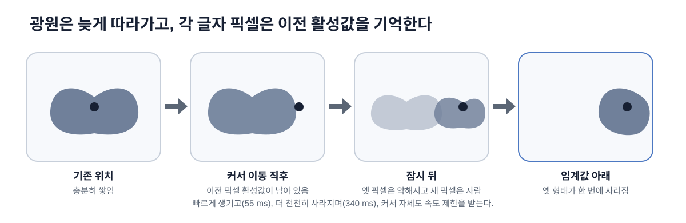

# Color Text 액체 타이포그래피 아키텍처

이 문서는 `pages/color-text/`에 구현된 인터랙티브 작품의 **실루엣 생성 구조와 움직임**을 설명한다. 고등학생도 이해할 수 있도록 먼저 비유로 설명하고, 뒤에서 실제 WebGL 렌더 패스와 코드 구조를 연결한다.

> 문서 범위: 글자 모양, 커서 Falloff, 잔상, Metaball field, 외곽선 추출, 검증 방법
> 제외 범위: 실루엣 내부의 색을 계산하는 방법

## 1. 한 문장으로 이해하기

글자 마스크의 각 픽셀에 커서 영향과 시간 기억을 저장하고, 화면의 각 출력 픽셀이 주변 활성 픽셀을 조사해 만든 숫자 지도에서 하나의 매끈한 액체 경계를 꺼낸다.


## 2. 프로젝트 파일 구조

```text
brand-artwork/
├── docs/artworks/color-text/
│   ├── architecture.md            # 지금 읽고 있는 문서
│   └── figures/                    # 문서용 SVG 도해
└── pages/color-text/
    ├── index.html                  # canvas와 오류 메시지
    ├── style.css                   # 전체 화면 레이아웃과 입력 관련 CSS
    ├── script.ts                   # 입력, WebGL 패스, 애니메이션의 중심
    ├── spec.md                     # 수치와 비교 결과를 포함한 상세 스펙
    ├── assets/                     # 레퍼런스 영상과 분석 이미지
    └── qa/                         # 실루엣 비교 이미지와 측정 스크립트
```

실제 작품의 대부분은 `pages/color-text/script.ts`에 들어 있다. `index.html`은 WebGL이 그릴 `<canvas>`를 제공하고, `style.css`는 캔버스를 화면에 맞게 고정한다.

## 3. “투명 구슬” 비유와 실제 데이터를 구분하기

구슬은 영향력이 주변으로 퍼지는 모습을 이해하기 위한 비유일 뿐이다. 실제 코드는 글자의 중심선을 찾지 않고, 글자 위에 구슬 객체나 고정된 점 목록도 만들지 않는다.

실제 데이터 단위는 다음과 같다.

- **글자 마스크 픽셀**: 그 위치가 글자 안쪽인지를 `0~1`로 저장한다.
- **활성 픽셀**: 글자 픽셀에 커서 영향이 닿아 현재 활성값을 가진 픽셀이다.
- **출력 픽셀 `p`**: 최종 실루엣의 그 위치가 남을지를 계산하는 화면 픽셀이다.
- **주변 표본 `qᵢ`**: 출력 픽셀 `p` 주변에 활성 픽셀이 얼마나 있는지 재는 측정 위치다.

“활성 픽셀을 투명 구슬처럼 본다”는 말은 각 활성 픽셀의 영향이 주변으로 부드럽게 퍼진다는 뜻이다. 그러나 구현은 활성 픽셀마다 원을 그리지 않고, 각 출력 픽셀이 자기 주변을 조사해 같은 결과를 근사한다.


## 4. 전체 데이터 흐름

실루엣을 만드는 경로만 꺼내면 다음과 같다.

```text
고해상도 글자 마스크
        │
        ▼
sourceMaterial
글자 마스크 픽셀 × 커서 Falloff
        │
        ▼
temporalMaterial
각 픽셀의 이전 활성값과 섞어 시간 기억 생성
        │
        ▼
surfaceSourceMaterial
아주 약한 활성 픽셀 제거
        │
        ▼
surfaceBlurMaterial
각 출력 픽셀이 황금각 표본 192개로 주변을 조사
        │
        ▼
surfaceSmoothMaterial × 2
가로 → 세로 Gaussian smoothing
        │
        ▼
finalMaterial
기준 높이에서 실루엣 경계 추출
        │
        ▼
화면
```

`animate()` 안에는 이 문서의 범위 밖인 별도 렌더 패스도 존재한다. 그러나 **화면에 보이는 실루엣의 기하 형태**는 위 경로의 `surfaceFieldTarget`으로 결정된다.

## 5. 단계별 구조

### 5.1 글자를 흑백 지도에 굽는다

`bakeTextMask()`는 아홉 줄의 문장을 브라우저의 2D canvas에 그린다.

- 작품 좌표계: `480 × 600`
- 글자 마스크 제작 해상도: `1440 × 1800`
- 배경 픽셀: 알파 `0`
- 글자 안쪽 픽셀: 알파 `1`에 가까운 값
- 글자 가장자리 픽셀: 안티앨리어싱 때문에 `0`과 `1` 사이의 값

3배 해상도에서 글자를 만든 뒤 선형 보간으로 읽으므로, 얇은 글자의 계단 현상이 줄어든다. 이 마스크는 글자의 중심선이 아니라 **채워진 글자 영역 전체**를 픽셀로 저장한 이미지다.

### 5.2 글자 픽셀과 커서 Falloff를 곱한다

`sourceMaterial`은 글자 마스크와 커서 주변의 타원형 빛을 곱한다.

```text
M(x, y) = 그 위치가 글자인 정도
L(x, y) = 그 위치가 커서에서 영향을 받는 정도
A(x, y) = 현재 픽셀의 활성값

A(x, y) = M(x, y) × L(x, y)^1.22
```

`M`과 `L`은 둘 다 `0~1`의 숫자다. 글자 밖에서는 `M=0`이므로 커서가 가까워도 `A=0`이다. 반대로 글자 안쪽이어도 커서 범위 밖이면 `L=0`이므로 활성화되지 않는다.

| 위치 | 글자 마스크 `M` | 커서 영향 `L` | 활성값 `A` |
| --- | ---: | ---: | ---: |
| 커서 근처의 글자 안쪽 | `1.0` | `0.9` | 약 `0.88` |
| 커서 근처의 글자 가장자리 | `0.4` | `0.9` | 약 `0.35` |
| 커서 근처의 배경 | `0.0` | `0.9` | `0.0` |
| 커서에서 먼 글자 안쪽 | `1.0` | `0.0` | `0.0` |

Falloff는 손전등처럼 중심에서 강하고 가장자리로 갈수록 약하다. 현재 기본 범위는 다음과 같다.

| 방향 | 범위 |
| --- | ---: |
| 가로 | 160 px |
| 커서 위 | 120 px |
| 커서 아래 | 240 px |

아래쪽 범위를 더 길게 둬서 활성 영역이 아래로 이어지는 구성을 만든다. 세로 가장자리로 갈수록 가로 폭도 줄어들기 때문에 단순한 큰 타원보다 좁고 길게 반응한다.

### 5.3 위치 지연과 픽셀 기억을 따로 계산한다

시간에 따른 반응은 두 개의 다른 상태로 나뉜다.

#### 5.3.1 광원 위치가 커서를 느리게 따라간다

`pointerTarget`은 `pointermove`에서 바로 저장한 실제 커서 위치다. `pointer`는 렌더링에 사용하는 광원 위치이며, 매 프레임 `pointerTarget`을 일부만 따라간다.

```text
pointerTarget = 사용자가 현재 가리키는 목적지
pointer       = 화면 계산에 실제로 사용하는 지연된 광원 위치

pointer ← pointer + (pointerTarget - pointer) × 시간 기반 이동 비율
```

최대 이동 속도는 초당 `300` 작품 픽셀이다. 이 단계는 광원 하나의 위치를 지연시킬 뿐, 지나간 글자 픽셀의 값을 남기지는 않는다.

#### 5.3.2 `temporalMaterial`이 각 글자 픽셀의 이전 활성값을 기억한다

`sourceMaterial`이 만든 `sourceTarget`은 이번 프레임의 활성 이미지다. `temporalMaterial`은 각 픽셀에서 이 현재 값 `C`와 이전 프레임의 기억 `H`를 섞어 새 기억을 만든다.

```text
Hₜ = Hₜ₋₁ × (1 - α) + Cₜ × α
```

현재 값이 더 크면 빠른 attack, 더 작으면 느린 release를 선택한다.

```text
attack  시간 = 0.055 s
release 시간 = 0.34 s

α = 1 - exp(-프레임 시간 / attack 또는 release 시간)
```

60fps에서는 활성 픽셀이 한 프레임에 목표값의 약 `26%`를 따라가고, 사라질 때는 약 `4.8%`씩만 줄어든다. 그래서 새 픽셀은 빠르게 생기고, 커서가 떠난 픽셀은 더 오래 남는다.

두 개의 렌더 타깃 `historyTargetA`와 `historyTargetB`는 이 픽셀 기억 이미지를 번갈아 읽고 쓴다. 이를 **ping-pong buffer**라고 한다.

```text
프레임 1: history A 읽기 → history B에 새 픽셀 기억 쓰기
프레임 2: history B 읽기 → history A에 새 픽셀 기억 쓰기
```



위치 지연만 있으면 “느리게 움직이는 손전등”에 가깝다. `temporalMaterial`까지 있어야 이전에 빛을 받은 글자 픽셀과 현재 빛을 받는 픽셀이 동시에 존재해 늘어지는 액체 같은 형태를 만들 수 있다. 기억 값은 연속적으로 줄어들지만, 뒤의 임계값을 통과하지 못하는 순간 화면에서는 비교적 빠르게 사라져 보인다.

### 5.4 너무 약한 활성 픽셀은 field 입력에서 제외한다

`surfaceSourceMaterial`은 시간 기억 이미지의 각 픽셀이 Metaball field의 출발점이 될 만큼 강한지 판단한다.

- 입력 임계값: `0.02`
- 부드러운 전환 폭: `0.025`

단순히 `0.02`에서 잘라 버리면 프레임마다 픽셀이 켜졌다 꺼지면서 떨릴 수 있다. 그래서 `smoothstep()`으로 `0.02~0.045` 사이의 부드러운 전환 구간을 만든다.

```glsl
detected = smoothstep(0.02, 0.045, activation);
sourceAlpha = activation * detected * step(0.08, textMask);
```

### 5.5 황금각 나선 표본으로 주변 활성 픽셀을 조사한다

`surfaceBlurMaterial`이 현재 구조의 핵심이다. 화면의 각 출력 픽셀 `p`는 자기를 중심으로 한 반경 `30 px` 원 안에서 활성 픽셀을 `192번` 읽는다.

여기서 “Fibonacci 표본”은 피보나치 수를 field 값으로 쓴다는 뜻이 아니다. **황금각 `137.5°`로 방향을 계속 돌려 192개의 측정 위치를 원 안에 고르게 배치한다**는 뜻이다. 해바라기 씨와 비슷한 나선 배치를 쓰면 표본이 특정 방향에 줄을 맞지 않아 사각형이나 십자 모양의 흔적이 줄어든다.

```text
표본 각도   = i × 137.5°
표본 반지름 = sqrt((i + 0.5) / 192) × 30 px
```

반지름에 `sqrt()`를 쓰는 이유는 원의 바깥쪽으로 갈수록 면적이 커지기 때문이다. 이렇게 해야 표본이 중심에 몰리지 않고 원의 면적에 비교적 고르게 배치된다.

각 표본은 위치에 있는 활성값 `S(qᵢ)`를 읽는다. 가까운 표본은 큰 가중치를 받고, 반경의 끝에 가까워질수록 가중치는 `0`에 가까워진다.

```text
wᵢ = (1 - 거리 비율) ^ 3.2

F(p) = 0.55 × S(p) + 2.2 × Σ(S(qᵢ) × wᵢ) / Σwᵢ
```

- `p`: 지금 field 값을 계산하는 출력 픽셀
- `S(p)`: 그 출력 위치의 활성값
- `qᵢ`: `p` 주변에서 살펴본 192개의 표본 위치
- `S(qᵢ)`: 표본 위치에 저장된 활성값
- `wᵢ`: 표본이 `p`에 얼마나 가까운지를 나타내는 가중치

출력 픽셀 `p`가 주변을 보았을 때 가까운 곳에 강한 활성 픽셀이 많으면 field가 높아진다.

- 글자에서 멀리 떨어진 `p`: 192개 표본이 거의 모두 `0`을 읽어 field가 낮다.
- 활성 글자 픽셀 근처의 `p`: 일부 표본이 활성값을 읽어 field가 올라간다.
- `Y` 갈림점 근처의 `p`: 여러 방향의 글자 픽셀을 함께 읽어 분기 구조가 field에 반영된다.

중요한 점은 **192개가 글자 위에 놓은 구슬 수가 아니라는 것**이다. 같은 192개의 상대적 표본 배치가 480×600의 모든 출력 픽셀에서 반복된다. 활성 픽셀마다 방사형 영향력을 뿌리는 것과 결과적으로 비슷하지만, GPU에서는 반대로 각 출력 픽셀이 주변을 모아 읽는 방식으로 계산한다.

계산량은 한 프레임에 대략 `480 × 600 × 192 = 55,296,000`번의 주변 텍스처 확인이다. 이 작업을 JavaScript 반복문이 아니라 GPU의 fragment shader가 픽셀마다 병렬로 처리한다.

이는 점 목록의 역제곱 영향력을 합산하는 고전적 Metaball 공식을 그대로 쓴 것은 아니다. **활성 픽셀 이미지에 둥근 가중 평균을 적용해 Metaball처럼 이어지는 연속적 field를 근사한 구조**다.

### 5.6 높이 지도를 가로와 세로로 매끄럽게 만든다

192개 표본만으로 만든 필드에는 작은 계단과 표본 흔적이 남을 수 있다. `surfaceSmoothMaterial`을 두 번 사용해 먼저 가로, 그다음 세로로 Gaussian smoothing을 적용한다.

- sigma: `1.8`
- 반경: 양쪽 `5 px`
- 실제 표본 수: 한 방향당 `-5`부터 `+5`까지 총 `11개`

2차원으로 큰 필터를 한 번 계산하는 대신, 가로와 세로를 나누면 비슷한 결과를 더 적은 계산으로 얻을 수 있다. 이를 **separable filter**라고 한다.

### 5.7 기준 높이에서 최종 외곽선을 꺼낸다

`finalMaterial`은 매끄러워진 필드에서 높이 `0.07` 부근을 경계로 사용한다.

- 실루엣 기준 높이: `0.07`
- 기본 가장자리 softness: `0.012`
- 화면 해상도에 따른 추가 antialiasing: `fwidth(surfaceField) × 1.2`

```glsl
coverage = smoothstep(
  threshold - edge,
  threshold + edge,
  surfaceField
);
```

현재 `coreMix`는 `0`이다. 즉, 가장 가까운 글자 픽셀 주변에 별도의 몸체나 명시적 외곽선을 강제로 합치지 않는다. 최종 외곽선은 Metaball field의 등고선 자체다.

## 6. 왜 Y 중심이 볼록하지 않고 오목해지는가


### 이전 구조

이전 구조는 각 출력 픽셀에서 **가장 가까운 활성 글자 픽셀 하나**를 골라 거리를 계산했다. `Y`의 왼쪽 팔, 오른쪽 팔, 아래 줄기 주변의 여러 픽셀 분포를 동시에 보지 못했다. 그 결과 교차점에 큰 원을 찍은 것처럼 중심이 볼록해지기 쉬웠다.

### 현재 구조

현재 구조에서는 각 출력 픽셀이 주변 192개 위치를 조사하므로, `Y`를 이루는 왼쪽 팔, 오른쪽 팔, 아래 줄기의 활성 픽셀 분포가 같은 field 안에 함께 반영된다.

1. 왼쪽 팔 근처의 표본은 왼쪽 글자 픽셀을 읽는다.
2. 오른쪽 팔 근처의 표본은 오른쪽 글자 픽셀을 읽는다.
3. 아래 줄기 근처의 표본은 세로로 이어진 글자 픽셀을 읽는다.
4. 두 팔 사이의 흰 픽셀 골짜기에서는 활성 픽셀을 읽는 비율이 비교적 낮아 field에 안장 모양의 낮은 지점이 남는다.
5. 높이 `0.07`의 등고선을 꺼내면 흰 공간이 줄기를 따라 아래로 파고든다.

이런 지점을 **안장점(saddle point)**이라고 한다. 말 안장의 가운데처럼 한 방향에서 보면 높고, 다른 방향에서 보면 낮다.

코드에는 `Y`를 위한 별도 모양이나 예외 처리가 없다. 같은 주변 표본 계산이 글자 픽셀의 배치에 반응해 다른 외곽선을 만든 결과다.

## 7. 렌더 타깃의 역할

WebGL의 렌더 타깃은 GPU 안에서 다음 계산으로 넘겨줄 중간 이미지를 저장하는 공간이다.

| 렌더 타깃 | 저장하는 값 | 다음 사용처 |
| --- | --- | --- |
| `sourceTarget` | 글자 마스크 픽셀과 커서 Falloff를 곱한 현재 활성 이미지 | 시간 기억 |
| `historyTargetA/B` | 각 글자 픽셀의 이전 값과 현재 값을 섞은 활성 기억 | 입력 감지 |
| `surfaceSourceTarget` | 임계값을 통과한 활성 픽셀 | 황금각 주변 표본 |
| `metaballRawTarget` | 출력 픽셀마다 192개 주변 표본을 합친 원래 field | 가로 smoothing |
| `surfaceHorizontalTarget` | 가로 방향으로 매끄러워진 높이 | 세로 smoothing |
| `surfaceFieldTarget` | 최종으로 매끄러워진 높이 지도 | 외곽선 추출 |
| 화면 | 최종 실루엣이 합성된 결과 | 사용자에게 표시 |

`renderPass(material, target)`는 전체 화면 크기의 사각형 하나를 그린다. 사각형의 각 픽셀에서 해당 shader가 실행되고, 결과가 다음 렌더 타깃에 저장된다.

## 8. 한 프레임의 실행 순서

`animate(now)`가 브라우저의 `requestAnimationFrame()`마다 호출된다.

```ts
function animate(now) {
  // 1. pointer가 pointerTarget을 느리게 따라가도록 갱신한다.
  updateDelayedPointer();

  // 2. 각 글자 마스크 픽셀과 Falloff를 곱한다.
  renderPass(sourceMaterial, sourceTarget);

  // 3. 각 픽셀을 이전 활성값과 섞고 history A/B를 교환한다.
  renderPass(temporalMaterial, historyWrite);
  swap(historyRead, historyWrite);

  // 4. 약한 활성 픽셀을 제거한다.
  renderPass(surfaceSourceMaterial, surfaceSourceTarget);

  // 5. 각 출력 픽셀이 황금각 표본 192개로 주변을 조사한다.
  renderPass(surfaceBlurMaterial, metaballRawTarget);

  // 6. 가로 → 세로로 매끄럽게 만든다.
  renderPass(surfaceSmoothMaterial, surfaceHorizontalTarget);
  renderPass(surfaceSmoothMaterial, surfaceFieldTarget);

  // 7. 기준 높이에서 경계를 꺼내 화면에 그린다.
  renderPass(finalMaterial, null);
}
```

위 코드는 이해를 위해 이 문서의 범위에 해당하는 패스만 남긴 의사 코드다.

## 9. 입력과 반응형 좌표

브라우저 화면의 크기와 작품 좌표의 크기는 다르다. `updateLayout()`과 `setPointerFromClient()`가 두 좌표계를 연결한다.

1. `480:600` 비율을 유지하면서 화면 안에 작품을 최대한 크게 배치한다.
2. 캔버스 바깥의 여백을 계산해 `artworkRect`에 저장한다.
3. 브라우저의 마우스 좌표에서 여백을 뺀다.
4. 결과를 `0~1` 범위의 작품 좌표로 바꾼다.
5. WebGL의 세로축 방향에 맞게 Y 좌표를 뒤집는다.

그래서 데스크톱과 모바일에서 같은 글자 위치를 가리킬 수 있다. `pointermove`와 `pointerdown`을 모두 받으므로 마우스와 터치 입력이 같은 경로를 사용한다.

## 10. QA 모드와 검증 순서

실루엣은 내부 표현을 제거한 세 종류의 값으로 비교한다.

```text
배경 = 0
원래 텍스트 = 1
효과 실루엣 = 2
```

재현 가능한 비교 주소의 예시는 다음과 같다.

```text
/pages/color-text/?qa=1&qaX=0.37&qaY=0.52&qaLabels=1
```

- `qa=1`: 움직이는 상태를 고정해 비교하기 쉽게 만든다.
- `qaX`, `qaY`: 커서 위치를 작품 좌표로 고정한다.
- `qaLabels=1`: 배경, 텍스트, 효과만 남긴 실루엣 지도 모드다.

검증은 다음 순서로 진행했다.

1. `Y` 교차부만 확대한다.
2. 중심의 볼록한 돌출이 사라졌는지 확인한다.
3. 흰 공간이 줄기를 따라 오목하게 내려오는지 확인한다.
4. `Y`가 통과한 뒤 전체 실루엣을 비교한다.
5. 커서 이동, 잔상 유지, 소멸을 확인한다.
6. 브라우저 오류와 빌드를 확인한다.

최종 측정에서 효과 면적은 레퍼런스보다 `2.61%` 컸고, 실루엣 중심부 두께의 중앙값은 `1.07%` 작았다. 숫자만 맞추지 않고 `Y`의 오목한 연결과 전체 외곽선의 연속성도 함께 확인했다.

## 11. 이 구현은 실제 물 시뮬레이션이 아니다

이 구조는 다음을 계산하지 않는다.

- 물의 질량과 부피 보존
- 압력과 점성
- 실제 중력 가속도
- 물방울끼리의 충돌
- 튀거나 갈라지는 유체 입자

대신 활성 글자 픽셀 이미지에 방사형 가중 평균을 적용한 field를 사용해 **물방울이 합쳐지는 외형**을 빠르게 흉내 낸다. 그래서 정확한 표현은 “유체 시뮬레이션”보다 “활성 픽셀 field 기반 액체 실루엣”이다.

## 12. 주요 조절값

| 상태값 | 기본값 | 모양에 미치는 영향 |
| --- | ---: | --- |
| `radiusX` | `107` | 커서 영향 범위의 가로 폭 |
| `radiusY` | `80` | 커서 위쪽 영향 범위 |
| `radiusYBelow` | `160` | 커서 아래쪽 영향 범위 |
| `metaballInputThreshold` | `0.02` | Metaball 출발점으로 인정할 최소 활성도 |
| `metaballInputSoftness` | `0.025` | 입력이 켜지고 꺼지는 전환 폭 |
| `metaballBlurRadius` | `30` | 각 출력 픽셀이 주변 활성 픽셀을 조사하는 거리 |
| `metaballFalloffPower` | `3.2` | 거리 증가에 따라 영향력이 줄어드는 속도 |
| `metaballSourceGain` | `0.55` | 현재 출력 위치의 활성값을 직접 남기는 비율 |
| `metaballFieldGain` | `2.2` | 주변 누적 영향의 비율 |
| `metaballSmoothing` | `1.8` | 높이 지도를 매끄럽게 만드는 정도 |
| `surfaceThreshold` | `0.07` | 최종 외곽선을 꺼낼 높이 |
| `surfaceSoftness` | `0.012` | 외곽선 전환의 부드러움 |
| `coreMix` | `0` | 별도 글자 외곽선 비활성화 |
| `pointerMaxSpeed` | `300` | 커서 빛이 따라가는 최대 속도 |
| `activationAttack` | `0.055 s` | 새 효과가 생기는 시간 |
| `activationRelease` | `0.34 s` | 옛 효과가 약해지는 시간 |
| `colorCenterRadiusX` | `20` | 글자 셀 중심에 놓는 색 타원의 가로 반경 |
| `colorCenterRadiusY` | `13` | 글자 셀 중심에 놓는 색 타원의 세로 반경 |
| `colorBlurSigma` | `2.5` | 타원과 주변 중간색을 연결하는 부드러움 |
| `colorBlurAspect` | `0.8` | 세로 방향 색 blur의 가로 대비 비율 |

일반 화면에서는 `lil-gui` 패널이 보이며, `광원 / Falloff`, `액체 실루엣`, `움직임 / 시간 기억`, `색상`, `고급 설정` 폴더로 나뉜다. 키보드의 `g`를 누르면 패널을 숨기거나 다시 열 수 있다. 자동 비교용 QA 모드에서는 이미지 비교를 가리지 않도록 패널이 처음부터 숨겨진다. 실루엣을 조절할 때는 한 번에 하나의 값을 바꾸고 Y 교차부를 먼저 확인하는 것이 안전하다.

## 13. 용어 정리

| 용어 | 쉬운 뜻 |
| --- | --- |
| Pixel | 이미지를 이루는 하나의 격자 칸. 이 문서의 실제 계산 단위 |
| Text mask | 각 픽셀이 글자 안쪽인지를 `0~1`로 저장한 흑백 지도 |
| Active pixel | 글자 마스크와 커서 Falloff를 곱한 현재 또는 기억된 활성값을 가진 픽셀 |
| Output pixel | 자기 위치의 field 값과 최종 실루엣 포함 여부를 계산하는 화면 픽셀 |
| Probe sample | 출력 픽셀 주변의 활성값을 읽기 위한 측정 위치. 구슬 객체가 아님 |
| Falloff | 중심에서 멀어질수록 값이 약해지는 규칙 |
| Field | 화면의 모든 위치에 숫자 하나씩 저장한 지도 |
| Metaball-like field | 활성 픽셀 주변을 둥근 거리 가중치로 모아 물방울 같은 경계를 만드는 숫자 지도 |
| Render target | GPU 계산의 중간 결과를 저장하는 이미지 |
| Ping-pong buffer | 두 저장 공간이 읽기와 쓰기 역할을 번갈아 하는 구조 |
| Threshold | 어떤 값을 남길지 결정하는 기준선 |
| Isocontour | 높이 지도에서 같은 높이를 이은 경계선 |
| Smoothing | 작은 계단과 잡음을 부드럽게 줄이는 계산 |
| Saddle point | 한 방향에서는 높고 다른 방향에서는 낮은 안장 모양의 지점 |

## 14. 참고 자료

- 작가가 제공한 Instagram 설명: Shody’s Metaball과 Falloff로 typography stroke를 드러낸다는 설명
- [Scenery — Metaball overview](https://scenery.io/plugins/metaball-7w5Tj0PnVJJ)
- [Scenery — Metaball manual](https://scenery.io/plugins/metaball-7w5Tj0PnVJJ/manual)
- [Cavalry — Falloff documentation](https://cavalry.studio/docs/nodes/utilities/falloff/)
- 구현: [`pages/color-text/script.ts`](../../../pages/color-text/script.ts)
- 수치 및 비교 기록: [`pages/color-text/spec.md`](../../../pages/color-text/spec.md)
