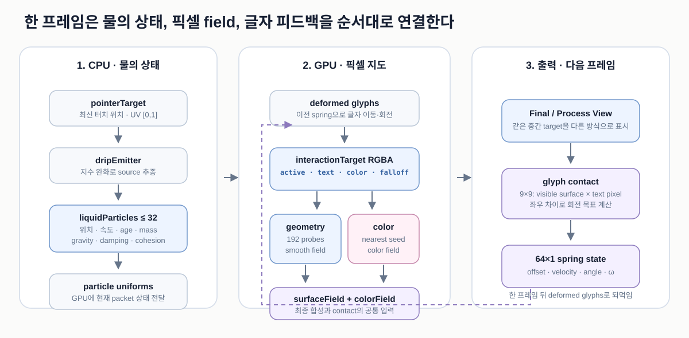

# Color Text 아키텍처

이 문서는 `pages/color-text/`의 **현재 코드**를 기준으로 작품 전체 구조를 설명한다. 입력이 들어온 뒤 CPU가 무엇을 기억하고, GPU의 여러 이미지 지도가 어떤 순서로 만들어지며, 그 결과가 글자 움직임과 최종 색으로 어떻게 이어지는지를 다룬다.

- 기준 구현: `pages/color-text/script.ts`
- 작품 좌표: `480 × 600`
- 문서 갱신 기준: `2026-08-10`
- 대상 독자: WebGL을 처음 접하는 고등학생도 전체 흐름을 따라갈 수 있는 수준

세부 실험값과 과거 비교 결과는 [`pages/color-text/spec.md`](../../../pages/color-text/spec.md)에 두고, 이 문서는 **현재 입력 → 상태 → 렌더 패스 → 출력 → 검증 구조**를 설명하는 데 집중한다.

## 1. 한 문장으로 이해하기

손가락은 물이 나오는 위치를 정하고, CPU는 그곳에서 떨어져 나온 물 덩어리들의 위치와 속도를 기억하며, GPU는 그 영향이 닿은 **현재 글자 픽셀**을 하나의 Metaball 실루엣으로 연결한다. 실루엣에 실제로 닿은 글자는 스프링처럼 내려가고 기울며, 바뀐 글자 위치는 다음 프레임의 실루엣 계산에도 다시 들어간다.



핵심은 세 종류의 상태를 구분하는 것이다.

1. `pointerTarget`: 가장 최근의 손가락 위치
2. `liquidParticles`: 이미 방출된 물 덩어리들의 물리 상태
3. `glyphSpringTarget`: 각 글자의 이동·회전 상태

과거 활성 이미지를 그대로 쌓아 두는 `temporalMaterial`은 없다. 시간 기억은 **물 덩어리의 위치·속도·나이**와 **글자의 스프링 상태**에 들어 있다.

## 2. 프로젝트 구조

```text
brand-artwork/
├── common/
│   └── touch-cursor.ts
│       └── 화면 녹화용 터치 위치 인디케이터
├── docs/artworks/color-text/
│   ├── architecture.md
│   └── figures/
│       ├── 01-pipeline.svg
│       ├── 02-pixels-and-field.svg
│       ├── 03-y-junction.svg
│       └── 04-current-frame-graph.svg
└── pages/color-text/
    ├── index.html
    │   └── canvas, Process View 버튼, SNS 메타 태그
    ├── style.css
    │   └── 전체 화면 배치, 모바일 입력 차단, 인디케이터 스타일
    ├── script.ts
    │   └── 입력, Solver, WebGL 패스, 스프링, 디버그 화면
    ├── spec.md
    │   └── 상세 수치와 과거 비교 기록
    ├── assets/
    │   ├── reference.mp4
    │   ├── reference-frame.png
    │   └── og-image.jpg
    └── qa/
        └── 실루엣 비교 이미지, 측정값, 분석 스크립트
```

`index.html`과 `style.css`는 화면과 입력 환경을 만든다. 작품의 계산은 대부분 `script.ts`에 있고, 한 장의 full-screen quad를 여러 ShaderMaterial로 반복 렌더링해 중간 결과를 다음 단계로 넘긴다.

## 3. 전체 구조: CPU 상태와 GPU 이미지 지도

이 작품은 실제 역할이 다른 두 계산 영역을 함께 사용한다.

### 3.1 CPU: 적은 수의 물 덩어리를 움직인다

JavaScript의 `liquidParticles` 배열에는 최대 32개의 물 덩어리가 있다. 각 원소는 이미지가 아니라 다음 숫자만 저장한다.

```ts
type LiquidParticle = {
  x: number;
  y: number;
  velocityX: number;
  velocityDown: number;
  age: number;
  mass: number;
  energy: number;
  growing: boolean;
  seed: number;
};
```

CPU는 중력, 점성 감쇠, 가까운 덩어리 사이의 응집력을 계산해 이 숫자들을 갱신한다. 글자 픽셀 수십만 개를 CPU에서 움직이지 않기 때문에 모바일에서도 구조를 단순하게 유지할 수 있다.

`growing`은 deterministic QA 입력까지 같은 GPU uniform 형식으로 전달하기 위해 남아 있는 표시값이다. 일반 상호작용에서 첫 source가 천천히 나타나는 정도는 `dripSourceAge`로 계산한 `energy`와 0에서 채워지는 `mass`가 담당한다.

### 3.2 GPU: 화면의 모든 픽셀에 숫자 지도를 만든다

GPU는 물 덩어리의 현재 위치를 받아 다음과 같은 이미지 지도를 차례로 만든다.

```text
변형된 글자 마스크
        ×
물 덩어리 Falloff
        ↓
활성 글자 픽셀
        ↓
Metaball 높이 지도
        ↓
최종 실루엣
```

동시에 활성 글자 픽셀까지의 거리와 색 에너지 지도도 만든다. 마지막 shader가 변형된 배경 글자, 실루엣, 색을 한 화면으로 합친다.

### 3.3 DOM: 작품 계산 밖의 인터페이스

하단 `Solver · Contact · Contour · Final` 버튼과 터치 인디케이터는 DOM 요소다. 이들은 작품의 내부 값을 보여주거나 단계를 바꾸지만 물리 계산이나 Metaball field에 입력으로 들어가지는 않는다.

## 4. 시작할 때 한 번 만드는 글자 데이터

### 4.1 원본 글자 배치

작품 문장은 다음 아홉 줄이다.

```text
PRESS
AND HOLD
THE SURFACE
UNTIL
THE WORDS
BEGIN
TO GIVE
WAY
BENEATH YOU
```

기본 글꼴은 `Helvetica Neue` 계열의 43px 굵기 300이며, 글자 중심 간격은 31.8px, 줄 간격은 42.2px이다. 공백까지 포함하면 총 64개의 글자 자리가 생긴다.

### 4.2 3배 해상도 글자 마스크

브라우저의 2D canvas가 글자를 `1440 × 1800`, 즉 작품 해상도의 3배로 굽는다.

- 배경: 알파 0
- 글자 내부: 알파 1에 가까운 값
- 글자 경계: 안티앨리어싱으로 0과 1 사이의 값

이 데이터의 실제 단위는 “글자 획”이라는 추상적인 선이 아니라 **글자 내부와 경계를 이루는 픽셀**이다.

### 4.3 독립 글자 아틀라스

각 글자는 `8 × 8` 아틀라스의 독립된 `64 × 64px` 칸에 저장된다. 아틀라스 자체도 3배 해상도다.

독립 칸을 쓰는 이유는 두 가지다.

1. `W`처럼 넓은 글자가 움직이거나 회전해도 고정 글자 칸에서 잘리지 않게 한다.
2. 한 글자를 역변형해 읽을 때 옆 글자의 픽셀을 함께 복사해 글자가 겹치는 일을 막는다.

`glyphMetadataTexture`는 글자별 실제 반쪽 폭과 공백 여부를 저장한다. 변형 shader는 출력 위치에서 가장 가까운 글자 자리뿐 아니라 양옆 후보도 보지만, 각 후보의 픽셀은 자기 아틀라스 칸에서만 가져온다.

### 4.4 선택 가능한 색 중심 아틀라스

글자의 잉크 양, 실제 폭·높이, 알파 가중 중심을 측정해 글자마다 다른 세로 타원을 만든 아틀라스도 함께 준비한다. 다만 현재 기본값 `colorEllipseInfluence = 0`에서는 이 타원이 최종 밝은 중심의 모양을 결정하지 않는다. 현재 화면에서 보이는 내부 중심은 뒤에서 설명할 **활성 글자 픽셀까지의 거리**를 따른다.

## 5. 입력과 물 source

### 5.1 `pointerTarget`과 `dripEmitter`는 다르다

`pointerTarget`은 이벤트에서 받은 최신 손가락 위치다. 이 값을 그대로 렌더링하면 손가락의 작은 움직임도 즉시 반영되어 가볍고 떨리는 느낌이 난다.

`dripEmitter`는 다음 지수 완화식으로 `pointerTarget`을 따라간다.

```text
blend = 1 - exp(-followEase × Δt)
emitter += (pointerTarget - emitter) × blend
```

기본 `followEase`는 `7.5 s⁻¹`이다. 따라서 source는 손가락보다 약간 늦게 따라오지만 프레임 속도가 달라져도 반응 성격이 크게 변하지 않는다.

### 5.2 처음 누를 때는 질량과 에너지가 함께 증가한다

`pointerdown` 순간에는 질량과 에너지가 모두 0인 source packet을 만든다.

```text
공급 질량 = 누른 시간 / 0.13초
source energy = (1 - exp(-누른 시간 / 0.36초))²
Falloff 반경 배율 = √질량
```

그래서 첫 프레임에 완성된 실루엣이 갑자기 나타나지 않는다. 반경은 질량 0에서 커지고, 밝기는 energy 0에서 서서히 올라간다.

터치 뒤 누적 이동이 작품 좌표로 8px을 넘으면 `dripHasDragged`가 켜지고, 이후 source energy는 바로 1을 사용한다. 즉 **첫 터치만 천천히 나타나고, 드래그 중 새 위치에서는 다시 시작 지연을 반복하지 않는다.**

### 5.3 source packet의 교대

첫 packet의 질량이 1이 된 뒤에는 그 완성된 packet을 emitter에 붙인 채 유지한다. 다음 질량 1이 시간 예산에 모두 준비되면 같은 위치에 완성된 새 packet을 만들고, 이전 packet만 아래로 떨어뜨린다.

```text
첫 packet: 0 → 1로 연속 성장
다음 질량이 1보다 작음: 기존 완성 packet을 source에 유지
다음 질량이 1이 됨: 완성 packet끼리 교대
이전 packet: source에서 분리되어 낙하
```

작은 점을 드래그 경로마다 찍지 않고 큰 source 자체가 부드럽게 움직인다. 그래서 빠르게 드래그해도 작은 조각의 사슬이 생기지 않는다.

### 5.4 이미 떨어진 물은 새 손가락 위치를 따라가지 않는다

드래그가 옆으로 이동해도 `dripEmitter`와 아직 붙어 있는 source만 이동한다. 분리된 packet은 자신의 위치와 속도로 계속 떨어진다.

```text
A에서 분리된 packet → A 아래로 낙하
B에서 분리된 packet → B 아래로 낙하
C의 현재 source      → C에서 새 물 공급
```

분리 순간에는 포인터의 접선 속도를 전달하지 않고 `velocityX = 0`, `velocityDown = 18px/s`로 시작한다. 그래서 위에서 원형으로 드래그해도 아래로 떨어진 물이 그 원을 계속 도는 현상을 막는다.

### 5.5 손을 떼면 공급만 멈춘다

`pointerup`은 새 물 공급을 멈추고 현재 source를 일반 packet으로 분리할 뿐이다. 기존 packet을 중앙에서 줄이거나 시간으로 투명하게 만들지 않는다.

모든 packet은 같은 중력과 점성 규칙으로 계속 낙하하고, 자신의 Falloff 전체가 화면 아래로 벗어났을 때만 배열에서 제거된다. 그래서 소멸이 “중앙 방패 모양만 남다가 사라지는 것”이 아니라 물이 아래 출구로 빠져나가는 움직임이 된다.

## 6. CPU Liquid Solver

한 애니메이션 프레임이 길어져도 계산이 갑자기 튀지 않도록 `Δt`를 최대 `1/60초` 크기의 substep으로 나눈다.

각 substep의 개념식은 다음과 같다.

```text
가로 가속도 = 응집력 + 작은 난류
아래 가속도 = 중력 + 응집력

속도 += 가속도 × Δt
속도 *= exp(-점성 × Δt)
위치 += 속도 × Δt
나이 += Δt
```

현재 기본 중력은 `78px/s²`다. 세로 감쇠는 가로 감쇠보다 약하게 적용해 아래 흐름은 유지하고 좌우 흔들림은 더 빨리 안정시킨다.

### 6.1 응집력은 벌어진 packet만 당긴다

두 packet이 기본 거리보다 멀어지고 응집 범위 92px 안에 있을 때만 서로 당긴다. 이미 겹친 packet을 밀어내지는 않는다.

겹침은 뒤의 Metaball 단계가 하나의 표면으로 처리한다. 물리 단계까지 반발력을 주면 새 packet 무리가 갑자기 폭발하듯 퍼질 수 있다.

손가락에 붙어 있는 source는 응집력 계산에서 제외한다. 그렇지 않으면 손가락을 옆으로 움직일 때 source가 이미 떨어진 물까지 끌고 간다.

### 6.2 32개 제한에서 외곽이 갑자기 커지지 않게 한다

새 packet을 추가하려는데 배열이 32개라면, source를 제외하고 가장 가까운 두 packet을 하나로 압축한다.

- 위치와 속도: 질량 가중 평균
- 화면에 보이는 질량: 두 값을 더하지 않고 더 큰 기존 질량 유지
- energy와 seed: 가중 평균

질량 1 두 개를 단순 합치면 반경 배율 `√2 ≈ 1.41`이 되어 정지 터치 중 Falloff가 갑자기 커진다. 현재 방식은 정확한 질량 보존보다 화면 외곽의 연속성을 우선한다.

## 7. GPU 한 프레임

### 7.1 현재 위치의 글자 마스크를 다시 만든다

`deformedGlyphMaterial`은 이전 프레임의 글자별 스프링 상태를 읽는다. 각 글자 전체에 같은 세로 이동과 회전을 적용해 두 개의 지도를 만든다.

- `deformedTextTarget`: `1440 × 1800` 고해상도 현재 글자 마스크
- `deformedColorCenterTarget`: `480 × 600` 현재 색 중심 마스크

글자 모양을 픽셀마다 잡아 늘리는 것이 아니라 글자 하나를 단단한 판처럼 이동·회전한다. 고해상도 글자 마스크를 최종 화면에도 직접 사용하므로 움직인 뒤에도 가는 선이 뭉개지지 않는다.

### 7.2 packet들로 연속 Falloff를 만든다

`interactionFieldMaterial`은 화면의 각 출력 픽셀에서 최대 32개 packet의 Falloff를 계산한다.

packet 하나의 모양에는 다음 값이 반영된다.

- 질량의 제곱근에 따른 전체 반경
- 나이에 따른 세로 신장
- 위·아래가 다른 세로 반경
- 끝으로 갈수록 좁아지는 가로 taper
- 오래 흐를수록 가늘어지는 stream width
- seed와 시간에 따른 작은 좌우 굴곡과 밀도 변화

모든 값을 더하면 겹친 곳이 지나치게 넓어진다. 단순 `max()`만 쓰면 가장 강한 packet이 바뀌는 순간 경계가 끊길 수 있다. 현재는 가장 강한 값과 두 번째 값을 찾고, 두 값의 차이가 `0.08` 안일 때만 monotonic smooth union으로 연결한다.

```text
streamLight(p) = smoothUnion(
  가장 강한 packet Falloff,
  두 번째 packet Falloff
)
```

이 결합값은 두 입력 중 큰 값보다 작아지지 않는다. 따라서 packet 사이에 어두운 홈을 만들지 않으면서 합산 방식의 과도한 팽창도 피한다.

### 7.3 글자 픽셀과 Falloff를 곱한다

현재 출력 위치 `p`에서 다음 값을 계산한다.

```text
M(p) = 현재 변형된 글자 마스크
L(p) = 이어진 물 Falloff

surfaceActivation(p) = M(p) × L(p)^1.22 × 0.92
colorActivation(p)   = colorCenter(p) × L(p)^1.12
```

이 결과는 `interactionTarget`의 네 채널에 함께 저장한다.

| 채널 | 값 | 사용처 |
| --- | --- | --- |
| R | Falloff와 만난 활성 글자 픽셀 | Metaball, Contact, 색 중심 거리 |
| G | 현재 글자 마스크 | 디버그, seed의 글자 내부 제한 |
| B | Falloff와 만난 선택형 타원 색 중심 | 색 field |
| A | 글자와 곱하기 전 원본 Falloff | Solver·Contact 시각화 |

글자 밖에서는 `M=0`이므로 큰 Falloff가 지나가도 geometry의 출발점이 되지 않는다. 반대로 글자 안이라도 물 범위 밖이면 활성값은 0이다.


## 8. 실루엣 geometry 파이프라인

색과 외곽선은 독립적으로 계산된다. 최종 실루엣 모양은 다음 경로만으로 결정된다.

```text
interactionTarget.r
  → surfaceSourceTarget
  → metaballRawTarget
  → surfaceHorizontalTarget
  → surfaceFieldTarget
  → threshold contour
```

### 8.1 약한 입력을 부드럽게 제외한다

`surfaceSourceMaterial`은 활성값 `0.02` 아래를 제거하고, `0.025` 폭으로 전환한다.

```glsl
detected = smoothstep(0.02, 0.045, activation);
source = activation * detected;
```

하나의 값에서 딱 잘라 켜고 끄지 않기 때문에 경계 픽셀이 프레임마다 깜빡이는 현상이 줄어든다.

### 8.2 각 출력 픽셀이 주변 192곳을 조사한다

`surfaceBlurMaterial`은 모든 출력 픽셀 `p`에서 반경 30px 안의 192곳을 읽는다. 조사 위치는 방향 편향이 적도록 황금각 약 `137.5°`로 돌려 배치한다.

```text
angleᵢ  = i × 137.5°
radiusᵢ = √((i + 0.5) / 192) × 30px
weightᵢ = (1 - radiusᵢ / 30px)^3.2
```

`√`를 쓰는 이유는 원의 바깥쪽 면적이 더 크기 때문이다. 이렇게 해야 조사점이 중심에 몰리지 않고 원 전체에 비교적 균일하게 놓인다.

```text
F(p) = 0.55 × S(p)
     + 2.2 × 주변 활성값의 거리 가중 평균
```

192개는 글자 위에 배치한 고정 구슬의 수가 아니다. 같은 조사 패턴을 **각 출력 픽셀이 자기 주변에서 반복**한다. GPU에서는 대략 `480 × 600 × 192`, 약 5천5백만 번의 텍스처 확인을 한 프레임에 병렬 처리한다.

### 8.3 가로와 세로로 smoothing한다

황금각 표본의 작은 흔적을 줄이기 위해 sigma 1.8의 Gaussian filter를 가로와 세로로 한 번씩 적용한다. 각 방향은 중심을 포함해 11개 위치, 즉 `-5…+5px`를 읽는다.

2차원 필터를 한 번에 계산하지 않고 가로와 세로로 나누는 것을 separable filter라고 한다. 비슷한 결과를 더 적은 계산으로 얻는다.

### 8.4 높이 0.07에서 외곽선을 꺼낸다

최종 화면은 `surfaceFieldTarget`의 값이 0.07을 넘는지를 기준으로 coverage를 만든다.

```glsl
edge = max(0.012, fwidth(surfaceField) * 1.2);
coverage = smoothstep(0.07 - edge, 0.07 + edge, surfaceField);
```

`fwidth()`는 현재 화면에서 한 픽셀 사이 값 변화량을 측정한다. 해상도와 확대 정도에 맞는 안티앨리어싱 폭을 더해 외곽선의 계단을 줄인다.

`coreMix` 기본값은 0이다. 즉 별도 고정 반경 몸체나 명시적인 글자 외곽선을 geometry에 강제로 합치지 않는다. 화면 외곽은 누적 field의 등고선 자체다.

## 9. Y 중심이 오목해지는 이유


이전 방식은 각 출력 픽셀에서 가장 가까운 활성 글자 픽셀 하나만 보았다. 그래서 `Y`의 두 팔과 아래 줄기가 만나는 곳을 큰 원 하나처럼 처리해 중심이 볼록해지기 쉬웠다.

현재 방식은 주변 192개의 활성 픽셀 분포를 함께 읽는다.

1. 왼쪽 팔, 오른쪽 팔, 아래 줄기의 영향이 같은 field에 들어온다.
2. 두 팔 사이의 흰 공간은 주변 활성 픽셀 비율이 더 낮다.
3. 그 낮은 값이 줄기 쪽으로 이어져 안장 모양의 골짜기를 만든다.
4. 0.07 등고선을 꺼내면 흰 공간이 Y 중심을 따라 오목하게 내려온다.

Y 전용 예외 모양은 없다. 같은 픽셀 조사 규칙이 글자 픽셀 배치에 반응한 결과다.

## 10. 내부 색 파이프라인

실루엣 geometry가 “어디까지 액체인가”를 정한다면, 색 파이프라인은 그 안에서 “어디가 밝고 어떤 색인가”를 정한다. 색 계산은 geometry coverage 밖으로 나갈 수 없다.

### 10.1 활성 글자 픽셀까지의 최근접 거리

현재 기본 내부 중심은 타원보다 글자 모양을 따른다. 이를 위해 다음 단계를 실행한다.

```text
interactionTarget의 활성 글자 픽셀
  → 글자 내부에서 8회 확산
  → seed 픽셀 생성
  → Jump Flood: 16, 8, 4, 2, 1, 1
  → 각 출력 픽셀에서 가장 가까운 활성 글자 픽셀 좌표
```

확산 단계는 활성값을 글자 내부에서만 넓힌다. `nearestSeedMaterial`은 활성값 0.05 이상이면서 글자 마스크 0.18 이상인 위치만 seed로 인정한다. Jump Flood는 여러 거리의 이웃 seed를 비교해 가장 가까운 활성 글자 픽셀 좌표를 `nearestRead`에 남긴다.

최종 shader는 이 좌표까지의 거리를 재서 기본 반경 3.2px 안에 글자 모양의 밝은 중심을 만들고, 1px의 짧은 경계로 0까지 줄인다. 멀리 남는 Gaussian 꼬리가 없어서 글자 안에 털 같은 후광이나 동일한 큰 타원이 보이지 않는다.

### 10.2 선택형 통계 타원 field

별도 경로에서는 글자별 통계 타원과 실제 활성 글자 픽셀을 기본 `80:20`으로 섞은 뒤, 41-tap Gaussian filter를 가로와 세로로 적용한다.

이 `colorFieldTarget`은 실험을 위해 남겨 둔 선택형 에너지다. 현재 기본값은 `colorEllipseInfluence = 0`이므로 최종 밝은 중심에는 섞이지 않는다. 값을 올리면 글자마다 크기가 다른 세로 타원 중심이 다시 나타난다.

### 10.3 팔레트 합성

최종 shader는 글자형 중심 에너지를 이용해 네 색 구간을 연속적으로 섞는다.

```text
edge rose → body rose → pale pink → hot color
```

- 팔레트 순환: 8초
- 전체 채도: 0.72
- 밝기: 0.96
- 따뜻한 크림 혼합: 0.12

마지막에는 coverage 안쪽에만 1/255보다 작은 dithering을 더해 완만한 색 구간의 banding을 줄인다. 배경 글자는 coverage 안에서 완전히 가려지므로 액체 아래 검은 글자가 비치지 않는다.

## 11. 글자 Contact와 스프링 피드백

### 11.1 글자별 네 상태

64개의 글자 자리는 `64 × 1` ping-pong render target에 다음 네 값을 저장한다.

| 채널 | 상태 |
| --- | --- |
| R | 원래 위치에서 내려간 거리 `offset` |
| G | 세로 속도 `velocity` |
| B | 회전 각도 `angle` |
| A | 회전 속도 `angularVelocity` |

두 target이 읽기와 쓰기 역할을 프레임마다 교대한다. 한 texture를 읽는 동시에 같은 texture에 쓰지 않기 위한 구조다.

### 11.2 실제 글자 픽셀과 보이는 실루엣이 겹쳐야 Contact다

각 글자의 실제 잉크 중심과 폭·높이 안에 `9 × 9` 검사점을 둔다. 각 점에서 다음 값을 곱한다.

```text
contact sample = 현재 글자 픽셀 × 최종 threshold를 넘은 실루엣
```

액체 field가 글자 가까이에만 있거나 글자의 빈 사각형 영역을 지나가는 것은 접촉이 아니다. 실제 글자 픽셀과 화면에 보이는 실루엣이 겹쳐야 글자가 움직인다.

전체 81개 중 가장 강한 접촉값이 하강 목표를 만든다. 왼쪽 네 열과 오른쪽 네 열의 접촉 차이는 회전 목표를 만든다. 가운데 열은 하강에는 참여하지만 회전에는 참여하지 않는다.

### 11.3 스프링 계산

```text
목표 하강 = contact × 10px
가속도 = (목표 하강 - 현재 하강) × 58 - 현재 속도 × 12

목표 각도 = 좌우 접촉 차이 × 최대 9°
각가속도 = (목표 각도 - 현재 각도) × 46 - 회전 속도 × 10
```

semi-implicit Euler 방식으로 속도를 먼저 바꾸고 위치·각도를 갱신한다. 계산 시간은 최대 `1/30초`로 제한하고, 이동과 회전에도 안전 범위를 둔다.

실루엣이 사라지면 목표가 0으로 돌아가 원래 위치의 스프링이 글자를 복원한다. 속도를 기억하므로 즉시 제자리로 순간이동하지 않고 짧은 관성을 보인다.

### 11.4 한 프레임 늦은 피드백

현재 프레임의 실루엣으로 새 스프링 상태를 계산하고, 그 결과는 다음 프레임의 `deformedTextTarget`을 만든다.

```text
현재 surface field
  → 현재 contact
  → 새 spring state
  → 다음 프레임의 글자 위치
  → 다음 프레임의 활성 글자 픽셀과 surface field
```

보이는 배경 글자와 실루엣 입력이 같은 변형 마스크를 사용하므로 글자는 내려갔는데 액체만 원래 자리에 남는 불일치가 없다. 한 프레임 지연은 한 pass가 자기 출력물을 같은 순간 다시 읽는 순환도 피한다.

## 12. 실제 한 프레임의 실행 순서

아래는 `animate(now)`에서 실행되는 현재 순서를 줄인 의사 코드다.

```ts
function animate(now) {
  // CPU
  simulateLiquidParticles(delta);
  followPointerWithEmitter(delta);
  supplyLiquidMass(delta);
  uploadParticleUniforms();

  // 현재 글자
  render(deformedGlyphMaterial, deformedTextTarget);
  render(deformedGlyphMaterial, deformedColorCenterTarget);

  // 글자 픽셀 × 물 Falloff
  render(interactionFieldMaterial, interactionTarget);

  // 최근접 활성 글자 픽셀
  renderStrokeSpread(8);
  render(nearestSeedMaterial, nearestTargetA);
  renderJumpFlood([16, 8, 4, 2, 1, 1]);

  // geometry
  render(surfaceSourceMaterial, surfaceSourceTarget);
  render(surfaceBlurMaterial, metaballRawTarget);
  renderGaussianX(surfaceHorizontalTarget);
  renderGaussianY(surfaceFieldTarget);

  // 다음 프레임용 글자 스프링
  render(glyphSpringMaterial, glyphSpringWrite);
  swap(glyphSpringRead, glyphSpringWrite);

  // 선택형 색 field
  renderColorGaussianX(colorHorizontalTarget);
  renderColorGaussianY(colorFieldTarget);

  // 화면
  render(debugStage < Final ? debugMaterial : finalMaterial, screen);
  requestAnimationFrame(animate);
}
```

## 13. 렌더 타깃 지도

| 렌더 타깃 | 크기·형식 | 저장 값 | 주요 소비자 |
| --- | --- | --- | --- |
| `deformedTextTarget` | `1440×1800`, unsigned byte | 현재 이동·회전한 글자 알파 | Interaction, Contact, Final |
| `deformedColorCenterTarget` | `480×600`, half float | 현재 글자별 선택형 색 중심 | Interaction |
| `interactionTarget` | `480×600`, half float RGBA | 활성 픽셀, 글자, 색 중심, 원본 Falloff | geometry, color, debug |
| `strokeSpreadTargetA/B` | `480×600`, half float | 글자 내부로 확산한 활성값 | nearest seed |
| `nearestTargetA/B` | `480×600`, half float, nearest filter | 가장 가까운 활성 픽셀 좌표·강도 | Final 글자형 색 중심 |
| `surfaceSourceTarget` | `480×600`, half float | 임계값을 통과한 활성 글자 픽셀 | 192 표본 Metaball |
| `metaballRawTarget` | `480×600`, half float | 누적한 원래 높이 field | 가로 smoothing |
| `surfaceHorizontalTarget` | `480×600`, half float | 가로로 매끄러운 field | 세로 smoothing |
| `surfaceFieldTarget` | `480×600`, half float | 최종 geometry 높이 지도 | Contact, Contour, Final |
| `glyphSpringTargetA/B` | `64×1`, half float | 글자별 이동·회전 상태 | 다음 프레임 변형 |
| `colorHorizontalTarget` | `480×600`, half float | 가로로 흐린 색 에너지 | 세로 color blur |
| `colorFieldTarget` | `480×600`, half float | 선택형 최종 색 에너지 | Final |

대부분의 중간 field가 `HalfFloatType`인 이유는 0~1 바깥의 연속적인 계산값과 작은 차이를 8비트보다 안정적으로 보존하기 위해서다. 글자 마스크는 원본 안티앨리어싱을 유지하면서 메모리를 줄일 수 있어 unsigned byte를 사용한다.

## 14. Process View

별도 페이지를 만들지 않고 같은 canvas와 같은 내부 상태에서 마지막 출력 material만 바꾼다. 단계를 이동해도 물과 글자 스프링은 계속 계산된다.

| 단계 | 보여주는 값 | 읽는 방법 |
| --- | --- | --- |
| `Solver` | source, packet 외피, 중심, 속도 벡터, 강한 응집 연결, 옅은 원본 Falloff | CPU 상태를 uniform으로 변환 |
| `Contact` | Falloff가 실제로 만난 글자 픽셀과 옅은 Falloff 등고선 | `interactionTarget`, `surfaceSourceTarget` |
| `Contour` | 고해상도 현재 글자와 최종 threshold 외곽선 하나 | `deformedTextTarget`, `surfaceFieldTarget` |
| `Final` | 실루엣, 내부 색, 배경 글자, dithering | `finalMaterial` |

기본은 `Final`이다. 숫자키 `1~4`, 좌우 방향키, `?stage=0…3`으로 바꿀 수 있다. 캔버스가 첫 손가락을 capture한 상태에서도 두 번째 손가락의 `pointerdown`으로 하단 버튼을 즉시 바꿀 수 있다.

## 15. 입력, 화면 배치, 모바일 처리

### 15.1 좌표 변환

작품은 항상 `480:600` 비율을 유지하면서 화면 안에 최대한 크게 배치된다. 브라우저 좌표에서 작품 여백을 빼고 0~1로 정규화하며, WebGL 방향에 맞게 Y축을 뒤집는다.

렌더러의 device pixel ratio는 최대 2로 제한한다. 고밀도 화면의 선명도는 확보하면서 지나친 fragment 계산 증가를 막는다.

### 15.2 끊기지 않는 드래그

`pointerdown`에서 canvas가 포인터를 capture한다. 손가락이 처음 누른 지점이나 canvas 표시 영역 밖으로 이동해도 같은 포인터의 move/up 이벤트를 계속 받는다.

### 15.3 iOS 기본 제스처 차단

canvas와 전체 화면에는 다음을 적용한다.

- `touch-action: none`
- `user-select: none`
- `-webkit-touch-callout: none`
- `-webkit-user-drag: none`
- `contextmenu`, `selectstart`, `dragstart`, `dblclick` 기본 동작 차단
- non-passive `touchstart/move/end/cancel`에서 `preventDefault()`

이렇게 해야 길게 눌렀을 때 Copy 메뉴나 확대경이 작품 입력을 가로채지 않는다.

### 15.4 터치 인디케이터

`common/touch-cursor.ts`는 약 54px의 반투명 ring, 중심점, 시작·종료 ripple을 DOM 오버레이로 표시한다. `pointer-events: none`이므로 포인터 capture, 물 source, Process View 버튼에 영향을 주지 않는다.

## 16. 실행 모드

| 모드 | 주소·조작 | 목적 |
| --- | --- | --- |
| 일반 | `/pages/color-text/` | 실제 터치 작품 |
| Process | `?stage=0…3` | 중간 단계로 시작 |
| QA | `?qa=1&qaX=0.37&qaY=0.52` | 고정된 synthetic packet으로 재현 가능한 비교 |
| Semantic QA | 위 주소에 `&qaLabels=1` | 배경·글자·효과의 3분류 실루엣 출력 |
| OG preview | `?og` | SNS 썸네일용 1.28배 포스터와 제목, 버튼 숨김 |
| GUI | 키보드 `g` | lil-gui 열기·닫기 |

`prefers-reduced-motion`에서는 시간 기반 팔레트와 shader의 시간 흔들림을 정지한다. 물리적 터치 반응 자체는 유지한다.

## 17. 불연속과 화질을 막는 구조적 선택

현재 구조에서 중요한 안정화 지점은 다음과 같다.

1. **과거 픽셀 이미지를 누적하지 않는다.** 물의 기억은 packet 상태에 있으므로 중앙에 이전 Falloff가 잔상처럼 남지 않는다.
2. **드래그 경로를 작은 점으로 재표본하지 않는다.** 큰 source가 연속적으로 이동해 조각 사슬을 줄인다.
3. **source를 응집과 압축에서 제외한다.** 드래그가 떨어진 물을 끌고 가거나 위쪽 Falloff가 깜빡이는 일을 막는다.
4. **packet 결합은 monotonic smooth union이다.** `max()`의 승자 교체 경계와 평균의 어두운 홈을 피한다.
5. **압축할 때 표시 질량을 더하지 않는다.** 32개 도달 순간의 반경 급팽창을 막는다.
6. **글자는 독립 아틀라스에서 3배 해상도로 변형한다.** 넓은 글자 잘림, 이웃 글자 복사, 회전 후 계단을 줄인다.
7. **Contact는 보이는 surface × 실제 글자 픽셀이다.** 실루엣이 닿지 않은 글자가 움직이는 일을 막는다.
8. **geometry와 색을 분리한다.** 색 조절이 외곽선을 넓히거나 Y의 오목한 모양을 바꾸지 않는다.
9. **외곽선은 `fwidth()`로 안티앨리어싱한다.** 화면 해상도에 맞는 연속적인 경계를 만든다.

## 18. 주요 기본값

### 물 source와 Solver

| 값 | 기본값 | 역할 |
| --- | ---: | --- |
| packet 최대 수 | 32 | CPU/GPU가 다루는 물 덩어리 상한 |
| `dripEmissionInterval` | 0.13s | 질량 1 공급 및 완성 source 교대 시간 |
| `dripAttack` | 0.36s | 첫 터치 energy의 점진적 등장 |
| drag 활성 거리 | 8px | 이후 새 위치의 시작 지연 제거 |
| `dripFollowEase` | 7.5s⁻¹ | source의 포인터 추종 속도 |
| `dripGravity` | 78px/s² | 아래 방향 가속도 |
| `dripInitialSpeed` | 18px/s | 분리 순간 하강 속도 |
| `dripViscosity` | 0.65 | 속도 감쇠 |
| `dripCohesion` | 0.9 | 벌어진 packet을 당기는 힘 |
| `dripCohesionRange` | 92px | 응집력 범위 |

### Falloff와 geometry

| 값 | 기본값 | 역할 |
| --- | ---: | --- |
| `radiusX` | 107px | source의 기본 가로 반경 |
| `radiusY` | 80px | 위쪽 세로 반경 |
| `radiusYBelow` | 160px | 아래쪽 세로 반경 |
| `dripStreamWidth` | 0.44 | 오래 흐른 packet의 가로 폭 비율 |
| `metaballInputThreshold` | 0.02 | field 입력 최소 활성값 |
| `metaballBlurRadius` | 30px | 192개 주변 조사 반경 |
| `metaballFalloffPower` | 3.2 | 주변 거리 가중치 지수 |
| `metaballSmoothing` | 1.8 | 가로·세로 Gaussian sigma |
| `surfaceThreshold` | 0.07 | 최종 실루엣 등고선 높이 |
| `surfaceSoftness` | 0.012 | 경계의 최소 부드러움 |

### 글자와 색

| 값 | 기본값 | 역할 |
| --- | ---: | --- |
| `textPushDistance` | 10px | 접촉 중 최대 하강 목표 |
| `textMaxRotation` | 9° | 비대칭 접촉의 최대 회전 목표 |
| `textSpringStiffness / Damping` | 58 / 12 | 세로 스프링 |
| `textRotationStiffness / Damping` | 46 / 10 | 회전 스프링 |
| `colorGlyphShapeRadius` | 3.2px | 글자형 밝은 중심 두께 |
| `colorGlyphShapeEdge` | 1px | 글자형 중심의 짧은 경계 |
| `colorEllipseInfluence` | 0 | 선택형 타원 field 혼합량 |
| `colorSaturation` | 0.72 | 전체 채도 |
| `colorPastelMix` | 0.12 | 따뜻한 크림 혼합량 |
| `colorCycle` | 8s | 팔레트 한 주기 |

모든 주요 값은 `lil-gui`의 `터치 드립`, `텍스트 밀림`, `광원 / Falloff`, `액체 실루엣`, `색상`, `고급 설정` 폴더에서 실시간으로 조절할 수 있다.

## 19. 검증 순서

구조를 바꿀 때는 다음 순서로 확인한다.

1. **Y 교차부:** 중심이 볼록한 원이 아니라 두 팔 사이 흰 공간이 오목하게 내려오는지 본다.
2. **전체 실루엣:** 배경 0, 글자 1, 효과 2의 3분류 이미지로 면적·폭·연속성을 비교한다.
3. **첫 터치:** 질량과 energy가 0에서 시작해 점진적으로 나타나는지 본다.
4. **드래그:** 현재 source만 이동하고 이미 분리된 packet은 원래 위치에서 계속 낙하하는지 본다.
5. **릴리즈:** 중앙에서 닦여 없어지지 않고 모든 packet이 아래로 빠져나가는지 본다.
6. **글자 Contact:** 실루엣이 실제 글자 픽셀에 닿은 경우에만 이동·회전하는지 본다.
7. **고정 글자 실험:** 스프링 이동을 0으로 만들어 남는 떨림이 Solver/field 쪽인지 분리한다.
8. **화질:** 넓은 `W`, 회전한 글자, Contact 경계, Contour 선을 모바일 DPR에서 본다.
9. **브라우저:** iOS 길게 누르기 UI, 포인터 capture, 두 번째 손가락 단계 전환을 확인한다.
10. **코드:** `pnpm typecheck`와 `pnpm build`를 통과한다.

기존 레퍼런스 문구에 대해 기록한 실루엣 수치와 분석 파일은 `pages/color-text/qa/`에 남아 있다. 현재 문장과 글자 배치가 달라졌으므로 그 수치는 **Metaball 방법의 기준선**으로 사용하며 현재 문장의 픽셀 수 주장으로 사용하지 않는다.

## 20. 이 구현이 아닌 것

이 작품은 Navier–Stokes 방정식이나 SPH를 이용한 완전한 유체 시뮬레이션이 아니다.

계산하지 않는 것:

- 정확한 압력과 부피 보존
- 실제 물의 충돌과 튐
- 점성에 따른 표면 내부 속도장
- 수천 개 유체 입자의 밀도 해석

대신 소수의 packet으로 **흐르는 영향 범위**를 계산하고, 실제 화면 외곽은 글자 픽셀 기반 Metaball field가 만든다. 따라서 정확한 표현은 “완전한 유체”보다 **particle-driven Falloff + pixel-field Metaball typography**다.

## 21. 용어 정리

| 용어 | 이 프로젝트에서의 뜻 |
| --- | --- |
| Pixel | 이미지의 한 격자 칸이자 글자·field 계산의 실제 단위 |
| Text mask | 각 픽셀이 글자인 정도를 0~1로 저장한 지도 |
| Active pixel | 현재 글자 픽셀과 물 Falloff가 겹쳐 0보다 큰 값을 가진 픽셀 |
| Output pixel | 자기 위치의 field와 최종 색을 계산하는 화면 픽셀 |
| Falloff | 중심에서 멀어질수록 값이 약해지는 영향 함수 |
| Source | 손가락 위치를 완화해 따라가며 물 질량을 공급하는 현재 packet |
| Packet | 위치·속도·질량·나이로 표현한 하나의 큰 물 덩어리 |
| Field | 화면 모든 위치에 숫자 하나씩 저장한 이미지 지도 |
| Metaball field | 주변 활성 픽셀의 영향이 누적되어 연결되는 높이 지도 |
| Threshold | 높이 지도에서 실루엣을 꺼내는 기준값 |
| Isocontour | 같은 field 높이를 이은 외곽선 |
| Render target | GPU 중간 계산 결과를 저장하는 texture |
| Ping-pong | 두 target이 이전 상태 읽기와 새 상태 쓰기를 교대하는 구조 |
| Jump Flood | 여러 거리의 이웃을 비교해 가까운 seed 좌표를 퍼뜨리는 알고리즘 |
| Spring state | 글자 하나의 이동·속도·회전·회전 속도 네 값 |

## 22. 참고 자료

- 작가의 Instagram 설명: Shody’s Metaball과 Falloff로 typography stroke를 드러낸다는 설명
- [Scenery — Metaball overview](https://scenery.io/plugins/metaball-7w5Tj0PnVJJ)
- [Scenery — Metaball manual](https://scenery.io/plugins/metaball-7w5Tj0PnVJJ/manual)
- [Cavalry — Falloff documentation](https://cavalry.studio/docs/nodes/utilities/falloff/)
- 현재 구현: [`pages/color-text/script.ts`](../../../pages/color-text/script.ts)
- 구현 수치와 비교 기록: [`pages/color-text/spec.md`](../../../pages/color-text/spec.md)
