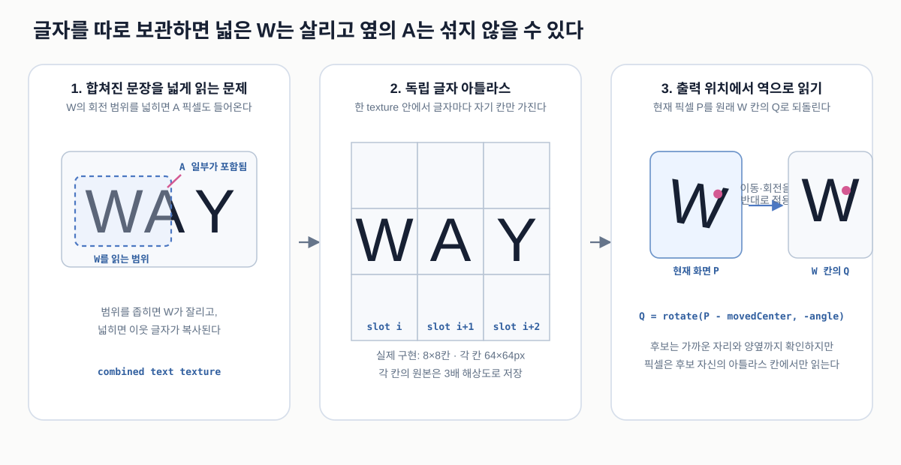

# Color Text Architecture

이 문서는 `pages/color-text/`의 **현재 구현**을 설명한다. 포인터 입력이 물 packet 상태로 바뀌고, 그 상태가 글자 픽셀 기반 실루엣·내부 색·글자 스프링으로 이어지는 실제 실행 순서를 다룬다.

- 기준 구현: [`pages/color-text/script.ts`](../../../pages/color-text/script.ts)
- 작품 좌표: `480 × 600 artwork pixel`
- 문서 갱신 기준: `2026-08-10`
- 상세 실험값과 과거 비교: [`pages/color-text/spec.md`](../../../pages/color-text/spec.md)

재사용 가능한 수학 원리는 별도 concept 문서로 분리했다.

- [Pixel-sampled Metaball Field](../../concepts/pixel-metaball-field.md)
- [Jump Flood Nearest-seed Search](../../concepts/jump-flood-nearest-seed.md)

## 1. 가장 먼저 이해할 구조

손가락은 물을 직접 그리지 않는다. 손가락은 물이 공급되는 source 위치만 정하고, CPU가 최대 32개의 큰 물 packet을 움직인다. GPU는 packet의 Falloff와 **현재 위치의 글자 픽셀**을 곱한 뒤, 그 픽셀들을 연속적인 field로 연결한다.


한 프레임에는 세 종류의 상태가 연결된다.

| 상태 | 저장 위치 | 의미 |
| --- | --- | --- |
| `pointerTarget`, `liquid.emitter` | CPU 객체 | 최신 손가락 위치와 완화된 source 위치 |
| `liquid.particles` | CPU 배열, 최대 32개 | 이미 만들어진 물 packet의 위치·속도·모양 상태 |
| `glyphSpringTargetA/B` | GPU `64 × 1` texture | 글자별 하강·회전과 각각의 속도 |

과거 활성 픽셀 이미지를 누적하는 `temporalMaterial`은 없다. 시간 기억은 `liquid.particles`와 글자 spring texture에 들어 있다.

## 2. 파일별 역할

```text
common/
  touch-cursor.ts
    화면 녹화용 터치 ring과 ripple

pages/color-text/
  index.html
    canvas, Process View 버튼, SNS meta
  style.css
    전체 화면 배치, 모바일 기본 제스처 차단
  config.ts
    작품 크기, 문장, 기본 파라미터와 QA override
  script.ts
    WebGL 자원 생성과 한 frame의 pass 실행 순서
  liquid-solver.ts
    source 공급, packet 중력·점성·응집력과 화면 밖 제거
  text-atlas.ts
    문장 mask, 독립 글자 atlas, 글자별 측정값 생성
  shaders.ts
    각 GPU pass가 픽셀 하나를 계산하는 GLSL
  parameter-gui.ts
    lil-gui 조절 항목과 texture uniform 갱신
  spec.md
    파라미터와 레퍼런스 비교 기록
  assets/
    reference와 OG image
  qa/
    고정 입력 비교 이미지와 분석 스크립트
```

처음 코드를 읽을 때는 `config.ts`에서 고정값을 확인하고, `liquid-solver.ts`와 `text-atlas.ts`에서 CPU 입력을 살펴본 뒤, `script.ts`의 `renderFrame()`을 읽는 순서가 가장 자연스럽다. `renderFrame()`은 한 장의 full-screen quad를 서로 다른 `ShaderMaterial`로 반복 렌더링하고, 각 결과를 render target texture에 저장해 다음 pass로 넘긴다. 픽셀별 수식이 필요할 때만 `shaders.ts`에서 같은 이름의 pass를 찾아간다.

## 3. 좌표 공간과 계산 시점

같은 `x`, `y`라도 입력과 shader에서 의미가 다르다.

| 공간 | 범위와 원점 | 사용하는 곳 |
| --- | --- | --- |
| CSS client coordinate | pixel, 화면 왼쪽 위가 원점 | `pointer` event의 `clientX`, `clientY` |
| artwork pixel | `480 × 600`, 문서에서는 길이 단위 | 반경, 속도, 글자 배치, sample 거리 |
| artwork UV | `[0,1] × [0,1]`, 왼쪽 아래가 원점 | `pointerTarget`, particle 위치, field texture |
| text bake coordinate | `1440 × 1800`, 왼쪽 위가 원점 | Canvas2D 글자 마스크와 glyph atlas |
| device pixel | 실제 drawing buffer pixel | 최종 화면의 `fwidth()` 안티앨리어싱 |

`setPointerFromClient()`는 화면 안에서 작품이 차지하는 사각형을 먼저 구한다. CSS 좌표에서 여백을 빼고 0~1로 나눈 뒤 Y를 뒤집어 artwork UV를 만든다.

계산 시점도 역할에 따라 다르다.

| 계산 | 위치 | 빈도 |
| --- | --- | --- |
| 문장과 glyph atlas 굽기 | CPU Canvas2D | 초기화할 때 한 번, 색 atlas 설정 변경 시 갱신 |
| pointer와 particle 물리 | CPU TypeScript | 매 frame, 필요하면 `1/60s` 이하 substep |
| 글자 변형과 field | GPU fragment shader | 매 frame, 각 target pixel |
| 최종 합성 | GPU fragment shader | 매 frame, 각 device fragment |
| 터치 인디케이터와 버튼 | DOM | pointer event와 stage 변경 시 |

## 4. 글자를 독립 아틀라스에 저장하는 이유

### 4.1 해결하려는 문제

문장 전체를 한 장의 이미지로 저장한 뒤 글자 하나만 움직이려고 하면 두 문제가 생긴다.

1. `W`처럼 실제 폭이 tracking 간격 31.8px보다 넓은 글자는 회전할 때 자기 칸 밖이 잘릴 수 있다.
2. 잘림을 막으려고 원본 문장을 넓게 읽으면 옆의 `A`나 `Y` 픽셀까지 함께 복사될 수 있다.



### 4.2 실제 저장 구조

공백을 포함한 문장 자리 수는 64개다. 각 자리에 `64 × 64 artwork px` 칸을 주고, `8 × 8` grid의 한 texture로 묶는다. 실제 Canvas2D atlas는 경계 품질을 위해 각 축을 3배로 만들어 `1536 × 1536` pixel이다.

이것을 “독립 글자 아틀라스”라고 부른다.

- **아틀라스:** 여러 작은 이미지를 한 texture에 모은 것
- **독립:** `W` 후보를 계산할 때 반드시 `W` 칸만 읽는다는 뜻
- 개별 texture 64장을 만드는 것이 아니라 한 texture 안에서 UV 구간만 분리한다

`glyphMetadataTexture`는 각 slot에 다음 값을 저장한다.

| 채널 | 의미 |
| --- | --- |
| R | 실제 glyph 반쪽 폭을 `MAX_GLYPH_HALF_WIDTH`로 정규화한 값 |
| G | 글자가 있으면 1, 공백이면 0 |

### 4.3 출력 픽셀에서 원본 칸을 역으로 찾는다

현재 화면의 artwork UV를 `P`, 글자의 이동 후 중심을 `C_m`, 회전 각도를 radian 단위 `a`라고 하자. Shader는 움직인 글자를 앞으로 그리는 대신 현재 출력 픽셀을 반대로 되돌린다.

```text
deltaArtwork = (P - C_m) * artSize
Q            = rotate(deltaArtwork, -a)
atlasUv      = atlasCellCenter + Q / atlasSize
```

| 변수 | 공간 | 의미 |
| --- | --- | --- |
| `P` | artwork UV | 지금 칠할 출력 픽셀 |
| `C_m` | artwork UV | spring 하강을 적용한 현재 글자 중심 |
| `Q` | artwork pixel | 이동과 회전 전 글자 칸에서의 위치 |
| `atlasUv` | atlas texture UV | 실제 glyph alpha를 읽을 위치 |

`-a`를 쓰는 이유는 현재 화면에 `+a`만큼 회전해 보이는 글자를 원래 방향으로 되돌려야 하기 때문이다. 이것은 texture mapping에서 흔히 사용하는 inverse transform이다.

현재 출력 X에서 가장 가까운 글자 자리와 양옆 자리까지 후보로 확인한다. 그래서 회전한 `W`가 nominal slot을 벗어나도 발견할 수 있다. 하지만 각 후보는 자기 atlas 칸만 읽으므로 이웃 글자 픽셀은 섞이지 않는다.

이 계산은 매 frame `deformedGlyphMaterial`에서 실행되어 다음 두 target을 만든다.

- `deformedTextTarget`: 현재 글자 alpha, `1440 × 1800`
- `deformedColorCenterTarget`: 선택형 색 중심, `480 × 600`

## 5. 터치 source와 particle 생명주기

### 5.1 해결하려는 문제

포인터 위치에 완성된 큰 타원을 바로 붙이면 첫 터치가 튀고, 드래그 경로에 작은 점을 계속 찍으면 조각 사슬이 생긴다. 손을 뗄 때 중심에서 alpha만 줄이면 물이 흐르지 않고 제자리에서 지워지는 것처럼 보인다.

현재 구조는 손가락을 **질량을 공급하는 source**로 보고, 완성된 큰 packet이 일정 시간마다 분리되어 떨어지게 한다.


### 5.2 `pointerTarget`과 `liquid.emitter`

`pointerTarget`은 이벤트에서 받은 최신 artwork UV다. `liquid.emitter`는 frame time `dt`와 추종 비율 `k_f`를 사용해 그 위치를 지수 완화로 따라간다.

```text
b       = 1 - exp(-k_f * dt)
emitter = emitter + (pointerTarget - emitter) * b
```

기본 `k_f = 7.5 s⁻¹`이다. 이 식은 frame마다 고정 비율을 쓰는 것과 달리 frame rate가 달라져도 비슷한 시간 반응을 유지한다.

### 5.3 하나의 `LiquidParticle`이 기억하는 값

```ts
type LiquidParticle = {
  x: number;
  y: number;
  velocityX: number;
  velocityDown: number;
  age: number;
  mass: number;
  energy: number;
  growing: boolean;
  seed: number;
};
```

| 값 | 단위·범위 | 역할 |
| --- | --- | --- |
| `x`, `y` | artwork UV | packet 중심의 현재 위치 |
| `velocityX` | artwork px/s | 가로 속도 |
| `velocityDown` | artwork px/s | 아래 방향 속도. 위치 Y를 감소시킨다 |
| `age` | second | source에서 분리된 뒤 흐른 시간 |
| `mass` | 기본 packet 질량 1 기준 | Falloff 반경에 `sqrt(mass)`로 적용 |
| `energy` | 보통 `0~1` | Falloff 전체에 곱하는 활성 강도 |
| `growing` | boolean | `age` 기반 추가 birth fade 사용 여부 |
| `seed` | `[0,1)` | packet별 굴곡과 난류 위상 |

#### `age`: 흐른 시간

source에 붙어 있는 packet은 `age = 0`이다. 분리된 뒤에만 증가하며 세로 신장, 가로 폭 축소, 좌우 굴곡의 진행 정도를 정한다. 수명이나 fade 시간이 아니므로 age가 크다는 이유로 지우지 않는다.

#### `mass`: 공간적인 크기

첫 source는 `mass = 0`에서 시작해 0.13초 동안 1까지 채워진다.

```text
radiusScale = sqrt(mass)
```

`mass = 0.25`이면 반경은 기본의 50%다. 면적이 반경 제곱에 비례하므로 질량과 반경을 같은 비율로 쓰지 않는다.

#### `energy`: 활성화 강도

첫 터치 energy는 별도 source 시간 `t_s`로 계산한다.

```text
energy(t_s) = (1 - exp(-t_s / 0.36s))²
```

0.36초는 완료 시간이 아니라 time constant다. energy는 0.36초에 약 0.40, 0.72초에 약 0.75, 1.08초에 약 0.90이다.

- `mass` 감소: Falloff 반경 자체가 작아짐
- `energy` 감소: 같은 모양이 글자 픽셀을 더 약하게 활성화함

누적 드래그 거리가 8 artwork px을 넘으면 현재 source energy를 1로 바꿔 새 위치마다 시작 지연이 반복되지 않게 한다. 손을 떼면 그 순간의 energy를 유지한다.

#### `growing`: QA와 공유하는 추가 fade 스위치

`growing = true`이면 shader에서 `age` 기반 birth fade를 한 번 더 곱한다. 일반 입력에서는 mass와 energy가 첫 등장을 담당하므로 대부분 false다. 고정 QA particle도 같은 uniform 구조로 표현하기 위해 남아 있다.

#### `seed`: 깜빡이지 않는 모양 차이

```text
seed = fract(sequence * 0.61803398875)
```

packet을 만들 때 한 번 정하고 이후에는 바꾸지 않는다. Shader의 사인파 시작 위상으로 사용하므로 packet마다 굴곡은 다르지만 매 frame 난수를 다시 뽑을 때처럼 깜빡이지 않는다.

### 5.4 Hold, Drag, Release

첫 packet의 mass가 1이 된 뒤에는 완성된 packet을 emitter에 붙여 둔다. 다음 질량 1이 0.13초 동안 준비되면 같은 위치에서 완성 packet끼리 교대하고, 이전 packet만 낙하한다.

드래그 중에는 붙어 있는 source만 emitter를 따라간다. 분리된 packet은 포인터의 가로 운동량을 받지 않고 `velocityX = 0`, `velocityDown = 18px/s`로 시작한다. 그래서 원형으로 드래그해도 떨어진 물이 원 궤도를 계속 돌지 않는다.

Release는 새 질량 공급만 멈춘다. 모든 packet은 같은 물리 규칙으로 아래로 이동하고, Falloff 전체가 화면 아래 margin을 벗어났을 때 배열에서 제거된다.

### 5.5 Particle solver는 물리 근사다

한 animation frame을 최대 `1/60s` 크기의 substep으로 나눈다. 각 substep에서 다음 순서로 갱신한다.

```text
velocity += (gravity + cohesion + turbulence) * dt
velocity *= exponentialDamping(dt)
position += velocity * dt
age      += dt
```

세로와 가로 damping은 다르다. 가로는 `exp(-viscosity * 1.35 * dt)`, 세로는 `exp(-viscosity * 0.22 * dt)`를 사용해 아래 흐름은 유지하면서 좌우 흔들림을 더 빨리 줄인다.

응집력은 두 packet이 rest distance보다 멀어질 때만 서로 당긴다. 이미 겹친 packet을 밀어내지 않는 이유는 뒤의 Metaball field가 겹침을 하나의 표면으로 처리하기 때문이다. 붙어 있는 source도 응집력과 32개 압축 대상에서 제외해 드래그가 떨어진 물을 끌고 가지 않게 한다.

#### 왜 최대 32개인가

`32`는 물리 법칙에서 나온 수가 아니라, 흐름을 기억하는 길이와 모바일 계산 비용 사이에서 선택한 작품 전용 계산 예산이다. 현재 구조에서는 [config.ts](../../../pages/color-text/config.ts)의 `LIQUID_PARTICLE_COUNT`가 CPU 배열 길이, GPU uniform 배열 길이, shader 반복 횟수를 함께 정한다. 따라서 제한 없이 packet만 계속 추가할 수는 없다.

`interactionFieldMaterial`은 `480 × 600 = 288,000`개의 field pixel마다 모든 packet의 Falloff를 검사한다. 최대 32개일 때 한 frame에 약 `288,000 × 32 = 9,216,000`회의 packet 영향 계산이 필요하다. 64개로 늘리면 이 비용은 약 2배가 된다.

CPU의 응집력은 모든 packet 쌍을 비교한다. packet 수를 `n`이라고 하면 비교 횟수는 `n × (n - 1) / 2`다.

| 최대 packet 수 | 한 substep의 최대 쌍 비교 |
| ---: | ---: |
| 32 | 496 |
| 64 | 2,016 |

packet 수를 2배로 늘리면 GPU Falloff 계산은 2배가 되지만 CPU 쌍 비교는 약 4배가 된다. 반대로 16개로 줄이면 계산은 가벼워지지만 오래된 흐름이 더 자주 합쳐져 손가락이 지나간 경로의 형태를 짧게 기억한다.

기본 방출 간격은 `0.13s`이므로 화면 밖 제거와 병합이 없다고 단순화하면 32개는 약 `32 × 0.13s = 4.16s` 분량의 흐름을 개별 packet으로 유지한다. 실제로는 아래로 빠져나간 packet을 먼저 제거하므로 보통 32개가 계속 가득 차 있지는 않다. 정확히 32여야 한다는 수학적 근거는 없으며, 현재 작품에서 충분한 흐름 기억과 안정적인 렌더링 비용을 함께 얻기 위한 경험적 값이다.

32개가 가득 차면 source가 아닌 가장 가까운 두 packet의 위치와 속도를 질량 가중 평균으로 합친다. 표시 mass는 더하지 않고 큰 기존 값을 유지한다. 이것은 질량 보존보다 병합 순간 반경이 `sqrt(2)`배 커지는 시각적 불연속 방지를 우선한 작품 전용 heuristic이다.

## 6. Packet Falloff와 활성 글자 픽셀

### 6.1 해결하려는 문제

CPU packet은 중심점과 몇 개의 숫자만 가진다. 화면의 각 픽셀에서 이 packet이 미치는 영향과 글자와의 접촉을 계산해야 실제 실루엣 입력을 만들 수 있다.

`interactionFieldMaterial`은 `480 × 600`의 모든 field pixel에서 최대 32개 packet Falloff를 계산한다.

### 6.2 Packet 하나의 Falloff

현재 출력 위치를 `p`, packet 중심을 `o_j`라고 하자. 둘의 UV 차이에 `artSize`를 곱해 artwork pixel 거리 `d_j`를 만든다.

```text
d_j = (p - o_j) * artSize
```

기본 가로·세로 반경에는 다음 작품 전용 보정을 적용한다.

- `sqrt(mass)`: packet 전체 크기
- `age`: 세로 신장과 가로 stream 형성
- 위 80px, 아래 160px의 비대칭 세로 반경
- 세로 끝으로 갈수록 가로가 좁아지는 taper
- `seed`, `age`, time을 이용한 작은 좌우 굴곡과 밀도 변화

정규화 거리 `n_j`가 Falloff 시작값 0.12보다 작으면 강하고, 1에 가까워지면 0이 된다. 이것은 실제 압력장이 아니라 시각적인 물줄기 외피를 만드는 경험적 함수다.

### 6.3 Packet 사이를 끊기지 않게 연결한다

모든 packet 값을 더하면 겹친 부분이 지나치게 넓어진다. `max()`만 사용하면 가장 강한 packet이 바뀌는 위치에서 기울기가 꺾일 수 있다.

현재는 가장 강한 값 `a`, 두 번째 값 `b`, 결합 폭 `k = 0.08`만 사용한다.

```text
h = max(k - abs(a - b), 0) / k
L = a + h² * k * 0.25
```

`abs(a-b) >= k`이면 `h=0`이라서 `L=a`다. 두 값이 비슷할 때만 최대 `k/4`만큼 연결 에너지를 더한다. 결과가 `a`보다 작아지지 않으므로 평균 blend의 어두운 홈이 없고, 모든 packet 합산보다 팽창이 제한된다.

### 6.4 글자 픽셀과 곱한 RGBA target

현재 변형된 글자 alpha를 `M(p)`, 결합 Falloff를 `L(p)`, 선택형 색 중심을 `E(p)`라고 한다.

```text
surfaceActivation = M(p) * L(p)^1.22 * 0.92
colorActivation   = E(p) * L(p)^1.12
```

`interactionTarget`은 한 번의 pass에서 다음 네 값을 저장한다.

| 채널 | 값 | 다음 소비자 |
| --- | --- | --- |
| R | 활성 글자 픽셀 `surfaceActivation` | geometry, contact, color seed |
| G | 현재 글자 alpha `M` | seed의 글자 내부 제한, debug |
| B | 선택형 타원 중심 `colorActivation` | optional color field |
| A | 글자와 곱하기 전 `L` | Solver와 Contact 시각화 |

글자 밖에서는 `M=0`이므로 Falloff만 지나가서는 geometry가 생기지 않는다. 내려온 물이 아래쪽의 새로운 글자 픽셀과 만나는 순간 그 위치에서 새 활성 픽셀이 만들어진다.

## 7. Geometry: 활성 픽셀을 액체 실루엣으로 연결

얇은 활성 글자 픽셀을 그대로 그리지 않고, 출력 픽셀마다 주변 활성 분포를 조사해 연속적인 높이 지도를 만든다. 공통 원리와 수식은 [Pixel-sampled Metaball Field](../../concepts/pixel-metaball-field.md)에 분리했다.


현재 작품의 pass와 기본값은 다음과 같다.

| pass | 현재 선택 |
| --- | --- |
| `surfaceSourceMaterial` | R 활성값 0.02부터 0.025 폭으로 부드럽게 허용 |
| `surfaceBlurMaterial` | 반경 30px, 황금각 표본 192개, 거리 지수 3.2 |
| `surfaceSmoothMaterial` | sigma 1.8, 가로 11-tap 후 세로 11-tap |
| `finalMaterial` | field 높이 0.07에서 coverage 추출 |

가장 가까운 활성 픽셀 하나만 사용하지 않고 주변 분포를 누적하므로 `Y`의 두 팔 사이에는 상대적으로 낮은 saddle이 남는다. threshold 외곽선은 그 낮은 공간을 따라 줄기 쪽으로 오목하게 들어온다. Y 전용 모양 코드는 없다.

최종 edge 폭은 `max(surfaceSoftness, fwidth(field) * 1.2)`다. `fwidth()`는 현재 device fragment에서 이웃 픽셀 사이 field 변화량을 측정해 확대와 해상도에 맞는 안티앨리어싱 폭을 만든다.

`coreMix = 0`이므로 geometry에 별도의 고정 반경 글자 몸체를 합치지 않는다. 화면 외곽은 `surfaceFieldTarget`의 등고선 자체다.

## 8. Color: 타원 대신 활성 글자 모양을 밝게 만들기

### 8.1 해결하려는 문제

글자마다 세로 타원을 하나씩 놓으면 `O`, `N`, `H` 내부에 같은 크기의 타원이 반복되어 보인다. Gaussian blur만 사용하면 글자 모양 주위에 긴 털 같은 halo도 남는다.

현재 기본 색 중심은 각 출력 픽셀에서 **가장 가까운 활성 글자 픽셀까지의 거리**를 사용한다. 원리와 일반적인 JFA 수식은 [Jump Flood Nearest-seed Search](../../concepts/jump-flood-nearest-seed.md)에 분리했다.

### 8.2 현재 pass

```text
interactionTarget의 활성 글자 픽셀
  -> 글자 내부 stroke spread 8회
  -> seed: activation >= 0.05, text alpha >= 0.18
  -> bounded JFA: 16, 8, 4, 2, 1, 1
  -> nearest active glyph coordinate
  -> 3.2px radius, 1px edge의 glyph-shaped energy
```

`nearestTargetA/B`는 seed 좌표가 pixel 사이에서 섞이지 않게 `NearestFilter`를 사용한다. 현재 jump 일정은 전체 480×600 field의 정확한 전역 최근접점을 보장하는 full JFA가 아니다. 최종 색이 3.2px 근처만 사용한다는 조건에 맞춘 bounded heuristic이다.

### 8.3 선택형 통계 타원

초기화할 때 글자별 잉크 양, 실제 폭·높이, alpha 가중 중심을 측정해 서로 다른 세로 타원을 color atlas에 굽는다. 이 field는 활성 글자 픽셀과 기본 `80:20`으로 섞은 뒤 Gaussian blur를 통과한다.

하지만 현재 `colorEllipseInfluence = 0`이므로 최종 밝은 중심에는 타원이 들어가지 않는다. 실험용 GUI 값을 올렸을 때만 나타난다.

### 8.4 Palette와 clipping

글자형 에너지는 `edge rose → body rose → pale pink → hot color` 네 anchor를 연속적으로 섞는 입력이 된다. 기본 채도 0.72, 밝기 0.96, warm cream 혼합 0.12이며 palette phase는 8초마다 한 바퀴 돈다.

색은 항상 geometry coverage 안에서만 합성된다. 배경 글자도 coverage 안에서는 완전히 가려진다. 마지막에 coverage 내부에만 1/255보다 작은 dithering을 더해 완만한 색 banding을 줄인다.

## 9. 글자 Contact와 Spring feedback

### 9.1 해결하려는 문제

실루엣이 닿은 화면 픽셀을 각각 아래로 옮기면 같은 글자 안에서도 이동량이 달라져 글자가 늘어나거나 찢어진다. 반대로 글자 bounding box만 검사하면 액체가 실제 글자에 닿지 않아도 글자가 움직일 수 있다.

현재는 글자 하나를 rigid한 판처럼 보고 이동과 회전 상태를 글자별로 저장한다.

### 9.2 Contact 측정

64개 slot 각각에 실제 잉크의 alpha 가중 중심과 반쪽 폭·높이를 저장한다. 현재 이동·회전한 glyph 영역에 `9 × 9` 표본을 놓고 다음 값을 계산한다.

```text
sampleContact = visibleSurface(sampleUv) * visibleTextPixel(sampleUv)
```

| 값 | 의미 |
| --- | --- |
| `visibleSurface` | `surfaceField`가 현재 threshold를 넘은 정도 |
| `visibleTextPixel` | 고해상도 변형 글자 alpha가 실제 잉크인 정도 |
| `contact` | 81개 중 가장 강한 접촉값 |
| `leftContact`, `rightContact` | 왼쪽·오른쪽 네 열 각각의 최대 접촉값 |

가운데 한 열은 하강에는 참여하지만 좌우 torque에는 참여하지 않는다.

### 9.3 목표값과 damped spring

```text
targetOffset = contact * 10px

side             = max(leftContact, rightContact)
pressureDiff     = (leftContact - rightContact) / max(side, epsilon)
targetAngle      = pressureDiff * side * 9°

acceleration     = (targetOffset - offset) * 58 - velocity * 12
angularAccel     = (targetAngle - angle) * 46 - angularVelocity * 10
```

접촉이 중앙에 가까우면 좌우 차이가 작아 회전도 작다. 한쪽만 강하게 닿으면 `pressureDiff`의 부호에 따라 기울어진다. 9°는 radian으로 바꿔 shader에 전달한다.

각 frame은 속도를 먼저 갱신하고 그 속도로 위치·각도를 갱신한다. spring 계산의 `dt`는 최대 `1/30s`로 제한한다. 위치는 기본 최대 하강의 `-14%…116%`, 회전은 목표 최대의 `±118%` 안으로 제한해 긴 frame이나 강한 feedback에서 폭주하지 않게 한다.

### 9.4 한 프레임 feedback

Spring state는 `64 × 1` half-float target 두 개에 저장한다.

| 채널 | 상태 |
| --- | --- |
| R | `offset`, artwork px |
| G | `velocity`, artwork px/s |
| B | `angle`, radian |
| A | `angularVelocity`, radian/s |

현재 frame의 surface와 글자로 새 state를 쓴 뒤 read/write target을 교대한다. 이 state는 다음 frame의 `deformedTextTarget`과 `deformedColorCenterTarget`에 사용된다.

보이는 글자와 Metaball 입력이 같은 변형 마스크를 읽으므로 글자는 내려갔는데 실루엣만 원래 자리에 남는 불일치가 없다. 한 frame 지연은 pass가 자기 output을 동시에 다시 읽는 순환도 피한다.

## 10. 실제 한 프레임 순서

`requestAnimationFrame()`의 `renderFrame(now)`는 다음 순서를 지킨다. 함수 이름도 이 표의 단계와 같아서 코드를 위에서 아래로 따라갈 수 있다.

| 순서 | 실행 | 출력 또는 상태 |
| ---: | --- | --- |
| 1 | `liquid.update(delta, pointerTarget)` | 분리된 packet 갱신과 source 질량 공급 |
| 2 | `uploadLiquidState()` | 최대 32개 packet의 GPU uniform |
| 3 | `renderDeformedGlyphPasses()` | 현재 글자와 color-center target |
| 4 | `renderInteractionPass()` | 활성 글자·text·color·Falloff RGBA |
| 5 | `renderStrokeSpreadPasses()` | 글자 내부에서 이어진 seed 입력 |
| 6 | `renderNearestSeedPasses()` | 가까운 활성 글자 seed 좌표 |
| 7 | `renderMetaballSurfacePasses()` | `surfaceFieldTarget` |
| 8 | `renderGlyphSpringPass()` | 다음 frame의 글자 state |
| 9 | `renderColorPasses()` | `colorFieldTarget` |
| 10 | `renderOutputPass()` | Process View 또는 최종 화면 |

Geometry를 만든 뒤 spring을 계산하므로 contact는 현재 화면에 실제로 나타날 surface를 사용한다. Spring swap 뒤에도 현재 frame의 최종 합성은 이미 만든 `deformedTextTarget`을 사용하고, 새 state는 다음 frame에 반영된다.

## 11. Render target 지도

| target | 크기·filter | 저장 값 | 다음 소비자 |
| --- | --- | --- | --- |
| `deformedTextTarget` | `1440×1800`, linear | 현재 글자 alpha | interaction, contact, final |
| `deformedColorCenterTarget` | `480×600`, linear | 현재 선택형 색 중심 | interaction |
| `interactionTarget` | `480×600`, half-float linear | active, text, color, Falloff | geometry, color, debug |
| `strokeSpreadTargetA/B` | `480×600`, half-float linear | 글자 내부 확산 활성값 | seed |
| `nearestTargetA/B` | `480×600`, half-float nearest | 가까운 seed UV와 strength | glyph-shaped color |
| `surfaceSourceTarget` | `480×600`, half-float linear | threshold를 통과한 active pixel | 192-probe field |
| `metaballRawTarget` | `480×600`, half-float linear | smoothing 전 geometry field | horizontal smoothing |
| `surfaceHorizontalTarget` | `480×600`, half-float linear | 가로 smoothing field | vertical smoothing |
| `surfaceFieldTarget` | `480×600`, half-float linear | 최종 geometry field | contact, contour, final |
| `glyphSpringTargetA/B` | `64×1`, half-float nearest | 글자별 offset·속도·회전 | 다음 frame glyph 변형 |
| `colorHorizontalTarget` | `480×600`, half-float linear | 가로 color blur | vertical color blur |
| `colorFieldTarget` | `480×600`, half-float linear | optional color energy | final |

Field target이 half float인 이유는 여러 gain을 합친 1보다 큰 값과 작은 연속 차이를 8-bit보다 안정적으로 보존하기 위해서다. 고해상도 글자 mask는 alpha 안티앨리어싱을 유지하면서 메모리를 줄이기 위해 unsigned byte를 사용한다.

## 12. Process View와 DOM UI

별도 debug 페이지는 없다. 하단 버튼은 같은 simulation과 render target을 유지한 채 마지막 출력 material만 바꾼다.

| 단계 | 보여주는 값 |
| --- | --- |
| `Solver` | packet 외피, 중심, 속도, 강한 응집 link, raw Falloff |
| `Contact` | Falloff가 만난 실제 글자 픽셀과 옅은 Falloff 등고선 |
| `Contour` | 현재 고해상도 글자와 최종 threshold 외곽선 하나 |
| `Final` | geometry, palette, 배경 글자를 합친 작품 |

숫자키 `1…4`, 좌우 방향키, `?stage=0…3`으로 바꿀 수 있다. 첫 손가락이 canvas에 capture된 중에도 두 번째 손가락의 `pointerdown`으로 버튼을 즉시 바꿀 수 있다.

`common/touch-cursor.ts`의 54px ring과 ripple은 `pointer-events: none`인 DOM overlay다. 화면 녹화에서 터치 위치만 보여주며 simulation 좌표에는 참여하지 않는다.

## 13. 입력과 화면 품질

- Canvas는 `480:600` 비율을 유지해 화면 안에 최대 크기로 배치한다.
- WebGL drawing buffer의 device pixel ratio는 최대 2로 제한한다.
- `pointerdown`에서 active pointer를 capture해 손가락이 시작 위치를 벗어나도 drag를 유지한다.
- `touch-action`, selection, callout, context menu와 non-passive touch 기본 동작을 차단해 iOS 확대경과 Copy UI가 입력을 가져가지 않게 한다.
- 얇은 글자는 3배 `deformedTextTarget`에서 직접 읽고, geometry field만 성능을 위해 480×600에서 계산한다.
- 최종 실루엣과 Process 선은 shader derivative 기반 antialiasing을 사용한다.

`prefers-reduced-motion`에서는 palette 시간과 shader의 빠른 시간 흔들림을 정지하지만 터치 물리는 유지한다.

## 14. 실행 모드와 조절값

| 모드 | 사용법 | 목적 |
| --- | --- | --- |
| 일반 | `/pages/color-text/` | 실제 터치 작품 |
| Process | `?stage=0…3` | 특정 중간 단계에서 시작 |
| QA | `?qa=1&qaX=0.37&qaY=0.52` | 고정 synthetic packet으로 재현 가능한 비교 |
| Semantic QA | QA 주소에 `&qaLabels=1` | 배경·글자·효과 3분류 출력 |
| OG | `?og` | 1200×630 SNS 이미지용 확대·제목, 버튼 숨김 |
| GUI | 키보드 `g` | lil-gui 열기·닫기 |

lil-gui는 현재 값을 여섯 폴더로 나눈다.

| 폴더 | 주요 조절 |
| --- | --- |
| 터치 드립 | gravity, stretch, turbulence, cohesion, source 교대 |
| 텍스트 밀림 | 하강·회전 거리, stiffness, damping, contact padding |
| 광원 / Falloff | 위·아래 반경, 가로 taper, edge 시작 |
| 액체 실루엣 | 입력 threshold, probe 반경·gain, smoothing, contour 높이 |
| 색상 | glyph-shaped 중심, optional ellipse, blur, palette |
| 고급 설정 | seed threshold와 비활성 geometry core 실험값 |

## 15. 현재 구현의 성격과 한계

### 공통 그래픽스 기법

- texture atlas와 inverse texture lookup
- multi-pass render target pipeline
- radial image-space field와 threshold contour
- Jump Flood 기반 nearest-seed 근사
- damped spring state의 ping-pong feedback

### Color Text가 선택한 방법

- 최대 32개의 큰 CPU packet으로 흐름 위치 계산
- 활성 글자 픽셀을 192개 황금각 표본으로 누적
- geometry와 color field를 독립적으로 계산
- 현재 글자 위치를 geometry 입력과 배경 출력에 함께 사용

### 미감을 위한 heuristic

- 위 80px, 아래 160px의 비대칭 Falloff
- age에 따른 stream width와 작은 굴곡
- 가장 강한 두 packet만 결합하는 monotonic blend
- capacity 압축에서 mass를 더하지 않음
- 16부터 시작하는 bounded JFA
- contact 최대값과 좌우 최대값으로 목표 회전 계산

이 작품은 Navier–Stokes, SPH 또는 정확한 부피 보존을 계산하지 않는다. Particle은 유체 입자라기보다 움직이는 Falloff packet이고, 화면의 액체 외곽은 픽셀 field가 만든다. 따라서 정확한 표현은 **particle-driven Falloff + pixel-field liquid typography**다.

비용이 가장 큰 부분은 `480 × 600 × 192`의 geometry 표본으로, 한 frame에 약 5천5백만 번의 주변 texture 확인이 필요하다. JFA와 Gaussian pass도 field pixel 수에 비례한다.

## 16. 검증 순서

구조나 파라미터를 바꿀 때는 다음 순서로 확인한다.

1. `Y` 교차부에서 흰 공간이 줄기를 따라 오목하게 내려오는지 본다.
2. Semantic QA에서 배경 0, 글자 1, 효과 2의 실루엣 면적과 폭을 비교한다.
3. 첫 Hold에서 mass와 energy가 0부터 시작하는지 본다.
4. Drag에서 source만 이동하고 분리된 packet은 원래 위치 아래로 흐르는지 본다.
5. Release에서 중앙 fade 없이 모든 packet이 아래로 빠지는지 본다.
6. 실제 visible surface와 글자 pixel이 겹친 glyph만 이동·회전하는지 본다.
7. `textPushDistance = 0`, `textMaxRotation = 0`으로 고정해 남는 떨림이 spring 이전 field인지 분리한다.
8. `W` 잘림, 이웃 glyph 중복, 회전 후 글자 안티앨리어싱을 확인한다.
9. iOS 길게 누르기 UI, pointer capture, 두 손가락 Process 변경을 확인한다.
10. `pnpm typecheck`와 `pnpm build`를 통과한다.

기존 문구로 측정한 수치는 `pages/color-text/qa/`에 남아 있다. 현재 문장은 다르므로 그 수치를 현재 화면의 pixel 수 주장으로 사용하지 않고 Metaball 방법의 regression 기준으로만 사용한다.

## 17. 핵심 데이터 흐름

```text
pointer event
  -> pointerTarget -> liquid.emitter -> liquid.particles
  -> deformed glyph mask × packet Falloff
  -> interactionTarget RGBA
  -> geometry field + nearest glyph color field
  -> visible surface contact -> glyph spring state
  -> 다음 frame의 deformed glyph mask
  -> Final 또는 Process View
```

핵심은 물 packet, 글자 pixel, 최종 surface를 같은 것으로 취급하지 않는 것이다. Packet은 **움직임을 기억**하고, 글자 pixel은 **Metaball 입력 위치를 제한**하며, surface field는 **화면 외곽과 contact를 결정**한다.

## 18. 참고 자료

- 작가의 Instagram 설명: Shody’s Metaball과 Falloff로 typography stroke를 드러낸다는 설명
- [Scenery — Metaball overview](https://scenery.io/plugins/metaball-7w5Tj0PnVJJ)
- [Scenery — Metaball manual](https://scenery.io/plugins/metaball-7w5Tj0PnVJJ/manual)
- [Cavalry — Falloff documentation](https://cavalry.studio/docs/nodes/utilities/falloff/)
- 현재 구현: [`pages/color-text/script.ts`](../../../pages/color-text/script.ts)
- 구현 수치와 비교 기록: [`pages/color-text/spec.md`](../../../pages/color-text/spec.md)
