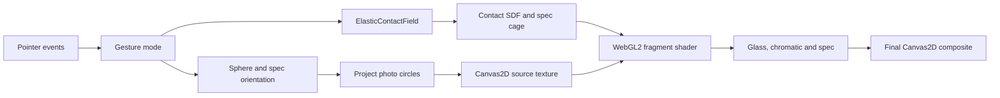
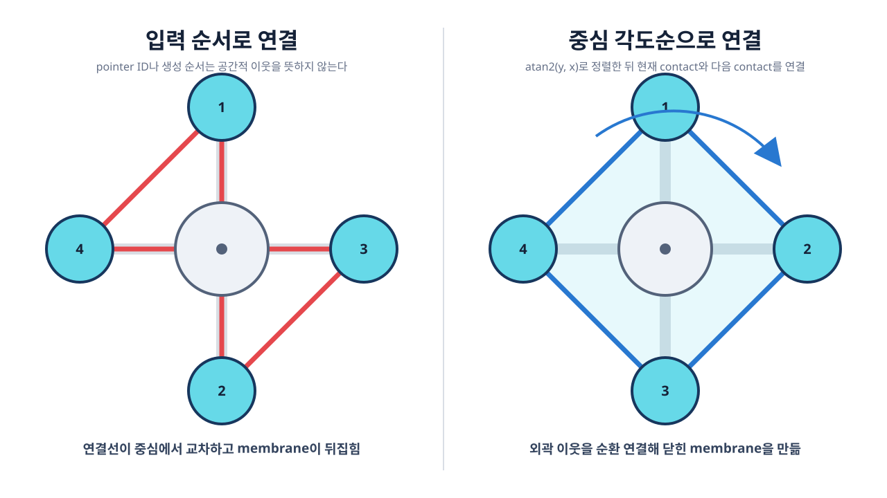
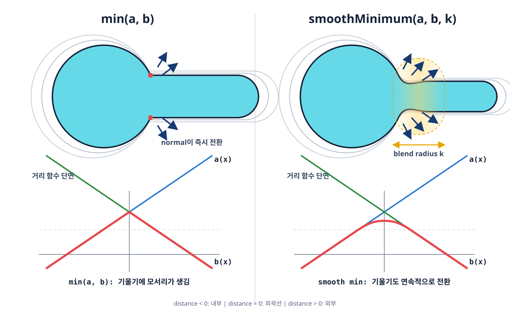

# Guseul Code and Rendering Guide

이 문서는 현재 `pages/guseul/` 구현을 처음 읽는 사람을 위한 코드 가이드다. 과거 실험 버전이 아니라 현재 최종 코드만 설명한다.

## 1. 가장 먼저 이해할 한 문장

구슬은 실제 3D mesh가 아니다.

1. CPU가 3D 구 위에 사진 원과 spec의 위치를 계산한다.
2. Canvas2D가 사진 원들을 한 장의 source texture로 그린다.
3. 여러 touch가 만든 2D signed-distance field가 구슬의 외곽선을 정한다.
4. WebGL2 fragment shader가 외곽선 안의 모든 픽셀에서 굴절, 색수차, normal, spec을 계산한다.

즉, **3D 데이터를 사용하는 2D implicit surface renderer**에 가깝다. 실제 polygon sphere를 그리지는 않지만, 구 표면의 회전과 광학 수식을 사용하기 때문에 3D처럼 보인다.

## 2. 한 프레임 전체 흐름



```text
Pointer events
  -> gesture mode 결정: pending / rotate / stretch
  -> ElasticContactField.update(delta)
  -> sphereOrientation과 specOrientation 갱신
  -> 구 위의 사진 원을 2D로 투영
  -> Canvas2D contentCanvas에 사진 원을 그림
  -> contact, contour, spec cage, source texture를 WebGL2에 업로드
  -> fragment shader가 구슬의 모든 픽셀을 렌더링
  -> 메인 Canvas2D가 배경, 그림자, WebGL canvas를 합성
```

실제 진입점은 `script.ts`의 `tick()`이다.

```ts
function tick(now: number): void {
  elasticField.update(dt);
  // inertia와 idle rotation 갱신
  renderer.render(getRenderParams());
  requestAnimationFrame(tick);
}
```

## 3. 파일별 역할

### `settings.ts`

최종 아트워크의 기본값만 있다. lil-gui는 이 객체를 직접 수정한다.

- interaction 감도와 자동 회전
- contact field와 release 값
- 사진 원 개수, 크기, 앞/뒷면 표현
- 굴절, IOR, dispersion
- spec 강도와 softness

릴스와 디버그 설정은 이 파일에 없다.

### `reel-presentation.ts`

릴스 촬영을 위한 상태와 하단 UI만 있다.

- 누적 렌더 단계
- 개별 레이어 on/off
- contact field, surface normal, spec mask 디버그
- 이전/다음 단계 및 `layers` 패널

최종 렌더 수식을 복제하지 않고, 기존 shader uniform을 0 또는 1로 바꾼다.

### `script.ts`

브라우저 앱의 조정자다.

- 이미지 asset과 사진 원 정의
- 구 회전 행렬
- pointer gesture 상태 전환
- 사진 원 투영과 Canvas2D source texture
- spec의 구 위 위치 계산
- CPU 데이터와 WebGL renderer 연결

### `elastic-contact-field.ts`

늘어난 구슬의 2D 외곽선을 계산한다.

- contact와 center seed
- center-contact bridge
- contact-contact membrane
- 면적 보정
- release spring
- 변형된 외곽선과 원래 원을 대응시키는 spec cage

### `webgl-renderer.ts`

WebGL2와 fragment shader가 있다.

- CPU 데이터를 uniform과 texture로 업로드
- 최종 외곽선 계산
- edge normal과 유리 단면 계산
- 굴절과 chromatic separation
- spec 역변형과 하이라이트
- glass shell과 디버그 출력

### `math.ts`

3D 벡터와 3x3 회전 행렬의 작은 공용 함수 모음이다.

## 4. 세 가지 좌표계

코드를 읽을 때 좌표계를 섞지 않는 것이 중요하다.

### 화면 좌표

- 단위: CSS pixel
- 원점: 화면 왼쪽 위
- `view.cx`, `view.cy`: 구슬 중심
- `view.radius`: 화면에서 구슬 반지름

### 구슬 정규화 좌표

`normalizedElasticPoint()`가 화면 좌표를 다음과 같이 바꾼다.

```text
x = (screenX - centerX) / radius
y = (screenY - centerY) / radius
```

기본 구슬의 경계는 반지름 1인 원이다. contact와 SDF 계산은 모두 이 좌표를 사용하므로 화면 크기가 달라도 같은 모양을 유지한다.

### 구 표면 3D 좌표

사진 원과 spec의 위치는 길이 1인 `[x, y, z]` 벡터다.

- `x`, `y`: 화면에 투영될 위치
- `z > 0`: 앞면
- `z < 0`: 뒷면

`sphereOrientation`과 `specOrientation`은 이 벡터를 회전시키는 3x3 행렬이다.

## 5. 입력 상태 머신

`GestureMode`는 네 상태를 가진다.

```text
idle -> pending -> rotate
               -> stretch
```

### 한 손가락 회전

1. 구슬 안에서 `pointerdown`하면 `pending`이 된다.
2. `longPressMoveThreshold`보다 먼저 많이 움직이면 `rotate`가 된다.
3. 이동 벡터 `(dx, dy)`는 화면에 수직인 회전축으로 바뀐다.

```ts
const axis = [-dy / distance, dx / distance, 0];
const angle = distance / view.radius * dragSensitivity;
```

화면 오른쪽으로 드래그하면 Y축 주위로 회전하는 이유가 이 변환 때문이다. `applyScreenAxisRotation()`은 사진 원과 spec 행렬을 함께 갱신한다.

손을 놓으면 마지막 `axis`와 `spinVelocity`가 관성을 만든다. 속도는 매 프레임 다음처럼 지수 감쇠한다.

```text
velocity *= exp(-inertiaDamping * delta)
```

관성이 끝난 뒤 `idleHandoffDuration` 동안 자동 회전으로 부드럽게 넘어간다.

### 한 손가락 long press와 여러 손가락 stretch

- 한 손가락을 `longPressDuration`만큼 유지하면 stretch
- 두 번째 손가락이 들어오면 바로 stretch
- stretch 중 추가 손가락은 새 contact가 됨

각 pointer는 `elasticPointerContacts`에서 contact id와 연결된다. contact가 처음 생긴 지점은 `anchor`, 현재 손가락 위치는 `position`이다.

stretch 중에도 `tick()`은 idle content rotation을 허용한다. 그래서 외곽선을 잡아 늘리는 동안 내부 사진은 계속 움직인다.

## 6. 탄성 외곽선의 핵심: signed-distance field

SDF는 각 픽셀이 경계에서 얼마나 떨어져 있는지 나타내는 숫자다.

```text
distance < 0 : 도형 내부
distance = 0 : 외곽선
distance > 0 : 도형 외부
```

원 하나의 SDF는 단순하다.

```text
d_circle(p) = length(p - center) - radius
```

`rawShapeDistance()`와 shader의 `contactField()`는 같은 형태 공식을 각각 CPU와 GPU에서 구현한다.

GPU가 각 픽셀에서 center seed, contact, bridge, membrane 거리장을 합쳐 `shapeDistance`를 만드는 전체 과정은 [`SDF Surface and Refraction`](../../concepts/sdf-surface-refraction.md)에 그림과 함께 정리했다.

### center seed

항상 원점에 있는 기본 원이다.

```text
d_seed = length(point) - seedRadius
```

현재 `seedRadiusScale`은 1보다 작지만, `contourOffset`이 최종 기본 외곽선을 다시 반지름 1로 만든다. 중심 seed가 고정되어 있기 때문에 여러 손가락으로 당겨도 전체 물체가 손가락을 따라 떠다니지 않는다.

### contact circle

손가락마다 원이 하나 생긴다. 중심에서 멀어질수록 contact radius는 `contactRadiusShrinkStart`, `contactRadiusShrinkEnd`, `contactRadiusMinScale`에 따라 작아진다.

contact 개수로 radius를 줄이지는 않는다. 오직 중심에서의 거리로 계산한다.

### center bridge

중심과 contact 사이의 선분에 두께를 준 capsule이다.

```text
d_bridge = distanceToSegment(point, center, contact) - bridgeRadius
```

`bridgeRadius = seedRadius * bridgeRadiusRatio`다. 이 값이 작으면 멀리 당겼을 때 목이 얇아진다.

### contact membrane

contact가 두 개 이상이면 `buildMembraneLinks()`가 contact를 중심 각도순으로 정렬하고 이웃 contact를 연결한다.



- 2개: 두 contact를 직접 연결
- 3개 이상: 바깥 순서의 이웃끼리 연결
- 충분히 넓게 벌어진 link: center와 두 contact가 이루는 영역을 채움

pointer id나 contact 생성 순서는 화면에서의 이웃 관계와 무관하다. 이 순서대로 연결하면 link가 중심에서 교차할 수 있다. `atan2(y, x)`로 중심 각도를 계산해 정렬하면 구 중심을 한 바퀴 도는 공간 순서가 만들어지고, 마지막 contact에서 첫 contact까지 연결해 닫힌 membrane을 얻는다.

release 중에는 저장된 `releaseAngle`을 사용한다. contact가 anchor로 돌아가는 동안 각도 순서가 바뀌어 link topology가 한 프레임에 뒤집히는 것을 막기 위해서다.

단순 삼각형으로 끝내지 않고 `signedDistanceToCurvedFanEdge()`가 두 contact 원에 이어지는 곡면 경계를 만든다. `edgeConcavity`가 contact 사이 경계가 안쪽으로 들어가거나 바깥으로 부푸는 정도를 정한다.

### smooth union

여러 원과 bridge를 `min(a, b)`로 합치면 접합부가 날카롭다. 현재 코드는 `smoothMinimum()`으로 부드럽게 합친다.



```text
d_shape = smoothMin(d_shape, d_branch, fieldSmoothness)
```

일반 `min()`은 두 거리값이 같아지는 위치에서 선택하는 거리장과 normal을 즉시 바꾼다. `smoothMinimum()`은 두 거리의 차이가 `fieldSmoothness`보다 작은 구간에서만 값을 보정한다. 그래서 외곽선과 normal이 함께 연속적으로 전환된다.

`fieldSmoothness`가 클수록 접합부가 더 넓고 둥글게 섞인다. 너무 크면 원래 의도보다 전체 면적이 부풀 수 있다. 수식, 현재 적용 순서, 튜닝 영향은 [`Smooth Union Guide`](../../concepts/smooth-union.md)에 별도로 정리했다.

## 7. 면적 보정

contact를 단순히 union하면 손가락 수와 거리에 따라 면적이 계속 증가한다. `solveContourOffset()`은 이를 줄이기 위해 최종 경계를 평행 이동한다.

### 76x76 grid는 렌더링 해상도가 아니다

여기서 76x76 grid는 구슬을 76픽셀로 그린다는 뜻이 아니다. CPU가 현재 모양의 면적을 재기 위해 잠시 사용하는 **모눈종이**다. 실제 화면은 이 grid와 관계없이 GPU가 화면 해상도에 맞춰 픽셀마다 렌더링한다.

CPU는 먼저 모든 contact를 포함하는 정사각형 검사 영역을 만들고, 이를 가로 76칸과 세로 76칸으로 나눈다. 따라서 검사하는 지점은 총 5,776개다.

```text
76 * 76 = 5,776 samples

. . . X X . . .
. . X X X X . .
. X X X X X X .
. . X X X X . .
. . . X X . . .
```

- `X`: 칸 중심이 구슬 내부
- `.`: 칸 중심이 구슬 외부

각 칸의 중심에서 `rawShapeDistance()`를 한 번 계산한다. signed distance가 0보다 작거나 같으면 내부로 판정한다.

```text
estimatedArea = insideSampleCount * cellArea
```

이는 종이에 그린 불규칙한 도형의 면적을 구할 때, 도형 안에 들어간 모눈 칸의 수를 세는 것과 같은 원리다. 경계를 지나는 칸은 중심점 하나로 안과 밖을 정하기 때문에 정확한 적분이 아니라 근삿값이다.

### 목표 면적 계산

기본 구슬의 정규화 반지름은 1이므로 기본 면적은 `PI`다. contact를 합친 보정 전 면적이 기본 면적보다 커지면 `areaPreservation`으로 허용할 팽창량을 정한다.

```text
expansion = max(unconstrainedArea - baseArea, 0)
targetArea = baseArea + expansion * (1 - areaPreservation)
```

예를 들어 이해를 돕기 위해 기본 면적을 100, contact로 늘어난 면적을 150이라고 가정하면 다음과 같다.

```text
areaPreservation = 0.92
targetArea = 100 + (150 - 100) * (1 - 0.92)
           = 104
```

즉, 늘어난 면적 150을 그대로 사용하지 않고 최종 면적이 약 104가 되도록 외곽선을 보정한다. `areaPreservation = 1`이면 가능한 한 원래 면적을 유지하고, 0이면 팽창한 면적을 그대로 허용한다.

### contour offset 찾기

CPU는 저장해 둔 5,776개의 distance를 서로 다른 `contourOffset`과 비교한다. offset을 바꿀 때마다 `rawShapeDistance()`부터 다시 계산하지 않아도 되므로, 같은 grid를 이용해 빠르게 여러 후보를 시험할 수 있다.

```text
현재 면적 > 목표 면적: 외곽선을 안쪽으로 이동
현재 면적 < 목표 면적: 외곽선을 바깥쪽으로 이동
```

이 판단으로 탐색 범위를 절반씩 줄이는 binary search를 13회 실행한다. 그 결과 목표 면적에 가장 가까운 `contourOffset` 하나를 얻는다. 전체 순서는 다음과 같다.

1. CPU가 76x76 grid에서 `rawShapeDistance()`를 샘플링한다.
2. `distance <= 0`인 칸을 세어 보정 전 union 면적을 추정한다.
3. `areaPreservation`으로 목표 면적을 정한다.
4. 같은 distance 샘플을 재사용하는 binary search로 `contourOffset`을 찾는다.
5. `pressureResponse` 속도로 이전 offset에서 새 offset까지 보간한다.

최종 shader에서는 다음 식을 사용한다.

```glsl
float shapeDistance = rawDistance - uContourOffset;
```

양의 `contourOffset`은 내부로 인정하는 범위를 넓혀 외곽선을 바깥쪽으로 이동시키고, 더 작은 값은 외곽선을 안쪽으로 이동시킨다. `minimumNeckWidth`는 면적 보정이 bridge를 완전히 눌러 없애지 않도록 offset의 하한을 둔다.

76이라는 값은 정확도와 CPU 비용 사이의 절충이다. grid가 너무 작으면 면적이 계단식으로 변하고, 너무 크면 매 프레임 검사할 지점이 지나치게 많아진다. contact를 멀리 당기면 같은 76x76 grid가 더 넓은 검사 영역을 덮으므로 칸 하나가 커지고 측정은 상대적으로 거칠어진다. 다만 이 grid는 면적과 offset만 정하며 최종 렌더링 해상도를 제한하지 않는다.

## 8. contact release

손을 놓았다고 contact를 즉시 삭제하지 않는다. 즉시 삭제하면 외곽선과 spec cage가 한 프레임에 바뀌어 깜빡인다.

release 위치는 임계 감쇠 식으로 anchor에 돌아간다.

```text
omega = 2 * PI * springFrequency
returnScale(t) = (1 + omega*t) * exp(-omega*t)
position(t) = anchor + releaseOffset * returnScale(t)
```

이 식은 진동하지 않고 빠르게 원위치로 돌아간다.

- `releaseHoldDuration`: influence를 잠시 유지하는 시간
- `releaseLifetime`: contact가 완전히 사라질 때까지의 전체 시간
- `springFrequency`: 위치가 anchor로 돌아가는 속도

위치 복귀와 influence fade를 동시에 계산하기 때문에 contact 수가 줄어드는 순간도 연속적이다.

## 9. 사진 원을 구 전체에 배치하는 방법

`createMarbleCircles()`는 golden-angle 분포를 사용한다.

```text
y = 1 - 2 * (index + 0.5) / count
r = sqrt(1 - y*y)
theta = index * goldenAngle + smallRandomOffset
x = cos(theta) * r
z = sin(theta) * r
```

이 방식은 개수가 변해도 한쪽 면에 몰리지 않고 구 전체에 비교적 균일하게 퍼진다.

`y`를 같은 간격으로 나누는 이유, golden angle이 반복 정렬을 피하는 원리, 현재 deterministic jitter의 역할은 [`Golden-angle Sphere Distribution`](../../concepts/golden-angle-sphere-distribution.md)에 그림과 함께 정리했다.

매 프레임 `projectMarbleCircle()`이 현재 `sphereOrientation`을 적용한다.

```ts
const [x, y, z] = rotateSpherePoint(orientation, circle.x, circle.y, circle.z);
```

화면 위치는 `(x, y)`이고 `z`는 다음 항목을 바꾼다.

- 앞면과 뒷면 draw order
- edge와 뒷면에서의 크기
- alpha와 haze
- blur, saturation, brightness
- 흰 stroke alpha

`backTransitionWidth`는 `z = 0` 부근에서 앞면과 뒷면 표현을 섞는 폭이다. 별도 portal로 순간 이동시키지 않고 `smoothstep`으로 연속 보간한다.

## 10. Canvas2D source texture

`drawContentLayer()`는 사진 원을 바로 화면에 그리지 않는다. 정사각형 `contentCanvas`에 먼저 그린다.

```text
visible circles
  -> 원형 clip
  -> 사진 cover crop
  -> depth grading
  -> 흰 circle stroke
  -> contentCanvas
```

이 Canvas2D 결과가 WebGL의 texture unit 0, `uContent`가 된다. 따라서 WebGL shader 입장에서는 여러 사진 원이 아니라 한 장의 평면 이미지다.

원 중심과 radius는 별도의 uniform 배열로도 전달한다. 이는 사진을 다시 그리기 위한 정보가 아니라, chromatic 효과가 실제 원 경계에 닿았는지 수학적으로 검사하는 데 사용한다.

## 11. CPU에서 GPU로 전달되는 데이터

`SceneRenderer.render()`가 `GpuGlassFrame`을 만든다.

### 매 프레임 전달

- viewport, 구슬 center와 radius
- 현재 source texture
- contact position, radius, influence
- membrane link
- contour offset
- 보이는 사진 원의 center와 radius
- 보이는 spec의 direction, axes, 크기, softness, intensity
- 릴스 레이어 on/off

### revision이 바뀔 때만 전달

- spec warp cage texture

#### spec warp cage가 무엇인가

Spec warp cage는 원래 원형 외곽선의 점이 늘어난 구슬 외곽선의 어디로 이동했는지 기록한 좌표 대응표다.

```text
원래 원의 위쪽 점     -> 늘어난 모양의 위쪽 점
원래 원의 오른쪽 점   -> 늘어난 모양의 오른쪽 끝
원래 원의 아래쪽 점   -> 늘어난 모양의 오목한 부분
```

GPU는 이 대응표를 이용해 원형 구슬에 있던 spec 하이라이트를 늘어난 외곽선에 맞게 변형한다.

#### revision은 변경 번호다

여기서 revision은 Git revision이나 프레임 번호가 아니다. **CPU에 있는 spec warp cage 좌표가 몇 번째로 변경된 데이터인지 나타내는 번호**다.

```text
revision 1: 기본 원 모양의 cage
revision 2: 오른쪽으로 조금 늘어난 cage
revision 3: 오른쪽으로 더 늘어난 cage
```

실제 경계 좌표는 `Float32Array`에 들어 있고 revision에는 좌표가 들어 있지 않다. revision은 cage 내용이 바뀌었다는 표시만 담당한다.

`BoundarySpecCageSolver`는 최대 64개 경계점의 대응 관계를 하나의 `Float32Array`에 계속 덮어쓴다. 배열 객체를 매번 새로 만들지 않으므로 renderer가 배열 참조만 비교하면 내부 숫자가 바뀌었는지 알 수 없다.

```text
같은 Float32Array 객체
  revision 7: 이전 경계 좌표가 들어 있음
  revision 8: 같은 배열에 새 경계 좌표를 덮어씀
```

그래서 solver는 cage를 실제로 다시 계산한 다음 `revision += 1`을 실행한다. 다음 값 중 하나가 달라져 최종 탄성 외곽선이 바뀔 때 cage도 다시 계산된다.

- contact 위치, radius, influence
- membrane link 위치와 influence
- center seed와 bridge 두께
- contour offset
- edge concavity와 smooth union 값
- 경계 sample 개수

사진 원의 회전이나 색상만 바뀌고 탄성 외곽선이 그대로라면 cage 내용은 바뀌지 않으므로 revision도 그대로다.

#### CPU와 GPU가 번호를 비교하는 방법

CPU는 새 cage를 계산하고 GPU는 그 데이터를 texture 복사본으로 받아 spec을 그린다. GPU renderer는 마지막으로 업로드한 revision을 기억한다.

```text
CPU cage revision = 8
GPU가 기억한 revision = 7
  -> 새로운 RGBA32F texture를 GPU로 upload

CPU cage revision = 8
GPU가 기억한 revision = 8
  -> 이미 같은 데이터이므로 upload 생략
```

칠판에 좌표를 새로 적을 때마다 구석의 번호를 올린다고 생각하면 된다.

```text
칠판 내용 변경 -> 번호 7
다시 변경      -> 번호 8
내용 그대로    -> 번호도 8
```

Revision은 이전 cage들을 보관하는 history가 아니다. revision 7, 8, 9의 배열을 따로 저장하지 않고, 배열 하나에는 항상 최신 좌표만 남긴다. 숫자만 증가시켜 GPU가 가진 복사본이 최신인지 확인한다.

즉, `GuseulWebGLRenderer.uploadElasticShape()`는 가벼운 contact uniform은 매 프레임 전달하지만, 최대 64개 경계점이 담긴 spec warp cage texture는 내용이 바뀌었을 때만 `gl.texSubImage2D()`로 갱신한다.

> `specWarpCageRevision`은 CPU와 GPU가 같은 cage 좌표를 가지고 있는지 확인하기 위한 변경 번호다.

## 12. fragment shader가 픽셀 하나를 그리는 순서

shader의 `main()`은 다음 순서로 작동한다.

### 1. 현재 픽셀을 구슬 정규화 좌표로 변환

```glsl
vec2 point = (pixelCss - uCenterCss) / uRadiusCss;
```

### 2. contact field와 최종 mask 계산

```glsl
float rawDistance = contactField(point);
float shapeDistance = rawDistance - uContourOffset;
float shapeMask = antialiasedCoverage(shapeDistance);
```

외부 픽셀은 즉시 투명하게 종료한다.

### 3. 외곽선 normal 계산

SDF의 gradient는 경계에 수직이다. shader는 화면 미분으로 gradient를 얻는다.

```glsl
vec2 derivative = vec2(dFdx(rawDistance), -dFdy(rawDistance));
vec2 edgeNormal = normalize(derivative);
```

이 normal은 원 중심에서 바깥으로 향하는 고정 radial vector가 아니다. 늘어난 현재 외곽선에 실제로 수직인 방향이므로 오목한 부분에서도 유리의 방향이 바뀐다.

### 4. 유리 단면 생성

`surfaceSample()`은 외곽선에서 안쪽으로 들어간 거리 `inwardDistance`를 사용한다.

- edge 부근: `convexProfile()`의 큰 slope
- bezel 안쪽: slope가 점차 0에 가까워짐
- 중심부: 거의 평평한 높이

결과 `surface.xy`는 굴절에 사용할 slope이고 `surface.z`는 ray가 통과할 유리 높이다.

```text
height = (thickness + bevelHeight) * displacementFactor
```

`inwardDistance`, `convexProfile()`, `surfaceSample()`이 각각 어떤 역할을 하고 slope와 height가 굴절 offset으로 이어지는지는 [`SDF Surface and Refraction`](../../concepts/sdf-surface-refraction.md#9-convexprofile은-유리의-볼록한-단면이다)에서 단면 도식으로 설명한다.

## 13. 굴절

`refractCameraRay()`는 공기에서 유리로 들어가는 카메라 ray를 Snell 법칙 형태로 계산한다.

```text
eta = 1 / IOR
refractedRay = refract(cameraRay, surfaceNormal, eta)
offset = ray.xy / -ray.z * glassHeight
```

`sampleLiquidGlass()`는 원래 `point`가 아니라 `point + offset`에서 source texture를 읽는다. edge slope가 클수록 offset이 커져 내부 사진이 가장자리 방향으로 늘어난 것처럼 보인다.

### source follow

외곽선만 늘어나고 source가 완전히 고정되어 있으면 유리와 내용물이 분리되어 보인다. 반대로 source가 contact를 100% 따라가면 전체 이미지를 고무처럼 늘린 것처럼 보인다.

`transformSourcePoint()`는 contact의 `position - anchor`를 거리 가중 평균하고 `sourceFollow`만큼 source 좌표에 역으로 적용한다.

```text
sourcePoint = deformedPoint - elasticDisplacement * sourceFollow
```

그래서 유리 외곽선은 크게 변형되지만 내부 사진은 일부만 따라간다.

## 14. chromatic separation

단순 blur가 아니라 R/G/B가 서로 다른 위치를 샘플링한다.

```text
red IOR  = ior + dispersion
green IOR = ior
blue IOR = ior - dispersion
```

shader는 세 ray offset에서 각각 texture를 읽고 다음처럼 채널을 조립한다.

```glsl
vec3 separated = vec3(redSample.r, greenSample.g, blueSample.b);
```

모든 픽셀에서 강하게 분리하면 화면 전체가 흐릿해진다. 그래서 두 gate를 사용한다.

### refracted edge gate

R/G/B sample 사이의 색 대비와 실제 pixel separation이 충분한지 검사한다. 구슬 edge에 가까울수록 강해진다.

### source edge gate

`sampleSourceEdge()`가 uniform으로 받은 사진 원의 signed distance를 계산한다. 현재 픽셀이 사진 원 경계에 가까울 때만 추가 RGB coverage를 만든다.

이 구조 때문에 뒤에 가려진 원의 chromatic이 위로 새지 않는다. shader가 draw order의 위쪽 원부터 검사해 실제로 보이는 원 경계를 선택한다.

## 15. spec의 기본 원리

spec은 화면의 고정 radial gradient가 아니다. 각 spec은 구 위의 `carrier`와 그 표면의 두 tangent axis를 가진다.

CPU의 `prepareSpecHighlight()`가 다음을 계산한다.

1. `specOrientation`으로 carrier를 회전
2. edge 체류감을 위해 `applySpecEdgeDwell()` 적용
3. carrier를 반사시켜 `sourceDirection` 계산
4. tangent를 reflection 공간의 `axisX`, `axisY`로 변환
5. 뒷면이면 visibility를 0으로 fade

shader의 `sampleSpecs()`는 현재 픽셀의 reflection vector가 각 spec 영역 안에 있는지 계산한다.

```text
dx = dot(reflection, specAxisX) / halfWidth
dy = dot(reflection, specAxisY) / halfHeight

circle: distance = length(dx, dy)
rect:   distance = max(abs(dx), abs(dy))
```

경계에서는 `softness`로 smoothstep하고, 내부는 `power`와 `intensity`를 적용한다.

## 16. 늘어난 외곽선에서 spec을 유지하는 방법

원형 구의 reflection 수식을 늘어난 좌표에 바로 적용하면 contact 끝에 긴 spec이 생긴다. 현재 방식은 먼저 늘어난 픽셀을 원래 원 좌표로 역변환한 뒤 reflection을 계산한다.

### CPU: `BoundarySpecCageSolver`

1. 101x101 grid에서 현재 SDF를 샘플링
2. marching-squares 방식으로 0 contour 추출
3. 가장 큰 연결 contour를 순서대로 정렬
4. `specBoundarySamples` 개수로 일정 간격 resample
5. 변형 boundary와 원래 unit circle boundary를 1:1 대응

cage texture 한 texel은 다음 네 값을 가진다.

```text
R, G = 현재 변형된 boundary x, y
B, A = 대응하는 원래 unit-circle x, y
```

### GPU: `inverseBoundarySpecWarp()`

현재 픽셀과 cage boundary의 mean-value coordinate weight를 계산하고, 같은 weight로 원래 unit circle 좌표를 보간한다.

```text
deformed point
  -> mean-value weights in deformed cage
  -> same weights on canonical circle
  -> canonical point
  -> sphere normal and reflection
  -> spec mask
```

그래서 contact 사이의 오목한 경계에서도 spec이 외곽선을 따라 연속적으로 변형된다. cage는 spec 좌표만 바꾸며 사진 원 굴절에는 사용하지 않는다.

## 17. glass shell 합성 순서

굴절된 source 위에 다음 순서로 더한다.

1. `innerShade`: surface normal과 고정 광원의 기본 명암
2. `glassMilk`: edge의 약한 흰 산란
3. `spec`: 회전하는 환경 반사
4. `topWash`: 위쪽 환경광
5. `rim`: 가장자리 밝기
6. `hardRim`: 가장 바깥의 얇은 대비
7. `caRim`: 가장자리 색수차 보강
8. `outerStroke`: 최종 shape boundary
9. Canvas2D `shadow`: 화면 합성 단계의 그림자

outer stroke와 shadow만 서로 다른 렌더 단계에 있다.

- outer stroke: fragment shader
- shadow: `compositeScene()`의 메인 Canvas2D

## 18. 릴스 단계

하단 `build step`은 최종 shader를 교체하지 않고 레이어 uniform을 누적해서 켠다.

```text
00 clear
01 source
02 source strokes
03 refraction
04 chromatic
05 inner shade
06 glass milk + top wash
07 rim + hard rim + CA rim
08 specular
09 final outer stroke + shadow
```

`06`과 `07`, 기존 `08`과 `09` 계열은 시각적으로 한 묶음이므로 각각 같은 단계에서 켜진다. `layers` 패널에서는 여전히 개별 on/off가 가능하다.

개별 토글을 변경하면 step은 `custom`이 된다. preset을 다시 선택하면 debug view와 contact overlay는 `final`, off로 초기화된다.

## 19. 설정이 전달되는 경로

값 하나를 추가할 때는 어느 영역의 값인지 먼저 구분한다.

### 최종 아트워크 값

```text
settings.ts layerControls
  -> RenderParams.controls
  -> ElasticContactField 또는 GpuGlassFrame.controls
  -> shader uniform
```

### 릴스/디버그 값

```text
reel-presentation.ts presentationControls
  -> RenderParams.presentation
  -> GpuGlassFrame.controls
  -> show/debug uniform
```

이 분리 덕분에 최종 파라미터를 공부할 때 촬영용 상태가 섞이지 않는다.

## 20. 추천 코드 읽기 순서

처음에는 아래 순서만 따라가면 된다.

1. `script.ts`의 `tick()`
2. `SceneRenderer.render()`
3. `createMarbleCircles()`와 `projectMarbleCircle()`
4. `drawContentLayer()`
5. `ElasticContactField.update()`
6. `rawShapeDistance()`
7. shader `main()`
8. `surfaceSample()`과 `sampleLiquidGlass()`
9. `prepareSpecHighlight()`와 shader `sampleSpecs()`
10. `BoundarySpecCageSolver`와 `inverseBoundarySpecWarp()`

처음부터 `BoundarySpecCageSolver`의 contour 연결 코드를 읽는 것은 권하지 않는다. 먼저 SDF, source texture, shader main 흐름을 이해한 뒤 읽는 편이 쉽다.

## 21. 디버그 뷰를 공부에 사용하는 방법

하단 `layers` 패널의 진단 항목을 사용한다.

- `contact field`: SDF 내부/외부와 최종 contour 확인
- `surface normals`: 굴절과 조명에 쓰는 normal 확인
- `spec mask`: reflection이 spec preset에 들어가는 영역 확인
- `show contacts`: center-contact bridge와 contact membrane 확인

레이어를 하나씩 끄면 해당 효과가 어느 단계에서 생기는지 바로 비교할 수 있다. 이 디버그는 별도 렌더러가 아니라 최종 shader의 중간값을 보여준다.

## 22. 용어 정리

- **SDF**: 경계까지의 부호 있는 거리 함수
- **seed**: 항상 중심에 남아 있는 기본 원
- **contact**: 손가락이 잡은 위치의 원
- **bridge**: 중심과 contact를 잇는 두꺼운 선분
- **membrane**: contact와 contact 사이를 채우는 영역
- **contour offset**: 목표 면적을 맞추기 위한 전체 경계 이동량
- **normal**: 현재 표면에 수직인 방향
- **IOR**: 굴절률, Index of Refraction
- **dispersion**: 파장별 굴절률 차이
- **chromatic separation**: R/G/B 채널이 다른 위치에서 보이는 현상
- **specular/spec**: 광원의 직접 반사 하이라이트
- **carrier**: 구 표면에서 spec preset의 중심을 운반하는 3D 벡터
- **tangent axes**: spec의 가로/세로 방향을 정하는 구 표면 축
- **cage**: 변형 전후 좌표를 대응시키는 외곽선 표본
- **uniform**: CPU가 shader 전체에 전달하는 공통 값
- **source texture**: 사진 원을 미리 합쳐 둔 Canvas2D 이미지
