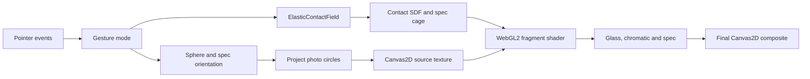
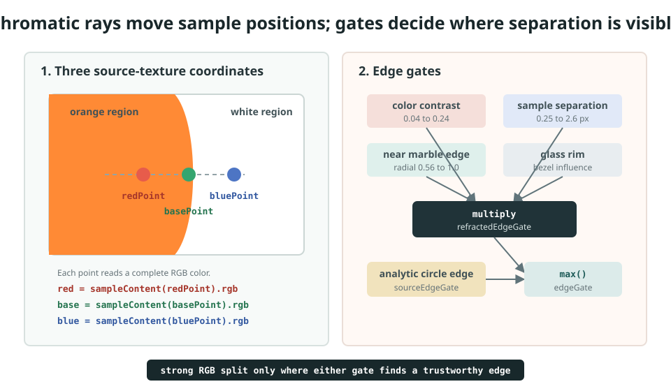
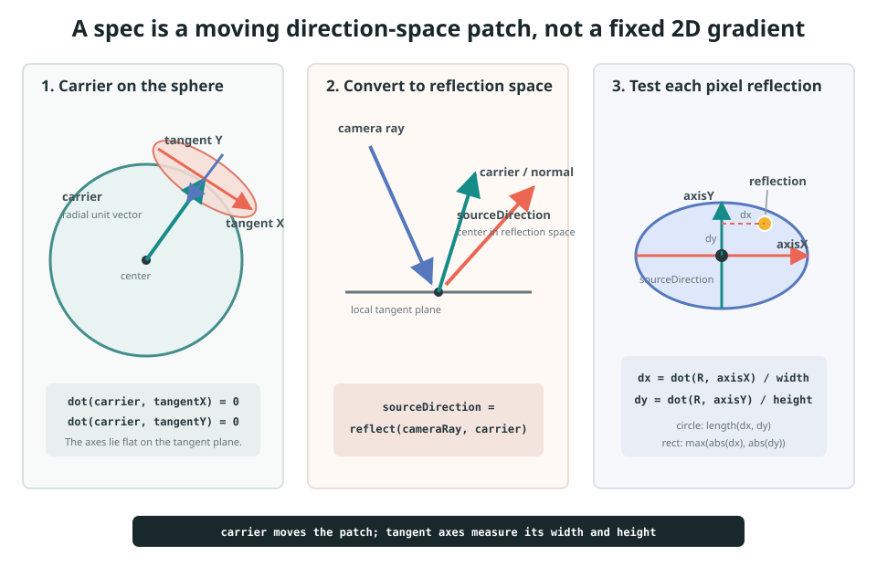
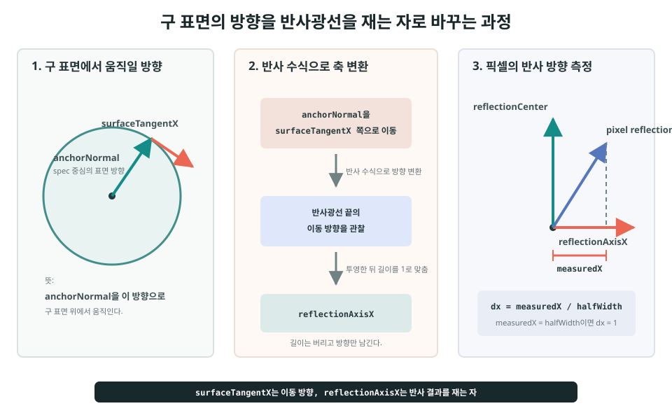
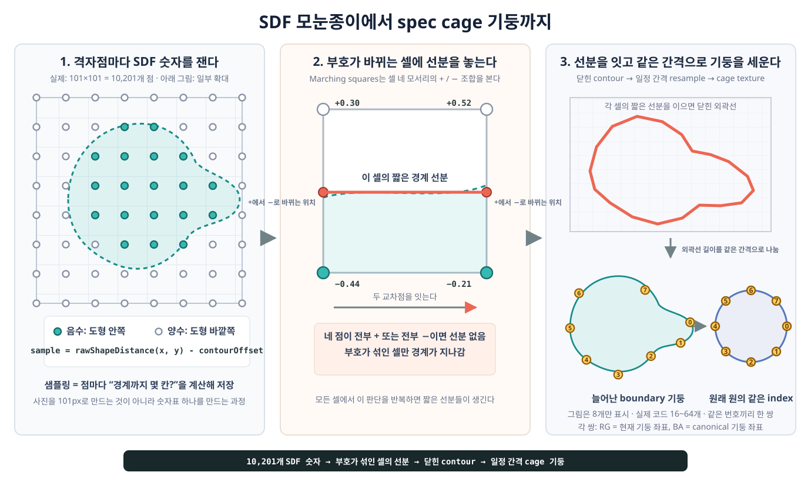

# Guseul Code and Rendering Guide

이 문서는 현재 `pages/guseul/` 구현을 처음 읽는 사람을 위한 코드 가이드다. 과거 실험 버전이 아니라 현재 최종 코드만 설명한다.

## 1. 가장 먼저 이해할 구조

구슬은 실제 3D mesh가 아니다.

1. CPU가 3D 구 위에 사진 원과 spec의 위치를 계산한다.
2. Canvas2D가 사진 원들을 한 장의 source texture로 그린다.
3. 여러 touch가 만든 2D signed-distance field가 구슬의 외곽선을 정한다.
4. WebGL2 fragment shader가 외곽선 안의 모든 픽셀에서 굴절, 색수차, normal, spec을 계산한다.

즉, **3D 데이터를 사용하는 2D implicit surface renderer**에 가깝다. 실제 polygon sphere를 그리지는 않지만, 구 표면의 회전과 광학 수식을 사용하기 때문에 3D처럼 보인다.

## 2. 한 프레임 전체 흐름



```text
Pointer events
  -> gesture mode 결정: pending / rotate / stretch
  -> ElasticContactField.update(delta)
  -> sphereOrientation과 specOrientation 갱신
  -> 구 위의 사진 원을 2D로 투영
  -> Canvas2D contentCanvas에 사진 원을 그림
  -> contact, contour, spec cage, source texture를 WebGL2에 업로드
  -> fragment shader가 구슬의 모든 픽셀을 렌더링
  -> 메인 Canvas2D가 배경, 그림자, WebGL canvas를 합성
```

실제 진입점은 `script.ts`의 `tick()`이다.

```ts
function tick(now: number): void {
  elasticField.update(dt);
  // inertia와 idle rotation 갱신
  renderer.render(getRenderParams());
  requestAnimationFrame(tick);
}
```

## 3. 파일별 역할

### `settings.ts`

최종 아트워크의 기본값만 있다. lil-gui는 이 객체를 직접 수정한다.

- interaction 감도와 자동 회전
- contact field와 release 값
- 사진 원 개수, 크기, 앞/뒷면 표현
- 굴절, IOR, dispersion
- spec 강도와 softness

릴스와 디버그 설정은 이 파일에 없다.

### `reel-presentation.ts`

릴스 촬영을 위한 상태와 하단 UI만 있다.

- 누적 렌더 단계
- 개별 레이어 on/off
- contact field, surface normal, spec mask 디버그
- 이전/다음 단계 및 `layers` 패널

최종 렌더 수식을 복제하지 않고, 기존 shader uniform을 0 또는 1로 바꾼다.

### `script.ts`

브라우저 앱의 조정자다.

- 이미지 asset과 사진 원 정의
- 구 회전 행렬
- pointer gesture 상태 전환
- 사진 원 투영과 Canvas2D source texture
- spec의 구 위 위치 계산
- CPU 데이터와 WebGL renderer 연결

### `elastic-contact-field.ts`

늘어난 구슬의 2D 외곽선을 계산한다.

- contact와 center seed
- center-contact bridge
- contact-contact membrane
- 면적 보정
- release spring
- 변형된 외곽선과 원래 원을 대응시키는 spec cage

### `webgl-renderer.ts`

WebGL2와 fragment shader가 있다.

- CPU 데이터를 uniform과 texture로 업로드
- 최종 외곽선 계산
- edge normal과 유리 단면 계산
- 굴절과 chromatic separation
- spec 역변형과 하이라이트
- glass shell과 디버그 출력

### `math.ts`

3D 벡터와 3x3 회전 행렬의 작은 공용 함수 모음이다.

## 4. 렌더링에서 사용하는 좌표와 방향 공간

코드를 읽을 때 같은 숫자가 어느 공간의 값인지 섞지 않는 것이 중요하다. 이 구현은 화면 위치, 변형된 구슬 위치, 원래 원 위치, 3D 방향을 한 프레임 안에서 차례로 사용한다.

### 화면 좌표

- 단위: CSS pixel
- 원점: 화면 왼쪽 위
- `view.cx`, `view.cy`: 구슬 중심
- `view.radius`: 화면에서 구슬 반지름

### 변형된 구슬 정규화 좌표

`normalizedElasticPoint()`가 화면 좌표를 다음과 같이 바꾼다.

```text
x = (screenX - centerX) / radius
y = (screenY - centerY) / radius
```

기본 구슬의 경계는 반지름 1인 원이다. Contact와 SDF 계산은 모두 이 좌표를 사용하므로 화면 크기가 달라도 같은 모양을 유지한다. Shader의 `point`는 현재 늘어난 외곽선 위에서 검사할 위치다.

### Source texture 좌표

굴절은 출력 픽셀을 앞으로 옮기는 대신, 현재 픽셀을 칠하기 위해 source texture의 어디를 읽을지 역으로 찾는다. `redPoint`, `basePoint`, `bluePoint`가 이 좌표다.

```text
변형된 point
  -> 굴절 offset 적용
  -> contact 변형을 sourceFollow만큼 역보정
  -> sourcePoint
  -> contentCanvas 조회
```

이 좌표도 기본 원이 `[-1, 1]` 범위에 들어가는 정규화 좌표이며, `contentUv()`가 texture의 `[0, 1]` UV로 바꾼다.

### Canonical spec 좌표

`specPoint`는 늘어나기 전 반지름 1인 원에서의 위치다. `inverseBoundarySpecWarp()`가 현재 `point`를 이 좌표로 되돌린다. 그래야 contact로 외곽선이 길게 늘어나도 원래 구의 반사 수식을 안정적으로 적용할 수 있다.

### 구 표면과 reflection의 3D 방향 공간

사진 원과 spec의 위치는 길이 1인 `[x, y, z]` 벡터다.

- `x`, `y`: 화면에 투영될 위치
- `z > 0`: 앞면
- `z < 0`: 뒷면

`sphereOrientation`과 `specOrientation`은 이 벡터를 회전시키는 3x3 행렬이다. Spec에서는 `specPoint`를 단위 구의 `specNormal`로 복원한 뒤, camera ray를 반사해 또 다른 길이 1의 방향인 `reflection`을 만든다. `reflection`은 화면 위치가 아니라 환경의 어느 방향을 향하는지 나타낸다.

전체 변환을 한 줄로 보면 다음과 같다.

```text
screenCss
  -> 변형된 구슬 point
     -> sourcePoint -> source texture 조회
     -> canonical specPoint
        -> specNormal
           -> reflection
              -> spec 원/직사각형 검사
```

### 이 문서에서 사용하는 normal은 서로 다르다

| 이름 | 차원 | 역할 |
| --- | --- | --- |
| `edgeNormal` | 2D | 현재 SDF 외곽선에 수직인 방향 |
| 굴절용 surface normal | 3D | `edgeNormal`과 유리 단면 slope로 만든 굴절 방향 |
| `specNormal` | 3D | `specPoint`에서 복원한 단위 구의 픽셀별 normal |
| `anchorNormal` | 3D | 한 spec의 중심 위치와 중심 surface normal을 함께 나타내는 기준 벡터 |

따라서 `edgeNormal`은 늘어난 2D 외곽선을 설명하고, `specNormal`과 `anchorNormal`은 반지름 1인 3D 구의 반사 방향을 설명한다. 이름에 모두 normal이 들어가지만 같은 벡터가 아니다.

## 5. 입력 상태 머신

`GestureMode`는 네 상태를 가진다.

```text
idle -> pending -> rotate
               -> stretch
```

### 한 손가락 회전

1. 구슬 안에서 `pointerdown`하면 `pending`이 된다.
2. `longPressMoveThreshold`보다 먼저 많이 움직이면 `rotate`가 된다.
3. 이동 벡터 `(dx, dy)`는 화면에 수직인 회전축으로 바뀐다.

```ts
const axis = [-dy / distance, dx / distance, 0];
const angle = distance / view.radius * dragSensitivity;
```

화면 오른쪽으로 드래그하면 Y축 주위로 회전하는 이유가 이 변환 때문이다. `applyScreenAxisRotation()`은 사진 원과 spec 행렬을 함께 갱신한다.

손을 놓으면 마지막 `axis`와 `spinVelocity`가 관성을 만든다. 속도는 매 프레임 다음처럼 지수 감쇠한다.

```text
velocity *= exp(-inertiaDamping * delta)
```

관성이 끝난 뒤 `idleHandoffDuration` 동안 자동 회전으로 부드럽게 넘어간다.

### 한 손가락 long press와 여러 손가락 stretch

- 한 손가락을 `longPressDuration`만큼 유지하면 stretch
- 두 번째 손가락이 들어오면 바로 stretch
- stretch 중 추가 손가락은 새 contact가 됨

각 pointer는 `elasticPointerContacts`에서 contact id와 연결된다. contact가 처음 생긴 지점은 `anchor`, 현재 손가락 위치는 `position`이다.

stretch 중에도 `tick()`은 idle content rotation을 허용한다. 그래서 외곽선을 잡아 늘리는 동안 내부 사진은 계속 움직인다.

## 6. 탄성 외곽선의 핵심: signed-distance field

SDF는 각 픽셀이 경계에서 얼마나 떨어져 있는지 나타내는 숫자다.

```text
distance < 0 : 도형 내부
distance = 0 : 외곽선
distance > 0 : 도형 외부
```

원 하나의 SDF는 단순하다.

```text
d_circle(p) = length(p - center) - radius
```

`rawShapeDistance()`와 shader의 `contactField()`는 같은 형태 공식을 각각 CPU와 GPU에서 구현한다.

GPU가 각 픽셀에서 center seed, contact, bridge, membrane 거리장을 합쳐 `shapeDistance`를 만드는 전체 과정은 [`Guseul Surface and Refraction`](./surface-refraction.md)에 그림과 함께 정리했다.

### center seed

항상 원점에 있는 기본 원이다.

```text
d_seed = length(point) - seedRadius
```

현재 `seedRadiusScale`은 1보다 작지만, `contourOffset`이 최종 기본 외곽선을 다시 반지름 1로 만든다. 중심 seed가 고정되어 있기 때문에 여러 손가락으로 당겨도 전체 물체가 손가락을 따라 떠다니지 않는다.

### contact circle

손가락마다 원이 하나 생긴다. 중심에서 멀어질수록 contact radius는 `contactRadiusShrinkStart`, `contactRadiusShrinkEnd`, `contactRadiusMinScale`에 따라 작아진다.

contact 개수로 radius를 줄이지는 않는다. 오직 중심에서의 거리로 계산한다.

### center bridge

중심과 contact 사이의 선분에 두께를 준 capsule이다.

```text
d_bridge = distanceToSegment(point, center, contact) - bridgeRadius
```

`bridgeRadius = seedRadius * bridgeRadiusRatio`다. 이 값이 작으면 멀리 당겼을 때 목이 얇아진다.

### contact membrane

contact가 두 개 이상이면 `buildMembraneLinks()`가 contact를 중심 각도순으로 정렬하고 이웃 contact를 연결한다.


- 2개: 두 contact를 직접 연결
- 3개 이상: 바깥 순서의 이웃끼리 연결
- 충분히 넓게 벌어진 link: center와 두 contact가 이루는 영역을 채움

pointer id나 contact 생성 순서는 화면에서의 이웃 관계와 무관하다. 이 순서대로 연결하면 link가 중심에서 교차할 수 있다. `atan2(y, x)`로 중심 각도를 계산해 정렬하면 구 중심을 한 바퀴 도는 공간 순서가 만들어지고, 마지막 contact에서 첫 contact까지 연결해 닫힌 membrane을 얻는다.

release 중에는 저장된 `releaseAngle`을 사용한다. contact가 anchor로 돌아가는 동안 각도 순서가 바뀌어 link topology가 한 프레임에 뒤집히는 것을 막기 위해서다.

단순 삼각형으로 끝내지 않고 `signedDistanceToCurvedFanEdge()`가 두 contact 원에 이어지는 곡면 경계를 만든다. `edgeConcavity`가 contact 사이 경계가 안쪽으로 들어가거나 바깥으로 부푸는 정도를 정한다.

### smooth union

여러 원과 bridge를 `min(a, b)`로 합치면 접합부가 날카롭다. 현재 코드는 `smoothMinimum()`으로 부드럽게 합친다.


```text
d_shape = smoothMin(d_shape, d_branch, fieldSmoothness)
```

일반 `min()`은 두 거리값이 같아지는 위치에서 선택하는 거리장과 normal을 즉시 바꾼다. `smoothMinimum()`은 두 거리의 차이가 `fieldSmoothness`보다 작은 구간에서만 값을 보정한다. 그래서 외곽선과 normal이 함께 연속적으로 전환된다.

`fieldSmoothness`가 클수록 접합부가 더 넓고 둥글게 섞인다. 너무 크면 원래 의도보다 전체 면적이 부풀 수 있다. 수식, 현재 적용 순서, 튜닝 영향은 [`Smooth Union Guide`](../../concepts/smooth-union.md)에 별도로 정리했다.

## 7. 면적 보정

contact를 단순히 union하면 손가락 수와 거리에 따라 면적이 계속 증가한다. `solveContourOffset()`은 이를 줄이기 위해 최종 경계를 평행 이동한다.

### 76x76 grid는 렌더링 해상도가 아니다

여기서 76x76 grid는 구슬을 76픽셀로 그린다는 뜻이 아니다. CPU가 현재 모양의 면적을 재기 위해 잠시 사용하는 **모눈종이**다. 실제 화면은 이 grid와 관계없이 GPU가 화면 해상도에 맞춰 픽셀마다 렌더링한다.

CPU는 먼저 모든 contact를 포함하는 정사각형 검사 영역을 만들고, 이를 가로 76칸과 세로 76칸으로 나눈다. 따라서 검사하는 지점은 총 5,776개다.

```text
76 * 76 = 5,776 samples

. . . X X . . .
. . X X X X . .
. X X X X X X .
. . X X X X . .
. . . X X . . .
```

- `X`: 칸 중심이 구슬 내부
- `.`: 칸 중심이 구슬 외부

각 칸의 중심에서 `rawShapeDistance()`를 한 번 계산한다. signed distance가 0보다 작거나 같으면 내부로 판정한다.

```text
estimatedArea = insideSampleCount * cellArea
```

이는 종이에 그린 불규칙한 도형의 면적을 구할 때, 도형 안에 들어간 모눈 칸의 수를 세는 것과 같은 원리다. 경계를 지나는 칸은 중심점 하나로 안과 밖을 정하기 때문에 정확한 적분이 아니라 근삿값이다.

### 목표 면적 계산

기본 구슬의 정규화 반지름은 1이므로 기본 면적은 `PI`다. contact를 합친 보정 전 면적이 기본 면적보다 커지면 `areaPreservation`으로 허용할 팽창량을 정한다.

```text
expansion = max(unconstrainedArea - baseArea, 0)
targetArea = baseArea + expansion * (1 - areaPreservation)
```

예를 들어 이해를 돕기 위해 기본 면적을 100, contact로 늘어난 면적을 150이라고 가정하면 다음과 같다.

```text
areaPreservation = 0.92
targetArea = 100 + (150 - 100) * (1 - 0.92)
           = 104
```

즉, 늘어난 면적 150을 그대로 사용하지 않고 최종 면적이 약 104가 되도록 외곽선을 보정한다. `areaPreservation = 1`이면 가능한 한 원래 면적을 유지하고, 0이면 팽창한 면적을 그대로 허용한다.

### contour offset 찾기

CPU는 저장해 둔 5,776개의 distance를 서로 다른 `contourOffset`과 비교한다. offset을 바꿀 때마다 `rawShapeDistance()`부터 다시 계산하지 않아도 되므로, 같은 grid를 이용해 빠르게 여러 후보를 시험할 수 있다.

```text
현재 면적 > 목표 면적: 외곽선을 안쪽으로 이동
현재 면적 < 목표 면적: 외곽선을 바깥쪽으로 이동
```

이 판단으로 탐색 범위를 절반씩 줄이는 binary search를 13회 실행한다. 그 결과 목표 면적에 가장 가까운 `contourOffset` 하나를 얻는다. 전체 순서는 다음과 같다.

1. CPU가 76x76 grid에서 `rawShapeDistance()`를 샘플링한다.
2. `distance <= 0`인 칸을 세어 보정 전 union 면적을 추정한다.
3. `areaPreservation`으로 목표 면적을 정한다.
4. 같은 distance 샘플을 재사용하는 binary search로 `contourOffset`을 찾는다.
5. `pressureResponse` 속도로 이전 offset에서 새 offset까지 보간한다.

최종 shader에서는 다음 식을 사용한다.

```glsl
float shapeDistance = rawDistance - uContourOffset;
```

양의 `contourOffset`은 내부로 인정하는 범위를 넓혀 외곽선을 바깥쪽으로 이동시키고, 더 작은 값은 외곽선을 안쪽으로 이동시킨다. `minimumNeckWidth`는 면적 보정이 bridge를 완전히 눌러 없애지 않도록 offset의 하한을 둔다.

76이라는 값은 정확도와 CPU 비용 사이의 절충이다. grid가 너무 작으면 면적이 계단식으로 변하고, 너무 크면 매 프레임 검사할 지점이 지나치게 많아진다. contact를 멀리 당기면 같은 76x76 grid가 더 넓은 검사 영역을 덮으므로 칸 하나가 커지고 측정은 상대적으로 거칠어진다. 다만 이 grid는 면적과 offset만 정하며 최종 렌더링 해상도를 제한하지 않는다.

## 8. contact release

손을 놓았다고 contact를 즉시 삭제하지 않는다. 즉시 삭제하면 외곽선과 spec cage가 한 프레임에 바뀌어 깜빡인다.

release 위치는 임계 감쇠 식으로 anchor에 돌아간다.

```text
omega = 2 * PI * springFrequency
returnScale(t) = (1 + omega*t) * exp(-omega*t)
position(t) = anchor + releaseOffset * returnScale(t)
```

이 식은 진동하지 않고 빠르게 원위치로 돌아간다.

- `releaseHoldDuration`: influence를 잠시 유지하는 시간
- `releaseLifetime`: contact가 완전히 사라질 때까지의 전체 시간
- `springFrequency`: 위치가 anchor로 돌아가는 속도

위치 복귀와 influence fade를 동시에 계산하기 때문에 contact 수가 줄어드는 순간도 연속적이다.

## 9. 사진 원을 구 전체에 배치하는 방법

`createMarbleCircles()`는 golden-angle 분포를 사용한다.

```text
y = 1 - 2 * (index + 0.5) / count
r = sqrt(1 - y*y)
theta = index * goldenAngle + smallRandomOffset
x = cos(theta) * r
z = sin(theta) * r
```

이 방식은 개수가 변해도 한쪽 면에 몰리지 않고 구 전체에 비교적 균일하게 퍼진다.

`y`를 같은 간격으로 나누는 이유, golden angle이 반복 정렬을 피하는 원리, 현재 deterministic jitter의 역할은 [`Golden-angle Sphere Distribution`](../../concepts/golden-angle-sphere-distribution.md)에 그림과 함께 정리했다.

매 프레임 `projectMarbleCircle()`이 현재 `sphereOrientation`을 적용한다.

```ts
const [x, y, z] = rotateSpherePoint(orientation, circle.x, circle.y, circle.z);
```

화면 위치는 `(x, y)`이고 `z`는 다음 항목을 바꾼다.

- 앞면과 뒷면 draw order
- edge와 뒷면에서의 크기
- alpha와 haze
- blur, saturation, brightness
- 흰 stroke alpha

`backTransitionWidth`는 `z = 0` 부근에서 앞면과 뒷면 표현을 섞는 폭이다. 별도 portal로 순간 이동시키지 않고 `smoothstep`으로 연속 보간한다.

## 10. Canvas2D source texture

`drawContentLayer()`는 사진 원을 바로 화면에 그리지 않는다. 정사각형 `contentCanvas`에 먼저 그린다.

```text
visible circles
  -> 원형 clip
  -> 사진 cover crop
  -> depth grading
  -> 흰 circle stroke
  -> contentCanvas
```

이 Canvas2D 결과가 WebGL의 texture unit 0, `uContent`가 된다. 따라서 WebGL shader 입장에서는 여러 사진 원이 아니라 한 장의 평면 이미지다.

원 중심과 radius는 별도의 uniform 배열로도 전달한다. 이는 사진을 다시 그리기 위한 정보가 아니라, chromatic 효과가 실제 원 경계에 닿았는지 수학적으로 검사하는 데 사용한다.

## 11. CPU에서 GPU로 전달되는 데이터

`SceneRenderer.render()`가 `GpuGlassFrame`을 만든다.

### 매 프레임 전달

- viewport, 구슬 center와 radius
- 현재 source texture
- contact position, radius, influence
- membrane link
- contour offset
- 보이는 사진 원의 center와 radius
- 보이는 spec의 direction, axes, 크기, softness, intensity
- 릴스 레이어 on/off

### revision이 바뀔 때만 전달

- spec warp cage texture

Spec warp cage는 늘어난 외곽선의 점과 원래 원의 점을 대응시키는 좌표표다. 다른 uniform보다 크고 외곽선이 바뀔 때만 새로 계산되므로 revision이 달라졌을 때만 GPU texture를 갱신한다. Cage가 spec을 어떻게 보존하는지와 revision upload의 세부 구현은 16장에서 설명한다.

## 12. fragment shader가 픽셀 하나를 그리는 순서

Shader의 `main()`이 담당하는 일을 한눈에 보면 다음과 같다. 이 장은 공통 전처리인 1~4단계를 먼저 설명하고, 13~17장은 서로 관련된 광학 계산을 주제별로 묶어 설명한다.

```text
1. 화면 좌표를 변형된 구슬 point로 변환
2. SDF와 최종 shape mask 계산
3. SDF gradient로 edgeNormal 계산
4. 유리 단면의 slope와 height 계산
5. 굴절된 source와 chromatic separation 계산
6. inner shade, milk, wash, rim의 가중치 계산
7. canonical specPoint에서 reflection과 spec mask 계산
8. 모든 층, outer stroke, debug output 합성
```

### 1. 현재 픽셀을 구슬 정규화 좌표로 변환

```glsl
vec2 point = (pixelCss - uCenterCss) / uRadiusCss;
```

### 2. contact field와 최종 mask 계산

```glsl
float rawDistance = contactField(point);
float shapeDistance = rawDistance - uContourOffset;
float shapeMask = antialiasedCoverage(shapeDistance);
```

외부 픽셀은 즉시 투명하게 종료한다.

### 3. 외곽선 normal 계산

SDF의 gradient는 경계에 수직이다. shader는 화면 미분으로 gradient를 얻는다.

```glsl
vec2 derivative = vec2(dFdx(rawDistance), -dFdy(rawDistance));
vec2 edgeNormal = normalize(derivative);
```

이 normal은 원 중심에서 현재 픽셀을 향하는 고정 방향이 아니다. 늘어난 현재 외곽선에 실제로 수직인 방향이므로 오목한 부분에서도 유리의 방향이 바뀐다.

### 4. 유리 단면 생성

`surfaceSample()`은 외곽선에서 안쪽으로 들어간 거리 `inwardDistance`를 사용한다.

- edge 부근: `convexProfile()`의 큰 slope
- bezel 안쪽: slope가 점차 0에 가까워짐
- 중심부: 거의 평평한 높이

결과 `surface.xy`는 굴절에 사용할 slope이고 `surface.z`는 ray가 통과할 유리 높이다.

```text
height = (thickness + bevelHeight) * displacementFactor
```

`inwardDistance`, `convexProfile()`, `surfaceSample()`이 각각 어떤 역할을 하고 slope와 height가 굴절 offset으로 이어지는지는 [`Guseul Surface and Refraction`](./surface-refraction.md#9-convexprofile은-유리의-볼록한-단면이다)에서 단면 도식으로 설명한다. 작품과 무관한 공통 원리는 [`SDF Glass Rendering`](../../concepts/sdf-glass-rendering.md)에 분리했다.

## 13. 굴절

`refractCameraRay()`는 공기에서 유리로 들어가는 카메라 ray를 Snell 법칙 형태로 계산한다.

```text
eta = 1 / IOR
refractedRay = refract(cameraRay, surfaceNormal, eta)
offset = ray.xy / -ray.z * glassHeight
```

`sampleLiquidGlass()`는 원래 `point`가 아니라 `point + offset`에서 source texture를 읽는다. edge slope가 클수록 offset이 커져 내부 사진이 가장자리 방향으로 늘어난 것처럼 보인다.

### source follow

외곽선만 늘어나고 source가 완전히 고정되어 있으면 유리와 내용물이 분리되어 보인다. 반대로 source가 contact를 100% 따라가면 전체 이미지를 고무처럼 늘린 것처럼 보인다.

`transformSourcePoint()`는 contact의 `position - anchor`를 거리 가중 평균하고 `sourceFollow`만큼 source 좌표에 역으로 적용한다.

```text
sourcePoint = deformedPoint - elasticDisplacement * sourceFollow
```

그래서 유리 외곽선은 크게 변형되지만 내부 사진은 일부만 따라간다.

## 14. chromatic separation

단순 blur가 아니라 R/G/B가 서로 다른 source texture 위치를 샘플링한다.



### green은 굴절되지 않는 것이 아니다

실제 빛은 파장마다 굴절률이 조금씩 다르지만, 현재 shader는 연속된 빛의 스펙트럼 대신 세 ray로 이를 근사한다.

```text
red IOR  = ior + dispersion
green IOR = ior
blue IOR = ior - dispersion
```

기본 `ior`로 계산한 `baseOffset`에는 이미 유리 굴절이 들어 있다. Green은 굴절되지 않는 것이 아니라 이 기본 굴절 경로를 기준으로 사용한다. Red와 blue는 그 기준에서 각각 다른 방향으로 dispersion 편차를 더 가진다.

```text
공통 유리 굴절      = baseOffset
red의 추가 편차    = dispersedRedOffset - baseOffset
green의 추가 편차  = 0
blue의 추가 편차   = dispersedBlueOffset - baseOffset
```

상대적인 채널 차이가 chromatic aberration을 만들기 때문에 한 채널을 기준으로 두어도 분리는 표현된다. Green을 기준으로 유지하면 세 채널을 모두 독립적으로 크게 이동시키는 것보다 원래 영상의 중심과 밝기 디테일이 안정적이다. 다만 이것은 파장별 굴절률을 정확히 재현한 물리 시뮬레이션이 아니라 시각적 근사다.

### `redPoint`, `basePoint`, `bluePoint`는 사진을 읽을 위치다

현재 출력 fragment의 구슬 좌표가 `point`다. 굴절 offset을 더하고 contact 변형을 역으로 보정하면 source texture에서 읽을 최종 좌표가 된다.

```glsl
vec2 redPoint = transformSourcePoint(point + redOffset);
vec2 basePoint = transformSourcePoint(point + baseOffset);
vec2 bluePoint = transformSourcePoint(point + blueOffset);
```

이 좌표들은 화면에서 앞으로 이동시킬 픽셀 위치가 아니다. 현재 출력 픽셀을 칠하기 위해 source texture의 어디를 읽어야 하는지 나타내는 inverse-sampling 좌표다.

각 좌표에서는 채널 하나가 아니라 완전한 RGB 색상 하나를 읽는다.

```glsl
vec3 red = sampleContent(redPoint).rgb;
vec3 base = sampleContent(basePoint).rgb;
vec3 blue = sampleContent(bluePoint).rgb;
```

변수 이름 `red`, `base`, `blue`는 각각 `redRaySample`, `baseRaySample`, `blueRaySample`이라고 읽는 편이 정확하다. 마지막에 각 샘플에서 필요한 채널 하나를 꺼내 조립한다.

```glsl
vec3 separated = vec3(red.r, base.g, blue.b);
```

세 좌표가 모두 균일한 흰색 영역 안에 있으면 각 샘플은 모두 `(1, 1, 1)`이다. 샘플 위치는 다르지만 조립 결과도 `(1, 1, 1)`이므로 색 분리는 보이지 않는다. 반대로 세 좌표가 사진 원과 배경의 경계를 가로지르면 서로 다른 색을 읽어 chromatic fringe가 생긴다.

### gate는 효과의 통과량이다

모든 픽셀에서 red와 blue 샘플을 강하게 벌리면 서로 다른 위치의 사진 세 장을 겹치는 것처럼 화면 전체가 흐릿해진다. 이를 막기 위해 두 gate가 강한 chromatic pass를 적용할 픽셀을 제한한다.

여기서 gate는 단순한 `true/false`가 아니라 `0~1` 범위의 부드러운 가중치다.

```text
gate = 0    효과를 통과시키지 않음
gate = 0.5  효과를 절반만 적용
gate = 1    효과를 완전히 적용
```

### refracted edge gate

이 gate는 굴절된 세 ray가 실제 source의 색 경계를 가로질렀는지 검사한다.

먼저 세 위치에서 읽은 전체 RGB 색상이 얼마나 다른지 `sourceContrast`로 측정한다.

```glsl
float sourceContrast = max(
  colorDistance(red, base),
  colorDistance(blue, base)
);
```

`colorDistance()`는 두 RGB 벡터의 유클리드 거리를 `0~1` 범위로 정규화한다. 세 ray가 모두 같은 흰색이나 같은 주황색 영역을 읽으면 `sourceContrast`는 `0`에 가깝다. 서로 다른 색 영역이나 사진 경계를 읽으면 값이 커진다.

```glsl
smoothRange(0.04, 0.24, sourceContrast)
```

대비가 `0.04` 이하면 gate를 닫고, `0.24` 이상이면 이 조건을 완전히 통과시킨다. 중간은 `smoothRange()`로 부드럽게 보간한다.

다음으로 red와 blue의 source 좌표가 화면에서 식별될 만큼 떨어졌는지 검사한다.

```glsl
vec2 separationVector = bluePoint - redPoint;
float separationPixels = length(separationVector) * uRadiusCss;
smoothRange(0.25, 2.6, separationPixels)
```

`redPoint`와 `bluePoint`의 차이는 정규화된 SDF 좌표이므로 `uRadiusCss`를 곱해 CSS pixel 거리로 바꾼다. `0.25px` 이하는 닫고, `2.6px` 이상은 완전히 통과시킨다.

마지막으로 현재 fragment가 구슬 외곽의 실제 굴절 band 안에 있는지 확인한다.

```glsl
float radial = 1.0 - clamp(inwardDistance, 0.0, 1.0);
smoothRange(0.56, 1.0, radial) * rim
```

여기서 shader 변수 `radial`은 3D radial vector나 2D radial gradient가 아니다. 현재 SDF 외곽선에서 안쪽으로 들어간 거리 `inwardDistance`를 뒤집은 **외곽선 근접도**다. 의미만 보면 `edgeProximity`에 가깝다.

```text
외곽선 바로 위  -> inwardDistance = 0 -> radial = 1
안쪽으로 이동   -> inwardDistance 증가 -> radial 감소
```

`rim`은 그중에서도 `bezelWidth` 안쪽의 좁은 유리 경계에서 강하다. 최종 gate는 네 조건의 곱이다.

```glsl
float refractedEdgeGate =
    contrastGate
  * separationGate
  * radialGate
  * rim;
```

곱셈이므로 색 대비, 실제 분리 거리, 외곽 위치, rim 중 하나라도 `0`이면 강한 chromatic pass가 닫힌다.

### source edge gate

`sampleSourceEdge()`가 uniform으로 받은 사진 원의 signed distance를 계산한다. 현재 픽셀이 사진 원 경계에 가까울 때만 추가 RGB coverage를 만든다.

`refractedEdgeGate`가 실제 texture 색상 차이로 경계를 찾는다면 `sourceEdgeGate`는 사진 원의 중심과 반지름을 사용해 수학적으로 경계를 찾는다. 그래서 균일한 사진이라 색 대비가 약해도 원의 outline에서는 안정적으로 chromatic을 만들 수 있다.

Shader는 draw order의 위쪽 원부터 검사해 현재 위치에서 실제로 보이는 원 경계 하나를 선택한다. 이 구조 때문에 뒤에 가려진 원의 chromatic이 위로 새지 않는다.

### 두 gate의 결합

두 gate는 곱하지 않고 큰 값을 선택한다.

```glsl
float edgeGate = max(refractedEdgeGate, sourceEdgeGate);
```

```text
사진 내부의 강한 명암 경계
  -> refractedEdgeGate가 열림

사진 원의 수학적 외곽선
  -> sourceEdgeGate가 열림

평평한 단색 내부 또는 구슬 중심
  -> 두 gate가 모두 닫힘
```

즉 둘 중 하나라도 신뢰할 만한 경계를 발견하면 강한 RGB 분리를 허용하되, 아무 경계도 없는 영역은 기본 굴절의 선명도를 유지한다.

## 15. spec의 기본 원리

Spec은 `specular highlight`의 줄임말이다. 매끄러운 유리나 금속 표면에 창문, 조명 같은 밝은 환경이 반사되어 생기는 하이라이트를 뜻한다.

### 먼저 결과부터: 환경의 밝은 카드를 방향으로 조회한다

멀리 있는 스튜디오에 밝은 원형 조명이나 직사각형 소프트박스가 있다고 생각하자. 매끄러운 구의 각 픽셀은 서로 다른 방향을 거울처럼 비춘다. 현재 shader는 픽셀마다 reflected ray를 구하고, 그 ray가 밝은 환경 영역을 향하면 spec을 밝힌다.

```text
각 출력 픽셀
  -> 구 표면 normal 계산
  -> camera ray를 반사해 reflection 계산
  -> reflection이 밝은 원/직사각형 영역 안인지 검사
  -> 안쪽이면 spec 밝기 적용
```

일반적인 environment mapping은 이 방향으로 cube map 이미지를 조회한다. 현재 구현은 별도 환경 이미지 대신 원과 직사각형을 수학으로 정의해 직접 검사한다.

```text
일반적인 environment mapping
  reflection -> cube map의 색 조회

현재 spec
  reflection -> 수학적 원/직사각형 mask 조회
```

화면 좌표에 밝은 2D 얼룩을 고정해 그리는 방식과도 다르다. 현재 방식은 구 표면의 normal과 반사 방향을 거치므로 spec이 edge로 갈수록 구의 곡률에 맞게 압축되고 휘어 보인다.

### 원이나 직사각형을 검사하려면 중심과 두 축이 필요하다

회전할 수 있는 직사각형 안에 점 하나가 들어 있는지 알려면 중심, 가로 방향, 세로 방향, 가로 크기, 세로 크기가 필요하다. Reflection 공간에서도 같다.

```text
reflectionCenter
  검사할 원/직사각형의 중심 방향

reflectionAxisX / reflectionAxisY
  가로와 세로를 재는 길이 1인 자

halfWidth / halfHeight
  각 자에서 경계로 사용할 눈금

각 픽셀의 reflection
  두 자로 측정할 점
```

이해하기 쉬운 형태로 쓰면 GPU의 질문은 다음과 같다.

```text
offset = pixelReflection - reflectionCenter
x = dot(offset, reflectionAxisX)
y = dot(offset, reflectionAxisY)

abs(x) <= halfWidth이고 abs(y) <= halfHeight인가?
```

따라서 픽셀별 `reflection`만 계산해서는 아직 직사각형을 검사할 수 없다. 그 점을 잴 `reflectionCenter`, `reflectionAxisX`, `reflectionAxisY`를 먼저 준비해야 한다.



### Spec preset은 구 표면의 anchor frame으로 저장한다

Preset은 reflection 공간의 두 축을 직접 저장하지 않는다. 대신 구 표면에서 spec의 중심과 방향을 다루기 쉬운 `anchorNormal`과 두 tangent axis를 만든다. 이를 작은 좌표 스티커에 비유할 수 있다.

```text
구의 중심에서 스티커 중심까지 꽂은 핀
  -> anchorNormal

스티커 표면의 가로 방향
  -> surfaceTangentX

스티커 표면의 세로 방향
  -> surfaceTangentY

스티커의 가로/세로 크기
  -> halfWidth / halfHeight
```

스티커는 좌표 frame을 이해하기 위한 비유일 뿐 실제로 표면에 칠한 decal은 아니다. 실제 밝은 영역은 reflection 방향 공간에 있다. 현재 artwork는 이 anchor frame을 `specOrientation`으로 움직여 반사 카드가 구 위를 이동하는 것처럼 연출한다.

#### `anchorNormal`은 위치이자 surface normal이다

구의 중심은 `(0, 0, 0)`이고 반지름은 `1`이다. 따라서 중심에서 표면의 한 점으로 향하는 길이 1의 벡터는 그 점의 위치이면서 바깥쪽 surface normal이기도 하다.

```text
(0, 0, 1)   화면 정면 중앙의 위치이자 normal
(1, 0, 0)   오른쪽 edge의 위치이자 normal
(0, 0, -1)  구 뒷면의 위치이자 normal
```

각 spec의 `anchorNormal`은 spec 중심을 고정하는 이 기준 벡터다. 다음 값은 z가 `1`에 가까우므로 구의 정면 중앙 근처를 뜻한다.

```ts
anchorNormal: [0.1039, 0.0024, 0.9946]
```

#### Tangent plane은 구에 한 점만 닿는 평면이다

구 표면의 한 점에 평평한 종이를 살짝 대면 종이는 구와 그 점에서만 닿는다. 이 종이가 tangent plane, 즉 접평면이다. `anchorNormal`은 종이를 수직으로 뚫고, 두 tangent axis는 종이 위에 놓인다.

```text
dot(anchorNormal, surfaceTangentX) = 0
dot(anchorNormal, surfaceTangentY) = 0
dot(surfaceTangentX, surfaceTangentY) = 0
```

코드는 x축을 tangent plane 위로 투영해서 첫 축을 만들고, `cross()`로 두 번째 축을 만든다.

```ts
const baseSurfaceTangentX = projectOntoTangent([1, 0, 0], baseAnchorNormal);
const baseSurfaceTangentY = normalizeVec3(
  crossVec3(baseAnchorNormal, baseSurfaceTangentX),
);
```

`projectOntoTangent()`는 입력 벡터에서 `anchorNormal` 방향 성분을 빼서 접평면 위에 눕힌다.

```text
tangent = vector - anchorNormal * dot(vector, anchorNormal)
```

### CPU가 anchor frame을 reflection 영역으로 바꾸는 순서

`prepareSpecHighlight()`는 preset의 anchor frame을 GPU가 검사할 `reflectionCenter`, `reflectionAxisX`, `reflectionAxisY`로 바꾼다.

#### 1. Anchor normal과 tangent frame을 회전한다

`specOrientation`은 드래그와 자동 회전으로 누적된 3D 회전 행렬이다.

```ts
const rotatedAnchorNormal = normalizeVec3(
  applyMatrix3(orientation, baseAnchorNormal),
);
```

Anchor normal만 회전하면 스티커 중심만 움직이고 무늬 방향은 고정되는 것처럼 보인다. 그래서 `baseSurfaceTangentX`, `baseSurfaceTangentY`도 같은 행렬로 회전한다.

#### 2. Edge에서 머무는 시간을 조절한다

구의 정면은 `anchorNormal.z`가 `1`, 옆면은 `0`, 뒷면은 음수다. `applySpecEdgeDwell()`은 z에 `specEdgeDwell` 지수를 적용하고 x/y를 다시 조정해 normal 길이를 `1`로 유지한다.

```text
z가 1에 가까움  -> 정면
z가 0에 가까움  -> edge
z가 음수        -> 뒷면
```

이것은 spec이 edge를 너무 빨리 통과하지 않도록 화면에서 보이는 이동 속도를 조절하는 시각적 보정이다.

#### 3. `reflectionCenter`를 계산한다

고정된 camera ray `(0, 0, -1)`를 `anchorNormal` 방향의 거울면에 반사한다.

```ts
const reflectionCenter = normalizeVec3(
  reflectVec3([0, 0, -1], anchorNormal),
);
```

`reflectionCenter`는 화면 위치가 아니다. **이 spec의 중심이 되려면 픽셀의 반사광선이 어느 3D 방향을 향해야 하는가**를 나타내는 unit vector다. Camera ray를 반사할 때 사용하는 normal은 `anchorNormal`이고, 그 계산 결과로 나오는 reflected ray가 `reflectionCenter`다.

```text
anchorNormal
  구 표면에서 spec 중심이 이동할 위치
  camera ray를 반사하는 surface normal

reflectionCenter
  anchorNormal이 camera ray를 반사한 방향
  즉 reflection 공간에서 spec 영역의 중심
```

#### 4. Tangent axis를 reflection 공간으로 옮긴다

`reflectionDerivative()`는 픽셀별 반사 계산을 대신하지 않는다. 구 표면의 가로·세로 tangent를 **reflected ray를 측정하는 가로·세로 자로 바꾸는 준비 작업**이다. 이 작업은 CPU에서 매 frame spec마다 한 번 수행하고, GPU는 준비된 자로 모든 픽셀을 검사한다.

구 표면에서 `anchorNormal`이 tangent 방향으로 조금 움직이면 reflected ray도 방향이 바뀐다. `reflectionDerivative()`는 이 작은 방향 변화를 계산해 측정 축의 방향을 찾는다.



두 축은 같은 것이 아니다.

```text
surfaceTangentX
  구 표면에서 anchorNormal을 어느 방향으로 움직일지 알려주는 화살표

reflectionAxisX
  그렇게 움직였을 때 reflected ray의 끝이 어느 방향으로 움직이는지 알려주는 화살표
```

거울의 기울기를 오른쪽으로 조금 바꾸면 반사광선도 움직이지만, 두 화살표가 반드시 같은 방향으로 움직이지는 않는다. 거울 반사 수식이 중간에 있기 때문이다.

```text
anchorNormal을 surfaceTangentX 방향으로 조금 이동
  -> camera ray를 다시 반사
  -> reflected ray 끝점의 이동 방향 계산
  -> 그 방향을 normalize
  -> reflectionAxisX
```

정면 중앙에서는 두 방향이 우연히 비슷해 보여서 `surfaceTangentX`를 그대로 사용해도 될 것처럼 보인다. 하지만 구의 옆으로 갈수록 둘은 크게 달라진다. 예를 들어 다음 45도 지점에서는 구 표면의 가로 tangent는 대각선이지만 reflected ray의 끝점은 z축 방향으로 움직인다.

```text
anchorNormal      = (0.707, 0,  0.707)
surfaceTangentX   = (0.707, 0, -0.707)
reflectionCenter  = (1,     0,  0)
reflectionAxisX   = (0,     0, -1)
```

`surfaceTangentX`를 reflection 공간의 자로 그대로 사용하면 이 위치에서 spec 직사각형의 회전과 폭을 잘못 측정한다.

##### 여기서 “조금”은 고정된 이동량이 아니다

`N = anchorNormal`, `T = surfaceTangent`라고 하자. 두 벡터는 길이가 1이고 서로 직각이다. 단위 구에서 `N`을 `T` 방향으로 `s` radian만큼 움직인 normal은 다음과 같다.

```text
N(s) = cos(s)N + sin(s)T
```

`s`가 아주 작을 때는 다음처럼 생각할 수 있다.

```text
N(s) ≈ N + sT
```

`reflectionDerivative()`는 `s = 0.01`처럼 실제 이동량을 정하는 함수가 아니다. `s`가 0에 가까워질 때 **normal이 T 방향으로 변하는 속도에 대한 reflected ray의 변화 속도**를 계산한다.

```text
reflectionDerivative(N, T)
= limit(s -> 0) [reflect(I, N(s)) - reflect(I, N)] / s
```

미분 없이 생각하면 다음 유한 차분과 같다.

```ts
// 개념을 보여주기 위한 pseudocode
const epsilon = 0.0001;
const reflectionCenter = reflect(cameraRay, anchorNormal);
const movedNormal = normalize(anchorNormal + epsilon * surfaceTangentX);
const movedReflection = reflect(cameraRay, movedNormal);

const reflectionAxisX = normalize(
  movedReflection - reflectionCenter,
);
```

즉 normal을 tangent 방향으로 아주 조금 옮기고, 반사를 다시 계산하고, 두 reflected ray 끝점의 차이를 재는 방식이다. 현재 함수는 두 번 반사하는 대신 반사 수식을 직접 미분해 같은 1차 변화 방향을 한 번에 구한다.

Camera ray가 `I = (0, 0, -1)`일 때 반사식은 다음처럼 단순해진다.

```text
R(N) = I - 2 dot(I, N)N
     = I + 2 Nz N
```

`N`의 변화율은 `T`, `Nz`의 변화율은 `Tz`이므로 곱을 미분하면 다음 결과가 나온다.

```text
dR/ds = 2(Tz N + Nz T)
```

이 벡터식이 `reflectionDerivative()` 내부 구현의 세 component로 그대로 풀려 있다.

```ts
return [
  2 * (tangentZ * anchorNormal[0] + normalZ * surfaceTangent[0]),
  2 * (tangentZ * anchorNormal[1] + normalZ * surfaceTangent[1]),
  2 * (tangentZ * anchorNormal[2] + normalZ * surfaceTangent[2]),
];
```

그 결과를 `reflectionCenter`의 tangent plane에 투영해 GPU가 사용할 `reflectionAxisX`, `reflectionAxisY`를 만든다.

```ts
const reflectionAxisX = projectOntoTangent(
  reflectionDerivative(anchorNormal, surfaceTangentX),
  reflectionCenter,
);
```

따라서 이름이 비슷하지만 두 단계의 축을 구분해야 한다.

```text
surfaceTangentX / surfaceTangentY
  구 표면에서 spec 스티커의 가로/세로 이동 방향

reflectionAxisX / reflectionAxisY
  reflected ray 방향 공간에서 spec 폭과 높이를 측정하는 방향
```

`projectOntoTangent()`가 마지막에 결과를 normalize하므로 `reflectionDerivative()`의 크기는 버리고 방향만 남긴다. 따라서 `reflectionAxisX`는 reflection 공간에서 사용하는 길이 `1`인 가로 자다.

#### 5. 뒷면에서는 숨긴다

전면 판정에 사용하는 `rotatedAnchorNormal.z`가 `0` 이하면 spec 중심이 뒷면에 있다. 이때 `visibility`를 `0`으로 만든다. Edge 근처에서는 `specEdgeFade` 범위로 서서히 사라지게 해 갑자기 끊기는 것을 줄인다.

### GPU는 준비된 두 자로 현재 픽셀을 측정한다

Shader는 먼저 늘어난 구슬 좌표를 원래 원 좌표로 역변환한다. 이 과정은 다음 16장에서 설명한다. 원 좌표 `specPoint`를 단위 구의 앞면 normal로 복원하고 camera ray를 반사하면 현재 픽셀의 `reflection`을 얻는다.

```glsl
vec3 specNormal = normalize(vec3(
  specPoint,
  sqrt(1.0 - dot(specPoint, specPoint))
));

vec3 reflection = normalize(
  reflect(vec3(0.0, 0.0, -1.0), specNormal)
);
```

현재 `reflection`을 spec의 두 축에 투영하면 spec 중심에서 가로와 세로로 얼마나 벗어났는지 알 수 있다.

```glsl
float measuredX = abs(dot(reflection, reflectionAxisX));
float measuredY = abs(dot(reflection, reflectionAxisY));

float dx = measuredX / halfWidth;
float dy = measuredY / halfHeight;
```

`dot()`은 현재 reflection 화살표에 가로 자 방향이 얼마나 들어 있는지 측정한다.

```text
reflection이 오른쪽으로 전혀 기울지 않음
  -> measuredX = 0

reflection이 오른쪽으로 많이 기울어짐
  -> measuredX가 커짐
```

`reflectionCenter`는 두 자와 직각이 되도록 축을 만들었기 때문에 다음 식이 성립한다.

```text
dot(reflectionCenter, reflectionAxisX) = 0
dot(reflectionCenter, reflectionAxisY) = 0
```

따라서 현재 픽셀의 `reflection`이 `reflectionCenter`와 같으면 `measuredX = 0`, `measuredY = 0`이고 spec 정중앙이 된다.

코드에서 `reflection - reflectionCenter`를 먼저 계산하지 않는 이유도 같다.

```text
dot(reflection - reflectionCenter, reflectionAxisX)
= dot(reflection, reflectionAxisX)
  - dot(reflectionCenter, reflectionAxisX)
= dot(reflection, reflectionAxisX) - 0
```

`halfWidth`는 화면 픽셀 거리나 구 표면의 직선거리가 아니다. Reflection 공간의 가로 자에서 spec 경계로 사용할 눈금이다.

```text
halfWidth = 0.42인 예

measuredX = 0     -> dx = 0 / 0.42    = 0    -> spec 중심
measuredX = 0.21  -> dx = 0.21 / 0.42 = 0.5  -> 중심과 경계 사이
measuredX = 0.42  -> dx = 0.42 / 0.42 = 1    -> spec 가로 경계
```

따라서 기존의 “`halfWidth`만큼 떨어진다”는 표현보다 다음 설명이 정확하다.

> Reflection의 `reflectionAxisX` 방향 성분이 `halfWidth`가 되면 `dx = 1`이고, `reflectionAxisY` 방향 성분이 `halfHeight`가 되면 `dy = 1`이다.

원과 직사각형은 같은 `dx`, `dy`를 서로 다른 거리 수식에 넣어 만든다.

```glsl
// 타원 또는 원
float distanceToSpec = length(vec2(dx, dy));

// 둥글게 흐려지는 직사각형
float distanceToSpec = max(dx, dy);
```

```text
distanceToSpec < 1  spec 영역 안쪽
distanceToSpec = 1  spec 경계
distanceToSpec > 1  spec 영역 바깥
```

`softness`는 경계가 흐려지는 폭, `power`는 중심에서 경계까지 밝기가 줄어드는 곡선, `intensity`는 최종 밝기다.

마지막으로 `dot(reflection, reflectionCenter)`를 검사한다. `reflectionAxisX`, `reflectionAxisY` 투영만 보면 반대 방향에도 같은 좌표가 생길 수 있기 때문에, 실제로 `reflectionCenter`와 같은 반구를 향할 때만 spec을 보이게 한다.

### 한 spec이 화면에 나타나는 전체 흐름

```text
preset anchorNormal과 크기
  -> specOrientation으로 anchorNormal과 surface tangent frame 회전
  -> anchorNormal로 camera ray를 반사해 reflectionCenter 계산
  -> surface tangent frame을 reflectionAxisX/reflectionAxisY로 변환
  -> GPU에 전달

각 출력 픽셀
  -> 늘어난 좌표를 원래 원 좌표로 역변환
  -> 구 surface normal 계산
  -> camera ray를 반사해 reflection 계산
  -> reflection을 reflectionAxisX/reflectionAxisY에 투영
  -> circle/rect 영역 안이면 softness, power, intensity 적용
```

### 이 방식의 그래픽스 용어와 범위

전체 구현에 하나의 정해진 알고리즘 이름이 있는 것은 아니다. 다음과 같은 표준 기법과 현재 artwork를 위한 수학적 mask를 조합한 방식이다.

| 현재 단계 | 가까운 그래픽스 용어 | 범위 |
| --- | --- | --- |
| `reflect(I, N)`으로 방향 계산 | reflection vector | 이상적인 거울 반사의 표준 공식 |
| reflected ray가 향하는 곳으로 밝기 결정 | reflection mapping / environment mapping | Cube map 등에서 널리 쓰이는 방식 |
| tangent 변화가 reflected ray에 미치는 영향 계산 | differential of reflection map / Jacobian | ray differential과 같은 미분 원리를 사용하는 특수한 경우 |
| 원·직사각형 안인지 수식으로 검사 | procedural reflection-space highlight mask | 이 artwork를 위한 stylized 구현 |

Reflection vector를 환경 map 조회 좌표로 쓰는 방식은 [Khronos `ARB_texture_cube_map` 명세](https://registry.khronos.org/OpenGL/extensions/ARB/ARB_texture_cube_map.txt)에 정의되어 있다. 반사식의 작은 변화를 미분해 인접 ray의 변화를 추적하는 더 일반적인 개념은 Homan Igehy의 [Tracing Ray Differentials](https://graphics.stanford.edu/papers/trd/)와 가깝다. 현재 `reflectionDerivative()`는 화면 전체 ray footprint를 추적하는 완전한 ray differential이 아니라, surface tangent를 reflection 측정 축으로 바꾸는 데 필요한 방향 미분만 사용한다.

반사 방향 자체는 물리적인 거울 반사식이지만, 밝은 직사각형을 방향 mask로 판단하는 부분은 실제 면광원의 거리, 차폐, 표면 거칠기와 빛의 적분을 모두 계산하는 물리 기반 조명은 아니다. 멀리 있는 밝은 studio light card를 빠르고 조절하기 쉬운 형태로 흉내 내는 시각적 근사다.

## 16. 늘어난 외곽선에서 spec을 유지하는 방법

### 먼저 둥근 고무판을 늘린다고 생각한다

늘이기 전의 구슬은 반지름 1인 원이다. 이 둥근 고무판에 spec을 그린 뒤 오른쪽 끝을 손가락으로 길게 당긴다고 생각하자.

```text
늘이기 전                   늘인 뒤

    ______                  _________
  /   ▭    \              /   ▭      \____
 |          |     ->      |                 )
  \________/              \________________/
```

Spec까지 고무처럼 같은 비율로 늘이면 오른쪽 contact 끝에 길고 찌그러진 하이라이트가 생긴다. 현재 artwork가 원하는 것은 하이라이트를 단순히 잡아당기는 것이 아니라, 늘어난 유리 표면 위에서도 원래 구의 반사 방향을 사용해 spec이 자연스럽게 이어지는 모습이다.

그래서 shader는 늘어난 현재 좌표로 바로 reflection을 계산하지 않는다. 먼저 다음 질문을 한다.

> 늘어난 고무판의 이 픽셀은, 늘이기 전 둥근 고무판에서는 어디에 있던 점인가?

그 원래 위치가 `specPoint`다.

```text
늘어난 현재 point
  -> 늘이기 전 위치를 역으로 찾음
  -> canonical specPoint
  -> 단위 구의 specNormal
  -> reflection
  -> spec mask
```

`canonical`은 변형을 적용하기 전 기준 모양이라는 뜻이다. 여기서는 반지름 1인 원이 canonical shape다.

### Cage는 두 외곽선에 같은 번호를 붙인 울타리다

CPU는 현재 늘어난 외곽선과 원래 원의 외곽선에 같은 개수의 표본점을 만든다. 각 표본점을 울타리 기둥이라고 생각하면 쉽다.

```text
현재 늘어난 외곽선의 0번 기둥 <-> 원래 원의 0번 기둥
현재 늘어난 외곽선의 1번 기둥 <-> 원래 원의 1번 기둥
현재 늘어난 외곽선의 2번 기둥 <-> 원래 원의 2번 기둥
...
```

이렇게 번호가 대응된 두 울타리가 spec warp cage다.

늘어난 쪽의 0번 기둥이 오른쪽으로 멀리 이동해도 canonical 쪽의 0번 기둥은 원의 오른쪽에 그대로 있다. 중요한 것은 두 기둥의 화면 위치가 아니라 **같은 번호끼리 한 쌍이라는 사실**이다. 이 대응표가 있으면 늘어난 내부 픽셀을 원래 원의 내부 위치로 되돌릴 수 있다.

### CPU는 현재 외곽선을 찾아 cage를 만든다

먼저 `101x101 grid에서 SDF를 샘플링한다`는 말을 일상적인 표현으로 바꾸면 다음과 같다.

> 모눈종이의 교차점 10,201곳에서 “이 점은 도형 안인가, 밖인가, 경계에서 얼마나 떨어졌나?”를 한 번씩 물어보고 숫자로 적는다.

프로그램은 가로 위치 101개와 세로 위치 101개를 일정한 간격으로 정한다. 두 위치가 만나는 각 격자점 `(x, y)`에서 다음 값을 한 번 계산해 저장한다.

```text
sample = rawShapeDistance(x, y) - contourOffset

sample < 0  : 도형 안쪽
sample = 0  : 외곽선 위
sample > 0  : 도형 바깥쪽
|sample|    : 외곽선에서 떨어진 거리
```

예를 들어 `-0.44`라면 안쪽에 있고 경계까지의 거리가 약 `0.44`, `+0.30`이라면 바깥쪽에 있고 경계까지의 거리가 약 `0.30`이라는 뜻이다. 이 숫자가 SDF 샘플이다.

여기서 **샘플링은 픽셀을 그리는 작업이 아니다.** 도형을 101px짜리 사진으로 만드는 것도 아니다. 나중에 외곽선을 찾을 수 있도록 격자점마다 숫자 하나를 미리 재어 두는 작업이다. 101x101개의 **점** 사이에는 100x100개의 **칸**이 생긴다.



#### 한 칸에서 짧은 외곽선 선분을 찾는다

Marching squares는 인접한 격자점 네 개가 만드는 칸을 하나씩 검사한다.

```text
왼쪽 위 +0.30 -------- 오른쪽 위 +0.52
        |                    |
        |       한 칸        |
        |                    |
왼쪽 아래 -0.44 -------- 오른쪽 아래 -0.21
```

위 두 점은 양수라서 바깥쪽이고 아래 두 점은 음수라서 안쪽이다. 한 모서리를 따라 값이 `+`에서 `-`로 바뀌었다면, 그 사이 어딘가에서는 반드시 `0`을 지난다. 그곳이 외곽선과 모서리가 만나는 위치다.

코드는 두 끝의 숫자 비율로 `0`의 위치를 선형 보간한다. `+0.30`과 `-0.44` 사이에서는 단순히 모서리의 한가운데라고 정하지 않고, `0.30 : 0.44`의 비율을 이용해 실제로 0에 더 가까운 위치를 고른다. 이렇게 찾은 교차점 두 개를 이으면 그 칸을 통과하는 짧은 외곽선 선분이 된다.

- 네 점이 모두 `+`이거나 모두 `-`이면 그 칸에는 외곽선 선분을 만들지 않는다.
- `+`와 `-`가 섞여 있으면 부호가 바뀌는 모서리에서 교차점을 찾고 선분으로 잇는다.
- 네 점의 부호가 바둑판처럼 엇갈리는 특별한 경우에는 칸 중심의 부호도 참고해 어느 교차점끼리 이을지 정한다.

이 검사를 100x100개 칸에서 반복하면 짧은 선분들이 생긴다. 이 선분들의 끝을 차례로 연결하면 닫힌 외곽선이 된다. 사각형 칸을 하나씩 전진하며 검사한다는 의미에서 이 방법을 **marching squares**라고 부른다.

#### 연결한 외곽선 위에 기둥을 같은 간격으로 다시 세운다

Marching squares가 만든 선분의 끝점들이 곧바로 cage 기둥이 되는 것은 아니다. 격자와 외곽선이 만난 위치에 따라 끝점 간격이 들쭉날쭉하기 때문이다.

CPU는 먼저 선분들을 연결해 하나의 긴 외곽선 경로를 만든다. 외곽선이 여러 개라면 면적이 가장 큰 것을 고른다. 그런 다음 그 경로의 전체 길이를 재고, 길이를 똑같이 나눈 위치에 `specBoundarySamples`개의 점을 새로 찍는다. 이 점들이 실제 cage 기둥이다. 현재 설정에서는 16~64개를 사용한다.

```text
marching squares의 불규칙한 선분 끝점
  -> 하나의 닫힌 외곽선으로 연결
  -> 외곽선 길이를 같은 간격으로 나눔
  -> 0번, 1번, 2번, ... cage 기둥 배치
```

원래 원에도 같은 개수의 기둥을 각도 순서대로 배치한다. 그래서 늘어난 외곽선의 `k`번 기둥과 원의 `k`번 기둥이 한 쌍이 된다.

정리하면 `BoundarySpecCageSolver`는 다음 순서로 울타리를 만든다.

1. 101x101 grid에서 현재 SDF를 샘플링한다.
2. `distance = 0`이 지나가는 칸을 이어 현재 외곽선을 찾는다.
3. 여러 contour가 생기면 가장 큰 연결 contour를 선택한다.
4. 외곽선을 따라 같은 간격으로 `specBoundarySamples`개의 기둥을 다시 배치한다.
5. 원래 원에도 같은 개수의 기둥을 각도 순서대로 배치한다.
6. 같은 index의 두 기둥을 한 쌍으로 저장한다.

Cage texture의 texel 하나에는 기둥 한 쌍이 들어간다.

```text
R, G = 현재 늘어난 boundary 기둥의 x, y
B, A = 대응하는 canonical circle 기둥의 x, y
```

### GPU는 내부 픽셀도 같은 비율로 원에 되돌린다

경계 기둥의 대응만으로는 내부 픽셀의 원래 위치가 바로 나오지 않는다. `inverseBoundarySpecWarp()`는 현재 픽셀이 늘어난 cage의 각 기둥과 얼마나 관계있는지 가중치를 계산한다.

예를 들어 오른쪽 끝에 가까운 픽셀은 오른쪽 기둥들의 영향을 많이 받고, 위쪽과 오른쪽 사이에 있는 픽셀은 위쪽 기둥과 오른쪽 기둥의 영향을 섞어서 받는다.

```text
늘어난 cage에서 현재 픽셀 P

왼쪽 기둥 영향      작음
위쪽 기둥 영향      중간
오른쪽 기둥 영향    큼
아래쪽 기둥 영향    작음
```

그런 다음 똑같은 가중치를 canonical circle의 대응 기둥에 적용한다.

```text
늘어난 cage
  P = 0번 기둥 * w0
    + 1번 기둥 * w1
    + 2번 기둥 * w2
    + ...

canonical circle
  specPoint = 원의 0번 기둥 * w0
            + 원의 1번 기둥 * w1
            + 원의 2번 기둥 * w2
            + ...
```

이때 사용하는 부드러운 가중치 계산법이 **mean-value coordinates**다. 이름보다 역할이 중요하다.

> 늘어난 울타리 안에서 현재 픽셀의 위치를 설명하는 혼합 비율을 구하고, 그 혼합 비율을 원래 원의 울타리에 그대로 적용한다.

픽셀이 기둥 사이를 움직이면 가중치도 서서히 바뀌므로 `specPoint`가 갑자기 튀지 않는다. Contact 사이가 오목한 외곽선에서도 같은 원리로 연속적인 위치를 얻는다. 마지막 center 보정은 늘어난 모양의 중심이 canonical 원의 중심 `(0, 0)`에 대응하도록 맞춘다.

### 왜 forward가 아니라 inverse warp인가

원래 원의 픽셀을 늘어난 위치로 앞으로 밀어내면 출력 화면에서 어떤 픽셀은 비고 어떤 픽셀은 여러 번 덮일 수 있다. Fragment shader는 지금 칠해야 하는 출력 픽셀 하나를 이미 알고 있으므로 반대로 묻는 편이 안정적이다.

```text
현재 출력 픽셀
  -> 원래 어느 좌표였는지 찾음
  -> 그 좌표에서 reflection 계산
```

Source texture를 굴절할 때 출력 픽셀에서 읽을 source 위치를 역으로 찾는 것과 같은 inverse-sampling 사고방식이다.

### 역변환 뒤에 다시 구의 reflection을 계산한다

GPU의 최종 순서는 다음과 같다.

```text
deformed point
  -> mean-value weights in deformed cage
  -> 같은 weights를 canonical circle에 적용
  -> canonical specPoint
  -> 단위 구의 앞면 specNormal 복원
  -> camera ray reflection 계산
  -> spec 원/직사각형 mask 검사
```

따라서 오른쪽 contact 끝처럼 화면상 길게 늘어난 곳도 reflection 계산을 할 때는 원래 단위 구의 알맞은 위치로 돌아간다. Cage는 spec 좌표만 바꾸며, 사진 원의 굴절과 `sourceFollow`에는 사용하지 않는다.

### Cage texture는 외곽선이 바뀔 때만 upload한다

`BoundarySpecCageSolver`는 최대 64개 기둥 쌍을 하나의 `Float32Array`에 계속 덮어쓴다. 배열 객체는 같고 내부 숫자만 바뀌므로 배열 참조만 비교해서는 새 cage인지 알 수 없다. 그래서 solver는 cage를 다시 계산할 때 `revision`을 1씩 올린다.

```text
같은 Float32Array 객체
  revision 7: 이전 boundary 좌표
  revision 8: 새 boundary 좌표
```

Renderer는 마지막으로 GPU에 올린 revision을 기억한다.

```text
CPU revision = 8, GPU revision = 7
  -> 새 RGBA32F cage texture upload

CPU revision = 8, GPU revision = 8
  -> 내용이 같으므로 upload 생략
```

Revision은 과거 cage를 보관하는 history가 아니다. 배열 하나에는 항상 최신 좌표만 남고, revision은 CPU와 GPU가 같은 버전의 좌표를 가지고 있는지 알려주는 변경 번호다. 사진 원의 회전이나 색상만 바뀌고 외곽선이 그대로면 cage도 바뀌지 않으므로 upload하지 않는다.

## 17. glass shell 합성 순서

굴절된 source 위에 다음 순서로 더한다.

1. `innerShade`: surface normal과 고정 광원의 기본 명암
2. `glassMilk`: edge의 약한 흰 산란
3. `spec`: 회전하는 환경 반사
4. `topWash`: 위쪽 환경광
5. `rim`: 가장자리 밝기
6. `hardRim`: 가장 바깥의 얇은 대비
7. `caRim`: 가장자리 색수차 보강
8. `outerStroke`: 최종 shape boundary
9. Canvas2D `shadow`: 화면 합성 단계의 그림자

outer stroke와 shadow만 서로 다른 렌더 단계에 있다.

- outer stroke: fragment shader
- shadow: `compositeScene()`의 메인 Canvas2D

## 18. 릴스 단계

하단 `build step`은 최종 shader를 교체하지 않고 레이어 uniform을 누적해서 켠다.

```text
00 clear
01 source
02 source strokes
03 refraction
04 chromatic
05 inner shade
06 glass milk + top wash
07 rim + hard rim + CA rim
08 specular
09 final outer stroke + shadow
```

`06`과 `07`, 기존 `08`과 `09` 계열은 시각적으로 한 묶음이므로 각각 같은 단계에서 켜진다. `layers` 패널에서는 여전히 개별 on/off가 가능하다.

개별 토글을 변경하면 step은 `custom`이 된다. preset을 다시 선택하면 debug view와 contact overlay는 `final`, off로 초기화된다.

## 19. 설정이 전달되는 경로

값 하나를 추가할 때는 어느 영역의 값인지 먼저 구분한다.

### 최종 아트워크 값

```text
settings.ts layerControls
  -> RenderParams.controls
  -> ElasticContactField 또는 GpuGlassFrame.controls
  -> shader uniform
```

### 릴스/디버그 값

```text
reel-presentation.ts presentationControls
  -> RenderParams.presentation
  -> GpuGlassFrame.controls
  -> show/debug uniform
```

이 분리 덕분에 최종 파라미터를 공부할 때 촬영용 상태가 섞이지 않는다.

## 20. 추천 코드 읽기 순서

처음에는 아래 순서만 따라가면 된다.

1. `script.ts`의 `tick()`
2. `SceneRenderer.render()`
3. `createMarbleCircles()`와 `projectMarbleCircle()`
4. `drawContentLayer()`
5. `ElasticContactField.update()`
6. `rawShapeDistance()`
7. shader `main()`
8. `surfaceSample()`과 `sampleLiquidGlass()`
9. `prepareSpecHighlight()`와 shader `sampleSpecs()`
10. `BoundarySpecCageSolver`와 `inverseBoundarySpecWarp()`

처음부터 `BoundarySpecCageSolver`의 contour 연결 코드를 읽는 것은 권하지 않는다. 먼저 SDF, source texture, shader main 흐름을 이해한 뒤 읽는 편이 쉽다.

## 21. 디버그 뷰를 공부에 사용하는 방법

하단 `layers` 패널의 진단 항목을 사용한다.

- `contact field`: SDF 내부/외부와 최종 contour 확인
- `surface normals`: 굴절과 조명에 쓰는 normal 확인
- `spec mask`: reflection이 spec preset에 들어가는 영역 확인
- `show contacts`: center-contact bridge와 contact membrane 확인

레이어를 하나씩 끄면 해당 효과가 어느 단계에서 생기는지 바로 비교할 수 있다. 이 디버그는 별도 렌더러가 아니라 최종 shader의 중간값을 보여준다.

## 22. 용어 정리

- **SDF**: 경계까지의 부호 있는 거리 함수
- **seed**: 항상 중심에 남아 있는 기본 원
- **contact**: 손가락이 잡은 위치의 원
- **bridge**: 중심과 contact를 잇는 두꺼운 선분
- **membrane**: contact와 contact 사이를 채우는 영역
- **contour offset**: 목표 면적을 맞추기 위한 전체 경계 이동량
- **edge normal**: 현재 늘어난 2D SDF 외곽선에 수직인 방향
- **굴절용 surface normal**: edge normal과 유리 단면 slope로 만든 3D 굴절 방향
- **IOR**: 굴절률, Index of Refraction
- **dispersion**: 파장별 굴절률 차이
- **chromatic separation**: R/G/B 채널이 다른 위치에서 보이는 현상
- **shader `radial`**: SDF 외곽선에 가까울수록 1이 되는 외곽선 근접도
- **specular/spec**: 밝은 조명이나 환경 영역이 매끄러운 표면에 반사되어 생기는 하이라이트
- **spec normal**: canonical spec 좌표에서 복원한 픽셀별 단위 구 normal
- **anchor normal**: 구 표면에서 한 spec의 중심 위치와 중심 surface normal을 함께 나타내는 단위 벡터
- **surface tangent axes**: anchor normal 위치에서 spec의 가로/세로 방향을 정하는 구 표면 축
- **reflection center**: anchor normal로 camera ray를 반사한 방향이자 reflection 공간의 spec 중심
- **reflection axes**: reflection 공간에서 spec의 가로/세로 크기를 측정하는 축
- **cage**: 변형 전후 좌표를 대응시키는 외곽선 표본
- **uniform**: CPU가 shader 전체에 전달하는 공통 값
- **source texture**: 사진 원을 미리 합쳐 둔 Canvas2D 이미지
