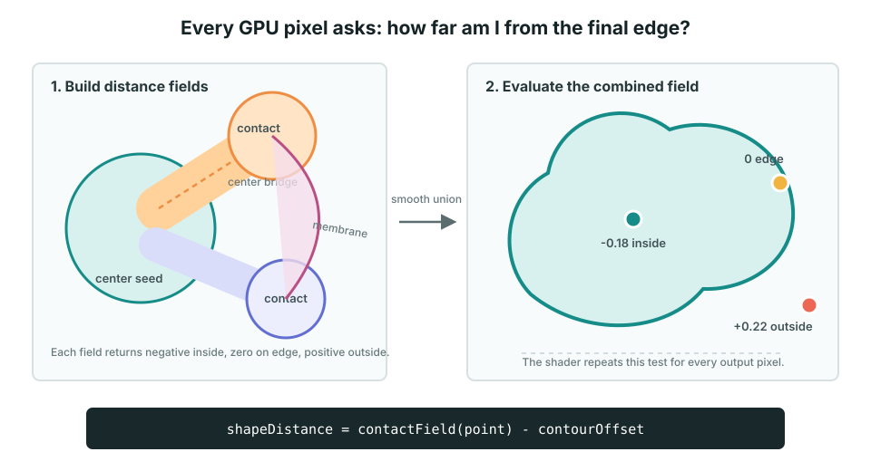
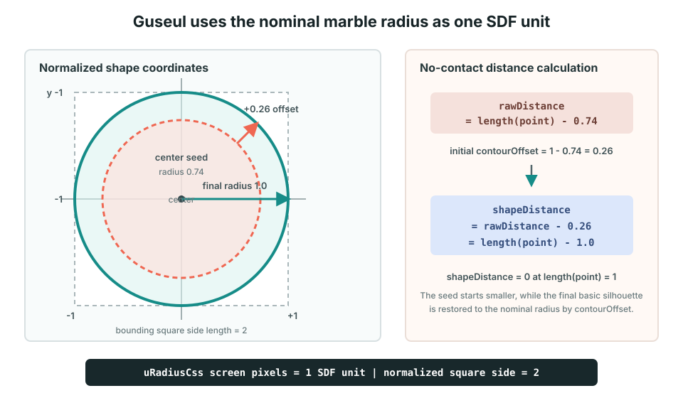
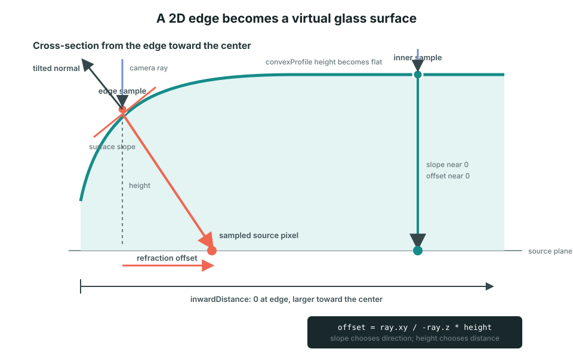

# Guseul Surface and Refraction

이 문서는 Guseul이 polygon mesh 없이 탄성 외곽선과 유리 굴절을 만드는 실제 구현을 설명한다. 다른 프로젝트에도 적용할 수 있는 일반 원리는 [`SDF Glass Rendering`](../../concepts/sdf-glass-rendering.md)에 분리했다.

```text
화면 픽셀
  -> shapeDistance로 안과 밖 판정
  -> inwardDistance와 edgeNormal 계산
  -> convexProfile로 유리 단면 생성
  -> surfaceSample로 slope와 height 조립
  -> 굴절된 source 위치에서 사진 색상 읽기
```

전체 코드 구조는 [`Guseul Architecture`](./architecture.md)를 먼저 참고한다.

## 1. GPU가 픽셀마다 shapeDistance를 계산한다



Guseul은 외곽선을 polygon으로 먼저 만든 뒤 내부를 채우지 않는다. 화면을 덮는 WebGL 삼각형 하나를 그리고, fragment shader가 출력 픽셀마다 같은 거리 수식을 실행한다.

먼저 화면 픽셀을 구슬 중심과 반지름 기준의 정규화 좌표로 바꾼다.

```glsl
vec2 point = (pixelCss - uCenterCss) / uRadiusCss;
```



여기서 좌표계의 `1`은 사각형 한 변이 아니라 화면의 명목상 구슬 반지름 `view.radius`다. `uRadiusCss`에 이 값이 전달된다.

```text
point = (0, 0)   구슬 중심
point = (1, 0)   기본 구슬의 오른쪽 경계
point = (0, -1)  기본 구슬의 위쪽 경계
```

따라서 기본 구슬을 감싸는 정규화 사각형은 x와 y가 각각 `-1~1`이고 한 변의 길이는 `2`다.

```text
화면 반지름 view.radius = 100px인 예

화면 100px = SDF 거리 1
화면  50px = SDF 거리 0.5
화면   1px = SDF 거리 0.01
```

이 좌표 단위는 contact로 외곽선이 늘어나도 바뀌지 않는다. Contact 위치가 `(2, 0)`이면 구슬 중심에서 명목상 반지름 두 배만큼 오른쪽이라는 의미다.

이제 각 픽셀은 `contactField(point)`를 호출해 자신이 최종 외곽선에서 얼마나 떨어져 있는지 계산한다.

## 2. 가장 먼저 center seed 거리를 구한다

원 하나의 signed distance는 다음과 같다.

```text
circleDistance = length(point - center) - radius
```

Center seed의 중심은 항상 `(0, 0)`이므로 더 단순하다.

```glsl
float distanceToShape = length(point) - uContactRadius;
```

현재 `uContactRadius`에 전달되는 기본 `seedRadiusScale`은 `0.74`다. 따라서 보정 전 center seed 경계는 `length(point) = 0.74`에 있다.

```text
rawDistance = length(point) - 0.74
```

Contact가 없는 초기 `contourOffset`은 `1 - seedRadiusScale`로 설정한다.

```text
contourOffset = 1 - 0.74
              = 0.26
```

최종 shader 거리는 raw distance에서 이 offset을 뺀다.

```text
shapeDistance
= rawDistance - contourOffset
= length(point) - 0.74 - 0.26
= length(point) - 1.0
```

그래서 center seed 자체는 반지름 `0.74`지만, contact가 없는 최종 기본 외곽선은 반지름 `1`이 된다.

```text
SDF 좌표계의 1
  = view.radius만큼의 화면 거리

center seed 반지름
  = 0.74

초기 contour offset
  = 0.26

최종 기본 구슬 반지름
  = 1.0
```

Center seed를 작게 시작하는 이유는 contact, bridge, membrane이 추가될 공간을 남기고 면적 보정으로 최종 크기를 조절하기 위해서다. Contact가 움직일 때 `contourOffset`도 면적 보정 결과에 따라 변하지만 좌표계에서 `1 = view.radius`라는 기준은 유지된다.

결과의 부호는 다음 의미다.

```text
distance < 0  원 내부
distance = 0  원 경계
distance > 0  원 외부
```

## 3. Contact와 bridge 거리장을 합친다

각 손가락 contact는 원 하나를 만든다.

```glsl
float pointDistance = length(position - contact.xy) - contact.z;
```

중심에서 contact까지 이어지는 bridge는 선분과 현재 픽셀 사이 거리에서 bridge 반지름을 뺀 capsule SDF다.

```glsl
float bridgeDistance = distanceToSegment(position, center, contact.xy)
  - bridgeRadius;
```

Contact 원과 bridge를 `smoothMinimum()`으로 합치면 하나의 부드러운 가지가 된다.

```glsl
float branchDistance = smoothMinimum(
  pointDistance,
  bridgeDistance,
  fieldSmoothness
);
```

그 가지를 다시 center seed와 합친다. Contact가 여러 개면 같은 과정을 반복한다.

## 4. Contact membrane을 합친다

여러 contact 사이에는 membrane link가 생긴다. 기본 link는 두 contact 사이 capsule이고, 넓은 영역을 채워야 할 때는 중심과 두 contact가 만드는 triangle 및 curved fan edge도 계산한다.

```text
center seed
  + contact circles
  + center bridges
  + contact membrane links
  + curved fan fills
  -> smooth union
  -> rawDistance
```

구현은 [`contactField()`](../../../pages/guseul/webgl-renderer.ts#L232)에 있다.

## 5. 면적 보정으로 shapeDistance를 완성한다

`contactField()`의 결과는 면적 보정 전 거리인 `rawDistance`다. CPU가 계산한 `contourOffset`을 적용하면 최종 `shapeDistance`가 된다.

```glsl
float rawDistance = contactField(point);
float shapeDistance = rawDistance - uContourOffset;
```

양수 offset을 빼면 더 많은 픽셀이 음수가 되므로 외곽선이 바깥으로 이동한다.

```text
rawDistance = 0.03
contourOffset = 0.05
shapeDistance = -0.02

원래는 외부였지만 보정 후 내부가 됨
```

최종 부호는 다음처럼 사용한다.

```text
shapeDistance < 0  구슬 내부
shapeDistance = 0  최종 외곽선
shapeDistance > 0  구슬 외부
```

`fwidth(shapeDistance)`는 픽셀 크기에 맞는 antialias 폭을 만든다. 완전히 외부인 픽셀은 투명하게 끝나고 내부 픽셀만 유리 계산을 계속한다. Fullscreen triangle을 사용하는 이유와 `fwidth()` 및 `smoothstep()`의 antialias 과정은 [`SDF Glass Rendering`](../../concepts/sdf-glass-rendering.md#3-gpu는-출력-픽셀마다-같은-질문을-한다)에 설명한다.

## 6. CPU에도 같은 거리 함수가 있는 이유

CPU의 `rawShapeDistance()`와 GPU의 `contactField()`는 같은 모양 수식을 구현한다. 역할은 다르다.

```text
CPU rawShapeDistance()
  -> 일부 지점만 검사
  -> 76x76 면적 측정
  -> contour offset 탐색
  -> spec warp cage 추출

GPU contactField()
  -> 최종 화면의 모든 픽셀에서 실행
  -> 실제 silhouette, normal, glass 렌더링
```

CPU는 보조 데이터를 만들고 GPU는 최종 이미지를 그린다. 두 구현의 수식이 달라지면 CPU가 예상한 외곽선과 GPU가 그린 외곽선이 어긋나므로 함께 유지해야 한다.

## 7. inwardDistance는 외곽선 안쪽 깊이다

최종 `shapeDistance`의 부호를 반대로 바꾸면 내부 깊이가 된다.

```glsl
float inwardDistance = max(-shapeDistance, 0.0);
```

```text
shapeDistance =  0.10  외부 -> inwardDistance = 0
shapeDistance =  0.00  경계 -> inwardDistance = 0
shapeDistance = -0.08  내부 -> inwardDistance = 0.08
shapeDistance = -0.40  깊은 내부 -> inwardDistance = 0.40
```

구슬 반지름이 `1`인 좌표계이므로 `0.1`은 반지름의 약 10%에 해당한다. Smooth union 영역에서는 완벽한 유클리드 거리와 조금 다를 수 있지만, 외곽선 근처의 단면과 antialias를 계산하기에는 연속적인 깊이값을 제공한다.

## 8. edgeNormal은 현재 외곽선의 방향이다

GPU는 인접 픽셀의 `rawDistance` 변화량을 화면 미분으로 구한다.

```glsl
vec2 derivative = vec2(dFdx(rawDistance), -dFdy(rawDistance));
vec2 edgeNormal = normalize(derivative);
```

SDF 값이 가장 빠르게 증가하는 방향은 외곽선에 수직이다. 따라서 이 normal은 기본 원 중심에서 뻗는 radial vector가 아니라, 늘어나거나 오목해진 **현재 외곽선에 수직인 방향**이다.

## 9. convexProfile은 유리의 볼록한 단면이다



`convexProfile(progress)`는 외곽선에서 안쪽으로 이동할 때 유리 표면이 얼마나 높고 가파른지 계산한다.

```glsl
float u = 1.0 - clamp(progress, 0.0, 1.0);
float inside = max(1.0 - pow(u, 4.0), 0.0001);
float height = sqrt(inside);
float derivative = 2.0 * pow(u, 3.0) / sqrt(inside);
```

함수의 반환값은 다음 두 숫자다.

```text
profile.x = 단면 높이
profile.y = 단면 기울기
```

```text
외곽선 progress 0
  -> 낮은 profile height
  -> 매우 큰 slope

bezel 안쪽 progress 1
  -> 최대 profile height
  -> slope 0, 평평한 표면
```

이것은 물리적으로 정확한 구의 단면이 아니라, 외곽선에서 빠르게 솟고 내부에서 평평해지는 스타일화된 렌즈 단면이다.

## 10. surfaceSample은 단면을 현재 외곽선에 붙인다

`surfaceSample()`은 먼저 `inwardDistance`를 `bezelWidth` 안의 0~1 진행도로 바꾼다.

```glsl
float progress = clamp(inwardDistance / bezelWidth, 0.0, 1.0);
vec2 profile = convexProfile(progress);
```

`convexProfile()`은 기울기의 크기만 반환한다. `edgeNormal`을 곱하면 현재 외곽선에 맞는 x/y 방향이 생긴다.

```glsl
vec2 slope = edgeNormal * profile.y;
```

유리 높이는 기본 두께와 볼록 단면 높이를 합친 뒤 전체 displacement 배율을 적용한다.

```glsl
float height = (thickness + bevelHeight) * displacementFactor;
```

마지막 반환값은 실제 3D 위치가 아니라 slope와 height를 하나의 `vec3`에 묶은 값이다.

```glsl
return vec3(slope, height);
```

```text
surface.x = 표면의 x 방향 기울기
surface.y = 표면의 y 방향 기울기
surface.z = 광선이 통과할 유리 높이
```

구현은 [`surfaceSample()`](../../../pages/guseul/webgl-renderer.ts#L301)에 있다.

## 11. 기울기와 높이로 굴절을 계산한다

기울기는 표면 normal의 방향을 결정한다.

```glsl
vec3 normal = normalize(vec3(surface.xy, 1.0));
```

평평한 내부에서는 `surface.xy`가 0에 가까워 normal이 카메라를 향한다. 외곽선에서는 slope가 커져 normal이 옆으로 크게 기울어진다.

`refractCameraRay()`은 normal과 IOR로 굴절된 광선 방향을 계산한다. `rayDisplacement()`는 광선이 유리 높이만큼 진행했을 때 source 평면에서 옆으로 얼마나 이동했는지 구한다.

`normalize()`와 GLSL `refract()`의 입력 벡터 및 Snell 법칙은 공통 문서 [`SDF Glass Rendering`](../../concepts/sdf-glass-rendering.md#8-기울기와-높이가-texture-굴절을-만든다)에 설명한다. Guseul의 `refractCameraRay()`는 고정된 camera ray에 맞춰 같은 계산을 직접 풀어 쓴 버전이다.

```glsl
vec3 ray = refractCameraRay(surface.xy, ior);
vec2 offset = ray.xy / max(-ray.z, 0.0001) * surface.z;
```

역할을 나누면 다음과 같다.

```text
surface.xy slope
  -> 광선이 어느 방향으로 꺾이는가

IOR
  -> 굴절 강도가 얼마나 큰가

surface.z height
  -> 꺾인 광선이 옆으로 얼마나 멀리 이동하는가
```

Shader는 현재 위치가 아니라 이동한 위치에서 source 사진을 읽는다.

```glsl
vec2 sourcePoint = point + offset;
vec3 color = sampleContent(sourcePoint).rgb;
```

그래서 사진 픽셀이 외곽선에서 휘고 늘어난 것처럼 보인다.

## 12. Chromatic separation도 같은 표면을 사용한다

빨강, 기본, 파랑 광선은 같은 slope와 height를 사용하고 IOR만 조금 다르게 계산한다.

```text
red ray  = IOR + dispersion
base ray = IOR
blue ray = IOR - dispersion
```

채널마다 source offset이 달라져 사진 경계와 구슬 가장자리에서 RGB가 분리된다. 별도 radial 색상 효과가 아니라 기본 굴절과 같은 광학 경로에서 나온다.

## 13. 핵심 요약

```text
contactField(point)
  -> rawDistance

rawDistance - contourOffset
  -> shapeDistance

max(-shapeDistance, 0)
  -> inwardDistance

convexProfile(inwardDistance / bezelWidth)
  -> profile height + slope magnitude

surfaceSample(inwardDistance, edgeNormal)
  -> directed slope + glass height

refractCameraRay() + rayDisplacement()
  -> source offset

sampleContent(point + offset)
  -> 최종 굴절 색상
```

핵심은 2D 외곽선 위에 3D mesh를 만드는 것이 아니라, **각 픽셀에서 거리, 기울기, 높이를 수식으로 만들어 가상의 유리 표면처럼 사용하는 것**이다.
