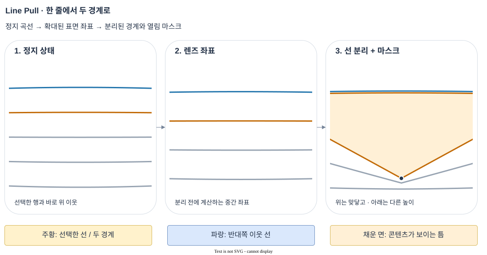
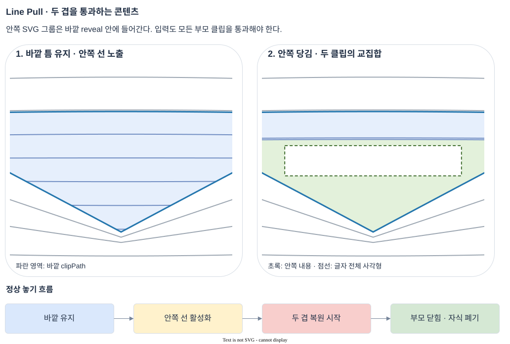

# Line Pull 아키텍처

Line Pull은 가로줄을 당겨 숨겨진 문구나 안쪽 선 표면을 여는 SVG 작품이다. 천의 질량·충돌을 계산하지 않는다. **포인터가 선택한 한 줄을 두 경계로 나누고, 그 사이를 열림 마스크로 사용한다.** 주변 선의 확대·꺾임은 좌표 함수로, 놓은 뒤 복원만 감쇠 스프링으로 계산한다.

이 문서는 현재 코드의 입력 → 중간 상태 → 렌더 단계 → 출력 → 검증을 설명한다. 원하는 동작의 기준은 [인터랙션 스펙](../../../pages/line-pull/spec.md), 정적 공유 카드 제작은 [공유 이미지 문서](./social-share-image.md)에서 별도로 다룬다.

## 코드 지도

| 파일 | 입력 → 출력과 책임 |
| --- | --- |
| [`index.html`](../../../pages/line-pull/index.html), [`style.css`](../../../pages/line-pull/style.css) | SVG·clipPath·텍스트·질감 요소와 폰트·선 스타일 |
| [`script.ts`](../../../pages/line-pull/script.ts) | 포인터 이벤트 → 겹 선택·당김 상태 → DOM 갱신. 초기화와 자식 겹의 생성·폐기도 담당 |
| [`geometry.ts`](../../../pages/line-pull/geometry.ts) | 표면·당김 값 → 곡선 교점, 확대 좌표, 위·아래 경계, SVG path |
| [`layers.ts`](../../../pages/line-pull/layers.ts) | 행·깊이·열림 다각형 → 콘텐츠, 입력 가능 영역, 유지 여부, 상위 겹 동시 복원 |
| [`copy-fit.ts`](../../../pages/line-pull/copy-fit.ts) | 원하는 글자 배치·폰트 치수·클립 → 실제로 들어가는 글자 크기와 세로 위치 |
| [`frame-loop.ts`](../../../pages/line-pull/frame-loop.ts) | 갱신 요청 → 하나의 예약 프레임. 움직임이 끝나면 다음 프레임을 예약하지 않음 |
| [`palette.ts`](../../../pages/line-pull/palette.ts) | 선 활성화 횟수 → 해당 겹이 유지할 패널·문자 색 조합 |
| [`generate-line-pull-texture.mjs`](../../../scripts/generate-line-pull-texture.mjs) | 오프라인 원본 질감 → 화면 밀도별 RGBA WebP 타일 |

## 1. 입력: 먼저 어느 겹의 어떤 선인지 정한다

### 1.1 좌표계와 초기 선 배열

`resize()`는 stage 크기를 읽어 SVG의 `viewBox`, `width`, `height`를 같은 값으로 맞춘다. 이후 기하 계산은 모두 **stage 기준 CSS px**, 오른쪽이 +X, 아래가 +Y다. SVG 전체에 확대 transform을 적용하지 않는다.

- `localPoint()`는 `clientX/Y`에서 stage의 좌상단을 뺀다. X는 `[0, width]`로 제한하지만 Y는 제한하지 않는다.
- `lineRows()`는 `baseY = phase + row × lineGap`으로 행을 만든다. 화면 위아래에 약 세 줄 간격의 여유분을 둔다. 당김 높이에 고정 제한은 없지만 선 배열 자체가 무한한 것은 아니다.
- 바깥 간격은 56px, 안쪽은 `max(32, 56 × 0.86) = 48.16px`이다. 바깥 시작 위상은 `56 × 0.56`, 안쪽 위상은 자신을 연 선의 `originY + 안쪽 간격 × 0.56`이다.
- 화면 밀도는 질감 파일 선택에만 관여한다. 포인터·선·clipPath에 DPR을 다시 곱하지 않는다.

`restY()`는 기준 행 높이 `baseY`를 약간 휘어진 선의 높이로 바꾼다. 화면 중앙에서 멀어질수록 높이가 화면의 세로 중앙 쪽으로 조금 모인다. 따라서 선을 잡거나 복원할 때 평평한 `baseY`와 실제 `restY(x, baseY)`를 구분해야 한다.

### 1.2 직접 잡기와 줄 사이에서 시작하기

`onPointerDown()`은 primary 포인터 하나만 소유한다. 마우스는 왼쪽 버튼만 받는다. `pickLayer()`는 **열린 상태로 유지된 부모의 실제 다각형 안**일 때만 자식으로 내려간다. 부모 경계에 너무 가까운 점은 제외한다.

선 위에서 시작하면 `lineAt()`가 같은 X의 정지 곡선 높이를 비교한다. 세로 거리 허용치는 `max(8, 선 두께 × 2)`이며, 가장 가까운 보이는 선을 고른다. `grabOffsetY`에 포인터와 선의 간격을 보관해 활성화 순간 선이 포인터로 튀지 않게 한다.

줄 사이에서 시작하면 `originIndex = null`로 기다린다. 이때 포인터를 잡고 있어도 열림·렌즈는 아직 없다. `onPointerMove()`가 이전 입력점부터 현재 입력점까지의 선분을 검사한다.

1. `crossingTimes()`는 포인터 선분과 각 정지 곡선의 교차 시점 `t`를 구한다. `t = 0`은 이전 점, `t = 1`은 현재 점이다.
2. 정지 곡선이 X의 이차식이므로, 선분 시작·중간·끝의 높이 차이로 이차식을 복원하고 근을 계산한다. 거의 일차식이면 일차식으로 처리한다.
3. `firstCrossing()`은 `0 < t ≤ 1`인 근 중 모든 부모 클립 안에서 보이는 가장 이른 교점을 고른다. 한 곡선의 첫 교점이 가려져도 두 번째 교점을 버리지 않는다.
4. `activate()`가 그 선에 콘텐츠와 색을 배정한다. 이후 목표 Y는 현재 포인터 위치를 사용한다. 빠른 이동으로 교점에서 멀리 지나갔어도 지나간 거리를 잃지 않는다.

직접 잡기와 교차 검사 모두 `visibleInLayer()`를 거친다. 보이지 않는 자식 선을 잡는 문제를 막기 위해 시각적 클리핑뿐 아니라 입력에도 같은 부모 영역을 적용한다.

## 2. 중간 상태: 포인터 소유권과 열린 모양은 별개다

`Layer`는 바깥 `depth = 0`과 선택적으로 생성되는 안쪽 `depth = 1`로 구성된다. `MAX_LAYERS = 2`는 콘텐츠 배치에서 세 번째 겹 생성을 막는다. 모든 칸에 미리 자식 DOM을 만들지 않고, 실제로 연 중첩 칸에만 자식 하나를 만든다.

| 상태 | 의미와 갱신 시점 |
| --- | --- |
| `pointerLayer` | 현재 포인터를 소유한 겹. 놓는 순간 먼저 `null`로 변경 |
| `pull.originIndex` | `null`이면 첫 교차 대기, 숫자이면 선택한 선 배열의 index |
| `originY`, `apexX/Y` | 기준 행과 화면에 그릴 당김 꼭짓점. X는 입력을 즉시 따르고 Y는 목표를 추종 |
| `targetY`, `grabOffsetY` | 입력이 요구하는 Y와 직접 잡기 오차. `targetY = pointerY - grabOffsetY` |
| `returning`, `velocityY` | 놓은 뒤 스프링 복원 여부와 속도 |
| `pinned` | 포인터가 없어도 첫 번째 중첩 틈을 유지하는 상태. 남은 Y 추종은 끝까지 진행될 수 있음 |
| `polygon` | 현재 위·아래 경계를 이은 열림 영역. 마스크·입력·글자 배치에 재사용 |
| `copyBounds` | 실제 폰트의 전체 글자 치수를 글자 크기 1 기준으로 저장한 값 |
| `dirty` | 해당 겹의 SVG를 다시 계산해야 하는지 여부 |
| `theme`, `parent`, `child` | 겹별 색과 열린 경로. 부모 색은 안쪽 활성화로 덮어쓰지 않음 |

DOM의 `data-state`는 `closed/open/returning/dragging`을 표시한다. 내부적으로는 `dragging` 안에 첫 교차 대기와 활성 당김이 있으므로, 이 속성 하나만 보고 선이 이미 선택됐다고 판단하면 안 된다.

### 2.1 콘텐츠와 색의 배정

`messageForSlot()`은 행의 정규화된 나머지 `((row % 3) + 3) % 3`을 사용한다. 음수 행에서도 배치가 반복된다.

| 겹 | 행 구분 | 내용 |
| --- | --- | --- |
| 바깥 | 나머지 0 | 안녕하세요 |
| 바깥 | 나머지 1 | 안쪽 선 표면. 이때 이름 문구는 없음 |
| 바깥 | 나머지 2 | 잘부탁드립니다 |
| 안쪽 | 모든 행 | 이지원입니다 |

문구는 칸에 고정되고, 색은 `activate()` 호출마다 빨강 → 애시드 옐로 → 코발트 블루 → 라일락 → 민트로 순환한다. 아직 선을 만나지 않은 포인터 입력은 순서를 넘기지 않는다. 선택한 색은 `layer.theme`에 복사되어 해당 당김과 복원 동안 유지된다.

### 2.2 놓기·유지·취소

`releasePointer()`는 마지막 `polygon` 캐시에만 의존하지 않고 현재 꼭짓점으로 영역을 다시 계산한다. 이동과 놓기가 같은 프레임에 들어오는 경우에도 유지 여부를 판단하기 위해서다.

| 상황 | 결과 |
| --- | --- |
| 바깥 중첩 칸을 충분히 열고 정상적으로 놓음 | `pinned = true`. 안쪽 선을 다시 잡을 수 있음 |
| 바깥 일반 문구 칸 또는 작게 연 중첩 칸을 놓음 | 해당 겹 복원 |
| 안쪽에서 선을 활성화한 뒤 정상적으로 놓음 | `returnLayerChain()`이 안쪽과 부모의 복원을 함께 시작 |
| 선을 만나지 않고 놓음 | 해당 대기 상태 제거. 기존 부모 틈은 유지 |
| 안쪽 드래그가 취소됨 | 활성 안쪽 겹만 복원. 부모 틈은 유지 |
| 열린 틈 밖을 누름 / 복원 중 다시 누름 | 선택한 표면을 정리하고 새 드래그 시작. 입력 잠금 시간 없음 |
| 드래그 중 Escape | 현재 드래그 즉시 취소 |
| 유지된 틈에서 Escape | 자식 당김을 정리하고 유지 중인 부모를 복원 |
| resize | 포인터와 자식 겹을 정리하고 새 크기로 바깥 선 재생성 |

유지 조건은 꼭짓점 X에서 **화면과 모든 부모 클립을 통과한 세로 높이 ≥ 안쪽 간격 × 2.2**다. 기본값에서는 약 106px이다. 단순한 포인터 이동 거리나 열림 영역의 bounding box 높이로 판단하지 않는다.

두 겹의 복원은 같은 프레임에 시작하지만 같은 순간에 끝난다는 보장은 없다. 부모가 먼저 닫히면 `clearPull()`이 자식 그룹과 clipPath까지 제거한다. 복원 중 재입력도 기존 변형을 그대로 이어 잡는 방식은 아니며, 선택한 표면을 정리하고 새 당김을 시작한다.

`pointercancel`, `lostpointercapture`, 창의 `blur`는 정상 놓기와 구분한다. 포인터 소유권과 ID를 먼저 해제한 뒤 브라우저의 pointer capture를 반환하므로, 뒤따르는 `lostpointercapture`가 복원을 중복 시작하지 않는다.

## 3. 렌더 단계: 움직임 갱신 → 기하 계산 → 마스크와 글자 → 합성

여기서 렌더 단계는 CPU와 SVG DOM 갱신의 순서다. 별도의 WebGL render target이나 후처리 셰이더 패스가 아니다.

### 3.1 하나의 프레임 루프

포인터 이벤트는 입력 상태를 갱신하고 `render()`를 호출한다. `createFrameLoop()`의 `pending`이 중복 요청을 합쳐 같은 프레임에 `animate()`를 한 번 실행한다. 이벤트 시점의 교점 검사·자식 생성·폰트 측정까지 전부 프레임 안으로 미루는 것은 아니다.

`animate(dt)`는 `advanceLayer(root, dt)`로 당김 상태를 진행시킨 후 `renderFrame()`을 호출한다. 추종이나 복원이 남아 있을 때만 다음 프레임을 예약한다. `dt`는 초 단위이고 최대 0.064초다. 대기에서 다시 깨어날 때 기준 시각을 새로 잡아 긴 idle 시간을 스프링에 넣지 않는다.

당기는 동안 Y는 다음 비율만큼 목표에 접근한다.

```text
alpha = 1 - exp(-followSpeed × dt)
apexY += (targetY - apexY) × alpha
```

`alpha`는 한 프레임 동안 따라갈 비율이며 기본 `followSpeed = 32`다. 시간이 길수록 더 많이 따라가므로 프레임 수 자체에 고정된 보간보다 시간 변화에 대응한다. 목표와의 차이가 0.001px 이하이면 추가 추종을 멈춘다.

복원은 `restY(apexX, originY)`를 목표로 한다. 변위에 비례하는 힘(`returnStiffness = 205`)과 속도 반대 방향의 감쇠(`returnDamping = 24`)를 적용한다. `ceil(dt × 120)`개의 작은 시간 간격으로 나눠 속도를 먼저, 위치를 다음에 갱신한다. 정지선을 넘어가거나 위치 오차 0.12px·속도 0.5px/s 미만이면 닫는다. 정지선을 넘어 반대쪽 틈이 열리는 진동을 막는 종료 조건이다.

`prefers-reduced-motion`에서는 포인터 Y를 즉시 반영하고 복원 애니메이션을 생략한다. 중첩 칸의 유지·두 번째 겹 조작은 남으며, 활성 안쪽 선을 정상적으로 놓으면 바깥까지 즉시 닫힌다.

### 3.2 확대된 표면과 갈라진 경계



도식은 실제 `geometry.ts` 함수로 만든 설명용 장면이다. 320×300 좌표계에서 `originY = 112`, 꼭짓점 `(160, 260)`, 기본 기하 파라미터를 사용하고 선 다섯 개만 발췌했다. 가운데는 **분리 전 계산 좌표**이지 사용자에게 따로 표시되는 프레임이 아니다. 주황색은 선택한 선과 그 두 경계, 파란색은 바로 위 이웃 선이다.

먼저 `pullDelta = apexY - restY(apexX, originY)`로 정지선에서 얼마나 당겼는지 구한다. 그 절댓값을 `d`, 방향을 `s`, 선 간격을 `g`라고 하면 렌즈 진행률은 다음과 같다.

```text
L = 1 - exp(-d / (1.35 × g))
```

`L`은 0에서 시작해 1에 가까워진다. `d`가 커져도 다시 작아지지 않으므로 당기다 축소되는 현상이 없다. `surfacePoint()`는 활성 행에서 반대 방향으로 두 줄 떨어진 곡선을 세로 확대의 기준으로 삼는다. 세로는 `1 + lensStrength × L`, 가로는 꼭짓점 X를 기준으로 `1 + horizontalLens × L` 배율을 사용한다. 기본 상한은 각각 1.20배와 1.27배다.

이는 국소 원형 렌즈로 배경을 샘플링하는 굴절 효과가 아니다. 현재 겹의 선 좌표 전체에 적용하는 기하 변형이며, 확대 기준이 포인터 Y를 따라 계속 멀어지지 않도록 설계된 시각적 모델이다.

### 3.3 위쪽은 이웃 선의 가장자리에 붙인다

`boundaryPoint()`는 확대된 원래 행에서 반대쪽 이웃 행으로 접근한다. 접근 진행률은 `1 - exp(-d / (g × boundaryEase))`다. 짧게 당길 때 빠르게 벌어지고 길게 당길수록 이웃 선 가까이 포화된다.

이웃 선의 중심선에 그대로 붙이면 두 선이 겹쳐 한 줄 두께로 보인다. 그래서 이웃의 **가장자리**가 만나는 위치를 목표로 삼는다. 선 두께를 `w`, 현재 이웃 곡선의 기울기를 `m`이라 할 때, 같은 X에서 필요한 세로 중심선 간격은 다음과 같다.

```text
verticalSeparation = w × sqrt(1 + m²)
```

세로 간격을 `sqrt(1 + m²)`로 나누면 국소 접선에 수직인 간격이 된다. 따라서 이 값을 사용하면 국소 법선 방향에서 중심선 사이에 `w`를 남길 수 있다. 평평한 부분의 기본 3px 선 두 개는 약 6px 두께로 이어진다. 곡선 전체를 정확히 법선 offset한 곡선을 구성하는 것이 아니라 **같은 X의 국소 기울기로 간격을 보정**한다.

추가 이동량은 `g × boundaryCreep × log(1 + d / g)`다. 위쪽 경계와 그 위 이웃 선에 같은 양을 적용해 맞닿음을 유지한다. 로그이므로 추가 이동은 계속 커지되 증가 속도가 줄어든다. 완전히 멈추는 고정 상한은 아니다.

### 3.4 아래쪽 꼭짓점은 하나로 뭉치지 않는다

`linePoint()`는 당김 방향의 각 행에 서로 다른 이동량을 준다. `opening().distance`는 확대된 활성 행에서 꼭짓점까지의 방향성 거리다. 정지선 기준의 `d`와는 다른 중간값이다.

- 선택한 행부터 해당 행까지 확대된 간격이 클수록 꺾임이 늦게 시작된다.
- 양 끝에서 작고 꼭짓점 X에서 1인 삼각형 가중치 `tent`가 꺾임의 위치를 정한다.
- `softPositive()`는 선이 당김 범위에 들어오는 경계에서 직선적인 `max(0, value)` 대신 작은 이차 구간을 사용한다. 새 행의 합류 순간 기울기가 급변하는 것을 줄인다.
- `apexSpacing = 0.16`은 충분히 끌려온 인접 행의 확대 간격 중 남길 비율이다. 기본 렌즈 상한에서 간격은 대략 `56 × 1.20 × 0.16 = 10.75px`다.

모든 꼭짓점의 X는 같아도 Y는 다르다. 선택한 행의 주 꼭짓점은 `apexX/Y`에 놓이며, 주변 선은 그 아래에 서로 다른 높이로 남는다. 위로 당길 때는 `s`가 바뀌어 같은 계산이 반전된다.

### 3.5 같은 좌표로 선과 마스크를 만든다

`sampleXs()`는 가로 약 28px마다 표본을 두되 최소 24구간을 사용하고, 꼭짓점 X를 반드시 추가한다. `pointsPath()`는 점들을 소수점 두 자리의 `M/L` 명령으로 잇는다. 연속 곡선 함수를 유한 개의 직선 구간으로 표시하는 근사다.

`renderLayer()`의 dirty 겹에서는 다음 값을 갱신한다.

1. 선 배열 중 선택한 행의 path는 `boundaryPoint()`로 바꾸고, 나머지 행은 `linePoint()`로 그린다.
2. 선택한 행의 아래 경계는 별도의 `origin` path에 그린다. 원래 정지 좌표에 세 번째 선을 추가하는 구조가 아니다.
3. 위 경계를 왼쪽→오른쪽으로, 아래 경계를 오른쪽→왼쪽으로 이어 `polygon`을 닫는다.
4. 같은 polygon을 `clipPath`에 넣어 그 사이의 패널·문구·자식 표면만 보이게 한다.

즉, 선의 겉모양과 콘텐츠가 보이는 틈을 서로 다른 수식으로 맞추지 않는다. 같은 경계 표본을 재사용한다. 다만 화면 path는 소수점 두 자리로 반올림하고 입력·배치용 polygon은 반올림 전 값을 유지하므로 극미한 차이는 있다.

### 3.6 두 겹은 실제 DOM 중첩으로 잘린다



`createView()`는 자식의 SVG 그룹을 부모 `reveal` 안에 넣는다. 부모 reveal 자체에 바깥 clipPath가 걸려 있고, 자식 reveal에는 안쪽 clipPath가 걸린다. 따라서 최종 안쪽 내용은 **바깥 틈 ∩ 안쪽 틈 ∩ 화면** 안에서만 보인다. 안쪽 path를 별도 화면 위에 얹고 사각형으로 가리는 방식이 아니다.

도식은 450×400 좌표에서 바깥 `(originY: 140, apex: 225/340)`, 안쪽 `(originY: 190, apex: 225/370)`을 사용한 설명용 장면이다. 왼쪽은 바깥을 열어 유지한 경우, 오른쪽은 안쪽까지 연 경우다. 오른쪽 점선은 실제 글리프가 아니라 `fitCopyInOpenings()`에 설명용 치수를 넣어 구한 **글자 전체 사각형**이다. 작품의 실제 글리프 치수는 브라우저에서 측정한다.

부모가 유지된 채 안쪽을 당길 때 부모 path는 dirty가 아니면 재계산하지 않는다. 안쪽 배경과 선의 색은 각각 자신의 `theme.panelColor`와 부모의 `theme.textColor`를 사용한다. 폰트 로드·디버그 변경처럼 부모를 dirty로 만드는 별도 변화가 있으면 부모도 다시 계산한다.

### 3.7 글자는 가운데에 두고 보이는 공간에 맞춘다

`activate()`는 선택된 문구로 `<tspan>`을 만든다. `measureCopy()`는 글자 크기 100에서 `getBBox()`를 한 번 읽고 100으로 나눈 치수를 저장한다. 폰트가 늦게 로드되면 열린 문구만 한 번 다시 측정한다. 정상 추종 프레임에서는 폰트 치수를 다시 읽지 않는다.

`copyLayout()`은 포인터 X 대신 `width / 2`에서 텍스트용 확대를 계산한다. 그래서 좌우 이동만으로 바깥 문구의 위치·크기가 바뀌지 않는다. `scaleX = 1`을 유지하고, 글자 크기 증가로 비율을 보존한 확대만 준다. 기본 크기는 화면 폭에 따라 64~190px, 렌즈에 따른 추가 배율은 최대 1.065다. 실제 최종 크기는 아래 fitting으로 더 작아질 수 있다.

`fitCopyInOpenings()`는 원하는 크기와 실제 glyph bounds를 받아 다음처럼 보정한다.

1. 후보 글자 크기에서 전체 글자 사각형의 좌우 끝과 여유 공간을 계산한다. 기본 여유는 `lineWidth × 2 + 6 = 12px`다.
2. 이 가로 구간을 지나는 polygon의 **모든 선분**을 조사한다. 글자 양 끝만 검사하면 가운데 솟은 경계에 글자가 잘릴 수 있기 때문이다.
3. 경계들의 가장 낮은 안전한 상한과 가장 높은 안전한 하한을 모아, 글자 사각형 전체가 들어갈 세로 범위를 구한다.
4. 16회 이분 탐색으로 원하는 크기 이하에서 들어가는 크기를 찾는다. 글자가 넓어질수록 안전한 공간이 커지지 않는다는 성질을 이용한다.
5. 세로 위치는 기존 배치에 가장 가까운 안전한 위치로 제한한다. 가로 중심은 고정한다. 중앙에 들어갈 공간이 없으면 크기를 0으로 둔다.

바깥 문구는 viewport만 fitting에 넣고 열림 마스크는 넣지 않는다. 그래야 당기는 동안 문구가 조금씩 드러난다. 안쪽 문구는 자기 틈과 모든 부모 틈도 함께 넣어, 충분히 열었을 때 이름 전체가 부모 경계에 잘리지 않게 한다. 안쪽에서는 포인터 X 변화로 클립 모양이 달라지므로 가로 중심은 같아도 크기·Y는 변할 수 있다.

## 4. 출력: SVG 위에 미리 구운 질감 한 장을 얹는다

한 겹의 SVG 내부 순서는 `reveal(배경·문구·자식)` → `origin(아래 경계)` → `field(위 경계를 포함한 선 배열)`이다. 자식 전체는 부모 reveal 안에 들어가므로 부모 선이 그 위에 그려진다. 그 위에 독립된 `.surface-grain` 요소 하나를 합성한다.

- 선은 `vector-effect: non-scaling-stroke`를 사용한다. 실제 확대는 좌표를 바꾸므로 선 두께를 중복 확대하지 않는다.
- 문구는 번들 Pretendard ExtraBold 800, 자간 `-0.065em`이다. 처음부터 preload하고, 실패하면 한국어 시스템 폰트 fallback으로 계속 조작할 수 있다.
- grain은 CSS `image-set()`으로 1x/2x/3x 중 하나를 선택해 384×360 CSS px 크기로 반복한다. 겹마다 질감을 추가하지 않는다.
- `renderFrame()`은 바깥 pull의 렌즈 진행률에 따라 질감 요소만 최대 1.05배 확대한다. 자식 pull은 별도의 grain transform을 만들지 않는다.

### 4.1 질감의 오프라인 처리

`generate-line-pull-texture.mjs`는 중립 회색 원본에서 주변 평균을 빼 미세 명암을 추출하고, 기본 multiply/screen 결과를 하나의 회색·알파 조합으로 환산한다. 여기에 좌표에 고정된 난수로 드문 밝은 입자와 약한 RGB 편차를 추가한다.

주변 평균 반경과 난수 셀은 CSS px에 맞춰 밀도별로 계산한다. 고밀도 파일만 크게 만들고 입자 크기를 줄이는 방식이 아니다. 밝은 입자에 필요한 알파는 높이되 기존 투과율을 보존해 문자에 검은 구멍이 생기는 것을 줄인다. 최종 RGB를 4/255 단계로 양자화하고 무손실 WebP로 저장한다.

`pnpm generate:line-pull-texture`를 실행할 때만 ffmpeg가 필요하다. 런타임은 저장된 타일 하나를 일반 알파 합성하므로 실시간 noise 생성·전체 화면 blur·SVG filter 패스가 없다. 단, 별도 보조 UI인 [touch-pointer](../../../common/touch-pointer.ts)는 작은 커서 그림에 drop-shadow를 사용한다. 작품 표면 필터와는 구분한다.

### 4.2 비용과 현재 한계

- dirty 겹의 선 개수를 `N`, 가로 표본 수를 `S`라고 하면 선 좌표·path 생성은 대략 `N × S`에 비례한다. 한 겹을 복원하거나 드래그할 때 그 겹의 모든 선을 갱신한다.
- 첫 교차 탐색은 생성된 행을 모두 검사한다. 열린 경로가 최대 두 겹이라 큰 scene graph를 유지하지 않는다.
- 부모 polygon·폰트 치수·질감 계산 결과를 재사용하고, idle 상태의 반복 프레임과 놓기 파동은 없다. 이것이 모든 기기에서 특정 FPS를 보장한다는 뜻은 아니다.
- 기하 모델은 봉제·접힘·굴절의 물리 법칙을 풀지 않는다. `boundaryEase`, `boundaryCreep`, `apexSpacing`은 레퍼런스의 모양을 맞추기 위한 경험적 파라미터다.
- 글자 fitting은 양쪽 경계가 X 방향으로 정렬된 현재 열림 다각형을 전제로 한다. 임의의 자기교차·다중 구멍 polygon을 처리하는 범용 레이아웃 엔진은 아니다.
- 접근성은 stage 설명과 reduced motion을 제공하지만, 현재 SVG는 `aria-hidden`이고 키보드로 선을 골라 여는 기능은 없다. 키보드 Escape 닫기만으로 전체 조작을 대체할 수는 없다.
- `?debug`에서 lil-gui를 표시해 값을 조절한다. 선 간격 변경은 선을 다시 만들고, 기하·선 두께 변경은 모델을 dirty로 만든다. 일반 화면에는 초기 안내·닫기 버튼·단계별 설명을 두지 않는다.

## 5. 검증: 수학 계약과 실제 입력 흐름을 나눠 확인한다

테스트는 모두 Vitest의 `.test.ts`이며 `pnpm typecheck`에도 포함된다.

| 테스트 | 보장하는 주요 계약 |
| --- | --- |
| [`geometry.test.ts`](../../../pages/line-pull/geometry.test.ts) | 위 경계 접근·두 줄 두께, 다른 높이의 꼭짓점, 임의 높이·가장자리, 단조 렌즈, 곡선 교차, 가운데 문구 |
| [`layers.test.ts`](../../../pages/line-pull/layers.test.ts) | 두 겹 제한·문구 배치·위상, 부모 영역 입력, 실제 보이는 유지 높이, 상위 겹 동시 복원 |
| [`copy-fit.test.ts`](../../../pages/line-pull/copy-fit.test.ts) | 글자 전체 포함, 중간 경계 극값·양 winding, 위로 당김·가장자리·모바일·보이지 않는 공간 |
| [`frame-loop.test.ts`](../../../pages/line-pull/frame-loop.test.ts) | 이벤트 폭주를 한 프레임으로 묶기, 스프링과 입력의 예약 공유, idle 시간 제외 |
| [`palette.test.ts`](../../../pages/line-pull/palette.test.ts), [`texture.test.ts`](../../../pages/line-pull/texture.test.ts) | 팔레트 순환·대비, 기존 합성 보존, 검은 바탕의 입자·색 편차·고밀도 일관성 |
| [`social-preview.test.ts`](../../../pages/line-pull/social-preview.test.ts) | 정적 공유 메타데이터·PNG 계약. 런타임 인터랙션 테스트와는 별개 |

```sh
pnpm test pages/line-pull
pnpm test
pnpm typecheck
pnpm build
```

순수 함수 테스트는 실제 브라우저의 pointer capture, SVG 폰트 측정, 렌더링 속도를 대신 검증하지 않는다. 동작을 바꿀 때는 기존 Chrome에서 아래 흐름을 별도로 확인한다.

1. 줄 사이에서 시작해 첫 선에 닿기 전에는 변형이 없는지, 빠른 대각선·수평 교차도 잡히는지 확인한다.
2. 짧고 긴 당김, 위로 당김, 좌우 끝, 화면 밖 Y, 복원 도중 즉시 재입력을 확인한다.
3. 중첩 틈을 유지한 후 두 번째로 당겨 이름 전체가 보이는지, 정상 놓기는 두 겹 복원·취소와 빈 틈 놓기는 부모 유지인지 확인한다.
4. resize, blur, 포인터 취소·캡처 해제, reduced motion과 폰트 지연 로딩을 확인한다.
5. 움직임이 끝나면 프레임이 멈추고 자식 그룹·clipPath가 남지 않는지 확인한다. FPS는 실제 기기에서 별도로 측정한다.

## 도식 원본

도식은 투명 SVG의 실제 기하를 draw.io 이미지 객체로 넣고, 제목·패널·설명은 draw.io에서 조립한 뒤 SVG로 export했다. 문서 그림의 색과 표본 행은 설명을 위한 것이며 작품 스크린샷은 아니다.

- 선 분리: [기하 SVG](../../assets/line-pull-opening-geometry.svg) · [draw.io 편집 원본](../../assets/line-pull-opening.drawio) · [완성 SVG](../../assets/line-pull-opening.svg)
- 중첩 클립: [기하 SVG](../../assets/line-pull-nesting-geometry.svg) · [draw.io 편집 원본](../../assets/line-pull-nesting.drawio) · [완성 SVG](../../assets/line-pull-nesting.svg)

`.drawio` 원본은 draw.io 앱·웹 또는 VS Code의 draw.io 확장에서 열 수 있다. 라벨은 더블 클릭해 편집하고 위치는 드래그로 옮긴다. 곡선 자체를 바꿀 때는 기하 SVG를 갱신해 이미지 객체에 다시 넣고, 편집 정보를 포함해 완성 SVG를 export한다.
