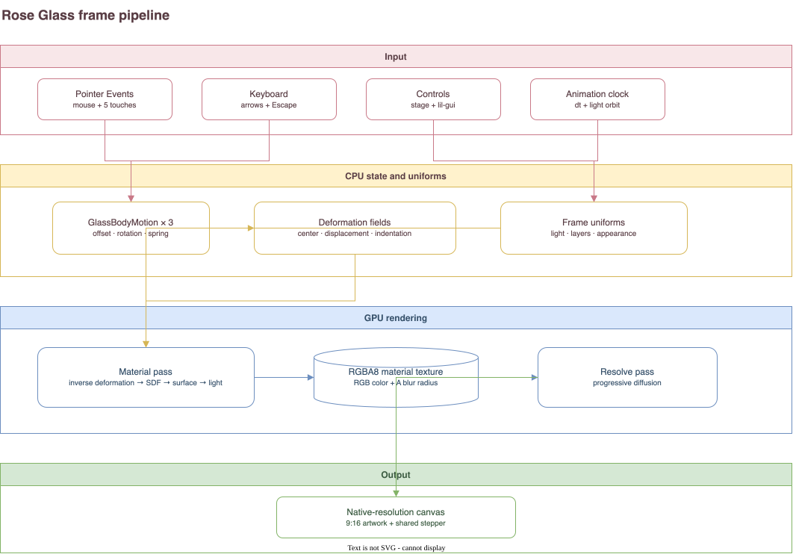

# Rose Glass 아키텍처

Rose Glass는 590 × 1280 기준 좌표계에 세 개의 반투명 유리 몸체를 해석적으로 만들고, 포인터 제약으로 표면을 변형한 뒤 WebGL 2의 두 렌더 패스로 출력한다. 이 문서는 현재 구현의 입력 → CPU 상태 → 변형 → GPU 렌더 패스 → 출력 → 검증 순서를 설명한다.



편집 원본은 [`rose-glass-frame-pipeline.drawio`](../../assets/rose-glass-frame-pipeline.drawio)다.

## 용어

| 표준 용어 | 의미 | 더 이상 쓰지 않는 표현 |
| --- | --- | --- |
| Rose Glass | 작품명, 공개 URL, 코드·문서 폴더에 공통으로 쓰는 이름 | Apple Glass Wallpaper |
| 유리 몸체 (`glass body`) | 각자 실루엣·재질·움직임을 갖는 세 형태 | pebble, 조약돌 |
| 위·아래·전경 유리 (`upper`, `lower`, `foreground`) | 화면에 그리는 순서와 역할이 드러나는 몸체 이름 | front, rear 0/1 |
| 기준점 (`canonical point`) | 변형되기 전 유리 재료 공간의 점 | material point만 단독으로 부르는 표현 |
| 화면점 (`scene point`) | 590 × 1280 작품 좌표계의 점 | CSS 좌표와 혼용한 point |
| 잡기 (`grip`) | 한 포인터가 한 몸체에 만드는 위치 제약 | contact |
| 변형장 (`deformation field`) | 중심·변위·눌림으로 구성된 국소 Gaussian 변형 | contact field |
| 변형 상태 (`deformation state`) | 한 몸체에 적용할 변형장 배열 | material state |
| 재질 패스 (`material pass`) | 색, 표면, 조명과 흐림 반경을 계산하는 첫 GPU 패스 | scene pass |
| 합성 패스 (`resolve pass`) | 재질 텍스처의 흐림 반경을 이용해 최종 픽셀을 만드는 두 번째 GPU 패스 | 후처리 전반을 뜻하는 모호한 표현 |
| 외곽 광학 (`edge optics`) | 두께에 따른 흡수·투과·progressive blur의 묶음 | 단순 border 또는 outline |

`rear`는 두 후경 몸체에 공통으로 적용하는 시각 파라미터(`rearAbsorption`, `rearBlur`)에만 쓴다. 몸체 자체를 가리킬 때는 `upper`와 `lower`로 구분한다.

## 파일 책임

| 파일 | 책임 |
| --- | --- |
| `pages/rose-glass/index.html` | 캔버스, 접근성 설명, 공유 Touch Pointer 진입점 |
| `pages/rose-glass/style.css` | 9:16 작품 영역, stepper와 오류 UI 배치 |
| `pages/rose-glass/script.ts` | WebGL 수명주기, 입력 연결, 프레임 루프, uniform packing, lil-gui |
| `pages/rose-glass/interaction.ts` | 세 `GlassBodyMotion`, 포인터 잡기, 탄성·감쇠, 다중 잡기 제약 |
| `pages/rose-glass/deformation.ts` | 몸체 형상, 순방향·역방향 변형, Jacobian, CPU/GLSL 공통 상수 |
| `pages/rose-glass/shader.ts` | 재질 패스와 합성 패스의 GLSL |
| `pages/rose-glass/presentation.ts` | 공유 stepper에 작품별 누적 렌더 레이어를 연결 |
| `common/touch-pointer.ts` | 작품별 구현을 만들지 않고 공통 포인터 시각화를 제공 |

## 1. 입력

### 포인터

브라우저의 Pointer Events를 마우스와 터치에 공통으로 쓴다. `scenePoint()`는 캔버스의 CSS 좌표를 다음 기준 공간으로 바꾼다.

- 기준 크기: 590 × 1280
- 기준 중심: `(295, 640)`
- 화면 비율이 달라도 작품 전체가 들어오도록 `min(width / 590, height / 1280)`을 사용

`pointerdown`에서는 그리기 순서의 역순인 전경 → 아래 → 위 순서로 hit test한다. 겹친 곳에서 눈에 보이는 앞쪽 몸체가 먼저 잡히게 하기 위해서다. 전체 작품은 최대 다섯 개의 활성 잡기를 공유한다. 포인터 하나는 한 몸체에만 속하지만, 서로 다른 몸체를 동시에 잡을 수 있다.

### 키보드와 제어 UI

- 방향키: 마지막으로 선택한 몸체를 작은 범위에서 이동
- `Escape`: 모든 몸체의 위치와 변형을 복원
- `D` 또는 `?debug`: lil-gui 표시
- stepper: 누적 렌더 단계 선택과 URL 상태를 공유 로직으로 관리

`prefers-reduced-motion`이 켜진 환경에서는 자동 조명 궤도와 복원 애니메이션을 줄인다.

## 2. CPU 상태

몸체 하나마다 `GlassBodyMotion` 인스턴스가 있다. 각 인스턴스는 다음 상태를 소유한다.

- 몸체 전체의 `offset`, `rotation`과 그 속도
- 활성 또는 복원 중인 `Grip[]`
- GPU에 보낼 `DeformationField[]` 캐시
- 키보드 이동 목표

잡기 하나는 `materialAnchor`, `pointerOrigin`, `pointerPosition`, `displacement`, `indentation`을 가진다. 포인터가 움직이면 몸체 전체 이동은 작게 제한하고, 남은 거리를 국소 변형으로 전달한다. 여러 포인터가 같은 몸체를 잡으면 각 제약의 잔차를 매 프레임 다시 계산해 이웃 잡기가 움직여도 손가락 아래의 재료점이 따라오게 한다.

위치와 회전에는 임계 감쇠에 가까운 `damp()`를, 국소 변위에는 감쇠가 있는 탄성 응답 `elastic()`을 쓴다. 손을 놓은 뒤 한 번의 작은 반동만 남기면서 프레임 속도에 따른 폭주를 피하려는 선택이다.

## 3. 변형장

잡기 하나는 큰 변형 하나가 아니라 네 개의 작은 변형장으로 나뉜다. 최대 다섯 잡기이므로 GPU 배열의 상한은 20개다. 작은 변형을 합성하면 큰 드래그에서도 국소 map의 접힘을 줄이고 역변형을 안정적으로 구할 수 있다.

한 변형장의 입력은 다음과 같다.

- 중심 `C`
- 포인터가 당긴 변위 `D`
- 눌림 세기 `I`
- 영향 반경 `r`

기준점 `P`에 적용되는 순방향 변형은 다음 형태다.

\[
d = P - C
\]

\[
w = \exp\left(-\frac{\lVert d \rVert^2}{2r^2}\right)
\]

\[
h = I \cdot s \cdot \exp\left(-\frac{\lVert d \rVert^2}{2r_p^2}\right)
\]

\[
P' = P + D w + d h
\]

여기서 `s`는 눌림 확장 계수, `r_p`는 눌림 반경이다. `Dw`는 잡힌 주변을 포인터 방향으로 이동시키고, `dh`는 누른 주변을 바깥으로 미세하게 벌려 입체적인 홈의 어깨를 만든다.

셰이더는 화면점에서 원래 재료점을 찾아야 한다. 따라서 각 변형장을 역순으로 방문하며 Newton 반복을 다섯 번 수행한다. 같은 과정에서 계산한 Jacobian은 실루엣 거리, 표면 기울기와 질감 밀도 보정에도 재사용한다. 이는 유한요소 물리 시뮬레이션이 아니라, 안정적인 직접 조작과 유리 표면 표현을 위한 해석적 2D 변형이다.

## 4. 프레임 루프와 uniform packing

`render()`는 다음 순서로 한 프레임을 만든다.

1. `dt`를 최대 1/30초로 제한한다.
2. 세 `GlassBodyMotion`의 spring 상태를 갱신한다.
3. 자동 조명을 타원형 궤도에서 이동한다.
4. 몸체별 변형장을 하나의 연속 배열로 합친다.
5. 몸체별 시작·끝 index를 `uDeformationRanges`에 기록한다.
6. 중심·변위를 `uDeformationFields`, 눌림·역반경 제곱을 `uDeformationMeta`에 기록한다.
7. 재질 패스와 합성 패스를 차례로 실행한다.

같은 `Float32Array`와 `Int32Array`를 매 프레임 재사용해 다중 터치 중 임시 객체와 GPU upload 횟수를 제한한다.

## 5. 재질 패스

재질 패스는 fullscreen triangle 하나를 그린다. 각 fragment는 화면점을 기준 공간으로 되돌린 뒤 위 → 아래 → 전경 순서로 합성된다.

몸체별 계산은 다음 순서다.

1. offset과 rotation을 제거한다.
2. `invertDeformation()`으로 기준점을 찾는다.
3. superellipse field와 비대칭 profile로 실루엣·외곽 두께를 구한다.
4. 변형 Jacobian과 procedural relief에서 surface normal을 만든다.
5. 장밋빛·유백색 재질, 서리 입자와 내부 inclusion을 계산한다.
6. 공유 광원으로 diffuse, 넓은 흰 반사광과 rim을 계산한다.
7. 외곽 두께에 따라 흡수와 투과를 적용한다.
8. 앞의 몸체가 뒤의 색에 드리우는 접촉 그림자와 넓은 penumbra를 합성한다.

출력 텍스처는 RGBA8이며 채널의 의미는 일반적인 알파 합성과 다르다.

- RGB: 아직 흐리지 않은 재질 색
- A: 0–1로 정규화한 국소 blur radius

외곽을 일정 두께의 선으로 그리지 않고, 실루엣 안쪽의 광학적 두께가 커질수록 흡수와 흐림이 점진적으로 증가하게 한다.

## 6. 합성 패스

합성 패스는 재질 텍스처를 네이티브 캔버스 해상도로 출력한다. 알파에 기록한 반경이 작으면 중심 표면을 그대로 보존하고, 반경이 큰 외곽에서만 5 × 5 binomial Gaussian kernel로 선형광 공간의 색을 섞는다. 마지막에 sRGB로 되돌리고 작은 dither를 더한다.

이 분리 덕분에 외곽은 부드럽게 풀리면서도 중앙의 서리 질감과 반사광은 흐려지지 않는다.

## 7. 성능 조절

출력 캔버스의 device pixel ratio는 2, 전체 픽셀은 약 300만으로 제한한다. 비싼 재질 패스만 활성 또는 복원 중인 잡기 수 `g`에 따라 축소한다.

\[
q = \frac{1}{\sqrt{1 + 0.4\max(0, g - 1)}}
\]

재질 버퍼의 가로·세로를 각각 `q`배로 줄이되 합성 패스와 UI는 원래 캔버스 해상도를 유지한다. 다섯 번의 역변형 반복은 겹친 큰 변형에서 오차가 누적되므로 줄이지 않는다.

프레임 루프는 다음 중 하나일 때만 이어진다.

- 몸체나 변형이 아직 움직이는 중
- 자동 조명이 움직이는 중
- 입력 또는 설정 변경으로 `wake()`가 호출됨

## 8. 출력과 단계

작품 캔버스는 9:16을 유지하고 stepper는 작품 아래 별도 영역에 놓인다. 단계는 shader contribution을 누적한다.

| 단계 | 추가되는 레이어 |
| --- | --- |
| 00 배경 | 배경만 표시 |
| 01 형태 | 위·아래·전경 유리 |
| 02 음영 | 기본 shading과 cast shadow |
| 03 외곽 | edge optics |
| 04 조명 | 자동 조명과 반사광 |
| 05 질감 | frost grain |
| 06 완성 | progressive diffusion |

Touch Pointer와 stepper는 `common/`의 공통 구현을 사용한다. 작품 코드는 유리 몸체의 hit test, 변형과 shader 레이어에만 집중한다.

## 9. 검증

자동 검증:

```bash
pnpm test pages/rose-glass
pnpm vitest run scripts/public-routes.test.ts scripts/rose-glass-social-image.test.ts pages/rose-glass/social-preview.test.ts
pnpm typecheck
pnpm build
```

수동 검증:

1. 전경 한 몸체를 한 손가락과 두 손가락으로 각각 당긴다.
2. 위·아래·전경 몸체를 서로 다른 포인터로 동시에 당긴다.
3. 다섯 포인터에서 잡기 유지, 해제와 복원이 끊기지 않는지 본다.
4. 겹친 부분에서 앞쪽 몸체가 선택되는지 확인한다.
5. 외곽만 점진적으로 흐려지고 중앙 질감은 유지되는지 확인한다.
6. `D`, `?debug`, 방향키, `Escape`, 00–06 stepper를 확인한다.
7. `/rose-glass/` 직접 진입과 소셜 미리보기 자산 경로를 확인한다.

## 한계

- 실제 3D 부피나 ray tracing이 아니라 2D analytic relief와 광학 근사다.
- 변형은 topology를 바꾸지 않으며 찢김·분리·몸체 간 충돌을 계산하지 않는다.
- 극단적인 변형에서는 determinant clamp와 stretch limit가 시각적 안정성을 우선한다.
- 후경 그림자와 흡수는 레퍼런스의 인상을 맞춘 조형 파라미터이며 물리 단위로 보정된 값은 아니다.
