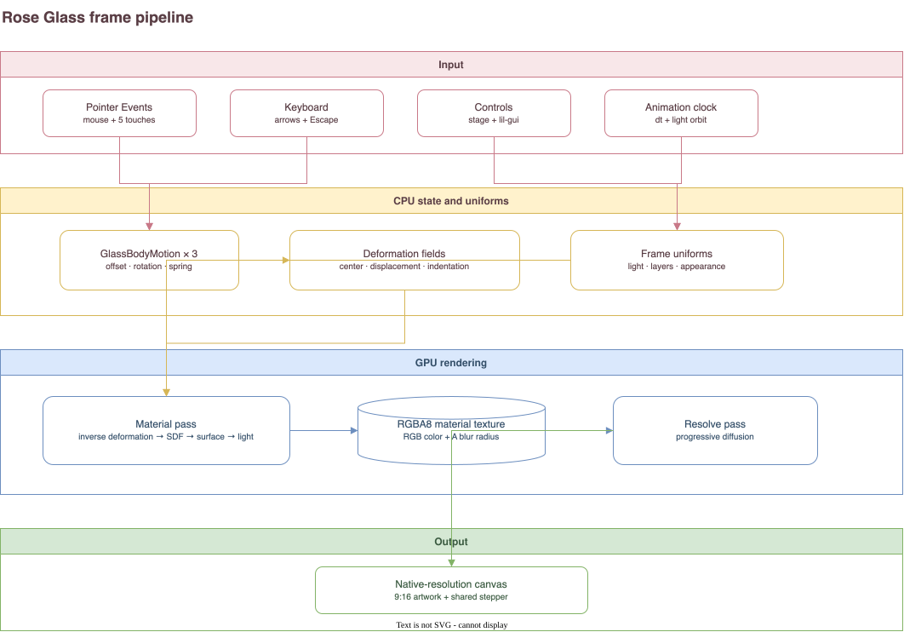

# Rose Glass 아키텍처

Rose Glass는 590 × 1280 기준 좌표계에 세 개의 반투명 유리 몸체를 해석적으로 만들고, 포인터 제약으로 표면을 변형한 뒤 WebGL 2의 두 렌더 패스로 출력한다. 이 문서는 현재 구현의 입력 → CPU 상태 → 변형 → GPU 렌더 패스 → 출력 → 검증 순서를 설명한다.



편집 원본은 [`rose-glass-frame-pipeline.drawio`](../../assets/rose-glass-frame-pipeline.drawio)다.

## 용어

| 표준 용어 | 의미 |
| --- | --- |
| Rose Glass | 작품명, 공개 URL, 코드·문서 폴더에 공통으로 쓰는 이름 |
| 유리 몸체 (`glass body`) | 각자 실루엣·재질·움직임을 갖는 세 형태 |
| 위·아래·전경 유리 (`upper`, `lower`, `foreground`) | 화면에 그리는 순서와 역할이 드러나는 몸체 이름 |
| 기준점 (`canonical point`) | 변형되기 전 유리 재료 공간의 점 |
| 화면점 (`scene point`) | 590 × 1280 작품 좌표계의 점 |
| 잡기 (`grip`) | 한 포인터가 한 몸체에 만드는 위치 제약 |
| 변형장 (`deformation field`) | 중심·변위·눌림으로 구성된 국소 Gaussian 변형 |
| 변형 상태 (`deformation state`) | 한 몸체에 적용할 변형장 배열 |
| 재질 패스 (`material pass`) | 색, 표면, 조명과 흐림 반경을 계산하는 첫 GPU 패스 |
| 합성 패스 (`resolve pass`) | 재질 텍스처의 흐림 반경을 이용해 최종 픽셀을 만드는 두 번째 GPU 패스 |
| 외곽 광학 (`edge optics`) | 두께에 따른 흡수·투과·progressive blur의 묶음 |

`rear`는 두 후경 몸체에 공통으로 적용하는 시각 파라미터(`rearAbsorption`, `rearBlur`)에만 쓴다. 몸체 자체를 가리킬 때는 `upper`와 `lower`로 구분한다.

## 화면을 그리는 전체 과정

**한 프레임은 유리의 색과 흐림 반경을 만든 뒤, 그 색을 국소적으로 흐려서 출력한다.**
잡기는 이 계산에 들어가는 변형 데이터를 바꾼다.
잡기가 없어도 같은 렌더링 단계로 기본 유리를 그린다.

| 단계 | 입력 데이터 | 계산 | 다음 단계로 보내는 데이터 |
| --- | --- | --- | --- |
| 화면 좌표 | 픽셀 위치, 재질 버퍼 크기, 화면 크기 | 590 × 1280 기준 공간으로 변환 | 화면점 `p: vec2` |
| 유리 형태 | p, 몸체 중심·크기·회전, 변형장 | 몸체 좌표 복원과 superellipse 계산 | `q: vec2`, 형태 값 f, 외곽 거리 |
| 표면 | q, 형태 값, 변형 Jacobian, noise | 깊이와 표면 기울기 계산 | 법선 `vec3`, 상대 두께, 질감 좌표 |
| 색·조명·광학 | 표면 데이터, 뒤쪽 색, 광원·재질 설정 | 재질색, 반사, 흡수, 외곽 투과, 질감 계산 | 몸체 RGB와 국소 흐림 반경 |
| 겹침 | 배경색, 위·아래·전경 몸체 | 그림자와 몸체를 뒤에서 앞으로 합성 | 재질 텍스처 `RGBA8` |
| 최종 필터 | 재질 RGB, A에 저장한 흐림 반경 | 선형 RGB에서 5 × 5 가중 평균 | 캔버스 RGB, 출력 A=1 |

현재 구현은 고정 카메라의 해석적 2D 표면 렌더러다.
사진 텍스처나 3D mesh로 유리를 그리지 않는다.
환경 맵과 PMREM도 사용하지 않는다.
광원 반사와 유리의 깊이는 아래 계산으로 직접 근사한다.

## 1. 입력

### 포인터

브라우저의 Pointer Events를 마우스와 터치에 공통으로 쓴다. `scenePoint()`는 캔버스의 CSS 좌표를 다음 기준 공간으로 바꾼다.

- 기준 크기: 590 × 1280
- 기준 중심: `(295, 640)`
- 화면 비율이 달라도 작품 전체가 들어오도록 `min(width / 590, height / 1280)`을 사용

`pointerdown`에서는 그리기 순서의 역순인 전경 → 아래 → 위 순서로 hit test한다. 겹친 곳에서 눈에 보이는 앞쪽 몸체가 먼저 잡히게 하기 위해서다. 전체 작품은 최대 다섯 개의 활성 잡기를 공유한다. 포인터 하나는 한 몸체에만 속하지만, 서로 다른 몸체를 동시에 잡을 수 있다.

### 키보드와 제어 UI

- 방향키: 마지막으로 선택한 몸체를 작은 범위에서 이동
- `Escape`: 모든 몸체의 위치와 변형을 복원
- `D` 또는 `?debug`: lil-gui 표시
- stepper: 누적 렌더 단계 선택과 URL 상태를 공유 로직으로 관리

`prefers-reduced-motion`이 켜진 환경에서는 자동 조명 궤도와 복원 애니메이션을 줄인다.

## 2. CPU 상태

몸체 하나마다 `GlassBodyMotion` 인스턴스가 있다. 각 인스턴스는 다음 상태를 소유한다.

- 몸체 전체의 `offset`, `rotation`과 그 속도
- 활성 또는 복원 중인 `Grip[]`
- GPU에 보낼 `DeformationField[]` 캐시
- 키보드 이동 목표

잡기 하나는 `materialAnchor`, `pointerOrigin`, `pointerPosition`, `displacement`, `indentation`을 가진다. 포인터가 움직이면 몸체 전체 이동은 작게 제한하고, 남은 거리를 국소 변형으로 전달한다. 여러 포인터가 같은 몸체를 잡으면 각 제약의 잔차를 매 프레임 다시 계산해 이웃 잡기가 움직여도 손가락 아래의 재료점이 따라오게 한다.

위치와 회전에는 임계 감쇠에 가까운 `damp()`를, 국소 변위에는 감쇠가 있는 탄성 응답 `elastic()`을 쓴다. 손을 놓은 뒤 한 번의 작은 반동만 남기면서 프레임 속도에 따른 폭주를 피하려는 선택이다.

## 3. 변형장

잡기 하나는 큰 변형 하나가 아니라 네 개의 작은 변형장으로 나뉜다. 최대 다섯 잡기이므로 GPU 배열의 상한은 20개다. 작은 변형을 합성하면 큰 드래그에서도 국소 map의 접힘을 줄이고 역변형을 안정적으로 구할 수 있다.

한 변형장의 입력은 다음과 같다.

- 중심 `C`
- 포인터가 당긴 변위 `D`
- 눌림 세기 `I`
- 영향 반경 `r`

기준점 `P`에 적용되는 순방향 변형은 다음 형태다.

\[
d = P - C
\]

\[
w = \exp\left(-\frac{\lVert d \rVert^2}{2r^2}\right)
\]

\[
h = I \cdot s \cdot \exp\left(-\frac{\lVert d \rVert^2}{2r_p^2}\right)
\]

\[
P' = P + D w + d h
\]

여기서 `s`는 눌림 확장 계수, `r_p`는 눌림 반경이다. `Dw`는 잡힌 주변을 포인터 방향으로 이동시키고, `dh`는 누른 주변을 바깥으로 미세하게 벌려 입체적인 홈의 어깨를 만든다.

셰이더는 화면점에서 원래 재료점을 찾아야 한다. 따라서 각 변형장을 역순으로 방문하며 Newton 반복을 다섯 번 수행한다. 같은 과정에서 계산한 Jacobian은 실루엣 거리, 표면 기울기와 질감 밀도 보정에도 재사용한다. 이는 유한요소 물리 시뮬레이션이 아니라, 안정적인 직접 조작과 유리 표면 표현을 위한 해석적 2D 변형이다.

## 4. 프레임 루프와 uniform packing

`render()`는 다음 순서로 한 프레임을 만든다.

1. `dt`를 최대 1/30초로 제한한다.
2. 세 `GlassBodyMotion`의 spring 상태를 갱신한다.
3. 자동 조명을 타원형 궤도에서 이동한다.
4. 몸체별 변형장을 하나의 연속 배열로 합친다.
5. 몸체별 시작·끝 index를 `uDeformationRanges`에 기록한다.
6. 중심·변위를 `uDeformationFields`, 눌림·역반경 제곱을 `uDeformationMeta`에 기록한다.
7. 재질 패스와 합성 패스를 차례로 실행한다.

같은 `Float32Array`와 `Int32Array`를 매 프레임 재사용해 다중 터치 중 임시 객체와 GPU upload 횟수를 제한한다.

## 5. 재질 패스: 색과 흐림 반경 만들기

**첫 패스는 각 픽셀의 RGB와 국소 흐림 반경을 계산한다.**
출력은 `materialTexture`라는 RGBA8 텍스처다.
이 텍스처는 아직 최종 화면이 아니다.

### 5.1 픽셀 위치를 작품 좌표로 변환

GPU는 `gl_VertexID`로 fullscreen triangle의 정점 세 개를 만든다.
이 삼각형이 재질 버퍼 전체를 덮는다.
fragment shader는 버퍼의 각 픽셀에서 실행된다.

| 입력 | 데이터 |
| --- | --- |
| `gl_FragCoord.xy` | 현재 재질 버퍼 픽셀의 위치 |
| `uResolution` | 재질 버퍼의 가로·세로 픽셀 수 |
| `uView` | 캔버스의 CSS 가로·세로 크기 |

```text
uv = gl_FragCoord.xy / uResolution
uv.y = 1 − uv.y
scale = min(uView.x / 590, uView.y / 1280)
p = (uv × uView − uView / 2) / scale + (295, 640)
```

uv는 0~1 범위의 화면 위치다.
p는 590 × 1280 기준 공간의 화면점이다.
작은 재질 버퍼에서도 같은 작품 위치를 계산한다.
화면의 종횡비가 달라지면 남는 영역에 배경이 확장된다.

### 5.2 배경과 몸체의 그리기 순서

`background(p)`는 p의 y 위치로 배경 그라데이션을 계산한다.
`uColorway`로 사용할 배경색 조합을 선택한다.
이 RGB를 첫 번째 `under` 값으로 사용한다.
under는 현재 몸체 뒤에 이미 그린 색이다.

| 몸체 ID | 몸체 | 중심 | 기준 반폭·반높이 |
| --- | --- | --- | --- |
| 0 | 위 유리 | `(321,299)` | `(245,408)` |
| 1 | 아래 유리 | `(274,941)` | `(260,366)` |
| 2 | 전경 유리 | `(298,645)` | `(252,386)` |

몸체마다 그림자를 먼저 under에 적용한다.
그 뒤 몸체의 색을 under와 합성한다.
이 작업을 위 → 아래 → 전경 순서로 수행한다.
전경 유리가 마지막에 뒤쪽 색을 덮는다.

### 5.3 화면점에서 유리의 형태 계산

화면점 p에서 몸체 중심과 이동량을 뺀다.
몸체의 회전을 역으로 적용한다.
변형장을 역으로 적용해 원래 유리 재료점을 찾는다.
몸체의 기울기와 y별 폭을 제거해 정규화 좌표 q를 구한다.

q는 변형 전 몸체의 좌표다.
q의 x와 y는 각각 몸체 크기로 나눈 값이다.
위 유리는 위쪽 폭이 줄어드는 profile을 사용한다.
전경 유리는 아래쪽 폭과 기울기를 별도로 조절한다.

```text
f = |q.x|ᵉ + |q.y|ᵉ
```

위·아래 유리의 지수 e는 2.35다.
전경 유리의 지수 e는 2.45다.
f=1은 몸체 외곽이다.
f<1은 몸체 내부다.
f>1은 몸체 외부다.

`contourDistance()`는 f의 기울기와 Jacobian으로 외곽 거리를 근사한다.
이 값의 단위는 기준 공간의 픽셀이다.
내부에서는 양수이고 외부에서는 음수다.
전체 공간에서 정확한 signed distance인 것은 아니다.

```text
aa = max(fwidth(distance) × 0.7, 0.65)
mask = smoothstep(−aa, aa, distance)
```

mask는 몸체가 픽셀을 덮는 비율이다.
0이면 뒤쪽 색을 유지한다.
1이면 몸체 색을 사용한다.
중간값이면 외곽에서 두 색을 섞어 계단 현상을 줄인다.

### 5.4 깊이와 법선 데이터 계산

```text
depth = √max(0, 1 − f)
```

depth는 중앙에서 크고 외곽에서 작다.
이 값으로 둥근 표면의 깊이를 근사한다.
실제 3D mesh의 깊이 버퍼 값은 아니다.

법선은 q의 기울기와 depth로 만든다.
`reliefNoise()`는 noise 값과 x·y 기울기를 함께 반환한다.
작은 noise와 큰 noise의 기울기를 법선에 더한다.
그 결과 서리 질감이 빛을 받는 방향도 달라진다.

| 중간 데이터 | 형식 | 사용처 |
| --- | --- | --- |
| `depth` | float | 둥근 법선과 광원 계산용 높이 |
| `jacobian` | mat2 | 변형에 따른 법선과 외곽 거리 보정 |
| `dent` | vec3 | 눌림 높이와 두 방향 기울기 |
| `grainUV` | vec2 | 표면 질감의 조회 좌표 |
| `sceneNormal` | vec3 | 몸체 회전을 반영한 조명용 법선 |
| `thickness` | float | 면적 변화에 따른 상대 두께 보정 |

`grainUV`는 몸체 재료 좌표에서 계산한다.
따라서 질감은 유리가 움직일 때 유리와 함께 움직인다.
화면에서 한 픽셀보다 작아지는 질감은 `fwidth()`로 약하게 만든다.

```text
thickness = 1 / √clamp(det(jacobian), 0.60, 1.55)
```

면적이 늘어나면 상대 두께가 줄어든다.
면적이 압축되면 상대 두께가 늘어난다.
법선 기울기는 Jacobian의 역전치와 눌림 기울기로 보정한다.

### 5.5 재질색과 조명 계산

몸체별 기본색에 위치별 밝기와 어두운 영역을 합성한다.
전경에는 대각선 내부 띠도 추가한다.
위 유리는 장밋빛, 아래 유리는 유백색을 기준으로 한다.
`uColorway`는 이 색을 선택한 색상 조합으로 변환한다.

조명은 두 종류의 근사로 계산한다.

| 조명 성분 | 입력 | 계산과 결과 |
| --- | --- | --- |
| 고정된 넓은 반사 | 반사 방향, 두 softbox 방향 | 방향 일치도에 따른 밝은 반사 |
| 움직이는 공유 광원 | `uLight`, 표면 높이, 법선 | 입사각, 반사각, 거리 감쇠에 따른 밝기 |

공유 광원의 높이는 기준 공간에서 550이다.
각 몸체의 표면 높이와 눌림을 반영해 광원 방향을 구한다.

```text
facing = max(dot(sceneNormal, lightDirection), 0)
halfVector = normalize(lightDirection + cameraDirection)
specular = max(dot(sceneNormal, halfVector), 0)¹⁴
falloff = 280000 / (280000 + 광원까지 거리²)
energy = uLightIntensity × falloff × (0.09 × facing + 0.34 × specular)
lightResponse = 1 − exp(−energy)
```

facing은 넓은 조명 반응이다.
specular는 더 좁은 하이라이트다.
lightResponse는 계산한 색을 따뜻한 흰색 쪽으로 밝힌다.
별도로 외곽의 프레넬 근사와 rim을 계산한다.
이 작품의 조명은 GGX의 D·F·V 계산과 다른 조형적 근사다.

### 5.6 외곽 흡수와 투과 계산

`edgeVolume(q,id)`는 위치별 광학 폭과 상대 밀도를 반환한다.
좌우와 아래쪽의 폭을 다르게 조절한다.
외곽에서 내부로 들어갈수록 흡수 효과가 줄어들도록 계산한다.

```text
transmission = exp(−extinction × opticalDepth)
흡수 후 선형 RGB = 조명 적용 선형 RGB × transmission
```

extinction은 RGB 채널별 감쇠 계수다.
opticalDepth에는 외곽 거리, 밀도, 흡수 설정, 상대 두께가 들어간다.
값이 커지면 해당 채널의 투과량이 줄어든다.

외곽의 얇은 부분에서는 `lipTransmission`으로 under를 다시 섞는다.
이 혼합은 선형 RGB에서 계산한다.
그래서 유리의 끝에서 배경이나 뒤쪽 몸체가 보인다.
이는 위치별 색 혼합이며 굴절 광선을 추적하는 계산은 아니다.

### 5.7 서리와 내부 입자 계산

shader는 사진 대신 여러 크기의 procedural noise를 사용한다.

| 데이터 | 보이는 효과 |
| --- | --- |
| `fine`, `mottling` | 작은 밝기 변화와 넓은 얼룩 |
| 셀별 `poreCenter`, `poreRadius` | 불규칙한 작은 어두운 구멍 |
| `facets`, `sparkle` | 작은 면의 밝은 반사 |
| `inclusions`, `flakes` | 유리 내부의 흐린 입자와 어두운 조각 |

입자 밝기에는 법선, 광원 방향, 반사량도 반영한다.
`uGrain`은 질감 강도를 조절한다.
후경 유리에는 별도의 큰 어두운 조각을 추가한다.
질감은 흡수 후의 색에 적용한 뒤 외곽 투과와 합성에 연결한다.

### 5.8 그림자와 몸체 합성

그림자는 광원 위치와 몸체의 가상 높이 차이로 이동량을 구한다.
몸체 외곽 거리에서 좁은 접촉 그림자와 넓은 반그림자를 계산한다.
두 그림자의 밀도를 합쳐 under를 채널별로 어둡게 만든다.

각 몸체의 마지막 출력은 다음과 같다.

```text
다음 under = mix(이전 under, 몸체 RGB, mask)
```

재질 패스는 누적 under와 blurRadius를 함께 유지한다.
국소 blurRadius는 외곽에서 크고 중앙으로 갈수록 줄어든다.
외곽 바로 바깥에도 반경을 이어서 최종 필터가 경계를 부드럽게 만든다.

### 5.9 다음 패스로 보내는 데이터

```text
재질 텍스처 RGB = 합성한 색
재질 텍스처 A = clamp(blurRadius / 16, 0, 1)
```

| 채널 | 저장값 | 소비자 |
| --- | --- | --- |
| RGB | sRGB 표현의 아직 흐리지 않은 색 | 합성 패스의 색 조회 |
| A | 정규화한 국소 흐림 반경 | 합성 패스의 표본 간격 계산 |

A는 투명도가 아니라 필터 제어값이다.
RGBA8이므로 각 채널은 8비트로 저장된다.
유리의 겹침과 투과는 이미 RGB 계산 안에서 처리했다.

## 6. 합성 패스: 국소 필터로 최종 화면 만들기

**두 번째 패스는 첫 패스의 RGB를 A에 기록한 반경으로 필터한다.**
출력 크기는 최종 캔버스의 픽셀 크기다.
재질 버퍼가 축소되어도 출력 크기는 유지한다.

### 6.1 중심 데이터와 표본 간격 조회

```text
uv = 출력 픽셀 위치 / 출력 해상도
center = texture(materialTexture, uv)
pixelRadius = center.a × 16 × uReferenceScale × uDiffusion
```

`uReferenceScale`은 기준 공간의 길이를 재질 버퍼 픽셀 길이로 변환한다.
`uDiffusion`은 최종 흐림의 강도다.
pixelRadius는 주변 표본 사이의 간격을 정한다.
실제 5 × 5 필터는 중심에서 각 축의 ±2 간격까지 조회한다.

pixelRadius가 0.25보다 작으면 중심 RGB를 그대로 출력한다.
작은 dither만 추가한다.
따라서 중앙의 표면 질감은 대체로 유지된다.

### 6.2 선형 RGB에서 25개 표본 합산

필터의 각 축은 가중치 `[1,4,6,4,1]`을 사용한다.
각 축의 가중치 합은 16이다.
두 축의 곱을 256으로 나누면 전체 가중치 합은 1이다.

```text
sampleUV = uv + (x−2, y−2) × pixelRadius / 재질 버퍼 해상도
선형 RGB 합 = Σ[toLinear(texture(sampleUV).rgb) × weight[x] × weight[y] / 256]
```

x와 y는 각각 0~4다.
총 25개 표본을 읽는다.
표본의 sRGB 값을 선형 RGB로 바꾼 뒤 더한다.
그 결과를 sRGB로 되돌린다.

가중치 합이 1이므로 일정한 색은 같은 밝기를 유지한다.
외곽에서는 색과 질감을 함께 평균한다.
중앙보다 큰 반경을 쓰는 외곽이 더 부드럽게 보인다.

### 6.3 최종 출력

```text
최종 RGB = toSrgb(선형 RGB 합) + dither / 255
최종 A = 1
```

dither는 약 −0.5~0.5 범위의 작은 값이다.
8비트 색의 계단처럼 보이는 변화를 줄인다.
최종 결과는 기본 framebuffer를 통해 캔버스에 표시한다.

재질 패스와 합성 패스의 수식은 [shader.ts](../../../pages/rose-glass/shader.ts)에 있다.
버퍼 연결과 uniform 전달은 [script.ts](../../../pages/rose-glass/script.ts)의 `render()`에서 확인한다.

## 7. 성능 조절

출력 캔버스의 device pixel ratio는 2, 전체 픽셀은 약 300만으로 제한한다. 비싼 재질 패스만 활성 또는 복원 중인 잡기 수 `g`에 따라 축소한다.

\[
q = \frac{1}{\sqrt{1 + 0.4\max(0, g - 1)}}
\]

재질 버퍼의 가로·세로를 각각 `q`배로 줄이되 합성 패스와 UI는 원래 캔버스 해상도를 유지한다. 다섯 번의 역변형 반복은 겹친 큰 변형에서 오차가 누적되므로 줄이지 않는다.

프레임 루프는 다음 중 하나일 때만 이어진다.

- 몸체나 변형이 아직 움직이는 중
- 자동 조명이 움직이는 중
- 입력 또는 설정 변경으로 `wake()`가 호출됨

## 8. 출력과 단계

작품 캔버스는 9:16을 유지하고 stepper는 작품 아래 별도 영역에 놓인다. 단계는 shader contribution을 누적한다.

| 단계 | 추가되는 레이어 |
| --- | --- |
| 00 배경 | 배경만 표시 |
| 01 형태 | 위·아래·전경 유리 |
| 02 음영 | 기본 shading과 cast shadow |
| 03 외곽 | edge optics |
| 04 조명 | 자동 조명과 반사광 |
| 05 질감 | frost grain |
| 06 완성 | progressive diffusion |

Touch Pointer와 stepper는 `common/`의 공통 구현을 사용한다. 작품 코드는 유리 몸체의 hit test, 변형과 shader 레이어에만 집중한다.

## 9. 검증

자동 검증:

```bash
pnpm test pages/rose-glass
pnpm vitest run scripts/public-routes.test.ts scripts/rose-glass-social-image.test.ts pages/rose-glass/social-preview.test.ts
pnpm typecheck
pnpm build
```

수동 검증:

1. 전경 한 몸체를 한 손가락과 두 손가락으로 각각 당긴다.
2. 위·아래·전경 몸체를 서로 다른 포인터로 동시에 당긴다.
3. 다섯 포인터에서 잡기 유지, 해제와 복원이 끊기지 않는지 본다.
4. 겹친 부분에서 앞쪽 몸체가 선택되는지 확인한다.
5. 외곽만 점진적으로 흐려지고 중앙 질감은 유지되는지 확인한다.
6. `D`, `?debug`, 방향키, `Escape`, 00–06 stepper를 확인한다.
7. `/rose-glass/` 직접 진입과 소셜 미리보기 자산 경로를 확인한다.

## 한계

- 실제 3D 부피나 ray tracing이 아니라 2D analytic relief와 광학 근사다.
- 변형은 topology를 바꾸지 않으며 찢김·분리·몸체 간 충돌을 계산하지 않는다.
- 극단적인 변형에서는 determinant clamp와 stretch limit가 시각적 안정성을 우선한다.
- 후경 그림자와 흡수는 레퍼런스의 인상을 맞춘 조형 파라미터이며 물리 단위로 보정된 값은 아니다.
