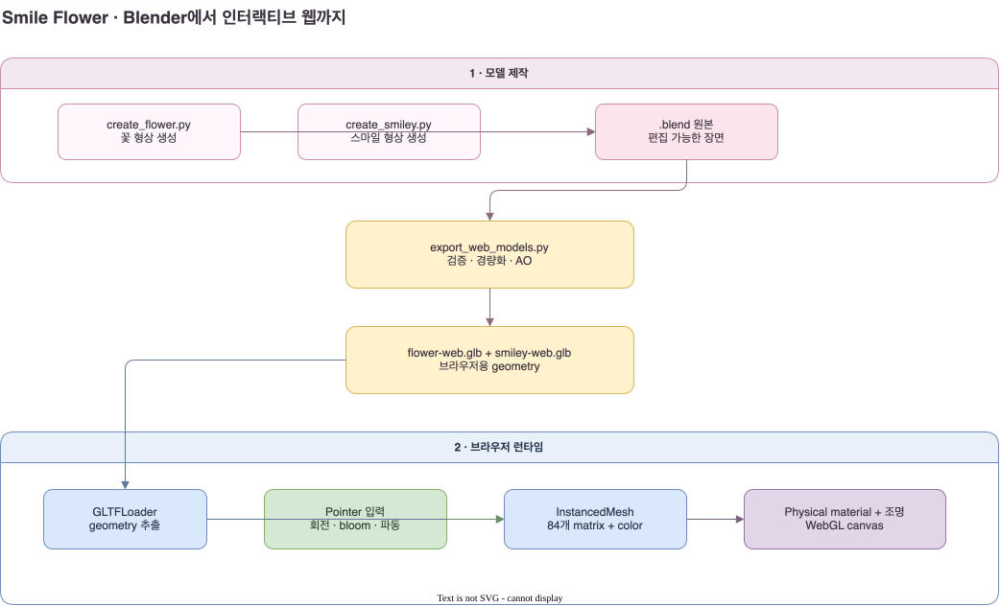

# 꽃웃음 (Smile Flower) Architecture

**꽃웃음**은 Blender에서 만든 꽃과 스마일 형상을 브라우저용 GLB로 변환하고, Three.js의 인스턴스 렌더링 위에 드래그 관성·길게 누르기·방사형 회전 파동을 결합한 작품이다. 코드 이름은 `smile-flower`다. 이 문서는 현재 코드의 입력 → 중간 상태 → 렌더 패스 → 출력 → 검증 순서를 설명한다.



## 1. 해결하려는 문제

화면에는 84개의 모델이 있지만, 각 꽃을 별도 3D 장면으로 다루면 파일 로드·draw call·상태 관리 비용이 커진다. 반대로 하나의 평면 이미지로 만들면 꽃잎 두께, 음각 중앙, 회전 중 옆면과 조명 변화를 잃는다.

현재 구현은 역할을 둘로 나눈다.

- Blender는 두께와 표면 굴곡을 가진 **형상**을 만든다.
- 웹 런타임은 각 인스턴스의 **위치, 크기, 회전, 색, 재질과 조명**을 계산한다.

따라서 형태를 바꾸려면 Blender 원본을 다시 내보내고, 색감과 움직임은 TypeScript 설정만 바꾸면 된다.

## 2. 소스와 빌드 산출물

| 단계 | 파일 | 역할 | 계산 빈도 |
| --- | --- | --- | --- |
| 꽃 생성 | `pages/smile-flower/create_flower.py` | 5개 외곽 꽃잎, 원통형 중앙, 6엽 음각, 선·점 장식을 하나의 폐곡면으로 생성 | 원본을 다시 만들 때 |
| 스마일 생성 | `pages/smile-flower/create_smiley.py` | 두꺼운 원판, 관통된 눈과 입, 둥근 테두리를 생성 | 원본을 다시 만들 때 |
| 편집 원본 | `assets/flower.blend`, `assets/smiley.blend` | Blender에서 직접 열어 수정하는 장면 | 수동 편집 시 |
| 웹 변환 | `export_web_models.py` | manifold·부피 검증, 메시 경량화, 꽃 접촉 음영을 vertex color에 기록 | 배포 모델을 다시 만들 때 |
| 런타임 모델 | `assets/flower-web.glb`, `assets/smiley-web.glb` | 브라우저가 실제로 다운로드하는 geometry와 material slot | 페이지 초기화 시 한 번 |

일반 GLB와 `-web.glb`를 분리한 이유는 편집 품질과 전송 비용을 동시에 보존하기 위해서다. 웹은 카메라와 Blender 조명을 가져오지 않고 형상과 material 이름만 사용한다.

## 3. 입력

### 3.1 포인터 입력

`field-interaction.ts`는 Pointer Events를 사용하므로 마우스와 여러 손가락을 같은 상태 기계로 다룬다. CSS pixel의 포인터 위치 `(clientX, clientY)`를 작품 좌표로 바꾼다.

| 기호 | 의미 | 공간과 단위 |
| --- | --- | --- |
| `clientX`, `clientY` | 브라우저가 전달한 포인터 위치 | viewport CSS pixel |
| `rect` | canvas가 차지하는 화면 사각형 | viewport CSS pixel |
| `x`, `y` | 작품 안의 포인터 위치 | 12 × 21.333 작품 좌표 |

변환식은 다음과 같다.

```text
x = ((clientX - rect.left) / rect.width - 0.5) × REFERENCE_WIDTH
y = (0.5 - (clientY - rect.top) / rect.height) × REFERENCE_HEIGHT
```

화면 y축은 아래가 양수지만 Three.js 장면은 위가 양수이므로 y의 부호를 뒤집는다.

### 3.2 고정 레이아웃과 색

`reference-layout.ts`는 720 × 1280 레퍼런스를 60으로 나눈 작품 좌표를 사용한다. 홀수·짝수 행의 시작 x를 다르게 두어 엇갈린 격자를 만들고, 각 cell에 꽃잎 색과 중앙 색 key를 저장한다. 이 데이터는 초기화할 때 한 번 만들어진다.

### 3.3 디버그 설정

`look-controls.ts`의 lil-gui는 `D` 키로 열리고 닫힌다. 회전 속도·회전량·파동 전파, 색상, roughness, 반사, 조명과 tone mapping을 현재 페이지 메모리에서만 바꾼다. 브라우저 저장소에는 기록하지 않으므로 새로고침하면 기본값으로 돌아온다.

## 4. 포인터 상태와 분기

포인터가 내려오면 처음에는 `pending`이다. 이후 입력은 두 경로 중 하나로 갈린다.

| 조건 | 상태 | 결과 |
| --- | --- | --- |
| 8 CSS pixel 이상 이동 | `drag` | 지나간 cell에 속도 의존 회전량을 전달 |
| 0.38초 동안 허용 범위 안에서 유지 | `hold` | 선택 지점을 중심으로 모델 크기와 위치를 재배치 |
| `hold` 뒤 손을 놓음 | release wave | 놓은 지점에서 바깥으로 회전 파동 시작 |

각 pointer ID는 자신의 `visited` 집합과 focus를 가진다. 그래서 여러 손가락이 동시에 다른 영역을 움직여도 한 손가락을 놓는 동작이 나머지를 취소하지 않는다.

## 5. 드래그 회전

### 5.1 지나간 모델 찾기

연속된 두 pointer event 사이의 선분과 각 cell 중심의 최단거리를 구한다. 이 거리가 `HIT_RADIUS × scale` 이하인 cell을 접촉 대상으로 선택한다. 선분을 작품 사각형에 먼저 clip하므로 canvas 밖에서 잡힌 긴 경로가 화면 전체를 잘못 회전시키지 않는다.

### 5.2 속도와 회전량

| 기호 | 의미 |
| --- | --- |
| `distance` | 두 이벤트 사이의 작품 좌표 거리 |
| `seconds` | 두 이벤트 사이의 시간 |
| `direction` | 지배적인 이동축에서 얻은 회전 부호 |
| `dragAmount` | 디버그 패널의 회전량 배수 |

초기 각속도는 다음 경험식으로 제한한다.

```text
speed = min(100, 20 + distance / max(seconds, 0.001) × 3)
        × direction × dragAmount
```

`distance / seconds`가 커지면 빠른 드래그이므로 더 많은 회전 에너지가 생긴다. 상한 100은 매우 드문 이벤트 간격이 과도한 각속도를 만들지 못하게 한다. 같은 gesture가 한 cell을 계속 지날 때는 첫 접촉, 가속 또는 방향 반전일 때만 에너지를 더해 느린 드래그가 무한히 회전량을 충전하지 않게 한다.

### 5.3 관성과 안착

접촉이 끝난 뒤 각속도는 지수 감쇠한다.

```text
velocity(t) = velocity(0) × exp(-FRICTION × t)
```

속도가 `SETTLE_SPEED` 아래로 내려가면 가장 가까운 반 바퀴 각도를 목표로 정하고 임계 감쇠 spring으로 안착한다. 꽃은 짝수 반 바퀴, 스마일은 홀수 반 바퀴다. 임계 감쇠의 정확해를 사용하므로 30 Hz와 120 Hz에서 최종 면과 정지 시점이 크게 달라지지 않는다.

## 6. 길게 누르기와 bloom

`bloom-motion.ts`는 각 cell의 원래 위치를 보존한 채 출력용 `layout = {x, y, scale}`만 갱신한다.

focus와 cell의 거리 제곱을 `d²`라고 하면 가까운 모델의 영향은 다음 Gaussian 형태다.

```text
localInfluence = strength × exp(-d² / 2.7)
scale = 1 - 0.45 × globalStrength + 1.85 × localInfluence
```

거리가 0이면 선택 모델이 가장 커진다. 거리가 증가하면 지수항이 빠르게 줄어 주변 모델은 원래보다 작아진다. 위치에는 더 넓은 `exp(-d² / 12)` 분포를 사용해 모델이 focus 반대 방향으로 조금 밀리게 한다.

스케일을 계산한 뒤 40회 이내의 contact resolution이 겹치는 원들의 위치만 분리한다. 큰 모델에는 `1 / scale⁴`의 작은 이동 weight를 주므로 중심의 큰 모델보다 주변의 작은 모델이 더 많이 밀린다. 손을 놓으면 `strength × exp(-1.7 × delta)`로 focus가 사라지고, layout은 `-expm1(-8 × delta)` 비율로 원래 자리로 복귀한다.

## 7. 놓을 때 퍼지는 회전 파동

각 cell의 파동 도착 시간은 놓은 위치로부터의 거리 `d`로 계산한다.

```text
arrival(d) = 0.012d + 0.0075 × waveDeceleration × d²
waveElapsed += delta × waveSpeed
```

첫 항은 시작 부분의 기본 진행 속도를 만든다. 두 번째 항은 거리의 제곱에 비례하므로 바깥으로 갈수록 추가 지연이 커진다. `waveSpeed`를 높이면 전체 도착 시간이 짧아지고, `waveDeceleration`을 높이면 바깥쪽만 더 늦어진다. 감속 강도가 0이면 거리에 비례하는 일정 전파 속도가 된다.

도착한 cell은 지정된 바퀴 수만큼 회전한다. 회전 progress는 처음 12%에서 sine으로 짧게 가속하고, 나머지 88%에서 cosine으로 감속한다. 시작과 끝의 각속도가 0이고 경계의 속도가 이어지므로 끝부분이 갑자기 멈추지 않는다.

## 8. 모델 선택과 인스턴스 행렬

한 cell의 누적 각도를 π로 나눈 반 바퀴 수가 홀수면 스마일, 짝수면 꽃을 사용한다. `script.ts`는 매 frame마다 모든 cell에 대해 다음 값을 하나의 4 × 4 matrix로 합친다.

- `layout.x`, `layout.y`: 격자 위치와 bloom 이동
- `pose.rotationX`: 드래그 또는 파동 회전
- `layout.scale`: bloom 크기
- 모델 보정 scale: 꽃 1, 스마일 0.98

꽃과 스마일의 각 material part는 `THREE.InstancedMesh` 하나를 공유한다. 각 인스턴스는 matrix와 color만 다르다. 이 구조는 84개의 독립 Mesh보다 geometry와 material을 덜 복제하고 draw call을 material part 수에 가깝게 유지한다.

## 9. 재질과 조명 렌더

GLB material의 이름은 부품을 구분하는 표식으로 사용된다. 웹에서 모든 부품을 `MeshPhysicalMaterial`로 다시 만들고 다음 값을 별도로 적용한다.

| 부품 | 색상 출처 | roughness 출처 |
| --- | --- | --- |
| 꽃잎 porcelain | cell의 흰색·연분홍·분홍 key | `petalRoughness` |
| 중앙 enamel | cell의 8색 core key | `coreRoughness` |
| 중앙 raised center | core 색과 pale rim 혼합 | `coreRoughness` |
| 선·점 stamens | 공통 stroke color | GLB 기본값 |
| 스마일 | cell의 8색 smiley key | `smileyRoughness` |

조명은 넓은 광원을 흉내 내는 3개의 방향광 shadow sample, fill light와 rim light로 구성한다. PMREM으로 만든 studio environment는 재질의 넓은 반사를 제공한다. ACES tone mapping과 sRGB 출력이 최종 canvas 색을 만든다.

꽃의 작은 접촉 그림자는 Blender export 단계에서 vertex color `COLOR_0`에 굽는다. 브라우저는 이 색을 material의 vertex color로 곱해 많은 꽃이 동시에 돌아갈 때도 꽃잎 사이 깊이를 유지한다.

## 10. 출력 해상도와 렌더 스케줄

카메라는 12 × 21.333 작품 좌표를 보는 orthographic camera다. CSS 크기와 별개로 최소 1080 pixel 폭을 목표로 device pixel ratio를 정하되, 총 350만 pixel과 GPU 최대 texture 크기를 넘지 않는다.

렌더 루프는 항상 화면을 다시 그리지 않는다. interaction이 움직이고 있거나 `dirty`가 true일 때만 instance matrix를 갱신하고 render한다. 문서가 숨겨졌거나 작품이 viewport 밖에 있으면 시간 기준을 초기화해 복귀 직후 큰 delta가 들어오는 것도 막는다.

## 11. 출력

최종 출력은 검은 배경 위 9:16 WebGL canvas다. DOM에는 작품 canvas와 로딩·오류 상태만 남고, 조정 패널은 기본적으로 숨겨진다. `prefers-reduced-motion`이 켜지면 관성 회전과 release wave 대신 접촉한 모델의 면만 한 번 바꾼다.

## 12. 검증

변경 후 다음 순서로 확인한다.

1. `pnpm typecheck`로 TypeScript의 사용하지 않는 변수와 타입 오류를 검사한다.
2. Blender export 보고서에서 non-manifold edge가 0이고 signed volume이 양수인지 확인한다.
3. `pnpm build`로 GLB URL과 번들 생성을 확인한다.
4. 기존 Chrome 창에서 기본 화면, `D` 패널, 드래그 관성, hold 이동과 release wave를 확인한다.
5. 30/60/120/240 Hz의 고정 delta로 motion 함수를 실행해 같은 바퀴 수와 최종 면에 안착하는지 확인한다.
6. 모바일 실제 기기에서는 여러 손가락, pointer cancel과 화면 가장자리 동작을 별도로 확인한다.

## 13. 한계와 대안

- 꽃과 스마일은 서로 topology가 다른 두 mesh다. 회전 중 edge-on 구간에서 교체하므로 실제 vertex morph는 아니다. 정면이 아닌 자유 카메라가 필요하면 같은 topology의 morph target이 더 적합하다.
- 접촉 회피는 원형 반경의 반복 보정이다. 형태의 정확한 외곽선을 충돌 검사하지 않으며 focus가 많아질수록 CPU 비용이 증가한다.
- 방향광 여러 개로 area light를 근사한다. 실시간 path tracing과 같은 광학 정확도는 없지만 모바일 WebGL 비용을 제어할 수 있다.
- vertex color 접촉 음영은 고정된 원본 꽃 형상에서 구운 값이다. 꽃잎 자체가 변형되는 애니메이션에는 screen-space AO 또는 동적 shadow가 더 적합하다.

## 14. 파일 지도

| 파일 | 읽을 때 볼 것 |
| --- | --- |
| `script.ts` | GLB 로딩, material 재생성, instancing, camera와 render loop |
| `field-interaction.ts` | pointer 상태, stroke hit test, 회전 관성, release wave |
| `bloom-motion.ts` | radial scale·displacement와 겹침 보정 |
| `reference-layout.ts` | 84개 위치와 색 key |
| `rotation-settings.ts` | 회전·파동 기본값 |
| `look-controls.ts` | 메모리 전용 lil-gui와 `D` 단축키 |
| `create_flower.py`, `create_smiley.py` | Blender geometry 생성 |
| `export_web_models.py` | 웹용 최적화, 검증과 GLB export |

재현 순서는 [꽃웃음 재현 가이드](./rebuild-guide.md)에 정리되어 있다.
