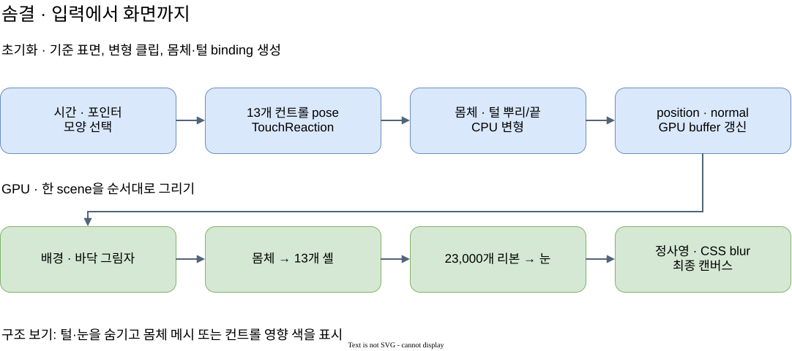

# 솜결 (Soft Forms) 아키텍처

솜결은 변형 가능한 3D 몸체에 털을 그린다. 셸은 털의 두께를 채운다. 리본은 털 한 가닥을 그린다.

CPU는 자동 움직임과 터치에 따라 몸체와 털의 좌표를 갱신한다. Three.js는 정사영 카메라로 장면을 그린다. 이 문서는 입력 → 중간 상태 → 렌더링 → 출력 → 검증 순서로 현재 구현을 설명한다.

도식 편집 원본은 [`soft-forms-frame-pipeline.drawio`](../../assets/soft-forms-frame-pipeline.drawio)다.

## 용어와 코드 이름

본문은 같은 대상에 같은 용어를 사용한다. 코드 식별자는 코드에 있는 이름을 그대로 사용한다.

| 용어 | 의미 | 코드 또는 영어 대응 |
| --- | --- | --- |
| 솜결 | 작품 이름. 코드 폴더와 공개 URL에는 `soft-forms`를 사용한다. | Soft Forms |
| 캐릭터 종류 | 노을 솜, 완두콩, 살구꽃, 별이, 파도 중 하나다. | `VariantId`, `variant` |
| 변형 컨트롤 | 독립된 이동·회전 기준점이다. 중심에 1개, 둘레에 12개가 있다. | `control` |
| 변형 리그 | 컨트롤의 변형 상태와 점별 가중치로 표면을 변형한다. | `DeformationRig` |
| 변형 상태 | 컨트롤의 이동량과 회전각이다. | `ControlPose`, `pose` |
| 기준 표면 | 자동 움직임과 터치를 적용하기 전의 표면이다. | `rest surface` |
| 표면 바인딩 | 기준 위치, 컨트롤 가중치, 볼 돌출량을 저장한 데이터다. | `SurfaceBinding`, `binding` |
| 셸 | 몸체 밖에 겹쳐 그리는 반투명 표면이다. | `shell` |
| 털 가닥 | 뿌리, 끝, 길이 등의 데이터를 가진 털 하나다. | `fiber` |
| 리본 | 털 가닥을 그리는 얇은 삼각형 띠다. | `ribbon` |
| 표면색 | 표면 위치에 따라 정하는 색이다. 몸체와 털이 같은 함수를 사용한다. | `surfaceColor()` |
| 표면 법선 | 표면에 수직인 방향이다. | `normal` |
| 정점 | 기하 데이터에 저장한 점이다. | `vertex` |
| 프래그먼트 | 삼각형을 화면에 그릴 때 생성하는 색·깊이 계산 단위다. | `fragment` |
| 채움 계수 | 털 층을 얼마나 채울지 정하는 0~1 값이다. | `coverage` |
| 불투명도 | 색을 합성할 때 사용하는 값이다. 0은 완전 투명, 1은 완전 불투명이다. | `alpha` |
| 카메라 공간 | 카메라를 기준으로 표현한 3D 좌표 공간이다. | `view space` |
| 버퍼 | CPU 또는 GPU에서 데이터를 저장하는 연속 영역이다. | `buffer` |
| 정점 속성 | 정점 또는 가닥별로 전달하는 셰이더 입력이다. | `attribute` |
| 공통 입력값 | 한 그리기 호출의 정점 또는 프래그먼트가 공유하는 셰이더 입력이다. | `uniform` |
| 분할점 | 리본의 길이 방향을 나누는 위치다. | `station` |
| 인스턴싱 | 같은 기하 데이터를 여러 가닥이 공유하는 그리기 방식이다. | `instancing` |

공개 `shape` 값은 `original`, `bean`, `flower`, `star`, `wave`다. 기본 캐릭터는 파도(`wave`)다. 이전 쿼리 `drop`은 `flower`로 해석한다. 이전 쿼리 `cloud`는 `wave`로 해석한다.

이전 이름과 현재 이름의 대응은 다음과 같다.

| 이전 이름 | 현재 이름 또는 처리 |
| --- | --- |
| Fluffy Peach | 솜결 / Soft Forms |
| `bone`, `joint`, `BoneRig` | 변형 컨트롤, `DeformationRig` |
| `bone-rig`, `bone-animation` | `deformation-rig`, `motion-fit` |
| `bone-motion`, `bone-surface` | `motion-clips`, `rest-surface` |
| `peachColor()` | `surfaceColor()` |
| `Variant.flutter` | 사용하지 않는 필드이므로 제거했다. |

## 모듈 책임

코드 폴더는 [`pages/soft-forms/`](../../../pages/soft-forms/)다.

| 파일 | 입력 → 출력 | 역할 |
| --- | --- | --- |
| [`script.ts`](../../../pages/soft-forms/script.ts) | URL·포인터·시간 → 장면 상태 | 카메라, 프레임 순서, 눈, 그림자, 구조 보기를 연결한다. |
| [`variants.ts`](../../../pages/soft-forms/variants.ts) | 캐릭터 ID·방향각 → 형태 계수 | 이름, 색, 깊이, 눈 이동량을 정한다. |
| [`rest-surface.ts`](../../../pages/soft-forms/rest-surface.ts) | 단위구 방향·기준 반경 → 기준 표면 위치 | 캐릭터의 기준 표면을 계산한다. |
| [`deformation-rig.ts`](../../../pages/soft-forms/deformation-rig.ts) | 기준 위치·변형 상태 → 변형 위치 | 고정 가중치로 평면 변환을 합산한다. |
| [`surface-binding.ts`](../../../pages/soft-forms/surface-binding.ts) | 표면 방향 → 표면 바인딩 | 몸체와 털 뿌리의 기준 위치, 가중치, 볼 돌출량을 저장한다. |
| [`motion-fit.ts`](../../../pages/soft-forms/motion-fit.ts) | 측정 외곽선 → 변형 상태 | 최소제곱 계산으로 원본 캐릭터의 외곽선을 맞춘다. |
| [`motion-clips.ts`](../../../pages/soft-forms/motion-clips.ts) | 외곽선 맞춤 결과·캐릭터 → 반복 클립 | 반복 움직임과 시간 대응표를 만든다. |
| [`motion-track.ts`](../../../pages/soft-forms/motion-track.ts), [`motion-loop.ts`](../../../pages/soft-forms/motion-loop.ts) | 키프레임·시간 → 보간값 | 움직임을 보간하고 원본 측정 프레임에 대응시킨다. |
| [`touch-reaction.ts`](../../../pages/soft-forms/touch-reaction.ts), [`zoom.ts`](../../../pages/soft-forms/zoom.ts) | 포인터 입력 → 반응 상태 | 눌림, 반동, 털 지연, 확대 배율을 계산한다. |
| [`fur-renderer.ts`](../../../pages/soft-forms/fur-renderer.ts) | 몸체·리그·터치 → 셸·털 버퍼 | 털의 기하 데이터와 재질을 관리한다. |
| `body.frag`, `palette.glsl` | 몸체 위치·법선·색 → RGBA | 몸체의 색과 불투명도를 계산한다. |
| `fur-shell.vert` / `.frag`, `fur-ribbon.vert` / `.frag` | 셸·털 버퍼 → RGBA | 셸과 리본을 그린다. |
| `background.frag`, `style.css`, `index.html` | 장면·표시 설정 → 화면 | 배경, 흐림 효과, 캔버스, 접근성 설명, 공유 정보를 제공한다. |
| `motion-data.ts`, `generate-motion.py` | 사전 측정 → 수치 데이터 | 측정 도구와 측정값을 제공한다. 실행 중에는 영상 픽셀을 사용하지 않는다. |

## 1. 입력과 좌표 공간

포인터의 `clientX/Y`는 CSS 픽셀 좌표다. `pointRayAt()`은 캔버스 경계를 기준으로 좌표를 `[-1, 1]` 정규화 장치 좌표(NDC)로 바꾼다. `Raycaster`는 이 좌표에서 현재 변형된 몸체를 찾는다.

`character.worldToLocal()`은 접촉점을 캐릭터 로컬 공간으로 옮긴다. `TouchReaction.begin()`은 접촉점과 해당 삼각형의 표면 법선을 받는다. 접촉 검사는 털 리본을 제외한다.

| 공간 | 기준과 단위 | 사용 위치 |
| --- | --- | --- |
| 측정 영상 | 720 × 720 픽셀. 오른쪽은 `+x`, 아래쪽은 `+y`다. | 원본 중심·눈·외곽선 움직임 |
| 단위구 방향 | 길이 1의 `(x,y,z)` 방향 벡터다. | 기준 표면과 털 분포 |
| 캐릭터 로컬 공간 | 작품 단위를 사용한다. 오른쪽은 `+x`, 위쪽은 `+y`, 앞쪽은 `+z`다. | 리그·터치·몸체·털·눈 |
| 장면·카메라 | 같은 작품 단위를 사용한다. 정사영 카메라의 위치는 `z=1000`이다. | 캐릭터 그룹의 이동·회전·크기 |
| 출력 화면 | CSS 픽셀과 장치 픽셀을 구분한다. 픽셀 비율의 상한은 2다. | WebGL 캔버스와 CSS 흐림 효과 |

`resize()`는 `unit = min(canvasWidth, canvasHeight) / 720`으로 정사영 범위를 계산한다. 화면의 짧은 변은 작품의 720단위를 담는다. 긴 변에는 여백이 생긴다. 두 손가락 입력은 카메라 확대 배율을 0.65~2.5로 조절한다.

포인터가 8 CSS 픽셀 이상 움직이면 입력 처리는 회전 드래그로 전환한다. 위아래 드래그는 X축 회전을 바꾼다. 좌우 드래그는 Y축 회전을 바꾼다. 몸체를 잡은 드래그만 털 지연 반응을 만든다.

두 번째 터치가 들어오면 입력 처리는 누름을 취소한다. 이후 두 손가락의 거리로 확대 배율을 계산한다.

`?t=2.25`는 자동 움직임의 시간을 2.25초로 고정한다. 터치 응답과 색 전환은 계속 진행한다. `prefers-reduced-motion`은 자동 시간을 고정한다. 이 설정에서는 색 전환도 즉시 적용한다. 구조 보기 GUI는 항상 표시한다.

## 2. 기준 표면과 표면 바인딩

초기화 코드는 `SphereGeometry(1, 88, 64)`의 위치를 `bodyDirections`에 복사한다. `bodyDirections`는 원본 단위구 방향을 저장한다. 몸체가 변형돼도 이 방향은 바꾸지 않는다. `baselineRadii`는 모든 측정 프레임에서 각 방향의 반경을 평균한 배열이다.

`restRadius()`는 방향각에 해당하는 기준 반경 두 개를 보간한다. 이 함수는 외곽선의 세부 형태와 캐릭터별 `shapeFactor()`도 적용한다. 단위구의 XY 위치가 중심에 가까우면 반경을 평균값에 가깝게 만든다. 이 처리는 앞면의 요철을 줄인다.

`restSurface()`는 XY 좌표에 반경을 곱한다. Z 좌표는 `z * 116 * depth`로 계산한다. 파도의 위쪽 봉우리에는 왼쪽 이동과 상승을 추가한다. 파도 전체에는 XY 기울기도 추가한다.

`bindSurface()`는 각 점의 기준 위치, 13개 컨트롤 가중치, 볼 돌출량을 `Float32Array`에 저장한다. 볼 돌출은 노을 솜에만 적용한다. 몸체 방향은 점마다 값 3개를 사용한다. 털 데이터는 가닥마다 `[x,y,z,length,lean]` 값 5개를 사용한다.

털 바인딩은 다음 순서로 만든다.

1. 몸체 표면에서 털 뿌리의 기준 위치를 계산한다.
2. 그 위치에서 컨트롤 가중치를 계산한다.
3. 뿌리를 기준 방향의 반대로 1.5단위 옮긴다.

이 순서는 털 뿌리를 몸체 안쪽에 넣는다. 뿌리를 옮겨도 몸체와 털은 같은 컨트롤 가중치를 사용한다.

캐릭터 ID가 바뀌면 `ensureSurfaceBindings()`는 리그와 표면 바인딩을 다시 만든다. 각 프레임은 저장한 가중치를 재사용한다. 눈 두 개의 위치는 별도로 계산한다. 눈 위치의 가중치는 각 프레임에서 계산한다.

## 3. 독립 컨트롤로 몸체 움직이기

컨트롤 0의 기준 위치는 중심 `(0,0)`이다. 둘레 컨트롤은 오른쪽에서 시작한다. 인덱스가 증가할 때마다 시계 방향으로 30°씩 배치한다. 기본 둘레 반경은 105단위다.

`shapeFactor()`는 캐릭터별 컨트롤 배치를 바꾼다. 파도 배치에는 기울기도 더한다. 컨트롤 사이에는 부모·자식 연결이 없다. 컨트롤 사이의 길이 제약도 없다.

점이 한 컨트롤에만 붙으면 영향 경계에서 몸체가 꺾인다. `weightsFor()`는 가까운 컨트롤에 큰 가중치를 준다. 이 함수는 가중치 합을 1로 맞춘다.

| 기호 | 의미 |
| --- | --- |
| `P=(x,y)` | 캐릭터 로컬 공간의 기준점이다. |
| `C_i` | 컨트롤 `i`의 기준 중심이다. |
| `σ_i` | 컨트롤의 영향 폭이다. 작품 단위를 사용한다. |
| `a_i` | 컨트롤의 영향 크기를 조절하는 계수다. |
| `q_i` | 정규화 전 가중치다. |
| `w_i` | 합을 1로 맞춘 가중치다. |

\[
q_i = a_i\exp\left(-\frac{\lVert P-C_i\rVert^2}{2\sigma_i^2}\right),\qquad
w_i = \frac{q_i}{\sum_j q_j}
\]

중심 컨트롤은 `a=1.8`, `σ=68`을 사용한다. 둘레 컨트롤은 `a=1`, `σ=43`을 사용한다. 점과 컨트롤 사이의 거리가 작을수록 `q_i`는 커진다. `σ_i`가 클수록 넓은 영역이 함께 움직인다.

정규화는 모든 `q_i`를 그 합으로 나눈다. 이 계산은 가중치 총량 때문에 이동 크기가 커지는 문제를 막는다.

`ControlPose`는 컨트롤의 이동량과 회전각을 저장한다. `D_i=(dx,dy)`는 로컬 이동량이다. `θ_i`는 라디안 회전각이다. `R(θ_i)`는 그 각도의 2D 회전 행렬이다.

`skinPoint()`는 각 컨트롤을 중심으로 기준점을 회전한다. 이동량을 더한 다음, 각 결과에 가중치를 곱해 합산한다.

\[
P' = \sum_i w_i\left(C_i+D_i+R(\theta_i)(P-C_i)\right)
\]

각 항은 같은 기준점에 서로 다른 강체 변환을 적용한 위치다. 모든 변형 상태가 0이면 결과는 기준점을 보존한다. 가중치 합이 1이기 때문이다. 이 방식은 평면 독립 컨트롤에 선형 혼합 스키닝(linear blend skinning)을 적용한다.

리그는 Z 좌표를 바꾸지 않는다. 볼 돌출과 터치 반응이 Z 좌표를 별도로 갱신한다.

### 자동 움직임 준비

초기화 때 `fitControlFrames()`는 측정 외곽선을 표본화한다. 표본은 네 반경대와 64개 방향에 있다. 이 함수는 표본에 맞는 원본 캐릭터의 변형 상태를 구한다.

맞춤 계산은 이동과 작은 회전에 대한 최소제곱 시스템을 만든다. 이 시스템은 이동·회전 크기에 벌점을 주는 항을 포함한다. 계산은 촐레스키(Cholesky) 분해 결과를 재사용한다. 실제 회전으로 생기는 오차는 세 번 보정한다.

`createMotionClips()`는 원본의 전진 동작 뒤에 별도 복원 궤적을 붙인다. 다른 네 캐릭터는 바람 목표를 따라 움직인다. 위치마다 목표의 시간 지연이 다르다. 초기화 코드는 감쇠 진동으로 이 움직임을 미리 계산한다.

시간 대응표는 움직임이 적은 구간의 시간을 줄인다. 모든 반복 클립은 144프레임이며, 24fps에서 6초다. 실행 중에는 `sampleTrack()`이 3프레임 간격의 키를 보간한다. 트랙의 회전 값은 도 단위다. 최종 `ControlPose.angle`은 라디안 단위다.

### 터치 합성

`TouchReaction.advance(dt)`는 누름과 드래그 상태를 갱신한다. 프레임 시간 `dt`의 상한은 0.05초다.

누름은 접촉점 주변에 변위를 만든다. 접촉점에서 멀어질수록 누름 변위는 작아진다. 손을 떼면 반동이 생긴다. 반동은 접촉점에서 먼 위치에 더 늦게 도착한다. 변위는 저장한 접촉점의 표면 법선 방향으로 더한다.

몸체 변형 후에는 표면 법선을 다시 계산한다. 털 뿌리에는 같은 터치 변위를 적용한다. 털끝에는 그 변위의 0.72배를 적용한다. 털끝에는 드래그 지연도 더한다.

이후 캐릭터 그룹 전체에 XY 눌림과 반동을 적용한다. 눈에는 깜빡임을 적용한다. 450ms 이내의 빠른 재탭은 반동을 다시 시작하지 않는다. 누름 시간이 0.35초 이상이면 긴 누름 반응을 사용한다.

## 4. 프레임 상태에서 GPU 버퍼까지

`render()`는 다음 순서로 한 프레임을 갱신한다.

1. 터치 상태를 갱신한다.
2. 선택한 캐릭터의 색 가중치를 갱신한다.
3. 반복 시간에 대응하는 원본 측정 시간을 구한다.
4. 볼 돌출량을 갱신한다.
5. 캐릭터가 바뀌었으면 표면 바인딩을 교체한다.
6. 현재 컨트롤 변형 상태를 설정한다.
7. `updateBodyGeometry()`로 몸체 위치와 표면 법선을 갱신한다.
8. `updateBodyGeometry()` 내부에서 `FurRenderer.update()`로 털 데이터를 갱신한다.
9. 구조 보기의 영향 색과 컨트롤 표시를 갱신한다.
10. 캐릭터 그룹의 이동, 회전, 크기를 갱신한다.
11. 눈 위치와 눈 개방도를 갱신한다.
12. 바닥 그림자를 갱신한다.
13. `renderer.render(scene, camera)`를 호출한다.

`variantWeights`는 종류 전환 중 색과 별이의 몸체 불투명도를 바꾼다. 형상은 선택한 ID의 기준 표면과 리그로 교체한다. 서로 다른 몸체 사이의 기하 보간은 수행하지 않는다.

몸체·셸 위치와 털 뿌리·끝 속성은 `DynamicDrawUsage`를 사용한다. CPU가 값을 갱신하면 `needsUpdate`를 켠다. 각 프레임은 기존 배열을 재사용한다.

다음 조건 중 하나를 만족하면 다음 프레임을 요청한다.

- 자동 시간이 진행 중이다.
- 색 전환이 진행 중이다.
- 터치 반응이 남아 있다.

## 5. 털 렌더링과 그리기 순서

[털의 셸과 리본 렌더링](../../concepts/fur-shells-and-ribbons.md)은 공통 공간 관계와 수식을 설명한다. 이 절은 현재 작품의 구현 선택을 설명한다.

| 그리기 단계 | 현재 구현 |
| --- | --- |
| 배경·그림자 | Z=-450 평면에 세로 색 변화와 가우스 타원 그림자를 그린다. |
| 몸체 | 앞면에 표면색, 약한 법선 조명, 노이즈를 적용한다. 외곽 불투명도를 줄인다. `depthWrite=true`다. |
| 13개 셸 | 몸체의 정점 연결 구조를 복제한다. `renderOrder=1..13`, `depthWrite=false`다. |
| 23,000개 리본 | 분할점 5개, 정점 10개, 삼각형 8개의 기하 데이터를 공유한다. 양면을 그린다. `renderOrder=14`, `depthWrite=false`다. |
| 눈 | 앞쪽 표면에 타원체 두 개를 놓는다. 깜빡임에 따라 높이를 바꾼다. `renderOrder=15`다. |

### 셸: 두께 채우기

CPU는 현재 몸체 정점에서 셸 위치를 계산한다. `ℓ=index/12`는 셸 인덱스를 정규화한 높이다. `B`는 현재 몸체 정점이다. `D`는 원본 단위구 방향이다. `S`는 계산한 셸 위치다.

\[
S = B + D\left(0.5 + 29\ell^{1.3}\right)
\]

`ℓ=0`이면 셸은 몸체에서 0.5단위 밖에 있다. `ℓ=1`이면 셸은 29.5단위 밖에 있다. 지수 1.3은 안쪽 셸의 간격을 더 좁게 만든다.

확장 방향 `D`는 원본 구 방향이다. 다시 계산한 표면 법선은 확장 방향으로 사용하지 않는다. 셸은 몸체의 법선 속성을 공유한다. 색과 노이즈를 조회하는 `basePosition`도 현재 몸체 위치를 공유한다.

프래그먼트 셰이더는 두 주파수의 3D 노이즈로 채움 계수를 계산한다. 안쪽 셸은 촘촘하게 채운다. 바깥쪽 셸은 성기게 채운다. 셸 높이에 따라 불투명도를 줄인다. 옆을 향한 표면은 더 높은 불투명도를 사용한다.

노이즈는 현재 변형된 몸체 위치에서 조회한다. 따라서 고정된 재료점을 완벽하게 추적하지 않는다. 가장 바깥 셸의 최종 불투명도는 0이다.

### 리본: 한 가닥 그리기

초기화 코드는 고정 난수 시드 `723981`을 사용한다. 털 방향은 단위구 표면에 면적 기준으로 균일하게 분포한다. 길이, 기울기, 폭, 휨은 한 번만 정한다.

약 17%의 가닥은 긴 가닥 분포를 사용한다. 위쪽 털은 더 길게 만든다.

`R`은 기준 뿌리다. `(x,y,z)`는 단위구 방향이다. `L`은 길이이며, `k`는 옆 기울기다. 기준 끝 `T`는 다음 위치다.

\[
T = R + L(x+yk,\ y-xk,\ z)
\]

뿌리와 끝은 뿌리의 같은 컨트롤 가중치로 변형한다. 끝의 가중치는 다시 계산하지 않는다. 이 선택은 뿌리와 끝이 서로 다른 컨트롤을 따라 벌어지는 현상을 줄인다.

정점 셰이더는 변형된 뿌리와 끝을 카메라 공간으로 옮긴다. 화면에 투영한 뿌리–끝 축에서 수직 방향을 구한다. 그 방향으로 리본 폭을 만든다.

길이 좌표 `t`는 뿌리에서 0, 끝에서 1이다. 분할점은 `0, 0.22, 0.48, 0.73, 1`이다. 폭은 `(1-t)^1.4`로 계산한다. 끝으로 갈수록 폭이 줄어든다. 휨은 `sin(πt)`로 계산한다. 두 끝점에서는 휨이 0이다.

투영 축의 길이가 거의 0이면 화면 X 방향을 폭 방향으로 사용한다. 프래그먼트 셰이더는 폭 가장자리와 끝의 불투명도를 줄인다. 원본 가닥 방향이 옆을 향할수록 가닥을 더 잘 보이게 한다. 이 표현은 실제 섬유의 광학·충돌을 계산하는 물리 시뮬레이션이 아니다.

## 6. 출력과 구조 보기

렌더러는 SRGB 출력과 `NoToneMapping`을 사용한다. 몸체와 털의 `ShaderMaterial`은 조명을 직접 계산한다. 장면의 `AmbientLight`와 `DirectionalLight`는 구조 보기의 `MeshStandardMaterial`에 사용한다.

캔버스에는 화면 크기에 맞춘 CSS 흐림 효과를 적용한다. 별도 프레임버퍼 흐림 패스는 사용하지 않는다.

`몸체 메시`는 실제 변형 기하 데이터에 와이어프레임을 겹친다. `변형 컨트롤`은 몸체의 영향 색과 표시점 13개를 보여준다. 영향 색은 실제 가중치의 네제곱을 다시 정규화한 값으로 계산한다. 이 색은 컨트롤 영역을 구분하기 위한 표시다.

컨트롤 표시점의 위치는 로컬 Z=0이다. 표시점 사이에 연결선을 그리지 않는다. 두 구조 보기 모드는 털과 눈을 숨긴다. 두 모드는 CSS 흐림 효과도 해제한다.

## 7. 한계와 검증

CPU 비용은 몸체 정점 수, 털 가닥 수, 컨트롤 수에 따라 증가한다. 셸의 GPU 비용은 셸 수와 겹치는 프래그먼트 수에 따라 증가한다. 리본 인스턴싱은 기하 데이터와 그리기 호출을 공유한다. CPU는 각 가닥의 변형을 계속 계산한다.

셸 확장 방향은 변형된 표면의 실제 법선과 다를 수 있다. 따라서 강한 변형에서 일정한 두께를 보장하지 않는다. 투명 셸과 리본은 정해진 순서로 그린다. 모든 가닥을 깊이별로 정렬하지 않는다.

큰 회전이나 가까운 확대에서는 겹침과 평평한 리본이 드러날 수 있다. 털 자체의 관성과 충돌은 계산하지 않는다. 방향에 따른 실제 빛 산란도 계산하지 않는다.

### 코드 검사

다음 명령을 실행한다.

1. `pnpm test pages/soft-forms`를 실행한다.
2. `pnpm typecheck`를 실행한다.
3. `pnpm build`를 실행한다.

테스트는 다음 항목을 확인한다.

- 기준 변형 상태의 위치 보존과 가중치 합
- 측정 외곽선 맞춤 오차
- 반복 경계의 위치·속도 연속성
- 표면 접힘과 시간 대응
- 표면 바인딩의 뿌리 안쪽 이동과 볼 돌출
- 탭, 긴 누름, 두 손가락 확대 배율 계산

### 화면 검사

기존 Chrome 창에서 다음 항목을 확인한다.

1. 다섯 캐릭터의 `?t=2.25` 화면을 확인한다.
2. 자동 반복 움직임을 확인한다.
3. 누르기 반응을 확인한다.
4. 드래그 회전을 확인한다.
5. 몸체 메시 보기를 확인한다.
6. 변형 컨트롤 보기를 확인한다.
7. WebGL·셰이더 오류를 확인한다.
8. 구조 보기에서 털과 눈을 숨기는지 확인한다.
9. 회전 중 털 뿌리가 몸체와 분리되는지 확인한다.

실제 터치 장치에서는 두 손가락 확대·축소를 추가로 확인한다.
