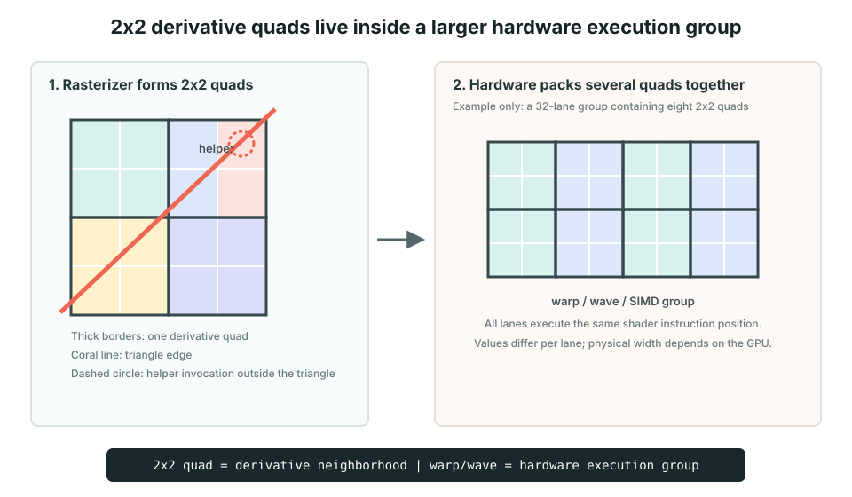
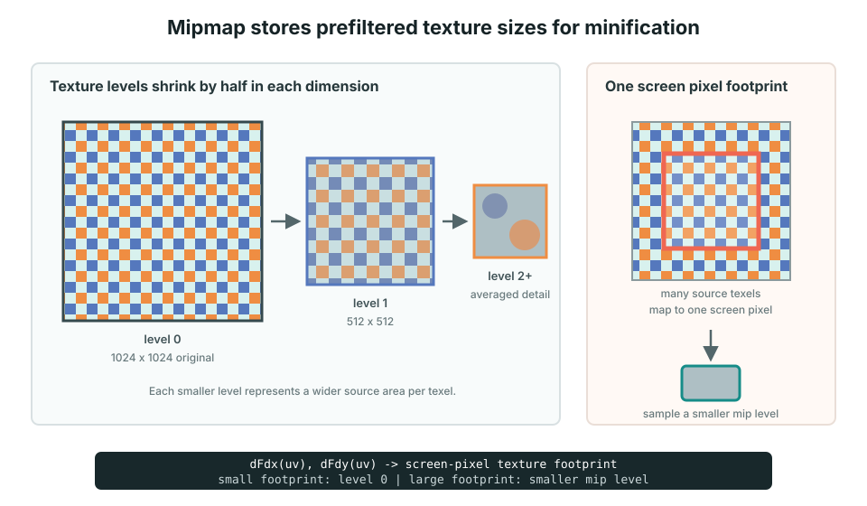

# Fragment Shader Execution

이 문서는 fragment shader가 화면 픽셀마다 따로 실행되는 것처럼 보이지만, GPU 내부에서는 여러 fragment가 어떻게 묶여 실행되는지 설명한다.

```text
triangle rasterization
  -> fragment 생성
  -> 2x2 quad 구성
  -> 여러 quad를 warp / wave로 묶음
  -> GPU 실행 유닛에서 같은 shader 명령 실행
  -> 살아 있는 fragment만 framebuffer에 결과 기록
```

Fullscreen triangle과 SDF antialiasing은 [`SDF Glass Rendering`](./sdf-glass-rendering.md#3-gpu는-출력-픽셀마다-같은-질문을-한다)을 함께 참고한다.

## 1. Fragment는 출력 후보 픽셀이다

Vertex shader가 만든 triangle을 rasterizer가 화면의 작은 격자로 나눈다. Triangle이 덮는 각 위치마다 fragment shader를 실행할 후보인 fragment가 생긴다.

```text
triangle
  -> rasterizer
  -> fragment 후보들
  -> fragment shader
  -> color, depth
```

Fragment는 최종 픽셀과 비슷하지만 완전히 같은 말은 아니다. Depth test, discard, blending 이전의 후보이므로 shader를 실행해도 framebuffer에 결과가 남지 않을 수 있다.

## 2. 왜 2x2 quad가 필요한가



GPU는 fragment의 화면 x/y 방향 변화량을 빠르게 계산할 수 있도록 인접한 fragment 네 개를 `2x2 quad`로 다룬다.

```text
        screen x
          ->

      A | B
     ---+---
      C | D
          |
          v screen y
```

가로 이웃을 비교하면 `dFdx()`, 세로 이웃을 비교하면 `dFdy()`를 추정할 수 있다.

```text
dFdx
  A와 B 비교
  C와 D 비교

dFdy
  A와 C 비교
  B와 D 비교
```

가로와 세로 변화량을 모두 구할 수 있는 가장 작은 정사각형 묶음이 2x2다.

GLSL이 정확히 어느 이웃을 어떤 순서로 빼는지는 하드웨어와 derivative 모드에 따라 달라질 수 있다. 개발자가 의존해야 하는 것은 특정 픽셀의 뺄셈 순서가 아니라 **화면 x/y 방향의 국소 변화량을 얻는다**는 의미다.

## 3. Quad 하나만 실행하는 것은 아니다

2x2 quad는 미분을 위한 논리적 이웃이다. 실제 GPU는 명령 하나로 더 많은 실행 lane을 함께 움직인다.

```text
quad 1개
  = fragment 4개

32-lane 실행 그룹의 개념적 예
  = quad 8개

64-lane 실행 그룹의 개념적 예
  = quad 16개
```

제조사와 API 문서에서 사용하는 이름은 다르다.

```text
NVIDIA       warp
AMD          wave 또는 wavefront
Apple/Intel  SIMD group 또는 SIMD width와 관련된 표현
```

`warp`와 `wave`는 이름은 다르지만, 여러 lane이 같은 shader 명령을 함께 실행한다는 공통 개념을 설명할 때 사용한다.

WebGL과 GLSL ES는 물리적인 실행 그룹 크기를 보장하지 않는다. 따라서 shader가 “항상 32개 fragment가 함께 실행된다”고 가정하면 안 된다.

## 4. 한 번에 실행하는 수는 누가 결정하는가

두 가지 숫자를 구분해야 한다.

### 실행 그룹의 폭

Warp 또는 wave 하나에 lane이 몇 개 있는지는 GPU 명령어 구조와 compiler mode가 결정한다.

```text
예: wave32
  -> 명령 하나가 32개 lane에 적용

예: wave64
  -> 명령 하나가 64개 lane에 적용
```

일반적인 WebGL fragment shader 코드에서 개발자가 이 숫자를 직접 정하지 않는다.

### 동시에 머물 수 있는 실행 그룹의 수

GPU 한 실행 유닛에 warp/wave가 몇 개 동시에 준비될 수 있는지는 다음 자원 사용량의 영향을 받는다.

- shader가 사용하는 register 수
- texture 및 연산 대기 시간
- GPU 실행 유닛과 scheduler 구조
- 다른 draw call과 시스템 작업량

Register를 많이 사용하는 shader는 동시에 대기할 수 있는 warp 수가 줄 수 있다. 이것은 warp 하나의 폭이 바뀐다는 뜻이 아니라, **같은 실행 유닛에 상주할 수 있는 warp 개수**가 줄 수 있다는 뜻이다.

## 5. 같은 명령을 여러 lane에 적용한다

개념적으로 warp/wave의 lane들은 같은 shader 명령 위치를 함께 실행한다.

```glsl
float distance = shapeField(point);
```

각 lane의 `point`와 `distance` 값은 다르지만 실행하는 명령은 같다.

```text
lane 0: shapeField(point0) -> -0.04
lane 1: shapeField(point1) -> -0.02
lane 2: shapeField(point2) ->  0.00
lane 3: shapeField(point3) ->  0.02
...
```

하나의 명령으로 서로 다른 데이터에 같은 연산을 적용하는 구조를 SIMD 또는 SIMT 관점으로 설명할 수 있다.

## 6. 분기 divergence가 생기면 무엇이 달라지는가

같은 실행 그룹 안의 lane이 서로 다른 `if` 경로를 선택할 수 있다.

```glsl
if (insideShape) {
  renderGlass();
} else {
  renderBackground();
}
```

일부 lane은 안쪽이고 다른 lane은 바깥쪽이면 GPU가 두 경로를 각각 실행하면서 해당하지 않는 lane을 잠시 비활성화할 수 있다.

```text
renderGlass 실행
  -> inside lane만 결과 사용

renderBackground 실행
  -> outside lane만 결과 사용
```

이를 branch divergence라고 한다. 분기가 있다고 항상 느린 것은 아니지만, 같은 그룹 안에서 경로가 많이 갈릴수록 함께 계산하는 장점이 줄 수 있다.

외곽선 바깥 fragment를 일찍 종료하는 early return은 뒤의 비싼 유리 계산을 줄인다. 다만 경계 quad 안에서는 일부 lane만 종료되므로 완전히 바깥쪽인 quad만큼 큰 절약은 아닐 수 있다.

## 7. Helper invocation은 왜 필요한가

Triangle 경계가 2x2 quad 일부만 덮을 수 있다.

```text
A active    B active
C active    D outside triangle
```

`D`를 전혀 실행하지 않으면 `B`와 `C`가 y/x 방향 이웃값을 얻지 못할 수 있다. GPU는 이런 위치를 helper invocation으로 실행할 수 있다.

```text
A, B, C
  -> 실제 fragment
  -> color/depth 기록 가능

D
  -> 미분 계산을 돕는 helper invocation
  -> framebuffer 결과는 기록하지 않음
```

따라서 shader 실행 수는 최종으로 색이 기록되는 픽셀 수보다 많을 수 있다.

## 8. Derivative는 quad의 이웃값을 사용한다

한 fragment 안에서 `value`는 숫자 하나지만 화면 전체에서는 위치 함수다.

```text
현재 fragment
  value = -0.02

화면 전체
  value = value(screenX, screenY)
```

`dFdx(value)`와 `dFdy(value)`는 quad의 이웃 lane 결과를 이용해 이 함수의 국소 변화량을 추정한다.

```glsl
float width = fwidth(value);

// 개념적으로 다음과 같은 의미
float width = abs(dFdx(value)) + abs(dFdy(value));
```

미분 연산은 가능하면 quad의 모든 lane이 공통으로 실행하는 위치에 두는 것이 안전하다. 서로 다른 lane이 다른 분기에서 derivative를 호출하면 필요한 이웃값이 없거나 결과가 정의되지 않을 수 있다.

## 9. Mipmap은 축소해 둔 texture 단계다



Mipmap은 원본 texture를 가로와 세로 절반 크기로 계속 축소해 미리 저장한 이미지 묶음이다.

```text
level 0   1024 x 1024   원본
level 1    512 x 512
level 2    256 x 256
level 3    128 x 128
...
level 10     1 x 1
```

이 단계들의 모양이 작은 피라미드처럼 줄어들기 때문에 mipmap pyramid라고 부른다.

### 왜 원본만 사용하면 문제가 생기는가

1024x1024 texture가 화면에서 32x32 픽셀로 보인다고 가정한다.

```text
texture 약 32x32 texel 영역
  -> 화면 픽셀 1개
```

원본 texture에서 texel 하나만 고르면 주변 수백 개 texel 정보가 사라진다. 카메라가 조금만 움직여도 선택되는 texel이 급격히 바뀌어 깜빡임, 물결무늬, 계단 현상이 생길 수 있다. 이를 minification aliasing이라고 한다.

32x32에 가까운 크기로 미리 평균낸 mip level을 읽으면 화면 픽셀 하나가 대표해야 하는 넓은 texture 영역을 더 안정적인 색 하나로 가져올 수 있다.

### 어떤 mip level을 읽을지 어떻게 아는가

Texture 좌표 `uv`가 화면 한 픽셀 동안 얼마나 변하는지 derivative로 추정한다.

```glsl
vec2 uvDx = dFdx(uv);
vec2 uvDy = dFdy(uv);
```

변화가 작으면 texture가 확대되어 있으므로 원본에 가까운 level을 사용한다. 변화가 크면 한 화면 픽셀이 넓은 texture 영역을 덮으므로 더 작은 level을 사용한다.

```text
uv 변화 작음
  -> level 0에 가까움

uv 변화 큼
  -> level 3, 4처럼 더 축소된 level
```

일반적인 `texture(sampler, uv)` 호출은 mipmap filtering이 설정되어 있다면 GPU가 derivative를 이용해 이 level을 자동으로 선택한다.

### Bilinear와 trilinear filtering

```text
bilinear filtering
  -> 한 mip level 안에서 가까운 4 texel을 섞음

trilinear filtering
  -> 인접한 mip level 2개를 고름
  -> 각 level에서 bilinear filtering
  -> 두 level 결과까지 다시 섞음
```

Trilinear filtering은 mip level이 바뀌는 경계를 덜 눈에 띄게 만든다.

WebGL에서 일반적인 설정은 다음과 같다.

```ts
gl.bindTexture(gl.TEXTURE_2D, texture);
gl.generateMipmap(gl.TEXTURE_2D);
gl.texParameteri(
  gl.TEXTURE_2D,
  gl.TEXTURE_MIN_FILTER,
  gl.LINEAR_MIPMAP_LINEAR,
);
```

`LINEAR_MIPMAP_LINEAR`는 축소할 때 trilinear filtering을 사용한다는 의미다.

### Mipmap의 메모리 비용

각 단계는 이전 단계 면적의 1/4이다.

```text
원본       1
level 1    1/4
level 2    1/16
level 3    1/64
...
```

전부 더하면 원본 하나보다 약 1/3만큼 메모리가 더 필요하다.

```text
전체 mipmap 메모리 약 1.33 x 원본 texture
```

메모리를 조금 더 사용해 축소 품질과 texture cache 효율을 얻는 방식이다.

## 10. 실행 흐름 요약

```text
triangle
  -> rasterizer가 fragment 생성
  -> 인접 fragment를 2x2 quad로 구성
  -> 여러 quad를 warp/wave로 실행
  -> helper invocation이 경계 미분 보조
  -> dFdx/dFdy가 화면 변화량 추정
  -> fwidth가 SDF antialias 폭 계산
  -> texture derivative가 mip level 선택
  -> 살아 있는 fragment만 최종 결과 기록
```

핵심은 shader가 픽셀마다 독립적으로 보이더라도 GPU는 실제로 주변 fragment와 더 큰 실행 그룹을 함께 처리한다는 점이다. Derivative, texture filtering, branch 비용을 이해하려면 개별 픽셀뿐 아니라 quad와 warp/wave 관점도 함께 봐야 한다.
