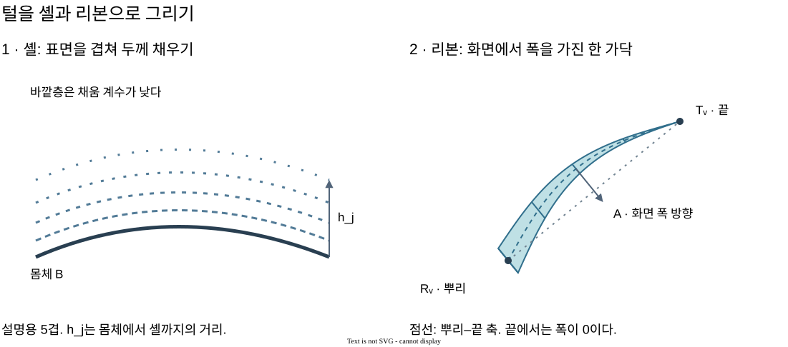

# 털의 셸과 리본 렌더링

짧고 촘촘한 털은 **겹친 표면으로 두께를 채우고, 얇은 띠로 개별 가닥을 그리는 방법**으로 표현할 수 있다. 이 제목은 두 기법을 함께 설명하기 위한 이름이다. 셸 렌더링(shell rendering)과 카메라를 향하는 리본(billboard ribbon)은 각각 재사용할 수 있으며, 둘의 조합이 하나의 고정된 표준 알고리즘인 것은 아니다.

## 1. 그림으로 먼저 보기



정밀 도형은 [`fur-shells-and-ribbons-geometry.svg`](../assets/fur-shells-and-ribbons-geometry.svg), 설명·배치 편집 원본은 [`fur-shells-and-ribbons.drawio`](../assets/fur-shells-and-ribbons.drawio)다. draw.io 앱이나 VS Code의 draw.io 확장에서 편집 원본을 열 수 있다. 그림의 셸 다섯 겹은 공간 관계를 설명하기 위한 축소 예시다.

왼쪽의 각 곡선은 털 한 가닥이 아니라 털 층의 단면이다. 점선 간격은 바깥층의 낮은 coverage를 나타낸다. 오른쪽은 뿌리와 끝을 잇는 축에 폭을 더한 리본이다. 곡선 중심은 휨을, 양쪽 경계는 끝으로 갈수록 줄어드는 폭을 나타낸다.

## 2. 해결하려는 문제

몸체 색에 noise만 넣으면 표면은 거칠어져도 외곽선 밖에 털이 나오지 않는다. 반대로 모든 털을 가는 선으로 그리면 표면 사이의 빈 공간이 잘 보이고, 카메라를 향하는 가닥은 점처럼 짧아진다.

셸은 표면 밖의 여러 높이에 얇은 밀도를 배치해 솜 같은 두께를 만든다. 리본은 한 가닥의 길이·휨·끝을 표현한다. 역할을 나누면 짧은 털의 촘촘한 내부와 외곽의 개별 가닥을 함께 표현할 수 있다.

## 3. 입력과 출력

| 기호 | 의미와 좌표 공간 |
| --- | --- |
| `B` | 현재 몸체의 3D 표면점. 캐릭터 로컬 공간의 위치 |
| `D` | 셸을 확장할 로컬 공간 단위 방향. normal 또는 별도로 지정한 성장 방향 |
| `ℓ_j` | 셸 `j`의 정규화 높이, 안쪽 0 → 바깥쪽 1 |
| `h(ℓ)` | 몸체에서 셸까지의 거리. 몸체와 같은 길이 단위 |
| `S_j` | 확장한 셸 위치 |
| `R`, `T` | 변형 이후 털의 뿌리와 끝. 로컬 공간 위치 |
| `M` | 로컬 위치를 view 공간으로 옮기는 model-view 행렬 |
| `R_v`, `T_v` | view 공간의 뿌리와 끝 |
| `U` | view XY에 투영한 뿌리–끝 축. 2D 벡터 |
| `A` | `U`에 수직인 길이 1의 화면 폭 방향 |
| `t`, `a` | 리본 좌표. `t∈[0,1]`은 뿌리 → 끝, `a∈[-1,1]`은 폭의 왼쪽 → 오른쪽 |
| `w(t)` | 리본 반폭. view 공간의 길이 단위 |
| `b` | 리본 중간의 최대 휨 거리. view 공간의 길이 단위 |
| `c` | noise·밀도 표본에서 얻은 coverage, 0~1 |
| `α`, `C` | fragment의 불투명도와 색 |

출력은 셸의 삼각형 mesh와 가닥별 리본 삼각형, 그리고 각 fragment의 RGBA다. 같은 2D 숫자라도 `R_v.xy`는 위치, `A`는 방향, `(t,a)`는 리본 내부 좌표이므로 서로 대신 사용할 수 없다.

## 4. 셸로 두께 채우기

표면점을 몸체 밖으로 작은 거리만큼 옮긴다. 표면을 복제한 각 셸의 vertex는 다음 위치다.

\[
S_j = B + h(\ell_j)D
\]

`h`가 커지면 셸이 몸체에서 멀어진다. `D`를 normal로 쓰면 현재 표면에 수직으로 확장하고, 성장 방향으로 쓰면 털의 기울기를 따른다. 고정된 기준 방향을 쓰는 방식은 계산이 간단하지만 변형 뒤의 일정 두께를 보장하지 않는다.

높이별 간격을 조절하려면 다음 함수군을 사용할 수 있다. `h_0`는 가장 안쪽 거리, `H`는 추가 두께, `p>0`은 간격 분포를 정하는 지수다.

\[
h(\ell)=h_0+H\ell^p
\]

`p=1`이면 같은 간격이다. `p>1`이면 안쪽의 간격이 좁고 바깥쪽의 간격이 넓다. `p<1`이면 반대다. 간격은 `h'(ℓ)=Hpℓ^(p-1)`에 비례하므로 지수가 간격에 미치는 영향을 확인할 수 있다.

모든 셸을 불투명하게 그리면 가장 바깥쪽의 매끈한 표면만 보인다. 밀도 표본의 coverage `c`와 높이 감쇠를 alpha로 바꿔 셸 사이를 보이게 한다. 예를 들어 층의 기본 불투명도 `a_0`, 감쇠 지수 `q>0`에 대해 다음을 쓸 수 있다.

\[
\alpha_{shell}=a_0\,c\,(1-\ell)^q
\]

`c=0`인 곳은 비고 `c=1`인 곳은 해당 층의 기본 밀도를 가진다. `ℓ=1`에서는 alpha가 0이며, `q`가 커질수록 바깥층이 빨리 옅어진다. 밀도는 표면 UV·높이로 volume texture를 샘플링하거나 3D procedural noise로 계산할 수 있다. 같은 가닥이 층을 관통하게 보이려면 높이 사이의 밀도 표본에도 연속성이 있어야 한다.

이 계산은 매 vertex에서 셸 위치를, 매 fragment에서 coverage·alpha를 만든다. 표면 geometry와 높이는 미리 저장하고, 표면이 움직일 때 위치 buffer를 갱신하거나 vertex shader에서 확장할 수 있다.

## 5. 리본을 카메라 쪽으로 펼치기

3D 선분은 길이만 있고 화면에서 안정적인 폭을 갖지 않는다. 뿌리·끝을 view 공간으로 옮긴 뒤 화면에 보이는 축을 기준으로 폭을 만든다. 아래 식은 정사영 카메라 또는 view 공간에서 카드를 만드는 경우다.

\[
R_v=M(R,1),\quad T_v=M(T,1),\quad U=T_v.xy-R_v.xy
\]

`U=(u_x,u_y)`에 수직인 벡터는 `(-u_y,u_x)`다. 내적이 `-u_xu_y+u_yu_x=0`이기 때문이다. 길이를 1로 정규화하면 가닥 길이에 따라 폭이 달라지는 일을 막는다.

\[
A=\frac{(-u_y,u_x)}{\lVert U\rVert}
\]

단, `‖U‖`가 작은 양수 임계값 `ε`보다 작으면 나누지 않고 `A=(1,0)` 같은 고정 방향을 쓴다. 카메라를 정면으로 향하는 가닥에서는 뿌리와 끝의 화면 위치가 거의 같아 이 예외가 필요하다. 이 fallback은 수치 오류를 막지만 가닥을 길게 보이게 만들지는 않는다.

리본의 중심과 폭은 다음으로 만든다. `w_0`는 뿌리 반폭, `r>0`은 taper 지수다. 2D 방향 `A`는 view Z 성분 0으로 확장해 더한다.

\[
w(t)=w_0(1-t)^r
\]

\[
P_v(t,a)=(1-t)R_v+tT_v+(A_x,A_y,0)\left[b\sin(\pi t)+a\,w(t)\right]
\]

첫 두 항은 뿌리와 끝 사이의 직선 위치다. `b sin(πt)`는 중간을 옆으로 휘게 하고 `a w(t)`는 그 중심의 양쪽에 폭을 더한다. `t=0`과 `t=1`에서 `sin`이 0이므로 두 끝을 움직이지 않으며, `t=1/2`에서 휨이 최대다. taper는 뿌리에서 `w_0`, 끝에서 0이 되어 뾰족한 끝을 만든다. 지수 `r`가 커지면 더 빨리 가늘어진다.

여러 `t` station에 `a=-1,+1` vertex를 두고 이웃 station을 두 삼각형으로 잇는다. station이 적으면 비용은 낮지만 휨의 꺾임이 드러난다. 한 리본 geometry를 공유하고 뿌리·끝·폭·휨을 instance attribute로 전달하면 가닥마다 별도 mesh를 만들 필요가 없다.

원근 카메라에서도 view 공간 카드는 사용할 수 있지만 깊이에 따라 화면 폭이 작아진다. 일정 pixel 폭이 필요하면 clip 좌표를 `w`로 나눈 화면 공간에서 축·폭을 계산하고 clip 공간으로 되돌려야 한다.

## 6. 리본의 가장자리와 겹침

삼각형 띠의 경계가 그대로 보이면 평평한 종이처럼 보인다. 폭 좌표와 길이 좌표에서 alpha를 낮춰 경계를 줄일 수 있다. `a_s∈[0,1)`는 폭 감쇠 시작점, `s>0`은 끝 감쇠 지수, `α_0`는 기본 불투명도다.

\[
e(a)=1-\operatorname{smoothstep}(a_s,1,|a|),\quad
f(t)=(1-t)^s
\]

\[
\alpha_{ribbon}=\alpha_0\,e(a)\,f(t)
\]

중앙 `a=0`은 잘 보이고 양쪽 경계 `|a|=1`은 투명해진다. 길이 `t`가 끝에 가까워질수록 옅어진다. `smoothstep`은 감쇠의 시작·끝 기울기를 0으로 만들어 갑자기 잘린 경계를 줄인다. geometry의 taper와 alpha의 끝 감쇠는 서로 다른 역할이다.

실루엣을 강조하는 보조값은 view 공간의 단위 normal `N_v` 또는 가닥 성장 방향 `D_v`에서 만들 수 있다.

\[
\mu_N=1-|N_v.z|,\qquad \mu_D=1-|D_v.z|
\]

각각 카메라 옆을 향하면 1, 카메라 축과 나란하면 0에 가깝다. 표면 normal과 가닥 방향은 다른 대상이다. 이 값으로 alpha를 강조하는 것은 시각적 근사이며, 털의 실제 산란 모델은 아니다.

일반 alpha 합성에서 현재 색 `C_s`, 뒤의 색 `C_d`, 현재 alpha `α_s`는 `C_out=α_s C_s+(1-α_s)C_d`로 섞인다. 순서를 바꾸면 결과가 달라지므로 보통 투명 도형은 뒤에서 앞으로 그린다. `depthWrite=false`는 앞의 투명 조각이 뒤를 완전히 가리는 문제를 줄이지만 올바른 정렬을 대신하지 않는다.

## 7. 변형과 일반 pseudocode

몸체가 움직일 때 뿌리·끝이 서로 다른 변형을 받으면 가닥이 표면에서 미끄러지거나 과하게 늘어날 수 있다. 기준 뿌리에서 만든 binding 가중치를 기준 끝에도 공유하는 방법을 사용할 수 있다. 이는 길이 보존이나 충돌을 보장하는 물리 시뮬레이션은 아니다.

```text
초기화 또는 형태 교체:
  bodyBinding = 기준 표면의 위치와 변형 가중치 저장
  각 가닥의 기준 뿌리, 기준 끝, 뿌리 가중치 저장
  하나의 리본 geometry와 여러 instance attribute 생성

매 프레임:
  bodyPoint = 변형(bodyBinding)
  root = 변형(restRoot, rootWeights)
  tip  = 변형(restTip,  rootWeights)

  셸 vertex:
    shellPoint = bodyPoint + height(layer) * growthDirection

  리본 vertex:
    root와 tip을 view 공간으로 변환
    projectedAxis에서 across 방향 계산, 짧은 축은 fallback
    중심 보간 + sin 휨 + taper 폭으로 vertex 위치 계산

  fragment:
    셸은 밀도 표본과 높이 감쇠로 alpha 계산
    리본은 폭 가장자리와 끝 감쇠로 alpha 계산
    투명도 합성 방식에 맞게 색을 누적
```

기준 binding과 가닥 속성은 캐시에 두고, 변형된 뿌리·끝은 매 프레임 갱신한다. across·taper는 매 리본 vertex에서, coverage·가장자리 alpha는 매 fragment에서 계산한다.

## 8. 일반적인 사용, 한계와 대안

짧은 털·솜·플러시 표면처럼 촘촘한 두께와 외곽의 가닥이 함께 필요한 표현에 사용할 수 있다. 셸은 겹친 fragment 수, 리본은 가닥 수와 station 수에 비례해 비용이 늘어난다. instancing은 draw call과 geometry 중복을 줄이며, 투명 영역을 여러 번 칠하는 overdraw는 여전히 남는다.

- **강한 변형:** 고정 성장 방향은 표면 normal과 어긋날 수 있다. normal·tangent를 변형에 맞춰 갱신하거나 방향을 함께 skinning할 수 있다.
- **카메라 정면의 가닥:** 투영 길이가 줄어든다. 작은 card·여러 방향 card·원통 geometry가 대안이다.
- **가까운 확대:** 셸 층이나 리본의 평면성이 드러날 수 있다. 더 많은 station, 실제 strand geometry, 거리별 LOD를 고려한다.
- **투명 겹침:** 가닥 단위 정렬은 비용이 크다. alpha test, alpha-to-coverage, order-independent transparency처럼 서로 다른 품질·비용의 대안이 있다.
- **긴 머리카락:** 이 표현만으로는 관성·충돌·꼬임을 만들 수 없다. 별도의 strand dynamics와 방향성 산란 모델이 필요하다.

셸과 fin을 함께 쓰는 대표적인 원전은 [Lengyel 등의 *Real-Time Fur over Arbitrary Surfaces* (2001)](https://gfx.cs.princeton.edu/pubs/Lengyel_2001_RFO/index.php)이다. 그 논문의 fin은 표면에 수직으로 놓은 도형에 털 volume의 단면을 매핑하는 방식이다. 여기서 설명한 가닥별 billboard ribbon은 카메라의 투영 축에서 폭을 만드는 선택이므로 fin과 구분해 부른다.

## 9. 구현 참고

- [솜결 (Soft Forms) 아키텍처](../artworks/soft-forms/architecture.md)
