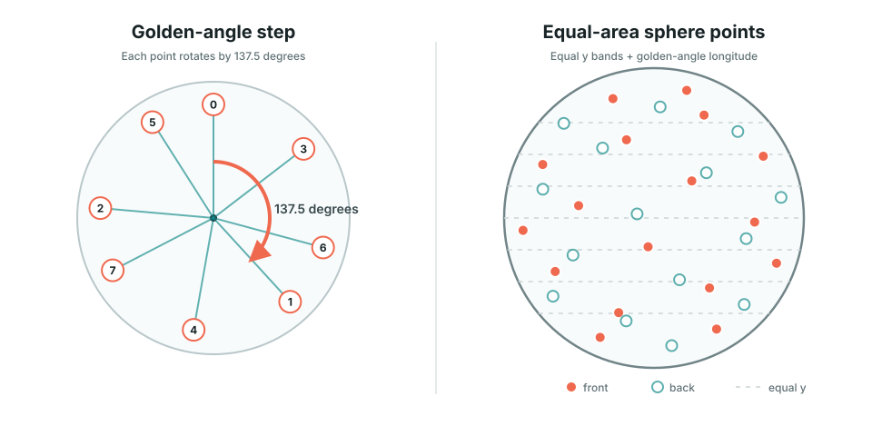

# Golden-angle Sphere Distribution

Golden-angle 분포는 정해진 개수의 점을 구 표면 전체에 비교적 균일하게 배치하는 방법이다. Guseul은 내부 사진 원의 중심을 만들 때 이 방식을 사용한다.

전체 작품 구조는 [`Guseul Architecture`](../artworks/guseul/architecture.md)를 먼저 참고한다.

## 1. 그림으로 먼저 보기



왼쪽은 점을 하나 추가할 때마다 이전 점에서 약 `137.5도` 회전하는 과정을 위에서 본 그림이다. 오른쪽은 높이를 같은 간격으로 나눈 뒤 각 점에 이 회전을 적용한 결과다.

- 청록색 점: 카메라를 향한 앞면
- 테두리만 있는 점: 구 뒤쪽
- 가로 점선: 같은 간격으로 나눈 `y` 위치

## 2. 해결하려는 문제

구에 점을 배치하는 가장 단순한 방법은 위도와 경도를 일정한 각도로 나누는 것이다. 하지만 위도선은 극지방으로 갈수록 둘레가 짧아진다. 같은 개수의 점을 모든 위도에 놓으면 위와 아래에 점이 몰린다.

```text
같은 위도 각도 + 같은 경도 각도
  -> 적도는 넓고 극은 좁음
  -> 극 근처 밀도가 높아짐
```

Guseul은 다음 두 문제를 따로 해결한다.

1. `y`를 균등하게 나눠 각 점에 비슷한 넓이의 가로 띠를 배정한다.
2. 각 점의 경도를 golden angle만큼 회전해 같은 세로선에 정렬되지 않게 한다.

이 조합은 흔히 **Fibonacci sphere** 또는 **spherical Fibonacci distribution**이라고 부른다.

## 3. Golden angle

황금비 `phi`는 다음 값이다.

```text
phi = (1 + sqrt(5)) / 2
    ~= 1.618
```

원을 황금비로 나눴을 때 생기는 작은 쪽 각도가 golden angle이다.

```text
goldenAngle = 2 * PI * (1 - 1 / phi)
            = PI * (3 - sqrt(5))
            ~= 2.39996 radians
            ~= 137.5078 degrees
```

예를 들어 매번 `90도` 회전하면 점은 네 방향을 반복하고, `120도`를 사용하면 세 방향을 반복한다. 반면 `137.5도`는 한 바퀴의 간단한 분수로 표현되지 않아 적은 수의 세로선이나 반복 무늬를 만들기 어렵다.

Golden angle만이 가능한 유일한 값은 아니다. 다만 황금비는 작은 분수로 근사하기 특히 어려운 무리수라, 점을 순서대로 추가할 때 반복과 정렬이 늦게 나타나는 실용적인 선택이다.

## 4. 높이를 같은 간격으로 나누는 이유

단위 구에서 `y`는 `-1`부터 `1`까지다. 점 개수가 `count`일 때 현재 코드는 다음 식으로 각 점의 높이를 정한다.

```text
y = 1 - 2 * (index + 0.5) / count
```

구에서 높이가 `dy`만큼 차이 나는 얇은 가로 띠의 면적은 위치와 관계없이 약 `2 * PI * dy`다. 따라서 `y`를 동일한 간격으로 나누면 각 점이 담당하는 표면적도 거의 동일해진다.

`index + 0.5`는 각 띠의 경계가 아니라 중앙에 점을 놓는다. 이 값이 없으면 첫 점이나 마지막 점이 정확히 극점에 놓여 주변보다 강조될 수 있다.

## 5. 3D 좌표 만들기

높이 `y`가 정해지면 그 높이에 있는 원의 반지름을 구한다.

```text
radial = sqrt(1 - y*y)
```

단위 구는 `x*x + y*y + z*z = 1`이므로 `x*x + z*z = 1 - y*y`다. `radial`은 해당 높이에서 사용할 수 있는 `x-z` 평면의 반지름이다.

그다음 index마다 golden angle을 누적해 경도를 만든다.

```text
theta = index * goldenAngle
x = cos(theta) * radial
z = sin(theta) * radial
```

결과 `(x, y, z)`는 항상 단위 구 표면에 있다.

```text
x*x + y*y + z*z = 1
```

## 6. 현재 Guseul 코드

실제 구현은 [`createMarbleCircles()`](../../pages/guseul/script.ts#L338)에 있다.

```ts
const goldenAngle = Math.PI * (3 - Math.sqrt(5));

const y = 1 - (2 * (index + 0.5)) / count;
const radial = Math.sqrt(Math.max(1 - y * y, 0));
const theta = index * goldenAngle + pseudoRandom(index, 1) * 0.42;

const x = Math.cos(theta) * radial;
const z = Math.sin(theta) * radial;
```

수식의 마지막 `pseudoRandom(index, 1) * 0.42`는 최대 `0.42 radian`, 약 `24도`의 결정적 jitter를 더한다. 매 실행마다 바뀌는 진짜 난수가 아니라 같은 index에는 항상 같은 값이 나온다.

이 jitter의 역할은 다음과 같다.

- 수학적으로 너무 규칙적인 나선 무늬를 약하게 흐트러뜨린다.
- 새로 렌더링할 때 사진 위치가 임의로 흔들리지 않게 한다.
- golden-angle 뼈대는 유지하면서 작품 배치를 조금 덜 기계적으로 보이게 한다.

값이 너무 커지면 원래의 균일한 분포가 무너질 수 있다. 현재 값은 위치를 완전히 다시 뽑는 대신 경도만 제한적으로 흔든다.

## 7. 개수가 바뀔 때의 동작

`circleCount`가 바뀌면 현재 개수로 전체 분포를 다시 계산한다. 고정된 큰 목록의 앞부분만 잘라 쓰지 않는다.

```text
잘못된 방식
  40개용 점을 생성 -> 앞의 6개만 사용
  -> 앞쪽 또는 위쪽에 몰릴 수 있음

현재 방식
  count = 6으로 y와 theta를 다시 계산
  -> 6개가 구 전체를 다시 나눠 가짐
```

대신 개수가 바뀌면 기존 점의 `y`도 함께 달라진다. 즉, 이 방식은 분포의 균일성을 우선하며 기존 점의 위치를 완전히 고정하는 nested distribution은 아니다.

## 8. 화면에 보이는 위치와는 다르다

Golden-angle 수식은 원의 **기준 3D 위치**만 정한다. 화면에 그리기 전에는 `sphereOrientation` 회전을 적용한다.

```text
golden-angle base point
  -> sphereOrientation으로 회전
  -> 앞면/뒷면과 화면 위치 계산
  -> edge 크기, alpha, haze 적용
  -> 사진 원 렌더링
```

따라서 드래그할 때 점들이 golden-angle 경로를 따라 움직이는 것은 아니다. 분포는 구에 고정되어 있고, 구 전체가 회전하면서 화면에서의 위치가 바뀐다.

## 9. 이 분포가 보장하지 않는 것

Golden-angle 분포는 중심점 간격을 비교적 고르게 만들지만 다음 항목까지 해결하지는 않는다.

- 사진 원의 실제 반지름과 겹침
- 사진마다 다른 크기
- 특정 색상이 서로 붙지 않도록 하는 배치
- 정확히 동일한 최근접 거리
- 앞면에서 항상 같은 개수가 보이는 구성

이 항목들이 필요하면 golden-angle 위치를 초기값으로 사용한 뒤 충돌 완화나 색상 배치 최적화를 별도로 적용해야 한다.

## 10. 핵심 요약

```text
equal y spacing
  -> 각 점에 비슷한 면적의 구 띠를 배정

golden-angle rotation
  -> 같은 경도선으로 정렬되는 것을 방지

deterministic jitter
  -> 규칙적인 나선 느낌을 약하게 완화

sphere rotation
  -> 분포를 유지한 채 모든 사진 원을 함께 이동
```

Golden-angle 분포의 핵심은 단순히 `137.5도`를 사용하는 것이 아니다. **같은 면적의 높이 분할과 반복되지 않는 경도 회전을 결합해 구 전체를 나누는 것**이다.
