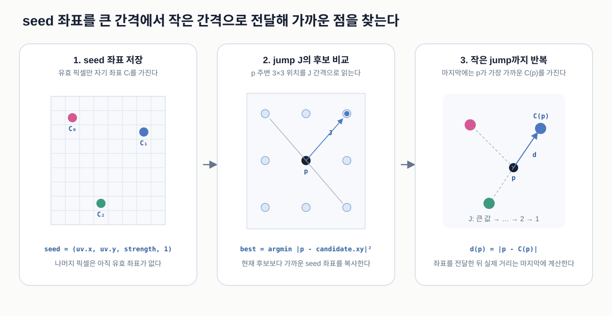

# Jump Flood Nearest-seed Search

Jump Flood Algorithm, 줄여서 JFA는 **각 출력 픽셀에서 가장 가까운 기준점이 어디인지** GPU로 빠르게 찾는 알고리즘이다. 기준점으로 선택된 픽셀을 `seed`라고 한다.

JFA는 색이나 활성값을 번지게 하지 않는다. 각 픽셀이 현재 알고 있는 **원래 seed의 좌표**를 큰 jump에서 작은 jump 순서로 이웃에게 전달한다.

## 1. 그림으로 먼저 보기



그림은 왼쪽에서 오른쪽으로 읽는다.

1. 입력에서 seed로 선택된 픽셀만 자기 좌표 `C_i`를 저장한다.
2. 출력 픽셀 `p`는 jump 간격 `J`만큼 떨어진 3×3 위치를 읽는다.
3. 이웃 위치가 들고 있는 seed 좌표들을 비교해 가장 가까운 좌표 하나를 남긴다.
4. `J`를 줄여 반복한 뒤 최종 seed 좌표 `C(p)`와 거리 `d(p)`를 얻는다.

## 2. 왜 필요한가

어떤 픽셀 `p`에서 가장 가까운 seed까지의 거리를 알고 싶다고 하자. 가장 단순한 방법은 모든 출력 픽셀이 모든 seed와 직접 거리를 비교하는 것이다.

```text
비교 횟수 = 출력 픽셀 수 × seed 수
```

출력 픽셀과 seed가 각각 수천 개 이상이면 이 계산을 매 frame 반복하기 어렵다.

JFA에서는 각 픽셀이 seed 전체를 보지 않는다. 주변 픽셀들이 이전 pass에서 찾아둔 seed 후보만 이어받는다. 큰 jump는 좌표를 멀리 전달하고, 작은 jump는 가까운 경계를 세밀하게 고친다. 덕분에 몇 번의 전체 화면 GPU pass로 최근접 seed를 근사할 수 있다.

## 3. Seed와 “좌표를 전달한다”는 말의 의미

입력 마스크에서 조건을 만족한 활성 픽셀을 seed로 선택할 수 있다. Seed 픽셀은 자기 위치를 저장하고, 나머지 픽셀은 아직 유효한 좌표가 없다고 표시한다.

```text
seed 픽셀
  -> 자기 좌표 (x, y)를 저장

나머지 픽셀
  -> 아직 아는 seed가 없음
```

다음 pass에서 비어 있던 픽셀이 seed 좌표를 전달받아도 그 픽셀 자체가 새로운 seed가 되는 것은 아니다. 저장되는 정보는 다음 문장에 가깝다.

> 지금까지 발견한 후보 중 나에게 가장 가까운 원래 seed는 `(x, y)`에 있다.

따라서 JFA의 중간 texture는 퍼져나가는 흑백 마스크가 아니라, 각 픽셀이 원래 seed 하나를 가리키는 **좌표 지도**다.

## 4. 입력, 중간 상태, 출력

| 기호 | 종류와 공간 | 의미 |
| --- | --- | --- |
| `p` | field pixel 좌표 | 지금 결과를 계산하는 출력 픽셀 |
| `q` | field pixel 좌표 | `p`에서 jump만큼 떨어져 읽어 보는 이웃 픽셀 |
| `C_i` | field pixel 좌표 | 원래 seed `i`의 좌표 |
| `C(q)` | field pixel 좌표 | 이웃 `q`가 현재 저장하고 있는 원래 seed 좌표 |
| `C(p)` | field pixel 좌표 | 현재까지 `p`에서 가장 가깝다고 선택된 seed 좌표 |
| `valid` | 0 또는 1 | 저장된 seed 좌표가 유효한지 여부 |
| `J` | field pixel | 현재 pass에서 이웃을 읽는 jump 간격 |
| `d(p)` | field pixel | `p`와 최종 seed `C(p)` 사이의 직선거리 |

Texture에 거리만 저장하지 않고 seed 좌표를 저장해야 한다. 그래야 다음 pass에서 이웃도 같은 원래 seed를 더 먼 픽셀에 전달할 수 있다. 구현에서는 좌표를 UV `[0,1]`로 저장할 수도 있지만, 거리를 비교할 때는 field 크기를 곱해 pixel 단위로 되돌린다.

## 5. 첫 Seed pass

입력 마스크가 threshold를 넘는 위치는 자기 좌표를 seed 좌표로 저장한다.

```text
mask(p) >= threshold
  -> texture(p) = (p.x, p.y, strength, 1)

그 외
  -> texture(p) = (0, 0, 0, 0)
```

마지막 채널의 `1`이 `valid`다. `strength`를 함께 저장하면 마지막 단계에서 가장 가까운 seed의 위치뿐 아니라 그 seed의 원래 세기도 사용할 수 있다.

## 6. 한 번의 Jump pass

### 6.1 `J=16`은 무엇을 뜻하는가

현재 픽셀을 `p=(x,y)`라고 하자. `J=16`이면 다음 아홉 위치를 읽는다.

```text
(x-16, y+16)  (x, y+16)  (x+16, y+16)
(x-16, y   )  (x, y   )  (x+16, y   )
(x-16, y-16)  (x, y-16)  (x+16, y-16)
```

가로·세로 이웃 `q`는 `p`에서 16px 떨어져 있고, 대각선 이웃 `q`는 `16√2`px 떨어져 있다. 하지만 이 거리는 **후보를 어디서 읽을지**만 정한다.

### 6.2 실제로 비교하는 것은 이웃이 아니라 원래 seed다

JFA가 비교하는 거리는 `p`에서 이웃 `q`까지의 거리가 아니다. `q`가 저장하고 있는 원래 seed 좌표 `C(q)`까지의 직선거리다.

```text
p = (100, 100)
q = (84, 84)             // J=16인 대각선 이웃
C(q) = (75, 80)          // q가 이전 pass에서 전달받은 원래 seed

이웃 q까지의 거리
  = 16√2

실제 후보 거리
  = distance(p, C(q))
  = √((100 - 75)² + (100 - 80)²)
  = √1025
```

`q`는 seed 주소를 전달하는 중간 지점일 뿐이다. 최종 비교 대상은 항상 원래 seed다.

### 6.3 기존 후보와 새 후보를 비교한다

현재 texture의 `p`에 이미 seed `A`가 저장되어 있고, 주변 위치에서 seed `B`, `C`를 읽었다고 하자.

```text
distance(p, A) = 11px   // 기존 후보
distance(p, B) =  7px   // 새 후보
distance(p, C) = 14px   // 새 후보

결과: B의 좌표를 다음 texture의 p에 저장
```

수식으로는 다음과 같다.

```text
D_candidate = |C_candidate - p|²
C_next(p)   = 기존 후보와 새 후보 중 D_candidate가 가장 작은 seed 좌표
```

직선거리인 Euclidean distance를 비교하지만, 어느 후보가 가까운지만 판단할 때는 `sqrt()`가 필요 없다. 거리 제곱이 작으면 실제 거리도 작기 때문이다.

```text
dx = p.x - seed.x
dy = p.y - seed.y
distanceSquared = dx² + dy²
```

## 7. 왜 큰 jump에서 작은 jump로 줄이는가

큰 `J`는 seed 좌표를 한 pass에서 멀리 전달하지만 중간 위치를 건너뛴다. 작은 `J`는 멀리 가지 못하지만 이미 전달된 후보를 가까운 픽셀 단위로 수정한다.

```text
큰 jump
  -> seed 좌표를 넓은 지역으로 빠르게 전달

작은 jump
  -> 빈틈을 줄이고 seed 사이의 경계를 세밀하게 수정
```

일반적인 전역 JFA는 이미지의 큰 변 길이에 가까운 2의 거듭제곱에서 시작해 절반씩 줄인다.

```text
예: 256 -> 128 -> 64 -> 32 -> 16 -> 8 -> 4 -> 2 -> 1
```

초반 pass가 전역으로 후보를 퍼뜨리고, 후반 pass가 Voronoi 경계 근처의 선택을 좁힌다. 마지막 `J=1`을 한 번 더 실행하는 변형은 남은 한 픽셀 오차를 줄일 때 사용한다.

## 8. Jump 합보다 먼 곳에는 도달할 수 있는가

제한된 일정에서는 도달 범위도 제한된다. 한 seed 좌표가 같은 방향으로 전달될 수 있는 최대 x 또는 y 이동량은 사용한 jump들의 합이다.

```text
16 + 8 + 4 + 2 + 1 = 31px
```

따라서 `16 -> 8 -> 4 -> 2 -> 1` 일정만 사용하면 한 seed가 도달할 수 있는 이론적인 영역은 seed를 중심으로 대략 다음 사각형이다.

```text
x 방향: -31px ~ +31px
y 방향: -31px ~ +31px
```

사각형 모서리까지의 직선거리는 `31√2`px지만, x나 y 중 하나라도 31px보다 멀다면 그 일정만으로는 seed 좌표가 도달할 수 없다. 마지막 `J=1` pass를 한 번 더 실행하면 각 축의 최대 범위가 32px로 한 칸 늘어난다.

이것은 오류라기보다 선택할 수 있는 계산 범위다. 결과가 seed 주변의 짧은 거리에서만 필요하다면 제한된 local 일정을 사용해 pass 수를 줄일 수 있다. 반대로 화면 전체에서 최근접 seed가 필요하다면 texture 전체를 덮는 더 큰 jump에서 시작해야 한다.

```text
local search
  작은 J에서 시작
  -> 빠르지만 jump 합 밖의 seed는 찾지 못함

global search
  큰 변 길이를 덮는 J에서 시작
  -> pass가 더 필요하지만 화면 전체로 후보 전달
```

## 9. Ping-pong texture가 필요한 이유

한 pass 안에서 읽는 중간 결과가 픽셀 실행 순서에 따라 바뀌면 안 된다. 그래서 같은 크기의 texture 두 장을 번갈아 사용한다.

```text
pass 1
  Texture A 읽기
  -> 기존 후보와 새 후보 비교
  -> Texture B에 가장 가까운 seed 좌표 쓰기

pass 2
  Texture B 읽기
  -> 다시 비교
  -> Texture A에 쓰기
```

이 구조를 `ping-pong`이라고 한다. Seed 좌표는 두 픽셀 사이에서 선형 보간되면 존재하지 않는 가짜 좌표가 생기므로 texture에는 nearest filtering을 사용한다.

## 10. 최종 거리 사용

JFA가 끝나면 각 픽셀에는 최종 seed 좌표 `C(p)`가 저장되어 있다. 실제 직선거리는 마지막 단계에서 계산한다.

```text
d(p) = length(p - C(p))
```

좌표를 UV로 저장했다면 x와 y에 field 크기를 곱해 pixel 단위로 계산한다.

```text
d(p) = length((pUv - seedUv) * fieldSize)
```

예를 들어 `d(p)`가 반경 `R` 안에 있을 때만 에너지를 만들고, 경계 폭 `E`에서 0으로 전환할 수 있다.

```text
energy = 1 - smoothstep(R - E, R + E, d(p))
```

`R`을 키우면 seed 주위의 영향 범위가 두꺼워진다. `E`를 키우면 경계가 더 흐려진다.

## 11. 계산 시점과 비용

JFA의 각 jump는 field의 모든 픽셀에서 실행되는 GPU pass다. 한 픽셀은 pass마다 최대 아홉 후보만 확인한다.

```text
대략적인 비용 = field 픽셀 수 × jump pass 수 × 9개 후보
```

모든 seed를 직접 비교하는 방법처럼 seed 수가 비용에 직접 곱해지지 않는다는 것이 핵심 장점이다.

## 12. 일반적인 사용

- Voronoi diagram 근사
- distance field 생성
- 가까운 feature나 seed 탐색
- GPU 기반 영역 전파
- seed의 부가 속성 전달

## 13. 정확도와 대안

JFA는 빠른 근사 알고리즘이다. Texture 전체를 덮는 jump 일정을 사용해도 일부 Voronoi 경계에서 한두 pixel 오차가 생길 수 있다. 제한된 local 일정은 jump 합 밖의 seed를 전달하지 못한다.

입력 seed가 작은 구멍 때문에 지나치게 끊겨 있다면 JFA 전에 마스크 안에서만 제한적인 확산을 적용할 수 있다. 이 전처리는 최근접 탐색과 별개의 선택이다.

정확한 전역 Euclidean distance가 필요하다면 다음 방법이 더 적합할 수 있다.

- exact Euclidean distance transform
- separable distance transform
- 전체 jump 일정의 JFA와 추가 보정 pass
- seed 수가 매우 적을 때 모든 seed 직접 비교

## 14. 구현 참고

이 원리를 사용한 구현 사례는 [Color Text Architecture](../artworks/color-text/architecture.md#8-color-활성-글자-모양을-밝게-만들기)에서 확인할 수 있다.

## 15. 핵심 요약

```text
활성 픽셀을 seed로 선택하고 자기 좌표 저장
  -> jump만큼 떨어진 이웃 q를 읽음
  -> q의 위치가 아니라 q가 가진 원래 seed C(q)를 후보로 사용
  -> 기존 후보와 새 후보의 직선거리 제곱 비교
  -> 가장 가까운 seed 좌표를 다음 texture에 저장
  -> jump를 줄여 반복
  -> 최종 좌표 C(p)에서 거리 d(p) 계산
```

JFA의 핵심은 픽셀을 색으로 채우는 것이 아니라, **원래 seed의 좌표를 전달하면서 각 픽셀이 가장 가까운 좌표 하나를 남기는 것**이다. 제한된 일정에서는 각 축의 최대 전달 범위가 jump 합으로 정해진다.
