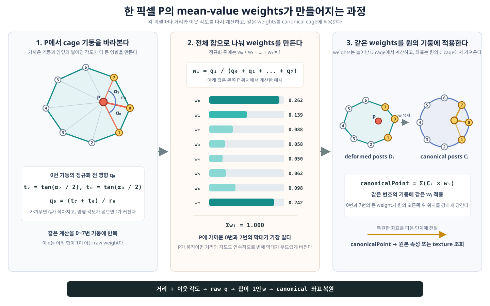
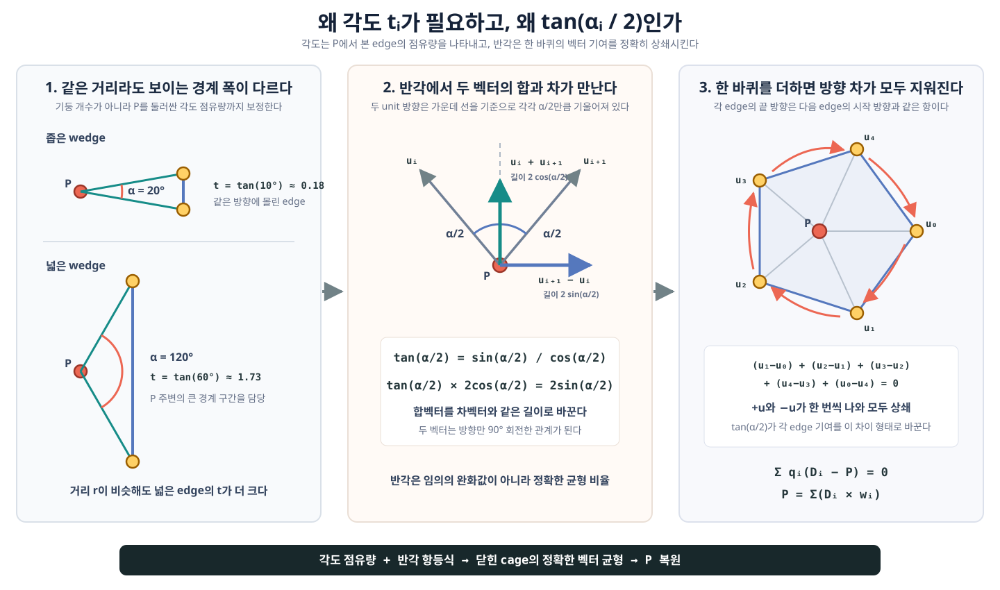

# Mean-Value Coordinates

Mean-value coordinates는 다각형 울타리인 cage 안의 점을 여러 기둥의 가중합으로 표현하는 방법이다. Cage 모양이 달라져도 같은 가중치를 대응하는 다른 cage에 적용할 수 있어 2D/3D 형태 변형과 좌표 복원에 사용한다.

Guseul의 전체 spec 처리 흐름은 [`architecture.md`](../artworks/guseul/architecture.md#16-늘어난-외곽선에서-spec을-유지하는-방법)를 먼저 참고한다.

## 1. 그림으로 먼저 보기



그림의 세 단계는 다음 질문에 각각 답한다.

1. 현재 픽셀 `P`가 각 기둥과 얼마나 가까우며, 기둥 양옆이 얼마나 넓게 보이는가?
2. 그 영향값을 모두 더해 합이 1인 `w0`, `w1`, ...로 어떻게 바꾸는가?
3. 같은 weights를 원래 원의 대응 기둥에 적용하면 `specPoint`가 어디에 생기는가?

## 2. 왜 경계 기둥의 대응만으로는 부족한가

늘어난 cage의 `0번 기둥`과 원의 `0번 기둥`이 한 쌍이라는 사실만으로는 내부 픽셀 `P`의 원래 위치를 바로 알 수 없다. `P`는 어느 한 기둥 위가 아니라 여러 기둥 사이에 있기 때문이다.

Mean-value coordinates는 `P`를 다음처럼 표현한다.

```text
P = D0 * w0 + D1 * w1 + D2 * w2 + ...
```

- `D_i`: 현재 늘어난 cage의 `i`번 기둥
- `w_i`: 현재 픽셀 `P`에 대해 계산한 `i`번 기둥의 weight

Weights의 합은 1이다.

```text
w0 + w1 + w2 + ... = 1
```

이 성질 때문에 기둥 좌표의 가중 평균으로 내부 위치를 설명할 수 있다. 삼각형 안의 점을 세 꼭짓점의 비율로 나타내는 barycentric coordinates를 꼭짓점이 많은 다각형으로 확장한 것이라고 생각하면 된다.

## 3. Weight는 픽셀마다 새로 계산한다

`w0`, `w1`, ...는 cage texture에 미리 저장된 고정값이 아니다. 출력 픽셀 `P`가 바뀌면 기둥까지의 거리와 기둥 사이의 각도도 바뀌므로 GPU가 픽셀마다 weights를 다시 계산한다.

기호는 다음과 같다.

| 기호 | 뜻 |
| --- | --- |
| `P` | 현재 역변환할 픽셀 |
| `D_i` | 늘어난 cage의 `i`번 기둥 |
| `C_i` | 원래 canonical cage의 `i`번 기둥 |
| `r_i` | `P`에서 `D_i`까지의 거리 |
| `alpha_i` | `P`에서 `D_i`와 다음 기둥 `D_(i+1)`을 바라본 각도 |
| `q_i` | 합이 1이 되기 전 raw weight |
| `w_i` | 합이 1이 되도록 정규화한 최종 weight |

## 4. 첫 단계: 기둥까지의 거리를 구한다

`P`에서 `i`번 기둥으로 향하는 벡터와 그 길이는 다음과 같다.

```text
v_i = D_i - P
r_i = length(v_i)
```

`P`가 `D_i`에 가까워질수록 `r_i`가 작아진다. Raw weight를 마지막에 `r_i`로 나누므로 가까운 기둥의 영향은 대체로 커진다.

거리만 사용하면 cage의 모양과 기둥의 연결 순서를 충분히 반영하지 못한다. 그래서 이웃한 두 기둥이 `P`에서 얼마나 넓게 보이는지도 함께 사용한다.

## 5. 두 번째 단계: 이웃 기둥 사이의 반각을 구한다

`P`에서 `D_i`와 `D_(i+1)`로 향하는 두 선 사이의 각도를 `alpha_i`라고 한다. Mean-value coordinates는 각도 자체보다 다음 반각 값을 사용한다.

```text
t_i = tan(alpha_i / 2)
```

각도가 weight에 영향을 주는 이유와 `alpha_i / 2`가 나오는 이유는 다음 그림처럼 서로 연결되어 있다.



### 5.1 각도는 P에서 본 edge의 점유량이다

거리만 사용하면 비슷한 방향에 기둥이 많이 몰렸다는 이유만으로 그쪽 영향이 과도하게 커질 수 있다. Mean-value coordinates는 기둥 개수를 세는 대신, 이웃한 두 기둥을 잇는 edge가 `P` 주변에서 차지하는 각도까지 함께 측정한다.

두 기둥이 거의 같은 방향에 있으면 `alpha_i`가 작다. 이 edge는 `P`를 둘러싼 전체 경계 중 좁은 방향만 담당한다. 반대로 두 기둥이 넓게 벌어져 있으면 edge가 더 큰 방향 구간을 담당하므로 `t_i`도 커진다.

| `alpha_i` | `t_i = tan(alpha_i / 2)` | 의미 |
| --- | --- | --- |
| `0도`에 가까움 | `0`에 가까움 | 같은 방향에 몰린 좁은 edge |
| `90도` | `1` | P 주변의 4분의 1 방향을 담당 |
| `180도`에 가까움 | 매우 커짐 | P가 그 edge 바로 가까이에 있음 |

마지막 성질이 중요하다. `P`가 edge에 가까워지면 그 edge의 양 끝 기둥을 바라보는 각도가 180도에 가까워진다. 그러면 `tan(alpha_i / 2)`가 매우 커져 두 끝 기둥이 다른 기둥보다 결과를 강하게 지배한다. 그래서 edge 위의 점은 canonical cage에서도 대응 edge 위의 점으로 보간된다.

### 5.2 반으로 나누는 것은 영향을 절반씩 배분하기 위해서가 아니다

`alpha_i / 2`는 단순히 edge의 영향력을 양 끝 기둥에 반씩 나눠 주는 값이 아니다. 두 unit direction 벡터의 합과 차를 비교하면 반각이 자연스럽게 나타난다.

`P`에서 두 이웃 기둥으로 향하는 길이 1의 방향을 `u_i`, `u_(i+1)`이라고 하자. 두 방향은 가운데 선을 기준으로 각각 `alpha_i / 2`만큼 기울어져 있다.

두 방향을 더하면 옆 성분은 상쇄되고 가운데 방향만 남는다.

```text
length(u_i + u_(i+1)) = 2 * cos(alpha_i / 2)
```

두 방향의 차를 구하면 가운데 성분은 상쇄되고 옆 방향만 남는다.

```text
length(u_(i+1) - u_i) = 2 * sin(alpha_i / 2)
```

합벡터의 길이 `2 * cos(alpha_i / 2)`를 차벡터의 길이 `2 * sin(alpha_i / 2)`로 바꾸는 비율이 바로 다음 값이다.

```text
sin(alpha_i / 2) / cos(alpha_i / 2)
  = tan(alpha_i / 2)
  = t_i
```

따라서 `t_i * (u_i + u_(i+1))`는 `u_(i+1) - u_i`와 길이가 같고 방향만 90도 회전한 벡터가 된다. 이 관계가 닫힌 cage 전체의 균형을 만든다.

### 5.3 한 바퀴를 돌면 방향 차가 모두 상쇄된다

모든 edge의 방향 차를 더하면 중간 항이 하나씩 지워진다.

```text
(u1 - u0) + (u2 - u1) + ... + (u0 - u_last) = 0
```

각 `+u_i`와 `-u_i`가 한 번씩 나타나기 때문이다. `t_i`는 각 edge의 합벡터를 이 방향 차와 같은 길이의 벡터로 바꾼다. 그래서 한 바퀴의 raw weight 기여도 정확히 균형을 이룬다.

```text
sum(q_i * (D_i - P)) = 0
```

식을 정리하고 모든 `q_i`의 합으로 나누면 다음 결과가 나온다.

```text
P = sum(D_i * w_i)
```

즉, `tan(alpha_i / 2)`는 단지 부드러워 보이는 값을 경험적으로 고른 것이 아니다. Cage 기둥의 가중합이 원래 점 `P`를 정확히 복원하도록 만드는 기하학적 균형 비율이다.

### 5.4 Shader는 각도를 직접 구하지 않는다

실제 shader는 `atan()`으로 `alpha_i`를 구한 뒤 다시 `tan()`을 호출하지 않는다. 두 벡터의 내적과 외적을 이용해 같은 반각 값을 바로 계산한다.

```text
a = D_i       - P
b = D_(i + 1) - P

t_i = cross(a, b) / (length(a) * length(b) + dot(a, b))
```

- `dot(a, b)`: 두 방향이 얼마나 같은 쪽을 보는지 측정한다.
- `cross(a, b)`: 한 방향에서 다른 방향으로 얼마나 돌아가는지와 그 회전 방향을 측정한다.

길이를 분리해서 보면 `cross(a, b)`는 `length(a) * length(b) * sin(alpha_i)`, `dot(a, b)`는 `length(a) * length(b) * cos(alpha_i)`다. 공통 길이를 약분하면 다음 반각 항등식이 남는다.

```text
sin(alpha_i) / (1 + cos(alpha_i))
  = tan(alpha_i / 2)
```

따라서 코드의 `cross / (length product + dot)`은 정확히 `t_i`이며, 각도를 명시적으로 구하지 않아도 된다.

## 6. 세 번째 단계: 기둥 양옆의 각도와 거리를 합친다

`D_i`에는 이전 edge의 각도 `alpha_(i-1)`과 다음 edge의 각도 `alpha_i`가 붙어 있다. 두 반각 값을 더하고 기둥까지의 거리로 나누면 raw weight가 된다.

```text
q_i = (t_(i - 1) + t_i) / r_i
```

따라서 보통 다음 두 조건에서 `q_i`가 커진다.

- `P`가 `D_i`에 가까워 `r_i`가 작다.
- `D_i` 양옆의 각도가 넓어 `t_(i-1) + t_i`가 크다.

그림에서 `P`와 가까운 0번과 7번 기둥의 막대가 긴 이유가 이것이다.

## 7. 네 번째 단계: 합이 1이 되도록 정규화한다

모든 raw weights의 합을 `Q`라고 한다.

```text
Q = q0 + q1 + q2 + ...
w_i = q_i / Q
```

그러면 최종 weights의 합은 항상 1이 된다.

```text
w0 + w1 + w2 + ... = 1
```

Guseul shader는 각 edge `(D_i, D_(i+1))`를 한 번씩 순회한다. Edge에서 구한 `t_i`를 양 끝 기둥에 각각 `t_i / r_i`, `t_i / r_(i+1)`만큼 더한다. 한 바퀴를 마치면 각 기둥에는 자연스럽게 이전 반각과 다음 반각이 모두 누적된다.

```text
edge i가 D_i에 더하는 값       = t_i / r_i
edge i가 D_(i+1)에 더하는 값   = t_i / r_(i+1)

전체 edge를 돈 뒤 D_i의 값     = (t_(i-1) + t_i) / r_i
```

## 8. 같은 weights를 canonical cage에 적용한다

Weights는 늘어난 기둥 `D_i`에서 계산했지만, 최종 좌표를 만들 때는 대응하는 원의 기둥 `C_i`를 사용한다.

```text
specPoint = C0 * w0 + C1 * w1 + C2 * w2 + ...
```

Shader는 정규화를 마지막 나눗셈으로 합쳐 다음과 같은 형태로 계산한다.

```text
weightedCoordinate = C0 * q0 + C1 * q1 + C2 * q2 + ...
weightSum = q0 + q1 + q2 + ...

specPoint = weightedCoordinate / weightSum
```

즉, 다음 두 문장은 동시에 성립한다.

```text
현재 cage에서 P의 위치        = sum(D_i * w_i)
canonical cage에서 원래 위치  = sum(C_i * w_i)
```

같은 index의 기둥에 같은 weight를 적용하기 때문에 늘어난 모양 안의 위치 관계가 원 안의 위치 관계로 옮겨진다.

## 9. 왜 픽셀이 움직여도 결과가 튀지 않는가

`P`가 조금 움직이면 각 기둥까지의 거리와 각도도 조금씩 변한다. 거리와 내적, 외적, 나눗셈으로 만든 weights도 연속적으로 변하므로 `specPoint`가 기둥 경계에서 갑자기 다른 위치로 점프하지 않는다.

특별한 위치에서는 다음 성질을 가진다.

- `P`가 정확히 `D_i` 위에 있으면 `w_i = 1`인 것처럼 대응하는 `C_i`를 바로 반환한다.
- `P`가 두 기둥을 잇는 edge 위에 있으면 두 대응 기둥 사이의 위치로 보간된다.
- Cage 안쪽에서는 모든 기둥의 영향을 합쳐 연속적인 좌표를 만든다.

이 성질이 cage-based deformation에서 mean-value coordinates를 사용하는 핵심 이유다.

## 10. Weight를 단순한 0~100% 영향력으로만 보면 안 된다

볼록한 cage 안에서는 weights를 양수 비율처럼 이해하기 쉽다. 하지만 contact 사이가 들어간 오목한 cage에서는 일부 signed angle과 weight가 음수가 될 수 있다.

음수 weight는 오류가 아니다. 오목한 경계를 지나치게 안쪽으로 끌지 않도록 다른 기둥의 영향을 반대 방향으로 보정할 수 있다. 따라서 다음 두 문장을 구분해야 한다.

- 항상 성립: 정규화된 weights의 합은 1이다.
- 항상 성립하지 않음: 모든 weight가 0과 1 사이의 양수다.

그래서 문서에서 weight를 편의상 `혼합 비율`이라고 부르지만, 오목한 cage에서는 부호가 있는 좌표 계수라고 이해하는 편이 더 정확하다.

## 11. 그래픽스에서 어디에 쓰이는가

Mean-value coordinates는 **generalized barycentric coordinates** 계열의 잘 알려진 방법이다. 보통 다음 작업에 사용한다.

- Cage-based deformation
- 2D 일러스트와 메시 변형
- 변형 전후의 좌표 이동
- 텍스처와 속성의 부드러운 보간
- Polygon 내부 좌표 표현

다만 모든 그래픽 작업이 이 방법을 쓰는 것은 아니다. 삼각형이면 일반 barycentric coordinates가 더 단순하고, cage가 매우 크면 미리 계산한 weights, bone skinning, harmonic coordinates, Green coordinates 같은 다른 방법이 더 적합할 수 있다.

Guseul에서는 기둥이 16~64개라서 fragment shader가 픽셀마다 모든 cage edge를 순회한다. 비용은 대략 `픽셀 수 * 기둥 수`에 비례한다. Mean-value coordinates 자체는 공통 기법이지만, 이를 spec reflection용 canonical 원 좌표 복원에 사용하는 것은 이 artwork에 맞춘 응용이다.

## 12. 현재 Guseul 구현과 연결하기

GPU의 실제 구현은 [`inverseBoundarySpecWarp()`](../../pages/guseul/webgl-renderer.ts#L396)에 있다.

```glsl
vec2 first = firstSample.xy - point;
vec2 second = secondSample.xy - point;
float firstDistance = length(first);
float secondDistance = length(second);

float crossValue = first.x * second.y - first.y * second.x;
float tangentDenominator = firstDistance * secondDistance + dot(first, second);
float halfAngleTangent = crossValue / tangentDenominator;

float firstWeight = halfAngleTangent / firstDistance;
float secondWeight = halfAngleTangent / secondDistance;
```

한 edge의 반각 기여를 양 끝 기둥에 더한 뒤 canonical 좌표의 가중합을 만든다.

```glsl
weightedCoordinate += firstCoordinate * firstWeight
  + secondCoordinate * secondWeight;
weightSum += firstWeight + secondWeight;

vec2 canonicalPoint = weightedCoordinate / weightSum;
```

CPU에도 같은 수식의 [`meanValueCoordinate()`](../../pages/guseul/elastic-contact-field.ts#L749)가 있다. CPU 버전은 늘어난 cage의 중심 `(0, 0)`이 canonical circle에서 어디로 옮겨지는지 계산하고, GPU의 `centerBoundaryCoordinate()`가 그 중심을 다시 `(0, 0)`에 맞추는 추가 보정에 사용한다. 이 center 보정은 weights를 구하는 mean-value coordinates 수식과는 별도 단계다.

## 13. 핵심 요약

```text
P에서 각 기둥까지 거리 r_i 계산
  -> 이웃 기둥 사이의 tan(alpha_i / 2) 계산
  -> q_i = (t_(i-1) + t_i) / r_i
  -> w_i = q_i / sum(q)
  -> specPoint = sum(C_i * w_i)
```

핵심은 다음 한 문장이다.

> 늘어난 cage에서 현재 픽셀을 설명하는 weights를 거리와 이웃 각도로 구하고, 그 weights를 원래 cage의 같은 번호 기둥에 적용해 canonical 좌표를 복원한다.
