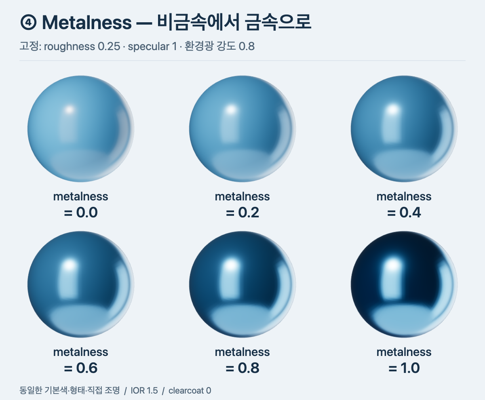
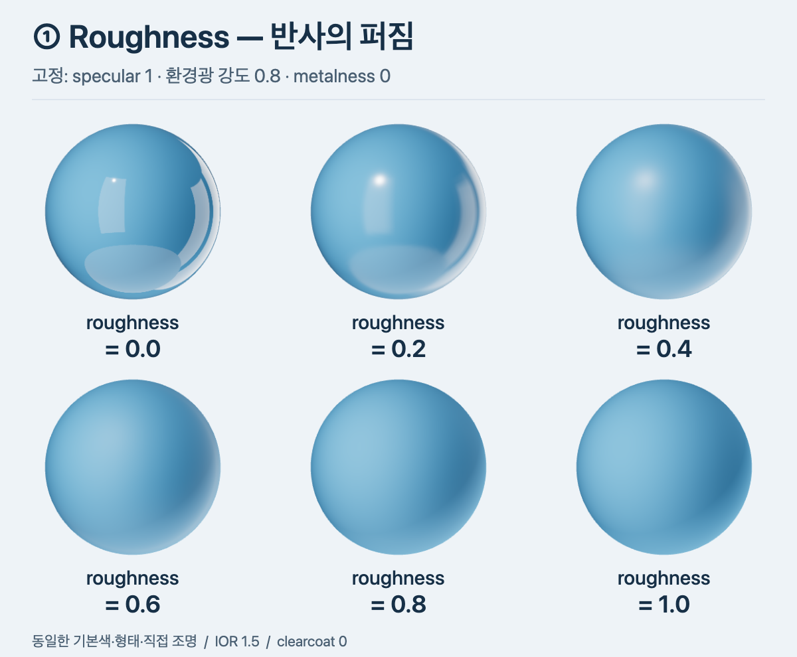
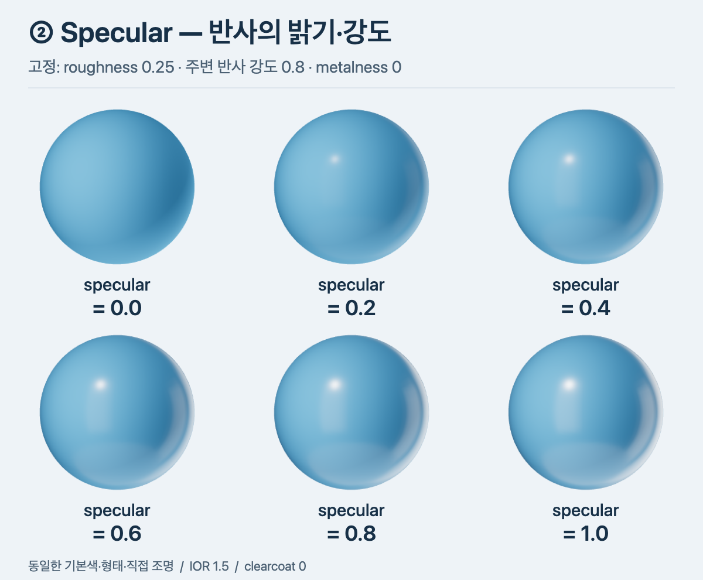
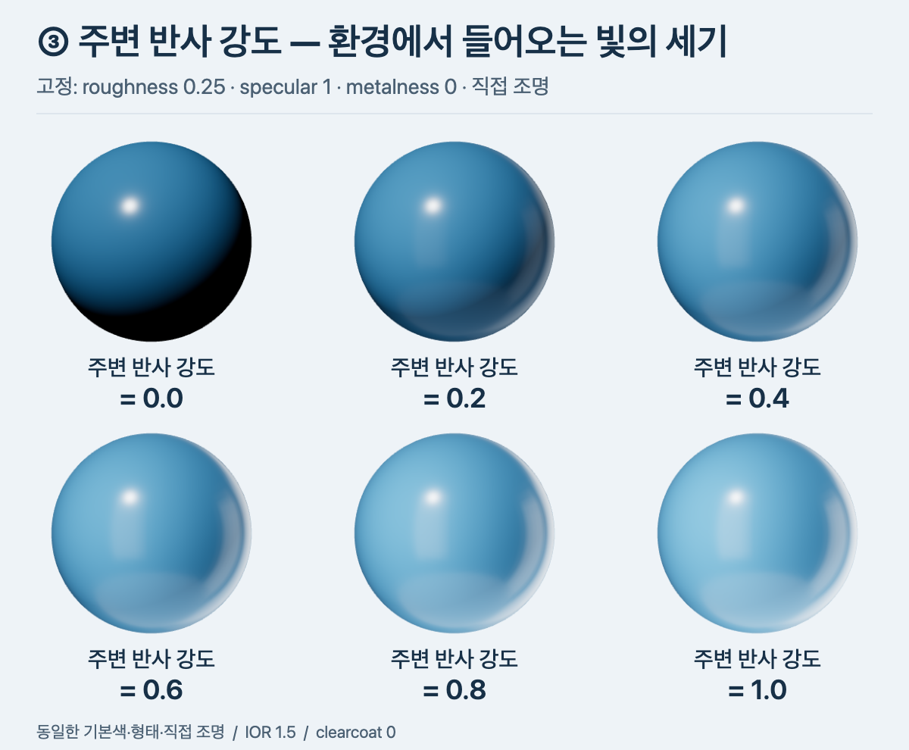

# PBR 재질: 최종 색에서 세부 계산까지

**최종 픽셀 색은 확산 반사와 정반사를 더한 빛으로 만든다.**
이 문서는 최종 계산에서 시작해 각 성분과 파라미터를 설명한다.
계산은 비교 이미지에 사용한 Three.js 0.163.0을 기준으로 한다.

## 1. 최종 픽셀 색

확산 반사는 넓은 방향으로 나오는 빛의 성분이다.
파란 무광 물체에서 넓게 보이는 파란색은 주로 확산 반사다.
정반사는 거울 반사 방향을 중심으로 나오는 빛의 성분이다.
조명이나 창문이 표면에 비친 부분은 주로 정반사다.

```text
합산 RGB = 확산 반사 RGB + 정반사 RGB
최종 픽셀 색 = 합산 RGB에 노출·톤 매핑·화면 색 변환 적용
```

각 성분에는 직접 조명과 환경광의 기여가 포함된다.
직접 조명이 여러 개이면 각 조명의 반사를 계산해서 더한다.
환경광은 환경 맵의 여러 방향에서 들어오는 빛을 사용한다.

```text
확산 반사 RGB = 각 직접 조명의 확산 반사 합 + 환경 확산 반사
정반사 RGB = 각 직접 조명의 정반사 합 + 환경 정반사
```

아래에서는 확산 반사와 정반사의 계산을 각각 설명한다.
파라미터가 필요한 단계에서는 이미지로 변화부터 확인한다.

## 2. 확산 반사 RGB

**확산 반사는 물체의 확산색과 표면이 받는 빛의 양으로 계산한다.**
많은 비금속에서는 빛이 내부로 들어가 산란한 뒤 나온다.
물체는 빛의 일부를 흡수한다.
나머지 빛의 색 성분이 물체의 색으로 보인다.
종이와 무광 도자기에서 이 성분을 쉽게 확인할 수 있다.

### 2.1 한 직접 조명의 확산 반사 계산

이 비교의 직접 조명은 Lambert 모델로 확산 반사를 계산한다.

```text
확산 반사 RGB = 조명 RGB × a × 확산색 / π
```

| 항 | 역할 |
| --- | --- |
| 조명 RGB | 해당 광원에서 들어오는 빛의 색과 세기 |
| a | 표면이 빛을 받는 각도에 따른 입사량 계수 |
| 확산색 | RGB 각 채널의 확산 반사 비율 |
| 1/π | 넓은 방향으로 나오는 빛의 총량을 맞추는 정규화 계수 |

이 모델에서는 확산 반사 반응을 모든 출력 방향에 동일하게 둔다.
반구 전체의 각도 가중 합이 π이므로 π로 나눈다.
확산색은 metalness로 계산한다.
a는 표면 법선과 광원 방향으로 계산한다.
[확산 반사 구현](https://github.com/mrdoob/three.js/blob/r163/src/renderers/shaders/ShaderChunk/common.glsl.js)

### 2.2 확산색: metalness로 기본색 배분



#### 이미지에서 확인할 변화

metalness=0이면 파란 확산 반사 위에 밝은 정반사가 보인다.
metalness=1이면 기본색이 정반사에 사용된다.
밝은 창문을 반사하는 위치는 밝게 보인다.
어두운 벽을 반사하는 위치는 어둡게 보인다.
중간값에서는 비금속과 금속의 성분이 섞인다.

금속도 주변 빛이 적으면 어둡게 보인다.
금속의 roughness가 커지면 정반사가 넓고 흐리게 보인다.

#### 확산색 계산

확산색은 기본색과 metalness로 계산한다.

| 기호 | 의미 |
| --- | --- |
| `C` | 기본색의 선형 RGB |
| `m` | metalness. 범위는 0~1 |

```text
확산색 = C × (1 − m)
```

`1−m`은 확산색에 사용하는 비금속의 비중이다.
m=0이면 확산색은 C와 같다.
m=1이면 확산색은 0이다.

기본색의 한 채널을 `C=0.5`로 가정한다.

| m | 확산색의 해당 채널 |
| --- | --- |
| 0 | `0.5 × 1 = 0.5` |
| 0.5 | `0.5 × 0.5 = 0.25` |
| 1 | `0.5 × 0 = 0` |

이 표는 계산 예시다.
비교 이미지의 기본색을 측정한 값은 아니다.
렌더러는 확산색을 확산 반사 식에 사용한다.
metalness는 정반사의 기준 반사색에도 사용한다.
이 계산은 정반사의 F 절에서 설명한다.
[확산색 구현](https://github.com/mrdoob/three.js/blob/r163/src/renderers/shaders/ShaderChunk/lights_physical_fragment.glsl.js)

#### 중간값의 사용

균일한 재질은 보통 비금속 0 또는 금속 1로 설정한다.
중간값은 경계 혼합, 텍스처 필터링, 표현 조절에 사용한다.
금속에 페인트나 코팅이 있으면 표면층의 성질도 고려한다.

### 2.3 a: 빛을 받는 각도 계수

N은 표면 법선이다.
L은 표면에서 광원을 향하는 방향이다.
두 방향 벡터의 길이는 1이다.

비스듬히 들어오는 빛은 더 넓은 표면에 걸쳐 닿는다.
따라서 단위 면적당 들어오는 빛이 줄어든다.
렌더러는 법선과 광원 방향으로 이 효과를 계산한다.

```text
a = max(N · L, 0)
```

| N과 L 사이 각도 | a |
| --- | --- |
| 0° | 1 |
| 60° | 0.5 |
| 90° | 0 |
| 90° 초과 | 0 |

### 2.4 여러 조명과 환경광의 확산 반사

렌더러는 각 직접 조명의 RGB와 방향으로 확산 반사를 계산한다.
렌더러는 계산한 RGB를 채널별로 더한다.

```text
직접 확산 반사 합 = 조명 1의 확산 반사 + 조명 2의 확산 반사 + …
```

환경 확산 반사는 표면이 받는 여러 방향의 환경빛을 합산한다.
실시간 렌더러는 미리 계산한 환경 맵 값으로 이 합을 근사한다.
이 비교에서는 환경의 입사량에 확산색/π를 적용한다.
정반사의 다중 산란에 따른 에너지 보정도 환경 계산에 포함한다.
환경빛의 세기는 [환경광 강도](#4-환경광-강도)로 조절한다.

## 3. 정반사 RGB

**정반사는 roughness와 specular 등 여러 재질 값을 함께 사용해 계산한다.**
roughness는 미세면 방향의 분포와 가림에 영향을 준다.
specular와 metalness는 미세면의 반사율에 영향을 준다.

### 3.1 한 직접 조명의 정반사 계산

```text
정반사 RGB = 조명 RGB × a × D × F × V
```

| 항 | 역할 | 관련 입력 |
| --- | --- | --- |
| 조명 RGB | 들어오는 빛의 색과 세기 | 광원 설정 |
| a | 빛을 받는 각도에 따른 입사량 계수 | 표면 법선, 광원 방향 |
| D | 반사에 필요한 방향의 미세면 분포 밀도 | roughness, 표면·광원·카메라 방향 |
| F | 해당 미세면에서 반사되는 빛의 비율 | specular, IOR, metalness, 기본색, 각도 |
| V | 미세면의 가림과 각도 보정 | roughness, 표면·광원·카메라 방향 |

`D × F × V`를 정반사 BRDF라고 한다.
BRDF는 들어오는 방향과 나가는 방향에 따른 표면의 반사 반응이다.
아래에서는 각 항의 입력과 계산을 설명한다.

### 3.2 계산에 사용할 방향

렌더러는 미세면 방향의 분포로 정반사를 계산한다.
이 방식을 미세면 모델이라고 한다.
이 비교에서는 GGX 분포를 사용한다.

방향 벡터는 같은 좌표 공간에서 계산한다.
다음 방향 벡터의 길이는 모두 1이다.
각도는 도 단위로 표시한다.
내적 값과 재질 값에는 단위가 없다.

| 기호 | 의미 |
| --- | --- |
| `N` | 전체 표면의 법선 |
| `L` | 표면에서 광원을 향하는 방향 |
| `W` | 표면에서 카메라를 향하는 방향 |
| `H` | L과 W의 중간 방향. 빛을 카메라로 반사하는 데 필요한 미세면 법선 |
| `q` | N과 H의 일치도 |

```text
H = normalize(L + W)
q = max(N · H, 0)
```

`normalize`는 벡터의 길이를 1로 만든다.
내적 `N · H`는 두 방향 사이 각도의 코사인이다.
`q=1`이면 N과 H가 일치한다.

### 3.3 D와 V의 입력: roughness



| 입력 roughness | 보이는 변화 |
| --- | --- |
| 0 | 창문 반사와 오른쪽 밝은 띠의 윤곽이 선명하다. |
| 0.2 | 반사 윤곽이 부드러워진다. |
| 0.4 | 반사가 넓은 밝은 영역으로 보인다. |
| 0.6~1 | 창문 형태가 흐려진다. 넓고 부드러운 밝기 변화가 남는다. |

roughness가 커지면 반사에 기여하는 미세면 방향의 범위가 넓어진다.
그 결과 하이라이트가 넓어지고 반사 윤곽이 흐려진다.

#### 계산용 roughness의 최소값

r은 최소값과 표면 방향 변화량을 반영한 계산용 roughness다.
α는 GGX 분포의 거칠기 값이다.

```text
α = r²
```

입력 roughness가 정확히 0이면 `α=0`이 된다.
이때 `q=1`이면 아래 D 식의 분자와 분모가 모두 0이다.
따라서 D가 `0/0`으로 정의되지 않는다.

**이 문제를 피하기 위해 계산에는 0보다 큰 roughness를 사용한다.**
Three.js r163은 최소값 **0.0525**를 적용한다.
이 최소값은 환경 맵 해상도도 고려한 구현값이다.
렌더러는 표면 방향의 화면상 변화량으로 roughness를 추가 보정한다.

```text
r = max(입력 roughness, 0.0525)
r = min(r + 표면 방향 변화량 보정, 1)
```

따라서 이미지의 입력 0도 계산에는 양수 roughness를 사용한다.
최소값 0.0525는 Three.js r163의 설정이다.
다른 렌더러는 다른 최소값을 사용할 수 있다.

완벽한 거울은 정확한 반사 방향에 빛이 집중되는 극한이다.
이 비교의 입력 0은 최소값을 적용한 매끄러운 표면이다.
roughness는 구의 실제 형상에 돌기를 추가하지 않는다.
[계산용 roughness 구현](https://github.com/mrdoob/three.js/blob/r163/src/renderers/shaders/ShaderChunk/lights_physical_fragment.glsl.js)

#### D: 미세면 방향의 분포 밀도

D는 H 방향을 향한 미세면의 분포 밀도다.

```text
D = α² / { π × [q² × (α² − 1) + 1]² }
```

D는 방향 분포의 밀도다.
D는 1보다 클 수 있다.
D는 정반사 계산에 곱하는 값이다.

`q=1`이면 식은 다음과 같이 줄어든다.

```text
D = 1 / (π × α²)
```

| 계산용 roughness r | α=r² | q=1일 때 D |
| --- | --- | --- |
| 0.2 | 0.04 | 약 198.94 |
| 0.8 | 0.64 | 약 0.777 |

작은 α는 일치하는 방향에 높은 밀도를 만든다.
방향이 어긋나면 밀도가 빠르게 낮아진다.
큰 α는 최고 밀도를 낮추고 방향 분포를 넓힌다.

`α=r²`는 roughness 입력을 GGX 분포의 거칠기 값으로 변환한다.
[GGX 분포 구현](https://github.com/mrdoob/three.js/blob/r163/src/renderers/shaders/ShaderChunk/lights_physical_pars_fragment.glsl.js)

#### V: 미세면의 가림과 각도 보정

다른 미세면은 빛이 들어오는 경로를 가릴 수 있다.
다른 미세면은 빛이 카메라로 나가는 경로도 가릴 수 있다.
V는 이 가림 효과와 각도 보정을 함께 계산한다.

a는 표면이 광원을 얼마나 정면으로 향하는지 나타낸다.
b는 표면이 카메라를 얼마나 정면으로 향하는지 나타낸다.
두 값은 다음 방향으로 계산한다.

| 기호 | 방향 |
| --- | --- |
| N | 표면에서 수직으로 나오는 법선 |
| L | 표면에서 광원을 향하는 방향 |
| W | 표면에서 카메라를 향하는 방향 |

방향 벡터의 길이는 모두 1이다.
내적은 두 방향 사이 각도의 코사인이다.

```text
a = max(N · L, 0)
b = max(N · W, 0)
```

| 법선과 해당 방향 사이 각도 | a 또는 b |
| --- | --- |
| 0°: 정면 | 1 |
| 60°: 비스듬한 방향 | 0.5 |
| 90°: 표면을 스치는 방향 | 0 |
| 90° 초과: 표면 뒤쪽 방향 | 0 |

예를 들어 a=1이면 빛이 표면에 정면으로 들어온다.
b=0.5이면 카메라 방향은 법선과 60°를 이룬다.
V는 a, b, roughness로 두 경로의 미세면 가림을 계산한다.
한 경로는 광원에서 표면으로 들어오는 경로다.
다른 경로는 표면에서 카메라로 나가는 경로다.

가림 계수 `G`는 0~1이다.
a와 b가 양수이면 다음 관계가 성립한다.

```text
V = G / (4 × a × b)
```

V는 작은 `4ab`로 나누므로 1보다 클 수 있다.
Three.js의 GGX Smith 상관 가림 모델은 V를 직접 계산한다.

```text
t = α²
g₁ = a × √[t + (1 − t) × b²]
g₂ = b × √[t + (1 − t) × a²]
V = 0.5 / max(g₁ + g₂, 0.000001)
```

분모의 최소값 0.000001은 0으로 나누는 계산을 피한다.

| 계산용 roughness r | a | b | V | G=4abV |
| --- | --- | --- | --- | --- |
| 0.2 | 1 | 1 | 0.25 | 1 |
| 0.8 | 1 | 1 | 0.25 | 1 |
| 0.2 | 0.5 | 0.5 | 약 0.998 | 약 0.998 |
| 0.8 | 0.5 | 0.5 | 약 0.670 | 약 0.670 |
| 0.8 | 0.1 | 0.1 | 약 3.878 | 약 0.155 |

광원과 카메라가 표면 정면에 있으면 `a=b=1`이다.
이 조건에서 V는 0.25다.
`a=b=0.5`인 예시에서는 roughness가 커지면 가림이 증가한다.
그 결과 V가 약 0.998에서 약 0.670으로 줄어든다.
마지막 행에서는 작은 `4ab`로 나누므로 V가 1을 넘는다.
최종 정반사는 a, D, V, F를 함께 곱해 계산한다.
[V 계산 구현](https://github.com/mrdoob/three.js/blob/r163/src/renderers/shaders/ShaderChunk/lights_physical_pars_fragment.glsl.js)

#### 하이라이트의 폭

구의 법선은 위치마다 다르다.
따라서 각 픽셀의 q와 D도 다르다.
반사 중심을 A, 중심에서 조금 벗어난 위치를 B라고 하자.

| 위치 | roughness가 낮을 때 | roughness가 높을 때 |
| --- | --- | --- |
| A: N과 H가 잘 일치하는 위치 | 높은 D가 강한 반사를 만든다. | D의 최고점이 낮아진다. |
| B: N과 H가 조금 어긋난 위치 | 낮은 D가 약한 반사를 만든다. | 넓어진 분포에 따라 D가 커질 수 있다. |

렌더러는 A와 B에서 각각 a, D, V, F를 계산한다.
렌더러는 각 위치의 계산값을 조명 RGB에 곱한다.
거칠기가 커지면 중심에서 벗어난 위치에도 반사 성분이 나타날 수 있다.
그 결과 화면에 넓은 하이라이트가 나타난다.

환경 반사는 미리 평균한 환경 맵을 사용한다.
roughness가 커지면 더 넓은 방향의 빛을 평균한 값을 조회한다.
그 결과 창문 반사의 경계가 부드러워진다.
[환경 반사 조회 구현](https://github.com/mrdoob/three.js/blob/r163/src/renderers/shaders/ShaderChunk/envmap_physical_pars_fragment.glsl.js)

### 3.4 F의 입력: specular와 기준 반사율



#### 이미지에서 확인할 변화

구 위쪽의 하이라이트와 오른쪽 반사 띠를 비교한다.
specular가 커지면 비금속의 정반사가 강해진다.
이 이미지의 roughness는 모두 0.25다.
반사가 강해지면 약한 반사 영역도 눈에 보일 수 있다.

#### 1단계: 비금속의 기준 반사율 R 계산

비금속의 기준 반사율은 굴절률 차이로 결정한다.
빛의 일부는 표면에서 반사된다.
나머지 빛은 내부로 들어가거나 흡수된다.

| 기호 | 의미 |
| --- | --- |
| `s` | specularIntensity. 이 비교의 범위는 0~1 |
| `n` | 재질의 IOR. 주변 공기의 굴절률은 1로 가정 |
| `R` | 비금속의 정면 입사 기준 반사율 |

흰 반사색을 사용할 때 다음 식을 적용한다.

```text
R = s × [(n − 1) / (n + 1)]²
```

두 매질의 굴절률이 같으면 `n−1=0`이다.
따라서 이 기준 반사율은 0이다.
s는 기준 반사율을 조절하는 배수다.

IOR=1.5이면 다음과 같이 계산한다.

```text
[(1.5 − 1) / (1.5 + 1)]² = 0.04
R = 0.04 × s
```

| specular | 0 | 0.2 | 0.4 | 0.6 | 0.8 | 1 |
| --- | --- | --- | --- | --- | --- | --- |
| 기준 반사율 | 0% | 0.8% | 1.6% | 2.4% | 3.2% | 4% |

이 조건에서 specular=1은 기준 반사율 4%를 사용한다.
R은 다음 단계에서 최종 기준 반사색 F₀를 구할 때 사용한다.
[기준 반사율 구현](https://github.com/mrdoob/three.js/blob/r163/src/renderers/shaders/ShaderChunk/lights_physical_fragment.glsl.js)

#### 적용 범위

이 비교의 specular는 비금속 정반사에 적용한다.
metalness=1이면 specularIntensity의 영향이 사라진다.
별도 clearcoat가 있으면 코팅층의 정반사를 추가로 계산한다.

#### 2단계: metalness로 최종 기준 반사색 F₀ 계산

정반사의 F₀는 비금속의 기준 반사율과 금속의 기본색을 결합한다.
metalness로 두 성분의 비중을 정한다.

| 기호 | 의미 |
| --- | --- |
| `C` | 기본색의 선형 RGB |
| `m` | metalness. 범위는 0~1 |
| `R` | 앞 단계에서 구한 비금속의 기준 반사율 |
| `F₀` | 정면 입사에서의 RGB 채널별 기준 반사율 |

앞에서 구한 R을 재사용한다.
흰 비금속 반사색에서는 같은 R을 RGB 각 채널에 사용한다.

```text
F₀ = R × (1 − m) + C × m
```

IOR=1.5이면 R=0.04×s이므로 다음 식과 같다.

```text
F₀ = (0.04 × s) × (1 − m) + C × m
```

s는 R을 조절하는 입력 배수다.
R은 비금속 성분의 기준 반사율이다.
F₀는 비금속과 금속 성분을 혼합한 최종 기준 반사색이다.
예를 들어 비금속에서 s=0.5이면 F₀=0.02다.
이 값은 정면 입사에서 약 2%를 반사한다는 뜻이다.

m=0이면 비금속의 기준 반사율을 사용한다.
m=1이면 F₀는 C와 같다.
따라서 금속에서는 specularIntensity의 영향이 사라진다.

기본색의 한 채널을 C=0.5로 가정한다.
specularIntensity는 s=1로 고정한다.

| m | F₀의 해당 채널 |
| --- | --- |
| 0 | `0.04 × 1 + 0.5 × 0 = 0.04` |
| 0.5 | `0.04 × 0.5 + 0.5 × 0.5 = 0.27` |
| 1 | `0.04 × 0 + 0.5 × 1 = 0.5` |

렌더러는 이 F₀로 각도별 F를 계산한다.
계산한 F는 정반사 RGB에 곱한다.

```text
specularIntensity, IOR → R 계산
R, metalness, 기본색 → F₀ 계산
→ 각도별 F 계산
→ 정반사 RGB 계산
```

[기준 반사색 구현](https://github.com/mrdoob/three.js/blob/r163/src/renderers/shaders/ShaderChunk/lights_physical_fragment.glsl.js)

#### 3단계: F₀로 미세면의 각도별 반사율 F 계산

F는 미세면의 프레넬 반사율이다.
F는 미세면에 도착한 빛 중 표면에서 반사되는 비율을 나타낸다.
예를 들어 F=0.04이면 해당 색 채널의 빛 중 약 4%가 표면에서 반사된다.
렌더러는 RGB 각 채널의 F를 계산한다.

유리를 정면에서 보면 내부가 잘 보인다.
유리를 비스듬히 보면 주변 풍경의 반사가 강해진다.
빛이 표면을 스치는 각도로 들어올수록 반사율이 커지기 때문이다.
미세면에도 같은 각도에 따른 반사율 변화를 적용한다.

`F₀`는 정면 입사에서의 기준 반사율이다.
비금속의 F₀는 IOR와 specular로 결정한다.
이 계산 예시는 IOR=1.5, specular=1을 사용한다.
따라서 `F₀=(0.04,0.04,0.04)`이다.

F에 사용하는 각도 φ는 H와 W 사이의 각도다.
H는 반사에 필요한 미세면의 법선이다.
이 반사 조건에서 H와 L 사이의 각도도 φ와 같다.
빛이 미세면을 스치는 각도가 되면 F가 커진다.
다음 Schlick 근사식은 스치는 각도의 반사율을 1로 둔다.

```text
u = max(H · W, 0) = cos φ
F = F₀ + (1 − F₀) × (1 − u)⁵
```

| φ | F₀=0.04일 때 채널별 F | 반사율 |
| --- | --- | --- |
| 0° | 0.04 | 약 4% |
| 60° | 0.07 | 약 7% |
| 80° | 약 0.410 | 약 41% |
| 90°에 접근 | 1에 접근 | 약 100%에 접근 |

F가 커지면 해당 픽셀에 더하는 정반사 RGB가 커진다.
그 결과 조명의 하이라이트와 주변 풍경의 반사가 강하게 보인다.
흰 조명과 흰 반사율을 사용하면 흰 정반사 성분이 더해진다.

다른 계산값을 고정하고 F만 0.04에서 0.08로 변경한다고 가정한다.
이때 정반사 RGB는 두 배가 된다.

```text
정반사 RGB = 조명 RGB × a × D × V × F
```

이 예시는 F의 곱셈 효과를 설명한다.
실제로 각도를 변경하면 a, D, V도 함께 달라질 수 있다.
D는 반사에 필요한 방향의 미세면 분포 밀도를 계산한다.
F는 해당 미세면에서 빛이 반사되는 비율을 계산한다.

이 표는 위 Schlick 식으로 계산했다.
Three.js r163은 다음 식으로 거듭제곱 항을 근사한다.

```text
p = 2^[(-5.55473 × u − 6.98316) × u]
F = F₀ × (1 − p) + F₉₀ × p
```

`F₉₀`는 스치는 각도의 반사율이다.
이 예시에서는 `F₉₀=1`이다.
실제 근사식에서 φ=60°의 F는 약 0.0726이다.
[프레넬 계산 구현](https://github.com/mrdoob/three.js/blob/r163/src/renderers/shaders/ShaderChunk/common.glsl.js)

### 3.5 계산한 항을 RGB에 적용

`Lᵢ`는 들어오는 조명의 선형 RGB 값이다.
Lᵢ에는 조명의 색과 세기를 포함한다.
그림자와 거리 감쇠가 있으면 Lᵢ에 반영한다.

한 직접 조명의 정반사는 다음 순서로 계산한다.

1. 법선 N, 광원 방향 L, 카메라 방향 W를 구한다.
2. 중간 방향 H를 구한다.
3. 계산용 roughness r과 분포 값 α를 구한다.
4. 각도 값 a, b, q, u를 구한다.
5. D, F, V를 구한다.
6. 조명 RGB에 a, D, V, F를 곱한다.

```text
정반사 반응(BRDF) = D × V × F
L정반사 = Lᵢ × a × D × V × F
```

D, V, a는 RGB 각 채널에 같은 값으로 곱한다.
F는 RGB 각 채널에 해당하는 값으로 곱한다.

흰 조명과 흰 F는 흰 정반사 성분을 만든다.
빨간 조명은 빨간 정반사 성분을 만들 수 있다.
금속의 F에는 기본색이 반영된다.
[직접 조명 계산 구현](https://github.com/mrdoob/three.js/blob/r163/src/renderers/shaders/ShaderChunk/lights_physical_pars_fragment.glsl.js)

#### RGB 곱셈 예시

이 예시는 정반사 식의 곱셈을 설명한다.
다음 값을 고정하고 D만 변경한다.

```text
Lᵢ = (1, 1, 1)
a = 0.8
F = (0.04, 0.04, 0.04)
V = 0.4
```

| D | 채널별 계산 | 정반사 RGB |
| --- | --- | --- |
| 2 | `1 × 0.8 × 2 × 0.4 × 0.04` | `(0.0256, 0.0256, 0.0256)` |
| 10 | `1 × 0.8 × 10 × 0.4 × 0.04` | `(0.128, 0.128, 0.128)` |

다른 조명 성분의 합을 `(0.1,0.3,0.5)`라고 가정한다.
두 번째 정반사를 더하면 `(0.228,0.428,0.628)`이 된다.
흰 성분이 더해져 밝기가 증가하고 색이 옅어진다.
렌더러는 합산 결과에 톤 매핑과 화면 색 변환을 적용한다.

이 수치는 선형 RGB 계산 예시다.
비교 이미지에서 측정한 값은 아니다.
실제 roughness 변경은 D, V, 환경 반사 계산에 함께 영향을 준다.

### 3.6 여러 조명과 환경광의 정반사

직접 조명마다 정반사 RGB를 계산한다.
광원 방향이 바뀌면 a, D, F, V도 달라질 수 있다.
재질의 roughness, specular, metalness는 같은 픽셀의 값을 사용한다.

```text
직접 정반사 합 = 조명 1의 정반사 + 조명 2의 정반사 + …
```

환경 정반사는 여러 입사 방향의 빛과 표면 반응을 합산한다.
이 비교에서는 roughness별로 미리 평균한 환경 맵을 사용한다.
렌더러는 환경 맵 값과 반사 반응의 근사값을 결합한다.
미리 평균한 환경 맵의 데이터와 생성 과정은 [PMREM](./pmrem.md)에서 설명한다.
환경광 강도는 환경 맵의 빛에 적용한다.

```text
전체 정반사 RGB = 직접 정반사 합 + 환경 정반사 RGB
```

[환경 반사 구현](https://github.com/mrdoob/three.js/blob/r163/src/renderers/shaders/ShaderChunk/envmap_physical_pars_fragment.glsl.js)

## 4. 환경광 강도



### 이미지에서 확인할 변화

환경광 강도가 0이면 구의 아래쪽이 매우 어둡다.
직접 조명은 유지되므로 위쪽 하이라이트가 남는다.
환경광 강도가 커지면 어두운 면이 밝아진다.
창문과 밝은 공간의 정반사도 강해진다.

### 환경광 계산

환경 맵은 들어오는 빛을 방향별로 저장한다.
렌더러는 환경 맵으로 확산 반사와 정반사를 계산한다.
환경광 강도는 두 성분의 입력 세기를 조절한다.

| 기호 | 의미 |
| --- | --- |
| `e` | 환경광 강도 |
| `E확산` | 강도 1에서 계산한 환경 확산 반사의 선형 RGB |
| `E정반사` | 강도 1에서 계산한 환경 정반사의 선형 RGB |

```text
환경 기여분 = e × (E확산 + E정반사)
전체 빛 = 직접 조명 기여분 + 환경 기여분
```

기준 환경 기여분의 한 채널을 0.2로 가정한다.

| e | 환경 기여분의 해당 채널 |
| --- | --- |
| 0 | 0 |
| 0.4 | 0.08 |
| 1 | 0.2 |

이 식은 환경광 계산 결과를 묶은 요약이다.
실제 구현은 환경빛을 조회할 때 `envMapIntensity`를 곱한다.
[환경광 강도 구현](https://github.com/mrdoob/three.js/blob/r163/src/renderers/shaders/ShaderChunk/envmap_physical_pars_fragment.glsl.js)

### 적용 범위

specular는 직접 조명과 환경광의 비금속 정반사에 영향을 준다.
환경광 강도는 환경 맵의 빛에 적용한다.
직접 조명의 세기는 별도 조명 설정으로 조절한다.

이 비교에서는 재질에 환경 맵을 직접 연결했다.
scene의 환경 설정을 사용하면 엔진 버전의 강도 설정을 확인한다.

## 5. 전체 픽셀 계산 순서

GPU는 각 표면 픽셀의 재질 값과 방향을 사용한다.
환경 맵은 미리 준비한 텍스처를 사용한다.

1. IOR와 specular로 비금속의 F₀를 계산한다.
2. metalness로 확산색과 최종 F₀를 계산한다.
3. 계산용 roughness와 α를 계산한다.
4. 표면, 광원, 카메라 방향으로 각도 값을 계산한다.
5. 각 직접 조명의 D, V, F를 계산한다.
6. 직접 조명의 확산 반사와 정반사를 계산한다.
7. roughness에 맞는 환경 맵 값을 조회한다.
8. 환경광 강도로 환경빛의 입력을 조절한다.
9. 환경 확산 반사와 환경 정반사를 계산한다.
10. 모든 빛의 성분을 합산한다.
11. 노출, 톤 매핑, 화면 색 변환을 적용한다.
12. 최종 픽셀 색을 출력한다.

이 순서는 계산의 의존 관계를 설명한다.
shader의 실행문 배치는 구현에 따라 달라질 수 있다.

## 6. 재질 조절 순서

| 원하는 변화 | 조절할 값 | 계산상의 변화 |
| --- | --- | --- |
| 창문 반사를 선명하게 표시 | roughness 감소 | 반사 방향 분포가 좁아진다. |
| 비금속 정반사를 강하게 표시 | specular 증가 | 비금속의 기준 반사율이 커진다. |
| 환경 반사와 어두운 면을 함께 밝게 표시 | 환경광 강도 증가 | 환경 맵의 빛이 강해진다. |
| 기본색을 금속 정반사에 사용 | metalness 증가 | 확산색은 줄고 금속 기준 반사색의 비중은 커진다. |

플라스틱이나 도자기는 다음 순서로 조절한다.

1. metalness를 0으로 설정한다.
2. roughness로 반사의 폭과 흐림을 조절한다.
3. specular로 정반사의 강도를 조절한다.
4. 환경광 강도로 주변 빛의 세기를 조절한다.

이미지의 값은 설명용 장면의 설정이다.
실제 상품의 재질 측정값은 아니다.

## 용어와 비교 조건

### 용어

| 용어 | 이 문서의 의미 |
| --- | --- |
| 기본색 | 재질에 입력하는 색 |
| 확산 반사 | 넓은 방향으로 나오는 빛의 성분 |
| 정반사 | 거울 반사 방향을 중심으로 나오는 빛의 성분 |
| 하이라이트 | 정반사로 밝게 보이는 영역 |
| 미세면 | 표면을 구성한다고 가정하는 작은 면 |
| 법선 | 표면에 수직으로 나오는 방향 |
| 환경 맵 | 주변에서 들어오는 빛을 방향별로 저장한 텍스처 |
| 선형 RGB | 빛을 더하고 곱할 때 사용하는 RGB 값 |
| 톤 매핑 | 계산한 빛의 범위를 화면에 표시할 범위로 변환하는 처리 |

| 파라미터 | 코드 이름 | 역할 |
| --- | --- | --- |
| roughness | `roughness` | 미세면 방향 분포와 반사의 흐림을 조절한다. |
| specular | `specularIntensity` | 비금속의 기준 반사율을 조절한다. |
| 환경광 강도(Environment intensity) | `envMapIntensity` | 환경 맵에서 들어오는 빛의 세기를 조절한다. |
| metalness | `metalness` | 확산색과 기준 반사색에 기본색을 배분한다. |

이 문서의 코드 이름은 Three.js 0.163.0을 기준으로 한다.
다른 렌더러에서는 같은 이름에 다른 계산을 사용할 수 있다.

### 비교 이미지의 조건

비교 이미지는 Three.js 0.163.0의 `MeshPhysicalMaterial`로 렌더링했다.
각 이미지에서는 한 가지 파라미터만 변경했다.
고정값은 이미지 위에 표시했다.
변경한 파라미터와 값은 각 구 아래에 표시했다.

| 조건 | 설정 |
| --- | --- |
| 형태, 기본색, 카메라, 직접 조명 | 모든 이미지에서 동일 |
| 환경 맵 | 밝은 창문, 밝은 천장, 어두운 벽을 표현한 동일한 맵 |
| IOR | 1.5 |
| clearcoat | 0 |
| 화면 처리 | ACES 톤 매핑과 화면 색 변환 |
| 윗줄 값 | 왼쪽부터 0, 0.2, 0.4 |
| 아랫줄 값 | 왼쪽부터 0.6, 0.8, 1 |

톤 매핑을 적용하므로 화면 밝기는 계산한 빛의 값에 정비례하지 않는다.

### 작성 기준

이 문서는 ASD-STE100의 작성 원칙을 한글에 적용했다.
한 문장에는 한 가지 내용을 쓴다.
같은 개념에는 같은 용어를 쓴다.
영어 어휘 규칙에 따른 적합성은 주장하지 않는다.
[ASD-STE100 설명](https://www.asd-ste100.org/STE_faq.html)

## 구현 참고

- [웃음꽃의 재질과 조명 구현](../artworks/smile-flower/architecture.md)
