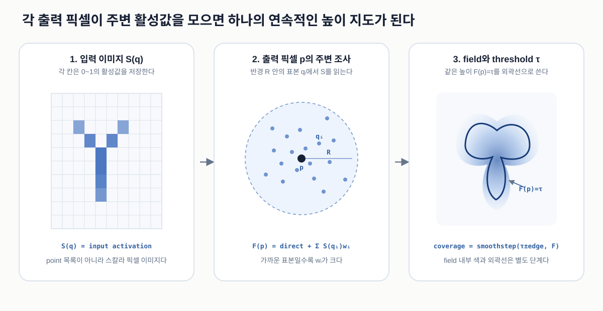

# Pixel-sampled Metaball Field

활성 픽셀 이미지를 주변에서 여러 번 읽어 연속적인 높이 지도 `F`를 만들고, 그중 한 높이를 외곽선으로 꺼내는 방법이다.

Color Text에서 이 원리를 사용하는 위치는 [`Color Text 아키텍처`](../artworks/color-text/architecture.md)의 geometry 단계를 참고한다.

## 1. 그림으로 먼저 보기



왼쪽의 `S(q)`는 활성 픽셀 이미지다. 가운데에서 출력 픽셀 `p`는 반경 `R` 안의 표본 `q_i`를 읽고, 오른쪽에서 누적 결과 `F(p)`가 기준 높이 `τ`를 지나는 위치를 외곽선으로 사용한다.

## 2. 해결하려는 문제

글자 마스크와 Falloff를 곱하면 액체 효과가 닿은 글자 픽셀만 남는다. 이 이미지를 그대로 화면에 그리면 결과가 글자 굵기만큼 얇고, 가까운 글자 조각 사이도 떨어져 보인다.

단순히 가장 가까운 활성 픽셀까지의 거리만 사용하면 모든 픽셀 주위에 같은 반경의 원을 붙인 것과 비슷해진다. 계산은 빠르지만 `Y`의 두 팔과 줄기처럼 여러 방향의 픽셀이 만나는 구조를 동시에 측정하지 못해 교차부가 둥근 뚜껑처럼 부풀 수 있다.

필요한 것은 출력 위치마다 다음 질문에 답하는 값이다.

> 이 위치 주변에 활성 픽셀이 얼마나 많이, 얼마나 가까이 분포해 있는가?

그 답을 화면 전체에 저장한 이미지가 field `F`다.

## 3. 입력과 출력

| 기호 | 종류와 공간 | 의미 |
| --- | --- | --- |
| `S(q)` | texture UV `[0,1]`에서 읽은 스칼라 | 위치 `q`의 활성값, 일반적으로 `0~1` |
| `p` | 출력 texture의 현재 UV | 지금 field 값을 계산하는 출력 픽셀 위치 |
| `q_i` | `p` 주변의 표본 UV | `i`번째로 `S`를 읽을 위치 |
| `N` | 고정 정수 | 한 출력 픽셀에서 사용하는 주변 표본 수 |
| `R` | artwork pixel | 표본을 놓는 최대 조사 반경 |
| `w_i` | 무단위 weight | `q_i`가 `p`에 가까운 정도 |
| `F(p)` | 스칼라 field | `p` 주변 활성 픽셀의 누적 영향 |
| `τ` | field와 같은 단위 | 최종 외곽선을 꺼내는 높이 |

`p`와 `q_i`는 shader에서 `[0,1]` UV지만, 반경과 거리는 artwork pixel로 정한다. 비율이 다른 화면에서도 원형 조사 범위를 유지하려면 pixel offset을 `artSize`로 나눠 UV offset으로 바꿔야 한다.

## 4. 황금각으로 표본 위치 만들기

같은 반경에 표본을 줄지어 놓으면 가로, 세로 또는 대각선 방향의 무늬가 field에 남는다. 방향 반복을 줄이기 위해 표본마다 황금각을 더한다.

표본 `i`의 정규화된 반경과 각도는 다음과 같다.

```text
u_i     = (i + 0.5) / N
rho_i   = sqrt(u_i)
theta_i = i * phi_g
phi_g   = PI * (3 - sqrt(5)) ~= 2.39996 rad ~= 137.5°
```

`rho_i`가 `0`이면 중심이고 `1`이면 조사 원의 끝이다. 실제 pixel offset은 다음과 같다.

```text
offset_i = R * rho_i * (cos(theta_i), sin(theta_i))
q_i      = p + offset_i / artSize
```

### 왜 반경에 `sqrt()`가 필요한가

원의 중심에서 반경 `r`까지의 면적은 `PI * r²`에 비례한다. `rho_i = u_i`로 놓으면 같은 index 간격이 같은 반경 간격이 되어 중심에 표본이 상대적으로 몰린다.

```text
면적 비율 u = rho²
rho = sqrt(u)
```

따라서 `u`를 일정하게 늘리고 `sqrt(u)`를 반경으로 사용하면 각 표본이 담당하는 원의 면적이 비슷해진다.

황금각은 유일한 균일 표본법이 아니다. 다만 작은 정수 비율로 반복되기 어려워 고정된 적은 수의 표본을 순서대로 추가할 때 방향 줄무늬가 늦게 나타나는 실용적인 선택이다.

## 5. 거리 weight 만들기

표본이 중심 `p`에 가까울수록 더 큰 영향을 주고, 조사 반경 끝에서는 영향이 0이 되게 한다.

```text
w_i = max(1 - rho_i, 0)^beta
```

각 항의 의미는 다음과 같다.

- `rho_i`: 조사 반경에 대한 거리 비율
- `1 - rho_i`: 중심에서 1, 끝에서 0이 되는 기본 영향
- `beta`: 중간 거리를 얼마나 빠르게 줄일지 정하는 지수

`beta`가 커지면 가까운 활성 픽셀만 강하게 남아 field가 단단하고 좁아진다. 작아지면 먼 표본도 더 많이 참여해 field가 넓게 이어진다.

## 6. 주변 활성값을 하나의 field로 합치기

현재 Color Text 코드와 같은 형태로 쓰면 다음과 같다.

```text
A(p) = [S(p) + sum(S(q_i) * w_i)] / [1 + sum(w_i)]
F(p) = sourceGain * S(p) + fieldGain * A(p)
```

`A(p)`는 주변 활성값의 거리 가중 평균이다. 분자와 분모에 들어 있는 첫 `S(p)`와 `1`은 중심 픽셀을 표본 하나처럼 포함한다.

- 주변이 모두 0이면 `A(p)`도 0에 가깝다.
- 가까운 곳에 활성 픽셀이 많으면 여러 `S(q_i)w_i`가 더해져 `A(p)`가 커진다.
- `sourceGain`은 현재 픽셀의 원래 활성 모양을 얼마나 직접 보존할지 정한다.
- `fieldGain`은 주변 분포가 외곽선을 얼마나 넓게 연결할지 정한다.

이 구조에서 `sourceGain`과 `fieldGain`은 정규화된 물리량이 아니라 작품의 실루엣을 조절하는 경험적 gain이다.

## 7. Smoothing과 threshold

고정된 개수의 표본만 사용하면 작은 점무늬와 계단이 남을 수 있다. Color Text는 field를 가로와 세로 Gaussian filter로 한 번씩 smoothing한다.

```text
raw field
  -> horizontal Gaussian
  -> vertical Gaussian
  -> smoothed field F_s
```

최종 coverage는 높이 `τ` 주변의 좁은 범위를 `smoothstep()`으로 바꾼 값이다.

```text
coverage(p) = smoothstep(τ - edge, τ + edge, F_s(p))
```

`τ`가 커지면 높은 곳만 남아 실루엣이 좁아지고, 작아지면 낮은 주변 영향까지 포함해 넓어진다. `edge`는 모양 크기보다 외곽선의 안티앨리어싱 폭을 담당한다.

## 8. 실제 Color Text 코드

현재 구현은 [`pages/color-text/script.ts`](../../pages/color-text/script.ts)의 다음 material에 나뉘어 있다.

| 코드 | 역할 | 계산 빈도 |
| --- | --- | --- |
| `surfaceSourceMaterial` | 약한 활성값을 부드럽게 제외 | 매 frame, 매 field pixel |
| `surfaceBlurMaterial` | 황금각 표본 192개 누적 | 매 frame, 매 field pixel |
| `surfaceSmoothMaterial` | Gaussian 가로·세로 pass | 매 frame, 매 field pixel |
| `finalMaterial` | threshold와 `fwidth()`로 coverage 생성 | 매 frame, 매 출력 fragment |

Color Text의 현재 작품 전용 값은 다음과 같다.

| 값 | 기본값 |
| --- | ---: |
| `N` | 192 |
| `R` | 30 artwork px |
| `beta` | 3.2 |
| `sourceGain` | 0.55 |
| `fieldGain` | 2.2 |
| Gaussian sigma | 1.8 |
| `τ` | 0.07 |

## 9. 일반적인 기법과 이 구현의 위치

이 방식은 고전적인 point Metaball 공식을 그대로 계산하지 않는다. 고전적 Metaball은 보통 점이나 구 중심 목록에서 거리 함수를 합산한다.

Color Text는 이미 rasterized된 활성 픽셀 이미지 `S`를 입력으로 받고, 원판 표본으로 주변 값을 모으는 **image-space radial accumulation**을 사용한다. 결과가 가까운 영역을 연결하고 threshold 외곽선을 만든다는 점에서 Metaball과 같은 역할을 하므로 이 프로젝트에서는 pixel-sampled Metaball field라고 부른다.

## 10. 비용, 한계, 대안

계산량은 대략 다음 값에 비례한다.

```text
field width * field height * sample count
```

Color Text에서는 `480 * 600 * 192`, 약 5천5백만 번의 주변 texture 확인이 한 frame에 필요하다. GPU fragment가 병렬로 처리하지만 모바일 성능에서 가장 비싼 pass 중 하나다.

현재 방식이 보장하지 않는 것:

- 표본 사이의 모든 픽셀을 읽는 정확한 원형 convolution
- threshold가 바뀌어도 일정한 실루엣 면적 유지
- 물리적인 부피나 표면장력
- 모든 글꼴과 크기에서 동일한 최적값

대안은 목적에 따라 다르다.

- 일정 반경의 몸체가 필요하면 distance transform 또는 SDF dilation
- 부드러운 blur만 필요하면 separable Gaussian convolution
- 점 개수가 적으면 고전적인 point Metaball 합산
- 정확한 거리와 normal이 필요하면 SDF 또는 exact Euclidean distance transform

## 11. 핵심 요약

```text
활성 픽셀 S
  -> 출력 픽셀 p 주변의 황금각 표본 q_i
  -> 거리 weight w_i로 누적한 field F(p)
  -> Gaussian smoothing
  -> 높이 τ의 coverage
```

이 방법의 핵심은 픽셀마다 원을 그리는 것이 아니라, **각 출력 픽셀이 자기 주변의 활성 픽셀 분포를 측정한다는 것**이다.
