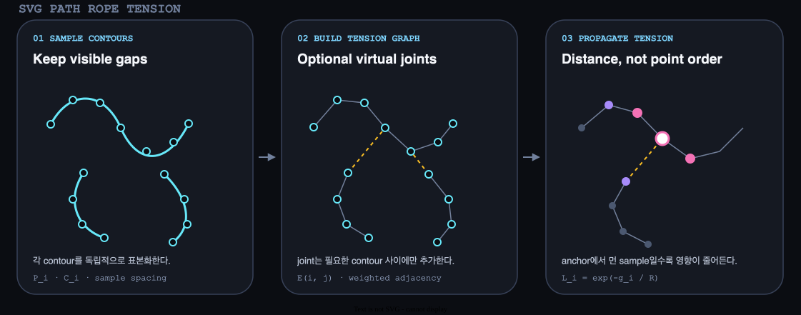

# SVG Path Rope Tension

SVG path를 일정 간격의 graph로 바꾸고 anchor부터 선을 따라간 거리에 따라 당김을 감쇠하면, 개별 점이 흩어지거나 형상 전체가 통째로 미끄러지지 않는 rope-like 변형을 만들 수 있다.

현재 적용 작품: [Afterbody Architecture](../artworks/afterbody/architecture.md)

## 1. 그림으로 먼저 보기



왼쪽은 화면에 보이는 contour를 서로 연결하지 않은 채 sample로 바꾼다. 가운데는 장력 전달에만 쓰는 virtual joint를 추가한다. 오른쪽은 터치 anchor에서 graph를 따라간 거리가 멀수록 작은 당김을 적용한다.

## 2. 해결하려는 문제

선으로 이루어진 형상을 터치점으로 당길 때 화면상의 직선거리만 사용하면 서로 다른 문제가 생긴다.

- 각 sample을 독립적으로 이동하면 이웃점의 이동량이 달라져 선이 톱니처럼 울퉁불퉁해진다.
- 모든 sample을 같은 비율로 이동하면 선의 구조가 느껴지지 않고 이미지 전체가 미끄러진다.
- SVG의 팔, 다리, 몸통이 별도 contour라면 한 contour에서 시작한 장력이 다른 contour로 전달되지 않는다.

필요한 값은 점이 터치점과 화면상 얼마나 가까운지가 아니라, **같은 선 구조 안에서 anchor와 얼마나 멀리 연결되어 있는가**이다.

## 3. 입력과 출력

| 기호 또는 코드 | 공간과 단위 | 의미 |
| --- | --- | --- |
| `P_i` | SVG local 좌표 | 일정 간격으로 표본화한 `i`번째 sample 위치 |
| `pathIndex_i` | 정수 index | sample이 속한 `M`-started contour |
| `E(i, j)` | design unit | 이웃 sample `i`, `j`를 잇는 graph edge 길이 |
| `A` | sample index | 터치 위치에서 가장 가까운 anchor sample |
| `g_i` | design unit | graph 안에서 `A`부터 `P_i`까지의 누적 거리 |
| `R` | design unit | 장력이 강하게 전달되는 유효 reach |
| `L_i` | 0–1 | 거리로 계산한 local tension |
| `I_i` | 0–1 근사 | 시간 반응과 먼 구간 보정을 합친 최종 influence |

출력은 sample마다 계산된 `I_i`다. 다음 단계는 이 influence를 anchor의 당김 거리와 곱해 sample의 새 위치를 만든다.

## 4. 직관적인 계산 과정

### 4.1 path를 sample로 바꾸기

`getTotalLength()`와 `getPointAtLength()`로 각 contour를 일정 길이 간격으로 읽는다. `M` 명령으로 시작하는 subpath는 별도로 표본화하고 첫 sample에 `startsPath`를 표시한다. 이 구분은 렌더러가 contour 사이에 보이지 않는 직선을 긋지 않게 한다.

### 4.2 graph edge 만들기

같은 contour 안의 연속 sample은 양방향 edge로 연결한다. edge weight는 두 sample 사이의 거리다. contour가 여러 개면 가장 긴 contour를 시작 집합으로 선택하고, 아직 연결되지 않은 contour의 endpoint를 연결 집합에서 가장 가까운 sample과 virtual joint로 잇는다.

virtual joint는 graph에만 존재한다. 실제 stroke 경로에는 추가하지 않으므로 화면의 의도적인 빈틈은 유지된다.

### 4.3 anchor에서 누적 거리 구하기

터치 위치에 가장 가까운 sample을 `A`로 고르고 graph edge를 따라 누적 거리를 전파한다. 한 점으로 가는 더 짧은 경로가 발견되면 그 점의 `g_i`를 갱신하고 이웃을 다시 검사한다.

### 4.4 거리를 장력으로 바꾸기

- `g_i = 0`: anchor이므로 local tension은 1이다.
- `g_i = R`: local tension은 약 0.37이다.
- `g_i = 2R`: local tension은 약 0.14다.
- `R`이 커짐: 장력이 선의 더 먼 부분까지 강하게 전달된다.
- `R`이 작아짐: anchor 주변만 국소적으로 당겨진다.

## 5. 실제 수식

anchor에서 sample `i`까지의 graph distance는 경로의 edge weight 합 중 가장 작은 값이다.

```text
g_i = min over paths A→i (sum of E along the path)
```

이 거리를 지수 감쇠로 변환한다.

```text
L_i = exp(-g_i / R)
```

Afterbody는 먼 부분이 완전히 정지해 선이 중간에서 끊겨 보이는 것을 막기 위해 작은 전달분 `T_i`를 추가한다.

```text
D_i = L_i + (1 - L_i) × T_i
S_i = 1 - exp(-elapsed / responseLag_i)
I_i = S_i × D_i
```

| 항 | 측정하는 것 |
| --- | --- |
| `D_i` | 거리 감쇠와 먼 구간 전달분을 합친 목표 장력 |
| `responseLag_i` | anchor에서 멀수록 늦게 따라오는 시간 지연 |
| `S_i` | 현재 frame에서 목표 장력까지 도달한 비율 |
| `I_i` | 위치 변형에 실제로 사용하는 최종 influence |

## 6. 왜 이 수식인가

지수 함수는 거리 0에서 정확히 1이고, 거리가 늘어날수록 연속적으로 감소한다. 특정 거리에서 갑자기 0이 되는 hard front가 없기 때문에 joint를 통과할 때 contour 전체가 한 번에 켜지는 현상을 피할 수 있다.

`1 - exp(-elapsed / responseLag)`도 같은 성질을 시간축에서 사용한다. 시작 frame에는 0이고 시간이 흐르면 1에 가까워진다. 거리가 먼 sample의 `responseLag`를 크게 하면 같은 줄을 따라 장력이 늦게 전달되는 인상을 만들 수 있다.

이 식은 물리적인 파동 방정식의 해가 아니다. 거리와 시간에 대해 연속적인 시각 반응을 만드는 감쇠 모델이다.

## 7. 실제 코드

| 단계 | 구현 |
| --- | --- |
| SVG contour sample | [`geometry.ts`의 `loadLineAsset()`](../../pages/afterbody/geometry.ts) |
| contour 내부 edge와 virtual joint | [`geometry.ts`의 `buildLineGraph()`](../../pages/afterbody/geometry.ts) |
| anchor와 graph distance cache | [`runtime.ts`의 `ropeFieldFor()`](../../pages/afterbody/runtime.ts) |
| 지수 감쇠와 최종 위치 | [`runtime.ts`의 `gatheredLinePosition()`](../../pages/afterbody/runtime.ts) |

Afterbody는 hold를 시작할 때 각 인체의 anchor와 `graphDistances`를 만든다. 손가락을 움직이는 동안 anchor는 유지하고 목표점 `contactOrigin`만 바꾼다. 따라서 처음 잡은 strand를 놓지 않고 끌고 가는 동작이 된다.

## 8. 일반적인 사용과 Afterbody의 응용

공통 원리는 polyline 또는 path를 weighted graph로 보고 graph distance로 영향 범위를 만드는 것이다. 선형 로고, 필기 stroke, 케이블, 덩굴, 윤곽선 편집에도 사용할 수 있다.

Afterbody 전용 선택은 다음과 같다.

- 여러 인체 SVG의 분리 contour를 nearest-endpoint virtual joint로 연결
- 먼 구간에 작은 `transmittedTension`을 남김
- path tangent의 수직 방향으로 sine `slack`을 추가
- 실제 spring 적분 대신 지수 시간 반응 사용

## 9. 특수 상황과 한계

- nearest-endpoint joint는 신체 topology를 이해하지 않는다. asset이 바뀌면 잘못된 contour가 연결될 수 있다.
- graph를 만드는 현재 최근접 탐색은 sample 수가 늘면 비용이 빠르게 증가한다. 큰 asset에는 spatial index가 필요하다.
- 일정 간격 표본화는 곡률이 큰 구간을 충분히 표현하지 못할 수 있다. adaptive subdivision이 대안이다.
- self-intersection이 있어도 path 진행 거리만 사용하므로 화면상 교차점 사이에는 장력이 전달되지 않는다. 교차점을 실제 joint로 취급하려면 별도의 교차 검출이 필요하다.
- 실제 줄의 overshoot, 관성, 충돌이 필요하면 mass-spring 또는 position-based dynamics가 더 적합하다.

## 10. 핵심 요약

SVG contour → 일정 간격 sample → contour 내부 edge + 보이지 않는 virtual joint → anchor 기준 graph distance → 지수 거리 감쇠와 시간 반응 → sample별 rope influence.
