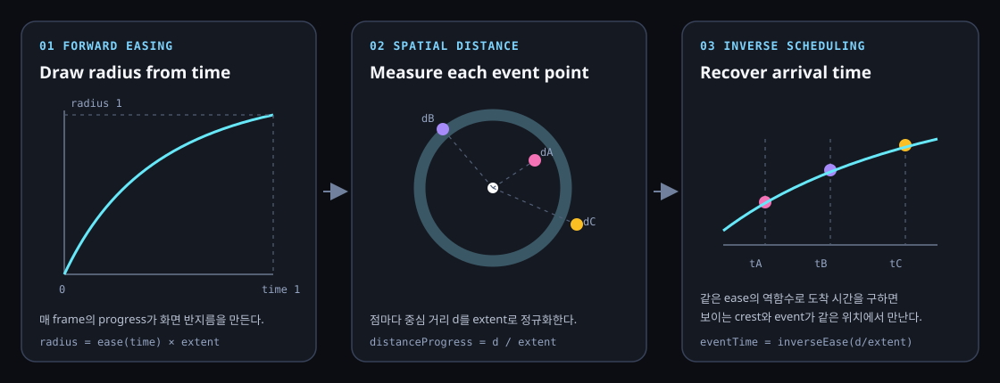

# Wavefront Event Scheduling

시간에 easing을 적용해 움직이는 wavefront와 공간의 개별 event를 맞추려면, 화면 반지름에는 forward easing을 사용하고 각 점의 실행 시각에는 같은 함수의 inverse easing을 사용한다.

현재 적용 작품: [Body Echo Architecture](../artworks/body-echo/architecture.md)

## 1. 그림으로 먼저 보기



왼쪽은 시간으로 화면 반지름을 계산한다. 가운데는 각 event point가 중심에서 얼마나 떨어졌는지 측정한다. 오른쪽은 그 거리를 inverse easing에 넣어 wavefront가 해당 위치에 도착하는 시간을 역으로 구한다.

## 2. 해결하려는 문제

파동 ring과 파티클 분해를 따로 애니메이션하면 ring이 아직 닿지 않은 점이 먼저 사라지거나, ring이 지나간 뒤에야 분해되는 어긋남이 생긴다.

선형 속도라면 `time = distance / speed`로 충분하다. 하지만 wavefront가 빠르게 출발해 느려지는 easing을 사용하면 시간과 거리가 비례하지 않는다. 화면에 보이는 것과 같은 함수로 도착 시각을 역산해야 한다.

## 3. 입력과 출력

| 기호 또는 코드 | 범위와 단위 | 의미 |
| --- | --- | --- |
| `t` | 0–1 | wave animation의 정규화된 시간 |
| `E(t)` | 0–1 | easing을 적용한 정규화 반지름 |
| `O` | design 좌표 | wave 중심 |
| `P_i` | design 좌표 | event가 실행될 `i`번째 점 |
| `d_i` | design unit | `O`와 `P_i` 사이의 거리 |
| `D` | design unit | wave가 도달해야 하는 최대 거리 extent |
| `q_i` | 0–1 | `d_i / D`로 정규화한 공간 진행도 |
| `t_i` | 0–1 | wave가 `P_i`에 도착하는 정규화 시간 |
| `T` | second | 전체 wave duration |

출력은 점마다 다른 event delay `t_i × T`다. 렌더러는 현재 시간이 이 delay를 넘으면 해당 점의 dissolve, 색 변화, 소리 같은 event를 시작한다.

## 4. 직관적인 계산 과정

1. 매 frame의 현재 시간 `t`를 easing에 넣어 보이는 ring 반지름을 만든다.
2. 각 점의 중심 거리 `d_i`를 최대 거리 `D`로 나눠 정규화 거리 `q_i`를 만든다.
3. `E(t_i) = q_i`를 만족하는 `t_i`를 찾는다.
4. 현재 시간이 `t_i × T`를 넘는 순간 점의 event를 실행한다.

`E`가 초반에 빠르게 증가하면 가까운 점의 `t_i` 간격은 짧고, 멀리 있는 점의 간격은 길어진다. 이 차이가 화면 ring의 감속과 동일해야 두 효과가 붙어 보인다.

## 5. 실제 수식

Body Echo의 forward easing은 exponent `a = 1.25`인 ease-out 형태다.

```text
E(t) = 1 - (1 - t)^a
```

화면 반지름은 다음과 같다.

```text
radius(t) = E(t) × D
```

점 `P_i`의 정규화 거리는 다음과 같다.

```text
q_i = clamp(distance(O, P_i) / D, 0, 1)
```

도착 시각은 easing의 역함수다.

```text
t_i = E^-1(q_i)
    = 1 - (1 - q_i)^(1/a)

eventDelay_i = t_i × T
```

## 6. 왜 이 수식인가

wavefront가 점 `P_i`에 도착한다는 것은 그 순간의 반지름이 점의 거리와 같다는 뜻이다.

```text
E(t_i) × D = d_i
E(t_i)     = d_i / D
E(t_i)     = q_i
```

양쪽에 `E^-1`을 적용하면 `t_i = E^-1(q_i)`가 된다. 따라서 forward easing과 inverse easing이 정확히 같은 함수 쌍이면 화면 crest와 event 위치가 같은 시공간 좌표에서 만난다.

Body Echo는 기계적으로 완벽한 원보다 유기적인 분해를 위해 event마다 최대 `0.025 s`의 작은 jitter를 더한다. 따라서 기본 동기화는 유지하지만 개별 sample은 crest보다 아주 조금 늦게 시작할 수 있다.

## 7. 실제 코드

| 단계 | 구현 |
| --- | --- |
| 최대 wave extent | [`wave-timing.ts`의 `measureWaveExtent()`](../../pages/body-echo/wave-timing.ts) |
| forward easing과 화면 반지름 | [`wave-timing.ts`의 `waveRadiusForProgress()`](../../pages/body-echo/wave-timing.ts) |
| inverse easing과 점별 delay | [`wave-timing.ts`의 `waveDelayForDistance()`](../../pages/body-echo/wave-timing.ts) |
| sample spawn time + jitter | [`runtime.ts`의 `spawnTimeFor()`](../../pages/body-echo/runtime.ts) |
| ring 렌더 | [`wave-renderer.ts`의 `render()`](../../pages/body-echo/wave-renderer.ts) |

Body Echo의 `D`는 wave 중심에서 480 × 270 design frame의 네 모서리까지 거리 중 최댓값이다. 터치점이 중앙에서 벗어나도 progress 1에서 전체 frame을 덮기 위한 선택이다.

## 8. 일반적인 사용과 Body Echo의 응용

이 방식은 시간에 따라 움직이는 경계와 위치별 event를 맞추는 일반적인 scheduling 패턴이다.

- ripple이 지나간 카드부터 reveal
- 폭발 충격파에 맞춘 debris 활성화
- 원형 wipe와 픽셀 삭제 동기화
- wavefront가 센서 위치에 도착할 때 음향 재생
- 거리 기반 데이터 시각화의 순차 강조

Body Echo는 이 원리를 SVG sample의 선 fade와 사각 파티클 spawn에 동시에 사용한다. 화면 wave는 radial gradient band와 crest로 그리지만 event scheduling은 색이나 gradient 모양이 아니라 중심 거리만 사용한다.

## 9. 특수 상황과 한계

- easing이 단조 증가하지 않으면 하나의 거리에 여러 도착 시간이 생겨 역함수를 하나로 정할 수 없다.
- 원형 wave가 아닌 장애물 회절이나 비균일 속도장은 Euclidean distance 대신 geodesic distance 또는 arrival-time field가 필요하다.
- 점이 wave 중간에 움직이면 처음 계산한 event time과 현재 위치가 어긋난다. 매 frame 재계산하거나 시작 위치에 고정해야 한다.
- 큰 jitter는 동기화 원리를 눈에 띄게 깨뜨린다. jitter는 crest 폭과 frame rate보다 작게 유지해야 한다.
- `D`를 frame 모서리 최댓값으로 잡으면 화면 밖 터치에서 duration 대부분이 화면 외부 이동에 쓰일 수 있다.

## 10. 핵심 요약

현재 시간 `t` → forward easing으로 wave 반지름 렌더, 각 점의 거리 `q_i` → 같은 easing의 inverse로 도착 시간 `t_i` 계산 → wavefront가 점을 지나는 순간 event 실행.
