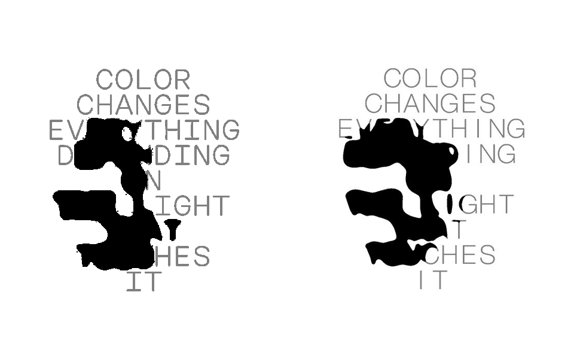

# Color Changes — implementation spec

## Reference

- Source: `assets/reference.mp4`
- 480 × 600, 4:5, 25 fps, 19.88 seconds
- Static nine-line typography with a colored local goo response

## Rendering model

1. Bake the nine text lines into a static 1440 × 1800 alpha texture, preserving
   the 480 × 600 artwork coordinate system at 3× sampling density.
2. Multiply the text alpha by an asymmetric elliptical falloff centered at the
   delayed cursor. This is the Cavalry-style “reveal the typography stroke using
   a falloff” stage described by the artist.
3. Retain activation only on the original glyph pixels in a half-float temporal
   buffer. Attack and release use separate exponential rates; the buffer is no
   longer a blurred image-space maximum.
4. Detect the retained alpha with a low 0.02 threshold and 0.025 transition.
   Detection happens before the liquid field is built, matching the Metaball
   plugin's alpha/luminance input-detection stage instead of first turning every
   glyph pixel into a fixed-radius circle.
5. At every output pixel, sample the detected stroke 192 times on a Fibonacci
   spiral over a 30 px radius. Radial influence falls as
   `(1 - r / radius)^3.2`; the direct source contributes 0.55 and the accumulated
   neighborhood contributes 2.2. Multiple nearby stroke segments therefore add
   into one scalar metaball field. This addition—not nearest-stroke dilation—is
   what forms an isofield saddle between the two arms and stem of `Y`.
6. Apply a separate five-tap Gaussian smoothing pass in each axis with sigma 1.8.
   Sampling and smoothing are independent controls, as in the referenced plugin,
   and the second pass removes the stepped/square boundary without broadening the
   source stroke into an indiscriminate blur.
7. Extract the 0.07 isosurface with 0.012 softness. The nearest-stroke continuity
   core is disabled (`coreMix = 0`), so there is no explicit outline, fixed-radius
   body, or glyph-shaped union hidden underneath the metaball silhouette.
8. Build color in a separate field. A nine-pixel Gaussian filter blurs both
   `activation × glyph` and `glyph`; dividing the two produces a normalized
   energy value that stays smooth without making intersections brighter merely
   because more stroke pixels overlap the kernel.
9. Drive the color core from that low-frequency density field, retaining only a
   4% fine nearest-stroke carrier. The connected-stroke propagation and jump
   flooding passes remain only for this subtle color detail; they do not affect
   silhouette geometry. Map energy through overlapping rose, pale-pink, and
   hot-color RGB blends instead of a single HSV ramp. The boundary color is the
   low-energy end of the same continuous field, not a fixed stroke.
10. Fully occlude the charcoal underprint inside the colored coverage, add only
   sub-pixel dithering inside that coverage, and animate all three palette anchors
   over time.

Geometry and color are deliberately independent. Geometry is falloff-masked
stroke alpha → sampled metaball influence → smoothing → isocontour. Color uses a
broader normalized energy field. The old nearest-stroke distance construction
could only ask which source pixel was closest, so the `Y` junction became a
convex cap. The accumulated field preserves the influence of both arms at once;
their competing gradients create the concave saddle visible in the reference.

This interpretation is grounded in the supplied Instagram caption and the
official tools it names: Scenery's [Metaball overview](https://scenery.io/plugins/metaball-7w5Tj0PnVJJ),
its [manual](https://scenery.io/plugins/metaball-7w5Tj0PnVJJ/manual), and Cavalry's
[Falloff documentation](https://cavalry.studio/docs/nodes/utilities/falloff/).

## Silhouette-only validation

The comparison deliberately discards palette details and maps the image to three
classes: background = 0, unaffected text = 1, effect silhouette = 2.

| Measurement | Reference | Previous | Final |
| --- | ---: | ---: | ---: |
| Effect pixels | 25,180 | 30,553 | 25,836 |
| Effect bounding box | 215 × 256 | 222 × 242 | 204 × 248 |
| Box occupancy | 0.457 | 0.569 | 0.511 |
| Equivalent strip width | 26.96 px | — | 25.13 px |
| Skeleton-width median | 32.14 px | — | 31.80 px |

The final visible effect area is 2.61% above the reference, versus 21.34% above
in the broad baseline. Its extent is 5.12% narrower and 3.13% shorter, while the
median skeleton width differs by only -1.07%. The focused comparison was the
first acceptance gate: the `Y` now contains a continuous, downward concavity at
the arms/stem junction rather than a convex center hotspot. Only after that gate
passed was the full silhouette measured.

The reproducible measurements and label-map generator are stored in
`qa/silhouette-metrics-final.json` and `qa/analyze-silhouette.mjs`.

## Interaction

- Pointer and touch position control the target of the light center.
- The light uses eased tracking plus a 300 artwork-pixel-per-second speed cap,
  creating the delayed motion visible in the reference instead of snapping.
- Glyph activation attacks over 55 ms and releases over 340 ms. Metaball source
  alpha is suppressed below the 0.02 detection threshold (with a 0.025
  transition), producing a visible hold followed by the reference's
  comparatively sudden local disappearance. The 0.05 cutoff now applies only to
  the fine nearest-stroke color carrier.
- The last pointer location persists after leaving the artwork.
- The palette completes a smooth cycle every eight seconds.
- `?qa` freezes the palette at the reference's pink/yellow phase.
- `?qa&qaX=0.37&qaY=0.52` also locks the pointer in normalized artwork space
  for deterministic reference comparisons.
- Add `&qaLabels=1` to render the exact background/text/effect class map without
  palette information.
- Press `g` to reveal the hidden tuning panel.

## Reference-space defaults

- Font: Helvetica Neue Light fallback stack, 43 px
- Character advance: 31.8 px
- Line height: 42.2 px
- Light radius: 160 × 120 px above and 160 × 240 px below, with 0.55 horizontal
  taper toward the vertical edges
- Geometry/color field resolution: 480 × 600, half-float RGBA render targets
- Metaball input threshold / softness: 0.02 / 0.025
- Metaball sampling: 192 Fibonacci-spiral samples over 30 px
- Metaball falloff power / source gain / field gain: 3.2 / 0.55 / 2.2
- Metaball smoothing: sigma 1.8, five taps per axis
- Surface isovalue / edge softness: 0.07 / 0.012
- Nearest-stroke geometry core: disabled; jump flooding serves color only
- Normalized color/glyph-density blur sigma: 9 px, 20 taps per side
- Fine nearest-stroke color carrier: 4%
- Pointer maximum speed: 300 reference px/s
- Activation attack/release: 55 ms / 340 ms
